<p align="center">
  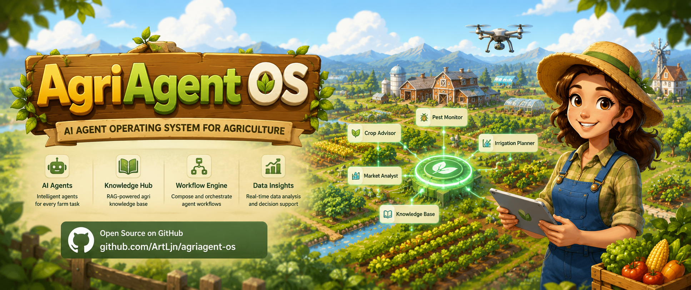
</p>

<p align="center">
  简体中文 | <a href="docs/farm-manager-design-spec/README_en.md">English Design Spec</a>
</p>

<p align="center">
  
  
  
  
  
  
  
  
  
  
  
</p>

<p align="center">
  
  
  
  
  
  
</p>

## 项目概览

AgriAgentOS 是一个面向农业经营场景的 AI Agent 操作系统，覆盖移动端经营工作台、自然语言记账、农事记录、作物模板、天气辅助规划、后台运维和 Agent 数据飞轮。项目采用 FastAPI 后端、React 管理后台和 Flutter 移动端，并围绕 Skill、Context、Memory、Trace 和 Evaluation 构建可治理、可观测、可评测的农业 Agent 平台。

完整架构、接口协议、Agent 运行规范和项目治理说明见 [设计文档](docs/farm-manager-design-spec/README.md)。

## 快速导航

| 入口 | 说明 |
| --- | --- |
| [界面预览](#界面预览) | 管理端技术界面和移动端业务界面截图 |
| [核心能力](#核心能力) | Agent、经营数据、智能填写、数据飞轮等能力摘要 |
| [架构亮点](#架构亮点) | Runtime、Skill、Context、Memory、Trace 的工程边界 |
| [快速启动](#快速启动) | Docker Compose 与本地开发启动方式 |
| [常用检查](#常用检查) | 后端、管理后台、移动端和架构门禁命令 |
| [文档入口](#文档入口) | 设计文档、架构文档、API 协议和当前迭代 |

## 适合谁看

| 角色 | 你可以从这里获得什么 |
| --- | --- |
| Agent 工程师 | 了解 Skill Registry、Context Engine、Memory Service、Runtime Loop、Reflection 和 Trace 闭环 |
| 后端工程师 | 了解 FastAPI 分层、领域目录、平台能力、数据库模型和 Alembic 迁移约束 |
| 前端工程师 | 了解 React 管理后台、Flutter 移动端、API 边界和真实业务界面 |
| 产品 / 运营 | 了解农业经营工作台、作物模板、账务、天气、用户管理和数据飞轮能力 |
| 评测 / QA | 了解 Simulation、Evaluation、TraceMonitor、DataFlywheel 和 repair pack 的问题闭环 |

## 界面预览

### 管理端技术界面

<table>
  <tr>
    <td align="center">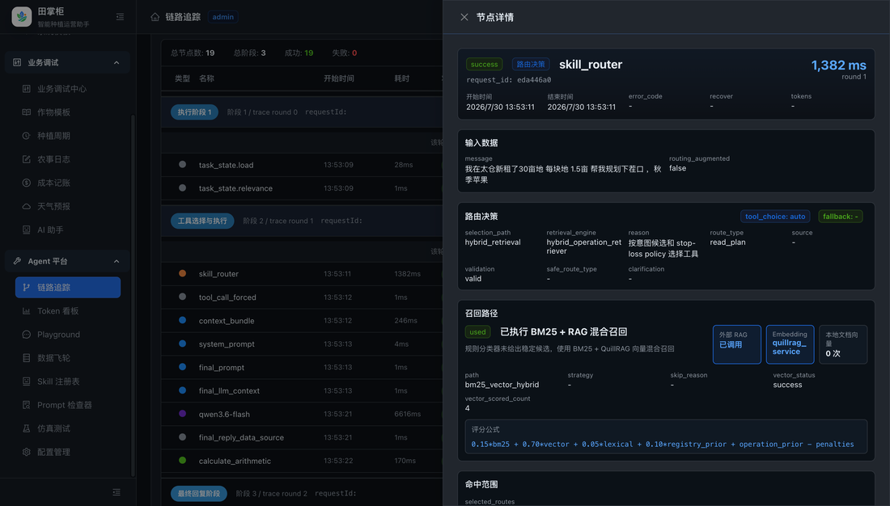<br>Trace Monitor</td>
    <td align="center">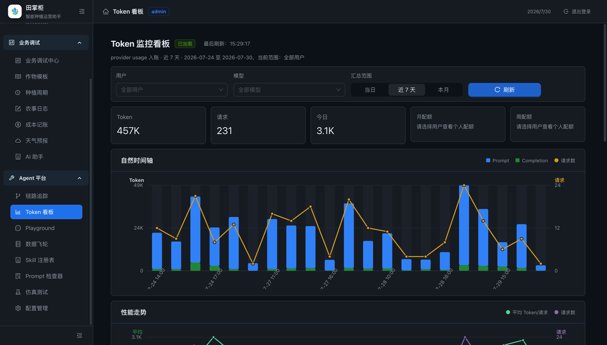<br>Token 监控</td>
    <td align="center">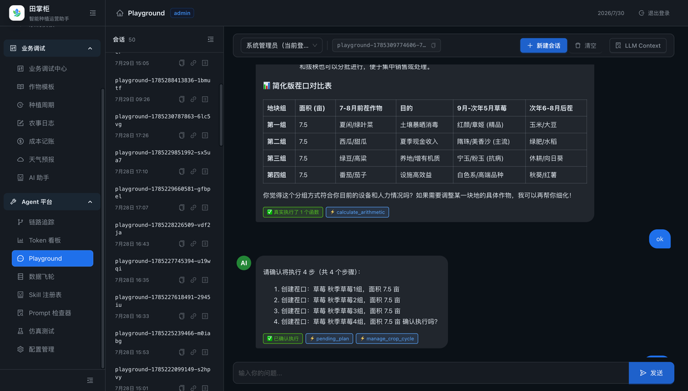<br>Agent Playground</td>
  </tr>
  <tr>
    <td align="center">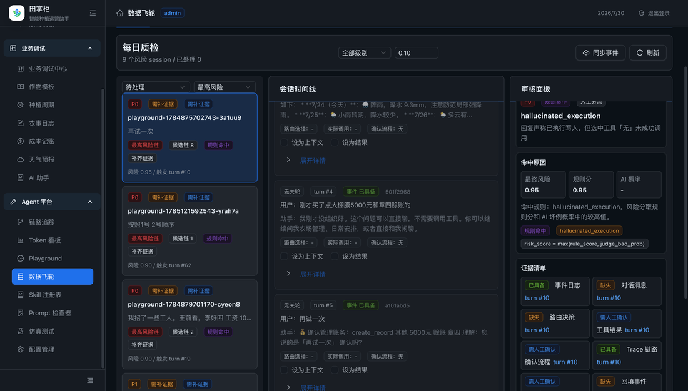<br>DataFlywheel</td>
    <td align="center">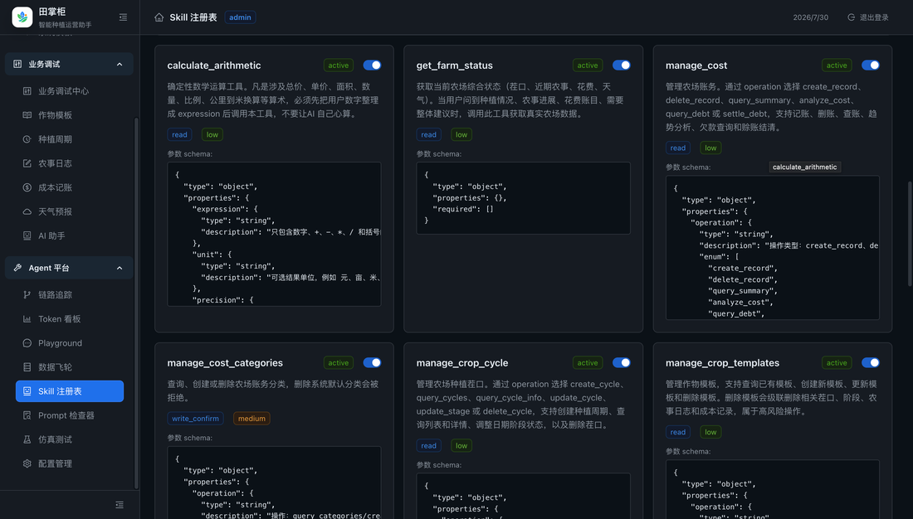<br>Skill Registry</td>
    <td align="center">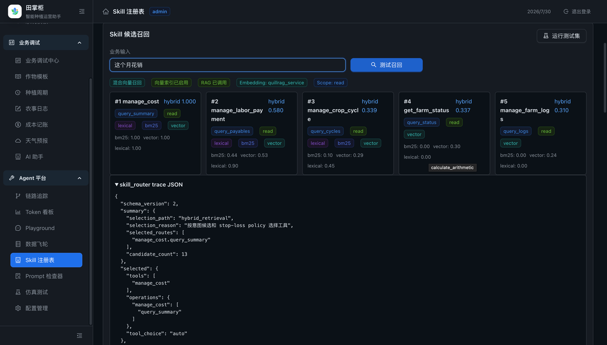<br>Skill Router Eval</td>
  </tr>
  <tr>
    <td align="center">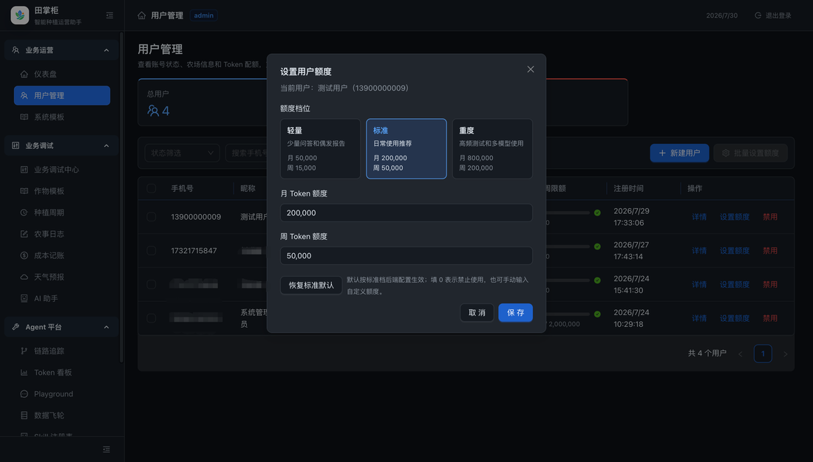<br>Prompt Inspector</td>
    <td align="center">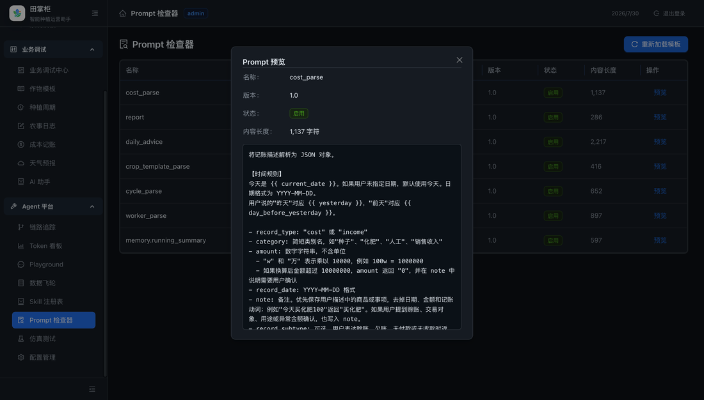<br>用户管理</td>
    <td align="center">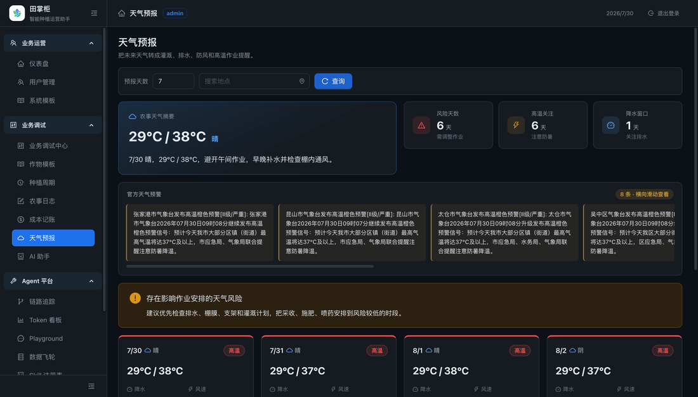<br>天气上下文</td>
  </tr>
</table>

### 移动端业务界面

<table>
  <tr>
    <td align="center">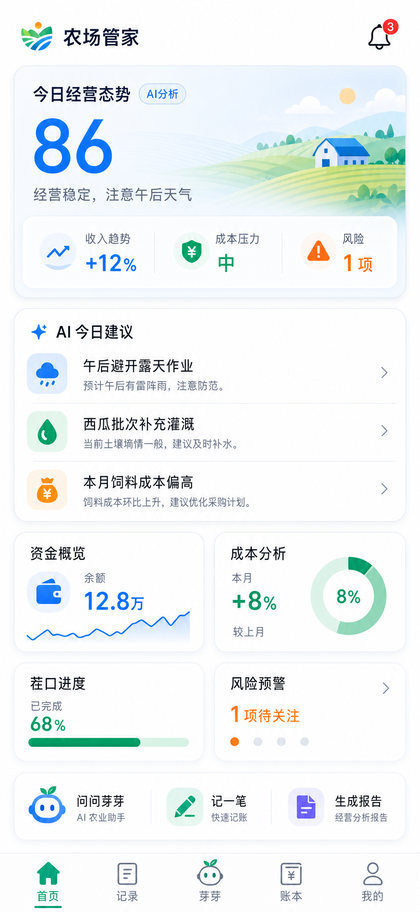<br>首页工作台</td>
    <td align="center">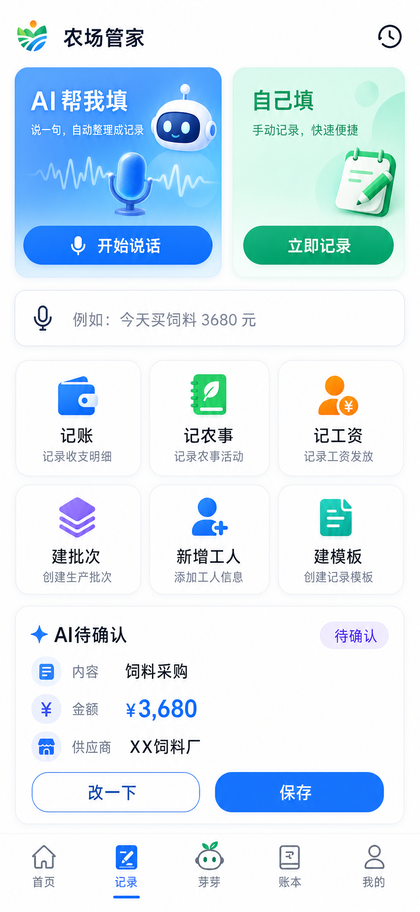<br>AI 智填工作台</td>
    <td align="center">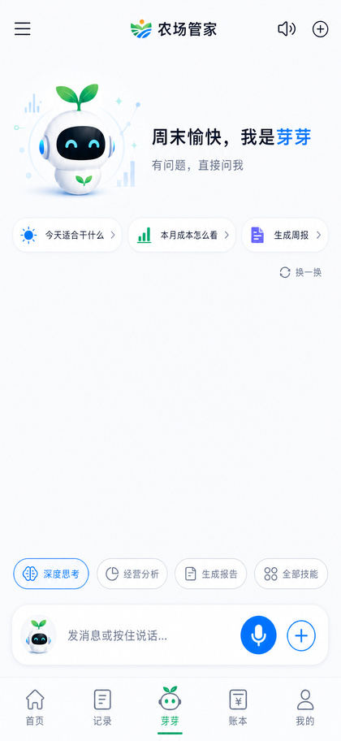<br>AI 助理</td>
    <td align="center">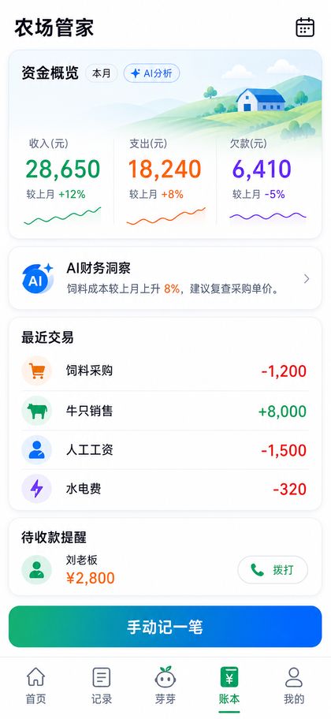<br>账本概览</td>
    <td align="center">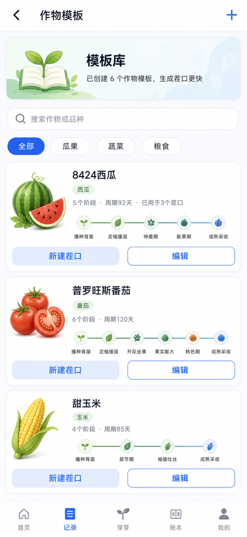<br>作物模板库</td>
  </tr>
</table>

## 核心能力

- **AI 农业 Agent**：支持自然语言问答、工具调用、SSE 流式回复、写操作确认和最终回复审计。
- **经营数据管理**：覆盖成本、收入、赊账、人工、农事日志、种植周期、地块和作业单。
- **智能填写**：移动端统一通过 `/smart-fill/scenarios` 和 `/smart-fill/parse` 生成表单草稿，避免直接写错业务数据。
- **作物模板库**：支持系统模板、农场副本、生长阶段、导入查重和模板维护。
- **上下文与记忆**：通过 ContextBundle、TaskState、短时摘要和显式长期记忆控制 Agent 输入。
- **可观测与数据飞轮**：TraceMonitor、Simulation、Evaluation、DataFlywheel 和 repair pack 形成坏例沉淀闭环。
- **管理后台**：提供用户、配置、技能、Token、Trace、数据飞轮、仿真评测和运营看板入口。

## 能力矩阵

| 能力域 | 已覆盖内容 | 关键入口 |
| --- | --- | --- |
| Agent Runtime | 工具调用、并行执行、最终回复、输出约束、写确认 | `backend/app/agent/` |
| Skill 系统 | Skill registry、operation 元数据、权限、schema、路由评测 | `backend/app/skills/` |
| Context 工程 | ContextBundle、selector、token budget、TaskState relevance gate | `backend/app/context/` |
| Memory 工程 | 短时窗口、会话摘要、显式长期记忆、observation event | `backend/app/memory/` |
| Prompt 工程 | Prompt registry、snippet 组合、渲染、replay | `backend/app/prompt/` |
| 数据飞轮 | 样本队列、LLM 预标注、人工确认、问题链、repair pack | `backend/app/platforms/data_flywheel/` |
| 仿真评测 | Simulation case、Evaluation replay、路由回归、报告聚合 | `backend/app/platforms/evaluation/` |
| 管理后台 | Trace、Token、Skill、Prompt、Playground、用户、天气、数据飞轮 | `admin-web/src/` |
| 移动端 | 首页、工作台、AI 助理、账本、作物模板、个人设置 | `mobile-app/lib/` |

## 架构亮点

AgriAgentOS 的重点不是把 LLM 接到一个聊天框，而是把农业场景里的高风险写操作、上下文污染、工具选择错误和回复不可审计问题拆成可治理的工程边界：

- **Runtime 与业务解耦**：Runtime 负责节点状态机、工具调用和最终回复，不直接拥有 Prompt、Context、Memory 或领域业务规则。
- **Skill operation 化**：Skill 不只是函数集合，还包含 operation 元数据、输入 schema、风险等级、确认策略和路由提示。
- **Context 可解释**：上下文由 selector、budget、compressor 和 trace payload 共同构成，避免把完整数据库或原始 trace 直接塞进 prompt。
- **写操作 fail-closed**：涉及成本、作物、工单、人工等业务写入时，默认进入 pending action 或 pending plan，缺字段不猜测。
- **Trace 到 DataFlywheel 闭环**：真实请求链路、工具调用、模型输出和失败证据可沉淀为样本，再进入评测、回归和 repair pack。
- **目录即边界**：后端不再使用旧技术层目录堆叠业务，新增代码必须进入 `domains/*`、`platforms/*` 或 Agent 平台对应边界。

## 技术栈

| 模块 | 技术 |
| --- | --- |
| 后端 | FastAPI、SQLAlchemy、Pydantic、Alembic、LangChain、Skillify |
| 数据 | MySQL 8.x、MongoDB 7、JSONL event log |
| 管理后台 | React 19、TypeScript、Vite、Ant Design 5、Vitest |
| 移动端 | Flutter、Riverpod、Dio、GoRouter、Flutter Secure Storage |
| Agent 平台 | Skill Registry、Context Engine、Memory Service、Runtime Loop、Reflection、Trace、Evaluation |
| 部署 | Docker Compose、Uvicorn、Nginx 静态前端容器 |

## 模块地图

| 模块 | 说明 | 面向的主要问题 |
| --- | --- | --- |
| `backend/app/bootstrap/` | FastAPI app factory、路由注册、中间件和 lifespan | 应用启动入口清晰、可测试 |
| `backend/app/domains/` | 用户、农场、种植、财务、天气、会话等领域代码 | 业务规则不散落到平台层 |
| `backend/app/application/` | 聊天、会话、建议、报告等 use case 编排 | API 层保持薄入口 |
| `backend/app/agent/` | Runtime、planner、executor、guardrails、reflection | Agent 执行链路可拆解 |
| `backend/app/skills/` | Skill 实现、注册、权限、schema 和脚本 | 工具能力可治理、可回归 |
| `backend/app/platforms/` | admin、data_flywheel、evaluation、simulation | 平台能力和业务领域隔离 |
| `admin-web/` | React 管理后台 | 运维、评测、Trace 和数据飞轮工作台 |
| `mobile-app/` | Flutter 移动端 | 面向真实经营场景的用户工作台 |

## 项目结构

```text
backend/app/
├── bootstrap/       # 应用工厂、路由注册、中间件、异常和 lifespan
├── domains/         # 用户、农场、种植、财务、天气、会话等业务领域
├── application/     # 聊天、会话、建议、报告等 use case 编排
├── agent/           # Agent runtime、planner、executor、guardrails、reflection
├── skills/          # Skill 实现、注册、权限、schema 和执行适配
├── prompt/          # Prompt 注册、组合、渲染和回放
├── context/         # ContextBundle、selector、预算、压缩和任务状态
├── memory/          # 短时记忆、显式长期记忆和 observation
├── platforms/       # admin、data_flywheel、evaluation、simulation、shared
├── shared/          # 配置、数据库、日志、安全、时间、模型注册
├── infra/           # trace、Mongo、限流、缓存、熔断、RAG client
└── ops/             # seed、审计和运维辅助

admin-web/           # React 管理后台
mobile-app/          # Flutter 移动端
docs/                # 架构、设计、规范和截图资产
openspec/            # 需求变更和能力规格
```

新增后端代码不得重新创建 `app.core`、`app.api`、`app.models`、`app.schemas`、`app.services`、`app.modules`、`app.simulation` 等旧技术层入口。

## 快速启动

### Docker Compose

```bash
cp backend/config.yaml.example backend/config.yaml

cat > .env <<'ENV'
MYSQL_ROOT_PASSWORD=change-me
MYSQL_PASSWORD=change-me
MONGO_INITDB_ROOT_PASSWORD=change-me
AUTH_JWT_SECRET=change-me-to-a-long-random-secret
ENV

docker compose up -d --build
```

默认端口：

| 服务 | 地址 |
| --- | --- |
| 后端 API | `http://127.0.0.1:18000` |
| 管理后台 | `http://127.0.0.1:18080` |
| 健康检查 | `http://127.0.0.1:18000/health` |

LLM、天气、RAG、Skill 向量召回等外部能力通过 `backend/config.yaml` 或环境变量配置；模板文件不会包含真实密钥。

### 本地开发

后端：

```bash
cd backend
python -m venv .venv
. .venv/bin/activate
pip install -r requirements.txt
uvicorn app.main:app --reload
```

管理后台：

```bash
cd admin-web
pnpm install
pnpm dev
```

移动端：

```bash
cd mobile-app
flutter pub get
flutter run
```

## 常用检查

```bash
# 后端
cd backend
ruff check .
pytest -v

# 管理后台
cd admin-web
pnpm lint
pnpm test

# 移动端
cd mobile-app
flutter analyze
flutter test
```

仓库还提供架构与复杂度门禁：

```bash
bash scripts/check-layer-deps.sh
bash scripts/check-complexity-budget.sh
bash scripts/check-guide-sensor-pairing.sh
```

## 开发约定

- **分支**：默认使用 `codex/*` 或独立 worktree 开发，通过 PR 合并。
- **提交**：提交信息使用 Conventional Commits，例如 `feat:`、`fix:`、`docs:`、`refactor:`、`test:`。
- **文档同步**：新增 API、数据模型、Skill、配置、部署或安全策略时，同步更新对应设计文档。
- **测试策略**：需求明确且可测试时补自动化测试；涉及不可自动验证的设计变更，至少补结构检查和人工审查点。
- **安全边界**：不提交 `.env`、真实密钥、凭证、生产连接串或大体积临时产物。
- **资源归档**：README 只引用 `docs/assets/screenshots/` 中的稳定截图；`output/` 只作为生成物和候选素材池。

## 文档入口

| 文档 | 用途 |
| --- | --- |
| [AGENTS.md](AGENTS.md) | Agent 工作规则、项目地图和硬性约束 |
| [系统架构](docs/architecture/overview.md) | 当前架构事实源和模块边界 |
| [后端系统架构](docs/architecture/backend-architecture.md) | 后端目录职责、请求链路和 Agent 平台拆分 |
| [设计规范](docs/farm-manager-design-spec/README.md) | 完整设计规范、接口协议、测试策略和项目管理 |
| [Agent 开发标准](docs/agent/agent-development-standard.md) | Agent / Skill / Context / Trace 开发硬规范 |
| [API 协议](docs/reference/api-spec.yaml) | OpenAPI / HTTP 协议参考 |
| [当前迭代](docs/plans/current-sprint.md) | 当前 sprint 状态和后续任务 |

## 截图与素材约定

根 README 只引用稳定文档资产：`docs/assets/screenshots/`。`output/` 目录用于生成物、设计候选和临时截图沉淀，不作为长期文档引用入口。

## 许可证

[CC BY-NC 4.0](docs/farm-manager-design-spec/LICENSE) © BlockShip。允许分享与改编，必须署名，不得用于商业目的。
