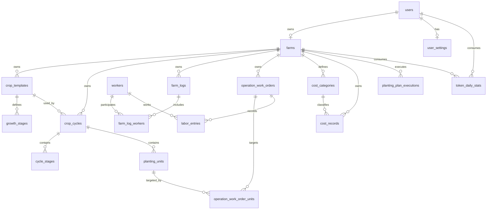

# v2 数据库 DDL 设计

> 文档目的：定义 Farm Manager v2 Business 的 canonical MySQL schema、表边界、命名规则和迁移策略。
>
> 适用范围：`../../business` Business REST、Business MCP 及其业务 Service。
>
> 数据库：MySQL 8.x，InnoDB，utf8mb4，utf8mb4_unicode_ci。

## 1. 结论与边界

当前 v2 Business 表结构以 `../../sql/farm_manager.sql` 为规范基线；现有环境不得直接执行整份基线文件，必须通过版本化增量迁移同步。

v2 Business canonical schema 包含 18 张业务/平台表：

| 领域 | 表 |
|---|---|
| 身份与租户 | `users`、`user_settings`、`farms` |
| 作物与种植 | `crop_templates`、`growth_stages`、`crop_cycles`、`cycle_stages`、`planting_units` |
| 农事与用工 | `workers`、`farm_logs`、`farm_log_workers`、`operation_work_orders`、`operation_work_order_units`、`labor_entries` |
| 财务 | `cost_categories`、`cost_records` |
| 业务幂等 | `planting_plan_executions` |
| 平台用量统计 | `token_daily_stats` |

以下内容不属于本 DDL：

- Agent 会话消息：MongoDB `conversationMessages`；
- Agent Trace：MongoDB `traceRecords`；
- Agent 幂等、并发锁和队列：Redis；
- Agent 短期记忆：文件或后续独立存储；
- 数据飞轮、仿真评测和历史 Agent MySQL 表：归档或独立 schema。

`alembic_version` 如果启用 Alembic，由 Alembic 自己维护，不作为业务表设计。

## 2. 设计原则

### 2.1 租户隔离

除 `users`、`user_settings` 外，业务表必须带 `farm_id`，并通过外键关联 `farms.id`。所有 Service 查询必须显式带 `farm_id`，不能依赖默认农场兜底实现租户隔离。

`farms.id` 是内部整数主键；`farms.uid` 是对外 UUID。JWT、接口和服务间委托令牌使用 `farm_uid`，SQL 使用内部 `farm_id`。

### 2.2 主键与外键

- 现有业务表统一使用 `INT AUTO_INCREMENT` 主键；
- `users.id` 使用 `VARCHAR(36)` UUID；
- 新增表的外键类型必须与目标主键完全一致；
- 外键名称统一为 `fk_<from_table>_<column>`；
- 业务事实和历史记录默认不级联删除；子表关系按业务语义选择 `CASCADE` 或 `SET NULL`。

### 2.3 时间与金额

- 时间字段使用 `DATETIME`，统一保存 UTC 或由应用层统一注入时区；
- 新增表的创建时间必须 `NOT NULL DEFAULT CURRENT_TIMESTAMP`；
- 金额使用 `DECIMAL(10,2)`，单位为元；
- Token 数量使用整数；成本估算使用 `DECIMAL(10,6)`。

### 2.4 JSON 使用边界

JSON 只用于不可稳定拆分的结果、请求快照或扩展元数据：

- `planting_plan_executions.result_json`：已提交聚合计划的结果快照；
- `token_daily_stats` 不保存请求明细，避免统计表膨胀；
- 不使用 JSON 替代模板阶段、种植单元、工人和财务记录等稳定关系。

## 3. 命名规范

### 3.1 表名

表名使用 snake_case 复数名词。当前代码已经使用的名称优先保持不变，避免把 schema 改名和业务迁移绑定在一起。

| 当前表名 | 处理 | 说明 |
|---|---|---|
| `operation_work_orders` | 兼容保留 | 当前 ORM、API 和 Service 已广泛引用；未来大版本可迁移为 `work_orders` |
| `operation_work_order_units` | 兼容保留 | 与上一表保持一致；未来可迁移为 `work_order_units` |
| `crop_cycles` | 保留 | API、ORM 和 Agent 工具均已使用 |
| `farm_logs` | 保留 | 表示已经发生的农事事实，不与工单合并 |
| `cost_records` | 保留 | 同时承载成本、收入和结算状态，改名需单独做兼容迁移 |
| `token_daily_stats` | 保留 | v2 平台 Token 日聚合统计 |

### 3.2 字段、索引和约束

- 字段使用 snake_case；
- 主键统一为 `id`，外键使用 `<entity>_id`；
- 统计日期使用 `stat_date`，不使用过于通用的 `date`；
- 普通索引：`idx_<table>_<columns>`；
- 唯一约束：`uq_<table>_<columns>`；
- 外键：`fk_<table>_<column>`；
- 不为单纯低选择性的布尔字段单独建索引；
- 单表索引数量原则上不超过 8 个，除非有明确查询证据。

## 4. 领域关系



业务边界：

- `crop_templates` 是模板定义；`growth_stages` 是模板阶段；
- `crop_cycles` 是一次具体种植茬口；`cycle_stages` 是茬口阶段实例；
- `planting_units` 是茬口下的棚、地块或区域；
- `farm_logs` 是事实记录；`operation_work_orders` 是作业单和作用范围；
- `farm_log_workers` 只记录事实参与人，不产生工资；
- `labor_entries` 记录作业单下的工资明细；
- `cost_records` 记录成本、收入和结算状态；人工成本由用工 Service 聚合作为来源账单；
- `planting_plan_executions` 只记录已经和业务实体同事务提交成功的种植计划；
- `token_daily_stats` 是聚合统计，不是 LLM 请求明细审计表。

## 5. Canonical DDL

以下 SQL 用于新环境初始化或生成基线迁移。生产环境不得直接执行其中的 `DROP TABLE`；生产变更必须使用可审查、可回滚的增量迁移。

```sql
SET NAMES utf8mb4;
SET time_zone = '+00:00';

CREATE TABLE users (
  id VARCHAR(36) NOT NULL,
  phone VARCHAR(20) NOT NULL,
  password_hash VARCHAR(128) NOT NULL,
  nickname VARCHAR(50) NOT NULL DEFAULT '农友',
  avatar_url VARCHAR(500) NULL,
  role VARCHAR(20) NOT NULL DEFAULT 'user',
  status VARCHAR(20) NOT NULL DEFAULT 'active',
  token_monthly_limit INT NULL,
  token_weekly_limit INT NULL,
  created_at DATETIME NOT NULL DEFAULT CURRENT_TIMESTAMP,
  PRIMARY KEY (id),
  UNIQUE KEY uq_users_phone (phone)
) ENGINE=InnoDB DEFAULT CHARSET=utf8mb4 COLLATE=utf8mb4_unicode_ci;

CREATE TABLE farms (
  id INT NOT NULL AUTO_INCREMENT,
  uid VARCHAR(36) NOT NULL,
  name VARCHAR(100) NOT NULL,
  location VARCHAR(200) NULL,
  user_id VARCHAR(36) NULL,
  created_at DATETIME NOT NULL DEFAULT CURRENT_TIMESTAMP,
  PRIMARY KEY (id),
  UNIQUE KEY uq_farms_uid (uid),
  UNIQUE KEY uq_farms_user_id (user_id),
  CONSTRAINT fk_farms_user
    FOREIGN KEY (user_id) REFERENCES users (id) ON DELETE SET NULL
) ENGINE=InnoDB DEFAULT CHARSET=utf8mb4 COLLATE=utf8mb4_unicode_ci;

CREATE TABLE user_settings (
  id INT NOT NULL AUTO_INCREMENT,
  user_id VARCHAR(36) NOT NULL,
  default_city VARCHAR(50) NULL,
  default_lat FLOAT NULL,
  default_lon FLOAT NULL,
  assistant_role VARCHAR(20) NOT NULL DEFAULT 'warm',
  created_at DATETIME NOT NULL DEFAULT CURRENT_TIMESTAMP,
  updated_at DATETIME NOT NULL DEFAULT CURRENT_TIMESTAMP
    ON UPDATE CURRENT_TIMESTAMP,
  PRIMARY KEY (id),
  UNIQUE KEY uq_user_settings_user_id (user_id),
  CONSTRAINT fk_user_settings_user
    FOREIGN KEY (user_id) REFERENCES users (id) ON DELETE CASCADE
) ENGINE=InnoDB DEFAULT CHARSET=utf8mb4 COLLATE=utf8mb4_unicode_ci;

CREATE TABLE crop_templates (
  id INT NOT NULL AUTO_INCREMENT,
  farm_id INT NULL,
  name VARCHAR(100) NOT NULL,
  variety VARCHAR(100) NULL,
  category VARCHAR(50) NULL,
  created_at DATETIME NOT NULL DEFAULT CURRENT_TIMESTAMP,
  PRIMARY KEY (id),
  KEY idx_crop_templates_farm_id (farm_id),
  KEY idx_crop_templates_farm_name_variety (farm_id, name, variety),
  CONSTRAINT fk_crop_templates_farm
    FOREIGN KEY (farm_id) REFERENCES farms (id) ON DELETE SET NULL
) ENGINE=InnoDB DEFAULT CHARSET=utf8mb4 COLLATE=utf8mb4_unicode_ci;

CREATE TABLE growth_stages (
  id INT NOT NULL AUTO_INCREMENT,
  crop_template_id INT NOT NULL,
  name VARCHAR(100) NOT NULL,
  duration_days INT NOT NULL,
  order_index INT NOT NULL,
  key_tasks VARCHAR(500) NULL,
  PRIMARY KEY (id),
  UNIQUE KEY uq_growth_stages_template_order
    (crop_template_id, order_index),
  KEY idx_growth_stages_template_id (crop_template_id),
  CONSTRAINT fk_growth_stages_template
    FOREIGN KEY (crop_template_id) REFERENCES crop_templates (id)
    ON DELETE CASCADE
) ENGINE=InnoDB DEFAULT CHARSET=utf8mb4 COLLATE=utf8mb4_unicode_ci;

CREATE TABLE crop_cycles (
  id INT NOT NULL AUTO_INCREMENT,
  farm_id INT NOT NULL,
  name VARCHAR(100) NOT NULL,
  crop_template_id INT NOT NULL,
  start_date DATE NOT NULL,
  field_name VARCHAR(100) NULL,
  total_area_mu DECIMAL(10,2) NULL,
  season VARCHAR(50) NULL,
  batch_note VARCHAR(500) NULL,
  status VARCHAR(20) NOT NULL DEFAULT 'active',
  created_at DATETIME NOT NULL DEFAULT CURRENT_TIMESTAMP,
  PRIMARY KEY (id),
  KEY idx_crop_cycles_farm_status_start
    (farm_id, status, start_date),
  KEY idx_crop_cycles_template_id (crop_template_id),
  CONSTRAINT fk_crop_cycles_farm
    FOREIGN KEY (farm_id) REFERENCES farms (id) ON DELETE RESTRICT,
  CONSTRAINT fk_crop_cycles_template
    FOREIGN KEY (crop_template_id) REFERENCES crop_templates (id)
    ON DELETE RESTRICT
) ENGINE=InnoDB DEFAULT CHARSET=utf8mb4 COLLATE=utf8mb4_unicode_ci;

CREATE TABLE cycle_stages (
  id INT NOT NULL AUTO_INCREMENT,
  cycle_id INT NOT NULL,
  name VARCHAR(100) NOT NULL,
  start_date DATE NOT NULL,
  end_date DATE NOT NULL,
  order_index INT NOT NULL,
  duration_days INT NOT NULL,
  key_tasks VARCHAR(500) NULL,
  is_current TINYINT(1) NOT NULL DEFAULT 0,
  PRIMARY KEY (id),
  UNIQUE KEY uq_cycle_stages_cycle_order (cycle_id, order_index),
  KEY idx_cycle_stages_cycle_id (cycle_id),
  CONSTRAINT fk_cycle_stages_cycle
    FOREIGN KEY (cycle_id) REFERENCES crop_cycles (id) ON DELETE CASCADE
) ENGINE=InnoDB DEFAULT CHARSET=utf8mb4 COLLATE=utf8mb4_unicode_ci;

CREATE TABLE planting_units (
  id INT NOT NULL AUTO_INCREMENT,
  farm_id INT NOT NULL,
  cycle_id INT NOT NULL,
  name VARCHAR(100) NOT NULL,
  area_mu DECIMAL(10,2) NULL,
  planted_date DATE NULL,
  status VARCHAR(20) NOT NULL DEFAULT 'active',
  note VARCHAR(500) NULL,
  created_at DATETIME NOT NULL DEFAULT CURRENT_TIMESTAMP,
  updated_at DATETIME NOT NULL DEFAULT CURRENT_TIMESTAMP
    ON UPDATE CURRENT_TIMESTAMP,
  PRIMARY KEY (id),
  KEY idx_planting_units_farm_id (farm_id),
  KEY idx_planting_units_cycle_id (cycle_id),
  CONSTRAINT fk_planting_units_farm
    FOREIGN KEY (farm_id) REFERENCES farms (id) ON DELETE RESTRICT,
  CONSTRAINT fk_planting_units_cycle
    FOREIGN KEY (cycle_id) REFERENCES crop_cycles (id) ON DELETE CASCADE
) ENGINE=InnoDB DEFAULT CHARSET=utf8mb4 COLLATE=utf8mb4_unicode_ci;

CREATE TABLE workers (
  id INT NOT NULL AUTO_INCREMENT,
  farm_id INT NOT NULL,
  name VARCHAR(100) NOT NULL,
  phone VARCHAR(30) NULL,
  default_pay_type VARCHAR(20) NOT NULL DEFAULT 'daily',
  default_unit_price DECIMAL(10,2) NULL,
  note VARCHAR(500) NULL,
  status VARCHAR(20) NOT NULL DEFAULT 'active',
  created_at DATETIME NOT NULL DEFAULT CURRENT_TIMESTAMP,
  updated_at DATETIME NOT NULL DEFAULT CURRENT_TIMESTAMP
    ON UPDATE CURRENT_TIMESTAMP,
  PRIMARY KEY (id),
  KEY idx_workers_farm_status (farm_id, status),
  CONSTRAINT fk_workers_farm
    FOREIGN KEY (farm_id) REFERENCES farms (id) ON DELETE RESTRICT
) ENGINE=InnoDB DEFAULT CHARSET=utf8mb4 COLLATE=utf8mb4_unicode_ci;

CREATE TABLE operation_work_orders (
  id INT NOT NULL AUTO_INCREMENT,
  farm_id INT NOT NULL,
  cycle_id INT NULL,
  operation_type VARCHAR(50) NOT NULL,
  operation_date DATE NOT NULL,
  scope_type VARCHAR(20) NOT NULL DEFAULT 'cycle',
  note VARCHAR(500) NULL,
  photo_urls TEXT NULL,
  source_type VARCHAR(50) NULL,
  source_id INT NULL,
  labor_cost_record_id INT NULL,
  created_at DATETIME NOT NULL DEFAULT CURRENT_TIMESTAMP,
  updated_at DATETIME NOT NULL DEFAULT CURRENT_TIMESTAMP
    ON UPDATE CURRENT_TIMESTAMP,
  PRIMARY KEY (id),
  KEY idx_operation_work_orders_farm_date
    (farm_id, operation_date),
  KEY idx_operation_work_orders_cycle_id (cycle_id),
  KEY idx_operation_work_orders_labor_cost (labor_cost_record_id),
  CONSTRAINT fk_operation_work_orders_farm
    FOREIGN KEY (farm_id) REFERENCES farms (id) ON DELETE RESTRICT,
  CONSTRAINT fk_operation_work_orders_cycle
    FOREIGN KEY (cycle_id) REFERENCES crop_cycles (id) ON DELETE SET NULL
) ENGINE=InnoDB DEFAULT CHARSET=utf8mb4 COLLATE=utf8mb4_unicode_ci;

CREATE TABLE farm_logs (
  id INT NOT NULL AUTO_INCREMENT,
  farm_id INT NOT NULL,
  cycle_id INT NOT NULL,
  work_order_id INT NULL,
  operation_type VARCHAR(50) NOT NULL,
  operation_date DATE NOT NULL,
  operation_time DATETIME NULL,
  note VARCHAR(500) NULL,
  photo_urls VARCHAR(2000) NULL,
  created_at DATETIME NOT NULL DEFAULT CURRENT_TIMESTAMP,
  PRIMARY KEY (id),
  KEY idx_farm_logs_farm_date (farm_id, operation_date),
  KEY idx_farm_logs_cycle_id (cycle_id),
  KEY idx_farm_logs_work_order_id (work_order_id),
  CONSTRAINT fk_farm_logs_farm
    FOREIGN KEY (farm_id) REFERENCES farms (id) ON DELETE RESTRICT,
  CONSTRAINT fk_farm_logs_cycle
    FOREIGN KEY (cycle_id) REFERENCES crop_cycles (id) ON DELETE CASCADE,
  CONSTRAINT fk_farm_logs_work_order
    FOREIGN KEY (work_order_id) REFERENCES operation_work_orders (id)
    ON DELETE SET NULL
) ENGINE=InnoDB DEFAULT CHARSET=utf8mb4 COLLATE=utf8mb4_unicode_ci;

CREATE TABLE farm_log_workers (
  id INT NOT NULL AUTO_INCREMENT,
  farm_log_id INT NOT NULL,
  worker_id INT NOT NULL,
  role VARCHAR(50) NULL,
  note VARCHAR(500) NULL,
  PRIMARY KEY (id),
  UNIQUE KEY uq_farm_log_workers_log_worker (farm_log_id, worker_id),
  KEY idx_farm_log_workers_worker_id (worker_id),
  CONSTRAINT fk_farm_log_workers_log
    FOREIGN KEY (farm_log_id) REFERENCES farm_logs (id) ON DELETE CASCADE,
  CONSTRAINT fk_farm_log_workers_worker
    FOREIGN KEY (worker_id) REFERENCES workers (id) ON DELETE RESTRICT
) ENGINE=InnoDB DEFAULT CHARSET=utf8mb4 COLLATE=utf8mb4_unicode_ci;

CREATE TABLE operation_work_order_units (
  id INT NOT NULL AUTO_INCREMENT,
  work_order_id INT NOT NULL,
  unit_id INT NOT NULL,
  PRIMARY KEY (id),
  UNIQUE KEY uq_operation_work_order_units_order_unit
    (work_order_id, unit_id),
  KEY idx_operation_work_order_units_unit_id (unit_id),
  CONSTRAINT fk_operation_work_order_units_order
    FOREIGN KEY (work_order_id) REFERENCES operation_work_orders (id)
    ON DELETE CASCADE,
  CONSTRAINT fk_operation_work_order_units_unit
    FOREIGN KEY (unit_id) REFERENCES planting_units (id) ON DELETE CASCADE
) ENGINE=InnoDB DEFAULT CHARSET=utf8mb4 COLLATE=utf8mb4_unicode_ci;

CREATE TABLE labor_entries (
  id INT NOT NULL AUTO_INCREMENT,
  farm_id INT NOT NULL,
  work_order_id INT NOT NULL,
  worker_id INT NOT NULL,
  pay_type VARCHAR(20) NOT NULL DEFAULT 'daily',
  quantity DECIMAL(10,2) NOT NULL DEFAULT 1.00,
  unit_price DECIMAL(10,2) NOT NULL,
  payable_amount DECIMAL(10,2) NOT NULL,
  paid_amount DECIMAL(10,2) NOT NULL DEFAULT 0.00,
  unpaid_amount DECIMAL(10,2) NOT NULL DEFAULT 0.00,
  settlement_status VARCHAR(20) NOT NULL DEFAULT 'unpaid',
  client_request_id VARCHAR(100) NULL,
  note VARCHAR(500) NULL,
  created_at DATETIME NOT NULL DEFAULT CURRENT_TIMESTAMP,
  updated_at DATETIME NOT NULL DEFAULT CURRENT_TIMESTAMP
    ON UPDATE CURRENT_TIMESTAMP,
  PRIMARY KEY (id),
  UNIQUE KEY uq_labor_entries_farm_client_request
    (farm_id, client_request_id),
  KEY idx_labor_entries_work_order_id (work_order_id),
  KEY idx_labor_entries_worker_status (worker_id, settlement_status),
  CONSTRAINT fk_labor_entries_farm
    FOREIGN KEY (farm_id) REFERENCES farms (id) ON DELETE RESTRICT,
  CONSTRAINT fk_labor_entries_work_order
    FOREIGN KEY (work_order_id) REFERENCES operation_work_orders (id)
    ON DELETE CASCADE,
  CONSTRAINT fk_labor_entries_worker
    FOREIGN KEY (worker_id) REFERENCES workers (id) ON DELETE RESTRICT
) ENGINE=InnoDB DEFAULT CHARSET=utf8mb4 COLLATE=utf8mb4_unicode_ci;

CREATE TABLE cost_categories (
  id INT NOT NULL AUTO_INCREMENT,
  farm_id INT NOT NULL,
  name VARCHAR(50) NOT NULL,
  type VARCHAR(10) NOT NULL,
  icon VARCHAR(50) NOT NULL DEFAULT 'tag',
  sort_order INT NOT NULL DEFAULT 0,
  is_default TINYINT(1) NOT NULL DEFAULT 0,
  created_at DATETIME NOT NULL DEFAULT CURRENT_TIMESTAMP,
  PRIMARY KEY (id),
  UNIQUE KEY uq_cost_categories_farm_type_name (farm_id, type, name),
  KEY idx_cost_categories_farm_id (farm_id),
  CONSTRAINT fk_cost_categories_farm
    FOREIGN KEY (farm_id) REFERENCES farms (id) ON DELETE RESTRICT
) ENGINE=InnoDB DEFAULT CHARSET=utf8mb4 COLLATE=utf8mb4_unicode_ci;

CREATE TABLE cost_records (
  id INT NOT NULL AUTO_INCREMENT,
  farm_id INT NOT NULL,
  cycle_id INT NULL,
  record_type VARCHAR(20) NOT NULL,
  category VARCHAR(50) NOT NULL,
  category_id INT NULL,
  category_name_snapshot VARCHAR(50) NULL,
  amount DECIMAL(10,2) NOT NULL,
  settled_amount DECIMAL(10,2) NOT NULL DEFAULT 0.00,
  settlement_status VARCHAR(20) NOT NULL DEFAULT 'settled',
  record_date DATE NOT NULL,
  recorded_at DATETIME NULL,
  note VARCHAR(500) NULL,
  record_subtype VARCHAR(50) NULL,
  counterparty VARCHAR(100) NULL,
  due_date DATE NULL,
  settled_at DATETIME NULL,
  parent_record_id INT NULL,
  source_type VARCHAR(50) NULL,
  source_id INT NULL,
  source_active_key VARCHAR(20) NULL,
  deleted_at DATETIME NULL,
  created_at DATETIME NOT NULL DEFAULT CURRENT_TIMESTAMP,
  PRIMARY KEY (id),
  UNIQUE KEY uq_cost_records_active_source
    (farm_id, source_type, source_id, source_active_key),
  KEY idx_cost_records_farm_date_deleted
    (farm_id, record_date, deleted_at),
  KEY idx_cost_records_farm_type_date
    (farm_id, record_type, record_date),
  KEY idx_cost_records_category_id (category_id),
  KEY idx_cost_records_cycle_id (cycle_id),
  KEY idx_cost_records_parent_id (parent_record_id),
  CONSTRAINT fk_cost_records_farm
    FOREIGN KEY (farm_id) REFERENCES farms (id) ON DELETE RESTRICT,
  CONSTRAINT fk_cost_records_cycle
    FOREIGN KEY (cycle_id) REFERENCES crop_cycles (id) ON DELETE SET NULL,
  CONSTRAINT fk_cost_records_category
    FOREIGN KEY (category_id) REFERENCES cost_categories (id)
    ON DELETE RESTRICT,
  CONSTRAINT fk_cost_records_parent
    FOREIGN KEY (parent_record_id) REFERENCES cost_records (id)
    ON DELETE SET NULL
) ENGINE=InnoDB DEFAULT CHARSET=utf8mb4 COLLATE=utf8mb4_unicode_ci;

CREATE TABLE planting_plan_executions (
  id INT NOT NULL AUTO_INCREMENT,
  farm_id INT NOT NULL,
  client_request_id VARCHAR(100) NOT NULL,
  request_fingerprint VARCHAR(80) NOT NULL,
  approval_fingerprint VARCHAR(80) NOT NULL,
  status VARCHAR(20) NOT NULL DEFAULT 'committed',
  crop_template_id INT NULL,
  crop_cycle_id INT NULL,
  planting_unit_id INT NULL,
  result_json JSON NULL,
  created_at DATETIME NOT NULL DEFAULT CURRENT_TIMESTAMP,
  updated_at DATETIME NOT NULL DEFAULT CURRENT_TIMESTAMP
    ON UPDATE CURRENT_TIMESTAMP,
  PRIMARY KEY (id),
  UNIQUE KEY uq_planting_plan_executions_farm_request
    (farm_id, client_request_id),
  KEY idx_planting_plan_executions_farm_created
    (farm_id, created_at),
  CONSTRAINT fk_planting_plan_executions_farm
    FOREIGN KEY (farm_id) REFERENCES farms (id) ON DELETE RESTRICT,
  CONSTRAINT fk_planting_plan_executions_template
    FOREIGN KEY (crop_template_id) REFERENCES crop_templates (id)
    ON DELETE SET NULL,
  CONSTRAINT fk_planting_plan_executions_cycle
    FOREIGN KEY (crop_cycle_id) REFERENCES crop_cycles (id)
    ON DELETE SET NULL,
  CONSTRAINT fk_planting_plan_executions_unit
    FOREIGN KEY (planting_unit_id) REFERENCES planting_units (id)
    ON DELETE SET NULL
) ENGINE=InnoDB DEFAULT CHARSET=utf8mb4 COLLATE=utf8mb4_unicode_ci;

CREATE TABLE token_daily_stats (
  id INT NOT NULL AUTO_INCREMENT,
  farm_id INT NOT NULL,
  user_id VARCHAR(36) NULL,
  stat_date DATE NOT NULL,
  service_name VARCHAR(30) NOT NULL DEFAULT 'agent',
  model VARCHAR(100) NOT NULL,
  call_type VARCHAR(30) NOT NULL,
  user_scope_key VARCHAR(36)
    GENERATED ALWAYS AS (COALESCE(user_id, '')) STORED,
  prompt_tokens INT NOT NULL DEFAULT 0,
  completion_tokens INT NOT NULL DEFAULT 0,
  total_tokens INT NOT NULL DEFAULT 0,
  request_count INT NOT NULL DEFAULT 0,
  estimated_cost_cny DECIMAL(10,6) NOT NULL DEFAULT 0.000000,
  created_at DATETIME NOT NULL DEFAULT CURRENT_TIMESTAMP,
  updated_at DATETIME NOT NULL DEFAULT CURRENT_TIMESTAMP
    ON UPDATE CURRENT_TIMESTAMP,
  PRIMARY KEY (id),
  UNIQUE KEY uq_token_daily_stats_scope
    (farm_id, user_scope_key, stat_date, service_name, model, call_type),
  KEY idx_token_daily_stats_farm_date (farm_id, stat_date),
  KEY idx_token_daily_stats_user_date (user_id, stat_date),
  CONSTRAINT fk_token_daily_stats_farm
    FOREIGN KEY (farm_id) REFERENCES farms (id) ON DELETE RESTRICT,
  CONSTRAINT fk_token_daily_stats_user
    FOREIGN KEY (user_id) REFERENCES users (id) ON DELETE SET NULL
) ENGINE=InnoDB DEFAULT CHARSET=utf8mb4 COLLATE=utf8mb4_unicode_ci;

ALTER TABLE operation_work_orders
  ADD CONSTRAINT fk_operation_work_orders_labor_cost
  FOREIGN KEY (labor_cost_record_id) REFERENCES cost_records (id)
  ON DELETE SET NULL;
```

## 6. 重点约束说明

### 6.1 系统模板与农场模板

`crop_templates.farm_id IS NULL` 表示系统模板；非空表示农场自定义模板。系统模板不可被农场业务直接修改，导入系统模板时复制为当前农场模板。

后续如果需要地域化匹配，可新增 `region_tag` 和 `dedup_key`，但应先完成重复数据清理，再添加唯一约束。

### 6.2 作业单与农事日志

`operation_work_orders` 是计划/执行单，允许通过 `scope_type` 表示 `cycle`、`unit`、`farm` 三种作用范围。

`farm_logs` 是已经发生的事实记录，可以通过 `work_order_id` 追溯来源，但不直接计算工资。工资必须写入 `labor_entries`，人工成本由财务 Service 聚合到 `cost_records`。

### 6.3 财务记录

`cost_records` 同时承载成本和收入：

- `record_type=cost`：成本；
- `record_type=income`：收入；
- `settled_amount`、`settlement_status`：赊账或未结算状态；
- `category_name_snapshot`：分类改名后的历史展示快照；
- `source_type/source_id/source_active_key`：防止同一业务来源重复入账。

当前还款/收款不新建经营账单，而是更新原记录结算字段。未来若需保留结算流水，应新增结算事件表，不重新复用 `cost_records`。

### 6.4 种植计划执行记录

`planting_plan_executions` 的作用是保存聚合写入的幂等结果，不是种植计划主表。

写入原则：

1. `prepare_planting_plan` 只生成计划和指纹，不写该表；
2. 用户确认后，模板、茬口、种植单元和执行记录在同一事务中提交；
3. 任一业务实体失败，整个事务回滚，不保留半成品执行记录；
4. 相同 `(farm_id, client_request_id)` 重放时返回原结果；
5. 相同请求 ID 携带不同指纹时返回 `idempotency_conflict`。

### 6.5 Token 统计

`token_daily_stats` 按以下维度聚合：

```text
farm_id + user_id + stat_date + service_name + model + call_type
```

其中 `user_id IS NULL` 可以表示系统级调用，但应用必须明确区分用户调用和系统调用，不能因为用户信息缺失而默认归入某个用户。

由于 MySQL 的唯一索引允许多个 `NULL` 值，表中使用生成列 `user_scope_key` 将系统级 `NULL` 归一为空字符串，确保同一农场的系统级统计也只有一条聚合记录。

统计表只保存日聚合数据，不保存完整 prompt、completion 或敏感请求内容。每次 LLM 调用成功或失败后由 Agent 统计 Service 使用 upsert 更新：

```sql
INSERT INTO token_daily_stats (
  farm_id, user_id, stat_date, service_name, model, call_type,
  prompt_tokens, completion_tokens, total_tokens,
  request_count, estimated_cost_cny
)
VALUES (?, ?, ?, ?, ?, ?, ?, ?, ?, 1, ?)
ON DUPLICATE KEY UPDATE
  prompt_tokens = prompt_tokens + VALUES(prompt_tokens),
  completion_tokens = completion_tokens + VALUES(completion_tokens),
  total_tokens = total_tokens + VALUES(total_tokens),
  request_count = request_count + 1,
  estimated_cost_cny = estimated_cost_cny + VALUES(estimated_cost_cny),
  updated_at = CURRENT_TIMESTAMP;
```

## 7. 迁移与发布策略

### 7.1 基线迁移

新环境使用本文件第 5 节生成基线 schema。现有环境不得直接执行整份 SQL，因为其中包含创建语句而非增量变更。

### 7.2 现有数据库升级顺序

建议按以下顺序拆分迁移：

1. 校验 `farms`、`users` 和 16 张 Business 旧表的现状；
2. 补齐缺失的外键、索引、默认值和 `NOT NULL`；
3. 创建 `planting_plan_executions`；
4. `planting_plan_executions` 统一使用 `crop_cycle_id`；如当前线上已经创建 `cycle_id`，先执行数据回填再删除旧字段；
5. 创建或修正 `token_daily_stats`；
6. 对旧 Agent MySQL 表进行只读观察，确认无 v2 读写后再迁出或归档；
7. 最后进行物理表重命名，例如 `operation_work_orders` → `work_orders`。

### 7.3 迁移工具

项目应统一使用一种迁移机制。推荐建立 v2 Alembic 环境：

```text
v2/business/alembic.ini
v2/business/alembic/env.py
v2/business/alembic/versions/
```

如果短期继续使用 raw SQL，必须增加版本表，至少包含：

```text
version
description
checksum
applied_at
```

应用启动禁止调用 `metadata.create_all()` 自动改生产表。`create_all()` 只允许出现在隔离测试数据库初始化中。

## 8. 暂不纳入 v2 Business 的表

以下表保留在历史快照或独立平台 schema，不进入本 canonical DDL：

```text
agent_data_flywheel_labels
agent_pending_plan_steps
agent_pending_plans
agent_task_states
agent_turns
conversations
feedback_records
idempotency_keys
memory_records
mongo_compensation_tasks
simulation_results
simulation_runs
```

说明：

- `token_daily_stats` 不在此清单中，按需求保留；
- `conversations`、`agent_turns` 等旧表不能因为名字仍被历史文档提及，就继续作为 v2 Agent 的真实持久化依据；
- 如果未来恢复 MySQL Agent 持久化，应单独设计 `agent` schema，不与 Business 业务基线混合。

## 9. 验收清单

- [ ] 新环境可以从 canonical DDL 创建 18 张表；
- [ ] v2 ORM 的 17 张业务模型与数据库表名、字段类型一致；
- [ ] `token_daily_stats` 可以按农场、用户、日期、服务、模型和调用类型正确 upsert；
- [ ] `planting_plan_executions` 与 `farms/crop_templates/crop_cycles/planting_units` 外键存在；
- [ ] 重放同一个种植计划请求不会新增业务记录；
- [ ] 不同指纹复用同一请求 ID 返回幂等冲突；
- [ ] 作物模板、茬口、种植单元失败时执行记录随事务回滚；
- [ ] 所有 Business Service 查询都带 `farm_id`；
- [ ] 生产部署只执行版本化增量迁移，不执行全量 `DROP TABLE` 快照；
- [ ] Agent 会话消息、Trace 和 Redis 幂等状态不再被误认为由 Business MySQL 表承载。

## 10. 后续变更建议

本设计先保持与当前 v2 ORM/API 的物理表名兼容。后续如果需要进一步统一命名，单独提交一项迁移：

```text
operation_work_orders       -> work_orders
operation_work_order_units  -> work_order_units
```

该迁移必须同时更新 ORM、Service、MCP 工具、REST 接口内部查询、测试、部署 SQL 和历史数据脚本，不应在本次 v2 DDL 基线中直接改名。
