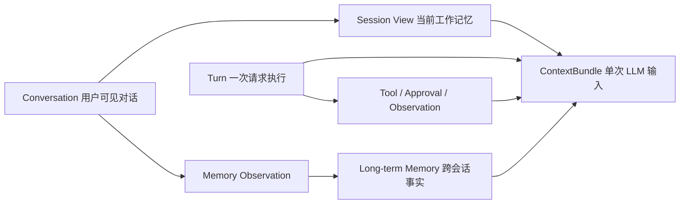
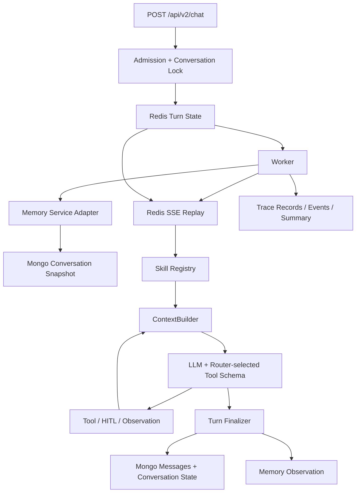
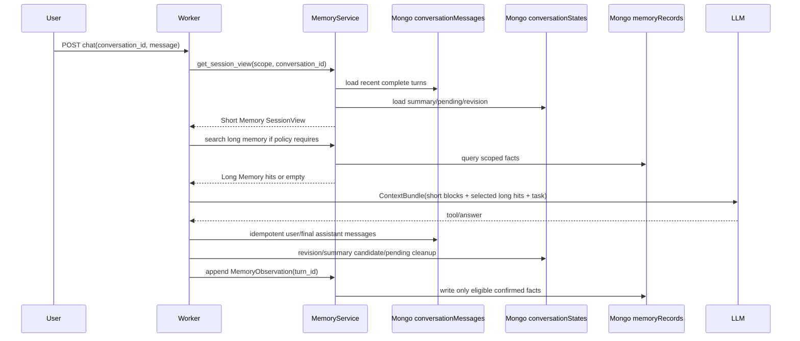
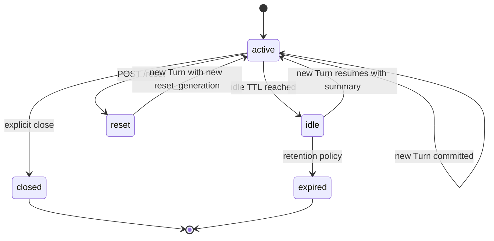

# v2 Agent Context、Session 与 Memory 一体化设计

> 本文是 Harness 总体设计中的 Context/Session/Memory 专项落地文档；宏观架构、Runtime 控制面、Context 压缩三道防线和完整改动路线见 [Agent Harness 总体设计](./2026-08-20-agent-harness-system-design.md)。

## 1. 文档定位

本文是 `../../agent` Context、Session、短时记忆和长期 Memory 的总设计，不是单个 bug 修复方案。它把已有的 Prompt Cache、ReAct Turn、Redis 协调、Mongo 会话历史和 Trace 规范收敛成一条可实施链路。

正式提案、技术决策、需求规格和实现任务位于：

- [OpenSpec proposal](../../../openspec/changes/agent-context-session-memory-system/proposal.md)
- [OpenSpec design](../../../openspec/changes/agent-context-session-memory-system/design.md)
- [OpenSpec tasks](../../../openspec/changes/agent-context-session-memory-system/tasks.md)
- [OpenSpec specs](../../../openspec/changes/agent-context-session-memory-system/specs/)

本文与已有的 [Context Prompt Cache 设计](./2026-08-10-context-prompt-cache-architecture.md)、[Mongo 会话集合设计](./2026-08-18-agent-mongo-collection-and-link-design.md) 和 [分层 Trace 设计](./2026-08-19-agent-trace-layered-observability-design.md) 配套使用。若旧文档与本文冲突，以本文和 OpenSpec delta spec 为准。

## 2. 设计目标

本设计要解决的不是“历史消息再多塞几条”，而是以下完整性问题：

1. 模型每次调用到底看到了哪些信息；
2. 哪些信息属于当前 Turn，哪些属于会话工作记忆，哪些可以跨会话沉淀；
3. 历史、摘要、Tool Schema 和工具结果如何共同受 token 预算控制；
4. Worker 重启、多进程、SSE 重连、摘要竞争和存储故障后，Context 是否仍然可恢复；
5. 开发者能否从 Trace 解释一次错误是 Context 缺失、工具未选择、工具未执行还是持久化失败。

## 3. 当前实现与问题边界

| 能力 | 当前实现 | 设计问题 | 目标阶段 |
|---|---|---|---|
| Prompt Cache | 静态 system prompt，时间放 user message | 方向正确，但 Tool Schema 未纳入统一预算 | P1 |
| Session 历史 | Memory Service 读取 Mongo | 需要完成真实 Mongo/Worker/SSE 验收 | P0 |
| 对话历史 | Mongo `conversationMessages` | 只用于 UI/历史查询，Runtime 不直接消费 | P0 |
| 短时窗口 | Memory Service 按完整 Turn 投影 | 需要继续完成 token 压缩和端到端验收 | P1 |
| 摘要 | `conversationStates.summary` + CAS | 需要继续完成真实 Worker 并发验收 | P0 |
| 长期 Memory | 只有读取入口，无沉淀生命周期 | 只是占位，不能宣称已有长期记忆 | P2 |
| Context usage | 只估算 messages | 未计 Tool Schema、Tool payload、response reserve | P1 |
| Tool Schema | 已实现 LLM Skill Router、Registry 按 Skill 展开和 `all/candidate` 开关；默认仍为 `all` | 尚未完成 candidate 灰度与回放评估 | P2 |
| Turn 状态 | Redis Hash + Event Stream | 已可恢复，但缺少 Context snapshot/revision 关联 | P0 |
| Trace | 已有 context build 和 LLM token usage | 缺少 Block、revision、source divergence、budget decision | P1 |

## 4. 核心概念与边界



### 4.1 Conversation

Conversation 是产品层多轮对话边界，外部 API 继续使用 `conversation_id`。它包含：

- 用户和助手最终可见消息；
- 当前会话状态和滚动摘要；
- `conversation_revision`、`summary_revision` 和 `reset_generation`；
- 用户、农场和权限范围。

### 4.2 Turn

Turn 是一次用户消息的执行边界，包含：

- 当前输入；
- ReAct step、Tool Call、Observation、HITL、终态；
- `turn_id`、`trace_id`、`conversation_revision`；
- Redis 中可恢复的状态和 SSE 事件。

Turn 结束后只保存最终用户/助手消息和受控的 Memory observation；原始工具轨迹进入 Trace/Turn 事件，不进入用户可见历史。

### 4.3 Context

Context 是一次 LLM API 调用的输入投影，每次 LLM 调用前重新构建。它不是永久状态，也不是完整历史。

同一 Turn 内：

- Conversation snapshot 保持不可变；
- 新的 assistant tool call、tool result、observation 作为动态内容追加；
- 下一步 LLM 必须重新计算预算和 Context Block；
- 外部业务数据是否变化由工具结果和明确刷新意图决定，不能把旧 Context 当实时数据库。

### 4.4 Session Memory

Session Memory 是当前 Conversation 的工作记忆投影，包含最近完整 Turn、滚动摘要、pending action 和临时任务状态。它可以过期或 reset，不等于删除用户可见历史。

### 4.5 Long-term Memory

Long-term Memory 是用户、农场或领域范围的稳定事实，例如明确的用户偏好、农场配置、已确认实体和已提交结果。它不能自动继承 conversation summary，也不能保存审批前数据和模型猜测。

## 5. 目标架构与事实源



路由模式由 `context.skill_router_mode` 控制：`llm_router` 走图中的 Router → Registry
选择链；`main_agent` 跳过前置 Router，Registry 直接向 ContextBuilder 提供全部 exposed
Tool Schema，由 Main Agent 自己完成能力路由。两种模式共用 Tool Executor、HITL、Context
预算和 Trace 契约。

| 存储 | 唯一职责 | 不负责什么 |
|---|---|---|
| Mongo `conversationMessages` | 用户/助手最终可见消息事实 | 不存完整 Tool 轨迹和逐 token 增量 |
| Mongo `conversationStates` | 会话 metadata、summary、revision、reset generation | 不替代 Turn 执行状态 |
| Redis Turn Hash | 活动 Turn、审批、租约、终态状态 | 不作为长期历史事实源 |
| Redis Event Stream | SSE 实时事件和短期 replay | 不作为永久 Trace 诊断源 |
| Mongo `traceRecords` | 执行节点、LLM、Tool、资源调用摘要 | 不作为用户聊天历史 |
| Mongo `traceEvents` | 语义 SSE 事件投影 | 不代表网络发送次数 |
| Memory Service/Records | 长期事实与 observation | 不保存未经确认的模型推断 |

### 5.1 现状：当前 Session 实际保存在哪里

当前代码里的“Session”没有独立的 `session` 表或集合，公开的会话标识实际就是 `conversation_id`。因此必须区分“当前实现”与“目标实现”：

| 数据 | 当前实际位置 | 当前读取/写入入口 | 生命周期 | 当前问题 |
|---|---|---|---|---|
| 会话标识 | API 请求 `conversation_id`，缺省为 `default` | `../../agent/api/chat.py` | 客户端持续携带 | 没有独立 Session metadata |
| 活动 Turn | Redis `turn:<turn_id>` Hash | `turn_store.py`、`worker.py` | `turn_state_ttl_seconds`，默认 1 天 | 只表示执行态，不是会话历史 |
| SSE 事件 | Redis `events:<turn_id>` Stream | `publish_event()`、`stream_events()` | Turn TTL | 只用于实时和重放 |
| 用户可见历史 | Mongo `conversationMessages` | `chat_store.append_message/load_recent/get_conversation` | 长期保留策略 | 当前 Runtime 不以它为短记忆主读源 |
| 当前短时记忆 | Mongo `conversationMessages` + `conversationStates` | `MemoryService.get_session_view()` | Mongo 持久化 | Mongo 不可用返回 `unavailable`，不伪造 fallback |
| 当前长期记忆 | 尚未启用 | `MemoryService.search()` 空实现 | 无 | Long-term Memory 按计划后置 |

结论：Session 运行态保存在 Redis Turn，用户可见历史和 Short Memory 保存在 Mongo。Memory Service 是唯一读取入口；Mongo 不可用时返回结构化 `unavailable`，不再保留本地 JSON fallback。

### 5.2 `conversationStates` 建议文档

```json
{
  "_id": "scope_hash:conversation_id",
  "schema_version": 1,
  "user_id": "user_01",
  "farm_uid": "farm_01",
  "conversation_id": "conv_01",
  "status": "active",
  "conversation_revision": 42,
  "reset_generation": 2,
  "summary": {
    "status": "ready",
    "content": "用户正在规划春季西瓜种植，已确认地块和面积。",
    "summary_revision": 7,
    "source_from_message_id": "msg_10",
    "source_to_message_id": "msg_24",
    "source_conversation_revision": 40,
    "content_hash": "sha256:...",
    "created_at": "2026-08-20T10:00:00Z"
  },
  "pending_action": null,
  "updated_at": "2026-08-20T10:01:00Z"
}
```

唯一索引建议为 `(user_id, farm_uid, conversation_id)`；所有读写都必须带可信身份范围。

### 5.3 目标：Session 保存在哪里

目标架构不新增公开的 `session_id`，仍使用 `conversation_id` 作为产品会话标识；Session 的持久化由两部分组成：

1. `conversationMessages` 保存用户可见消息事实；
2. `conversationStates` 保存 Session metadata 和工作记忆索引。

`conversationStates` 是 Session 的主状态文档，至少保存：

```text
scope: user_id + farm_uid + conversation_id
status: active | idle | closed | expired | reset
conversation_revision
reset_generation
summary.content / summary_revision / source_range
pending_action
temporary_task_state
last_active_at / expires_at
```

实现配置默认使用 `pending_action_ttl_seconds=600` 和
`task_state_ttl_seconds=3600`。读取 Session View 时同时检查状态字段和
`expires_at`；发现过期状态后使用当前 `conversation_revision` 做 CAS 清理，
避免过期审批或临时任务继续注入 Context。

Redis 只保存活动 Turn 的可恢复执行态和事件，不保存 Session 的长期真相。可选的 Redis snapshot 只能作为短 TTL 读缓存，必须带 `conversation_revision`；revision 不一致时回源 Mongo。

### 5.4 Short Memory：存储、读取和注入

Short Memory 不是一张单独的“最近消息表”，而是由三个持久化来源和一个运行时来源组成的 Session View：

| Short Memory 部分 | 存储位置 | 写入时机 | 读取时机 | 注入 Block |
|---|---|---|---|---|
| 最近完整 Turn | Mongo `conversationMessages` | 用户消息先写入；Turn 终态写 assistant 消息 | 每个新 Turn 启动时读取最近窗口 | `recent_turns` |
| 窗口外滚动摘要 | Mongo `conversationStates.summary` | 超过 token/Turn 阈值后生成，CAS 写入 | 每个新 Turn snapshot 读取 | `session_summary` |
| 待审批动作 | Redis Turn + `conversationStates.pending_action` | `approval_required` 时写入；完成/拒绝/过期时清理 | 新 Turn 和审批恢复时读取 | `pending_action` |
| 临时任务状态 | `conversationStates.temporary_task_state` | 计划/多步任务状态变化时更新 | 同一 Session 的每个 Turn 读取 | `active_task_state` |
| 当前 Turn 观察 | Redis Turn 内存态，随后进入 SSE/Trace | 当前 Tool 返回 observation 时追加 | 同一 Turn 的下一次 LLM 调用 | `turn_observations` |

Short Memory 的标准读取接口是：

```python
session_view = memory_service.get_session_view(
    user_id=user_id,
    farm_uid=farm_uid,
    conversation_id=conversation_id,
    reset_generation=reset_generation,
)
```

返回值必须包含：

```text
recent_turns
summary
pending_action
temporary_task_state
conversation_revision
summary_revision
source_status
```

注入顺序固定为：

```text
system_contract       system：静态、最高优先级、可缓存
tool_schema           API tools：Router 选中 Skill 展开的工具 Schema
hot_context           system：可信用户/农场/时间
pending_action        system：未过期的待审批状态
active_task_state     system：当前多步任务状态
session_summary       system：窗口外摘要
recent_turns          system：最近完整 Turn，标记为历史数据
task_input            user：当前用户请求
turn_observations     assistant/tool：当前 Turn 动态观察
```

每次 LLM 调用都重新组装上述投影；历史 Block 不能被模型当成待执行指令，必须带历史数据边界标记。Short Memory 不直接注入完整 Tool 原始结果，只注入结构化摘要，例如工具名、实体名称/ID、结果状态、查询时间和是否可能过期。

### 5.5 Long Memory：存储、沉淀、读取和注入

Long Memory 与 Conversation Session 分离，目标使用 Mongo `memoryRecords` 保存稳定事实，使用 `memoryObservations` 保存待处理的交互观察：

| 数据 | 目标存储 | 写入者 | 写入条件 | 注入方式 |
|---|---|---|---|---|
| 交互观察 | Mongo `memoryObservations` 或等价队列 | Turn Finalizer/Memory Service | Turn 已有明确终态，幂等写入 | 默认不直接注入 |
| 用户偏好 | `memoryRecords(scope=user)` | Memory Fact Writer | 用户明确表达或确认 | `memory_hits`，按需 |
| 农场稳定配置 | `memoryRecords(scope=farm)` | Memory Fact Writer/业务写入同步 | 业务事实已确认 | `memory_hits`，按需 |
| 已确认实体事实 | `memoryRecords(scope=farm, domain=planting/finance)` | 业务结果沉淀器 | Tool 成功提交或用户确认 | `memory_hits`，按需 |
| 临时查询结果 | 不进入 Long Memory | 无 | 仅当前任务需要 | Short Memory/当前 Turn observation |

`memoryRecords` 至少包含：

```text
memory_id
scope_type: user | farm | domain
scope_id
domain
fact_type
fact_value
source: user_confirmed | business_committed | reviewed
confidence
created_at / updated_at / expires_at
source_turn_id / source_message_id
status: active | superseded | expired | rejected
```

Long Memory 的写入链路为：

```text
Turn final_answer
    -> MemoryObservation(idempotency_key=turn_id)
    -> Fact eligibility check
    -> optional fact extraction/review
    -> memoryRecords upsert
```

模型不能直接把自己的推测写入 `memoryRecords`。摘要、天气临时结果、审批前参数、失败工具返回和未确认的业务意图只能留在当前 Session 或 Trace。

当前 Turn Finalizer 的提交顺序固定为：用户 prompt 以
`turn:{turn_id}:user:prompt` 幂等写入 `conversationMessages`；assistant 终态以
`turn:{turn_id}:assistant:{message_kind}` 幂等写入；assistant 消息成功或幂等命中后才推进
`conversationStates`；随后以 `turn:{turn_id}:memory-observation` 幂等追加
`memoryObservations`。Mongo 消息写入失败时不派发新 Turn，assistant 消息写入失败时不推进
Session revision。`memoryObservations` 只是待处理事件，不代表长期事实已写入。

错误边界如下：正常完成、超时、失败和审批拒绝会保存对应的 assistant 可见终态；取消或
审批过期且没有 assistant 终态时只清理 pending action，不伪造消息和 observation；业务
commit 已成功但回复收尾失败时保留 commit 事实并标记消息持久化不完整，恢复流程不得重复
执行 commit。

Long Memory 的标准读取接口是：

```python
hits = memory_service.search(
    scope={"user_id": user_id, "farm_uid": farm_uid},
    query=current_user_input,
    domains=selected_context_dependencies,
    limit=5,
)
```

注入规则：

- 闲聊、简单问答和无业务依赖请求不读取 Long Memory；
- 只有当前意图、Skill metadata 或明确用户请求触发检索；
- 结果以低优先级 `memory_hits` Block 注入，不写入 `recent_turns`，不伪装成用户原话；
- 每个 hit 必须携带来源、scope、时间和过期状态；
- 预算不足时先丢弃 Long Memory hits，不能丢弃当前任务、审批状态和最近观察。

### 5.6 两种 Memory 的完整读写时序



因此，Short Memory 是“同一 conversation 的工作上下文”，Long Memory 是“跨 conversation 的可复用事实”；两者都通过 MemoryService/ContextBuilder 注入，不能在 `react.py` 内部直接读文件或拼接数据库字段。

## 6. ContextBundle 设计

### 6.1 Block 类型

| Block | 默认优先级 | 来源 | 策略 |
|---|---:|---|---|
| `system_contract` | 0 | Prompt registry | 必须保留、版本化、可缓存 |
| `tool_schema` | 1 | SkillRegistry/ContextPolicy | 按需候选、计入预算 |
| `task_input` | 2 | 当前请求 | 必须保留 |
| `hot_context` | 3 | Auth/用户设置/农场快照 | 低 token、高可信 |
| `pending_action` | 4 | Turn/Conversation State | 未过期时必须保留 |
| `turn_observations` | 5 | 当前 Turn | 优先保留最新结果 |
| `recent_turns` | 6 | Conversation Messages | 保留最近完整 Turn |
| `session_summary` | 7 | Conversation State | 可压缩、需 revision |
| `memory_hits` | 8 | Memory Service | 只在意图或 Skill 依赖时检索 |
| `dynamic_reminder` | 9 | Runtime | 仅当前调用有效 |

每个 Block 至少有：`key`、`source`、`priority`、`required`、`compressible`、`min_tokens`、`estimated_tokens`、`version`、`fresh_until`、`status`、`drop_reason`。

### 6.2 预算算法

```text
usable_budget = model_context_tokens
              - response_reserve_tokens
              - safety_margin_tokens

used = system + tools + task + hot + pending
     + observations + recent_turns + summary + memory_hits
```

预算决策顺序：

1. 保留 required Block；
2. 保留当前任务、审批状态和最近 observation；
3. 压缩旧工具结果和窗口外历史；
4. 依次丢弃过期、低优先级、非当前意图相关 Block；
5. required Block 仍超限时生成 `context_budget_exceeded`，不得静默请求模型。

建议初始配置：

```yaml
context:
  recent_turn_limit: 6
  summary_soft_ratio: 0.60
  summary_hard_ratio: 0.80
  response_reserve_tokens: 4096
  safety_margin_tokens: 1024
  max_tool_result_summary_chars: 1200
  skill_router_mode: main_agent # main_agent | llm_router
  skill_router_backend: llm
  skill_router_max_skills: 3
  skill_router_timeout_seconds: 12
  tool_schema_mode: all # 兼容/观测字段；实际开关由 skill_router_mode 控制
```

`skill_router_mode=main_agent` 是默认 Baseline：跳过前置 Router，向 Main Agent 暴露全部 exposed Tool Schema。
切换为 `skill_router_mode=llm_router` 后，先调用 LLM Backend 选择 Skill，再由 Registry 展开候选 Tool
Schema；运行时 ContextBundle 会记录 `tool_schema_mode=candidate`。修改 `agent/config.yaml` 或对应环境变量后必须重启 Agent。
`tool_schema_mode` 保留用于兼容和观测，不单独决定是否调用 Router。

## 7. Session Memory 生命周期



### 7.1 新 Turn

1. 校验用户、农场和 `conversation_id`；
2. 读取 `conversationStates` 与最近消息，得到 `conversation_revision`；
3. 创建 Redis Turn，并保存 snapshot revision；
4. ContextBuilder 生成第一版 ContextBundle；
5. ReAct 每步重新构建动态 Context；
6. 终态后幂等写入 assistant 消息、conversation state 和 observation；
7. revision 递增，刷新摘要候选和 Trace summary。

### 7.2 摘要

摘要触发条件使用 token ratio 和完整 Turn 数的组合，而不是单一 message 数：

- soft threshold：后台生成，不阻塞当前 Turn，但必须带 CAS；
- hard threshold：当前 Turn 继续前同步压缩；
- summary 只覆盖明确的 source message range；
- 最近完整 Turn 永远优先于摘要；
- 摘要失败降级为最近窗口，并保留失败状态。

### 7.3 reset

`POST /api/v2/reset` 的默认语义是“重置 Agent 工作记忆”：

- 清空 active summary、pending action 和临时任务状态；
- `reset_generation += 1`；
- 保留 Mongo 用户可见消息，便于历史回看和审计；
- 新 Turn 不注入 reset 前的工作记忆；
- 硬删除历史必须是独立的受控数据治理接口。

## 8. 运行时代码改动范围

| 文件/目录 | 改动方向 | 边界 |
|---|---|---|
| `../../agent/domains/harness/context/builder.py` | ContextBundle、Block、预算和动态重建 | 不直接访问 Mongo/Redis |
| `../../agent/domains/harness/memory/service.py` | 改为 Memory adapter/Projection 入口 | 不暴露本地文件给 Runtime |
| `../../agent/domains/harness/context/summarizer.py` | 独立 summary、CAS、幂等、失败状态 | 不覆盖新 revision |
| `../../agent/domains/harness/runtime/engine.py` | 消费 Context/Memory 接口，移除存储细节 | 保留 ReAct 和终态语义 |
| `../../agent/domains/harness/runtime/turn.py` | 增加 snapshot/revision/source 状态 | 不混淆 TurnStatus 与 Context 状态 |
| `../../agent/platforms/persistence/mongo/chat_store.py` | Conversation State、消息事实源、索引 | 只负责 Mongo adapter |
| `../../agent/platforms/persistence/redis/turn_store.py` | 保存 revision、reset generation 和回放状态 | Redis 只做在线状态 |
| `../../agent/application/worker.py` | 恢复和幂等持久化 | 不重复写最终消息 |
| `../../agent/api/chat.py` | 暴露 source/revision 元数据 | 保持现有请求兼容 |
| `../../agent/api/reset.py` | reset generation 和 active view 清理 | 默认不删可见历史 |
| `../../agent/domains/harness/observability/trace/` | Context、Memory、summary、budget trace | 脱敏、有界 |
| `../../agent/prompts/` | 保持静态 contract 和版本 | 不注入动态业务事实 |
| `../../agent/tools/` | 增加 context dependency 元数据 | 不在 Skill 内拼 Context |

## 9. 迁移范围与开关

### Phase 0：只观测

- 新增 ContextBlock/Bundle 和 revision 数据结构；
- shadow 计算 Mongo 与 JSON 的差异；
- 不改变实际模型输入；
- 增加 `context_source_divergence` Trace。

### Phase 1：摘要正确性

- 增加 `conversationStates`；
- 摘要独立存储并 CAS；
- 修复摘要回注；
- reset 改为 generation 语义。

### Phase 2：Mongo-only 读取

- Memory adapter 只读 Mongo；
- Mongo 不可用时返回 `unavailable`，由 application 按策略决定当前 Turn 是否继续；
- 完成多 Worker、重启、Mongo 故障和一致性验收后进入生产运行。

### Phase 3：Skill Router 与按需工具

- 真实计算 message/tool/result/reserve；
- 最近 Turn + summary 压缩；
- LLM Skill Router shadow 运行，记录 selected Skill 与全量暴露差异；
- candidate Tool Schema 灰度。

### Phase 4：长期 Memory

- 接入 observation queue；
- 只沉淀确认后的用户/农场事实；
- 后续独立评估检索和向量能力。

建议开关：

```text
candidate_tool_schema
long_term_memory_observation
```

任何阶段回滚只关闭业务能力开关，不删除 Mongo 消息、摘要和 Trace；Mongo 不可用时返回 `unavailable`，不启用本地文件 fallback。

## 10. 验收体系

| 验收域 | 必须证明的事实 |
|---|---|
| 多轮语义 | 第一轮查询结果可被第二轮引用，且不无意义重复查询 |
| 摘要 | 摘要生成后重载仍能注入，旧摘要不能覆盖新消息 |
| 预算 | Tool Schema、工具结果和输出预留都被计入，裁剪有原因 |
| 生命周期 | reset、idle、expired、resume 的注入语义明确 |
| 恢复 | Worker 重启和 SSE after_seq 不重复执行或写消息 |
| 一致性 | Mongo、Memory projection、Trace revision 可互相解释 |
| 租户 | 不同用户/农场无法读取对方 Conversation 或 Memory |
| 降级 | Mongo/Redis/Memory 故障返回结构化 source status，不伪造成功 |
| 观测 | Trace 能区分 Context 缺失、工具未选、工具未执行和持久化失败 |
| 工程门禁 | focused tests、Ruff、复杂度、层依赖和真实 Redis/Mongo/SSE smoke 通过 |

## 11. 明确不在本次实现中的内容

- 不直接把所有历史迁移成向量；
- 不引入第二套公开 Session API；
- 不把完整思维过程写入 Mongo；
- 不把 Trace summary 当作用户聊天事实；
- 不以“LLM 返回了自然语言成功”替代业务提交证据；
- 不在没有真实 Redis/Mongo/Worker/SSE 证据时宣称生产链路完成。

## 12. 评审结论

本设计的核心交付不是一个新的 `memory.py`，而是一个有明确事实源和版本边界的工作记忆系统：

```text
Mongo Conversation Snapshot
    -> Memory Service Projection
    -> ContextBundle + Token Budget
    -> ReAct Turn
    -> Idempotent Finalization
    -> Conversation Revision / Memory Observation / Trace
```

后续实现应按 OpenSpec tasks 的 1～8 组顺序推进，每组完成后只用对应 focused evidence 标记完成，不能以静态代码存在替代真实 Worker、存储和 SSE 验收。

## 13. 当前实现状态（2026-08-21）

本轮按“Session + Short Memory + Context 优先、Long-term Memory 延后”的范围完成了第一段可运行闭环：

| 已落地 | 证据/边界 |
|---|---|
| `ConversationSnapshot`、`ContextBlock`、`ContextBundle`、`MemoryObservation`、`MemoryHit` | `../../agent/domains/harness/context/models.py`，含 JSON round-trip、租户字段和 revision |
| `conversationStates` adapter | `../../agent/platforms/persistence/mongo/chat_store.py`，含租户过滤、唯一索引、revision CAS、幂等和 unavailable |
| Session View 读取入口 | `memory.get_session_view()`；只读取 Mongo，故障返回 `unavailable` |
| Short Memory 注入 | `session_summary`、`recent_turns`、`pending_action`、`active_task_state` 独立 Block；工具原始 payload 不进入历史投影 |
| Context 预算 | messages、Tool Schema、response reserve、safety margin，支持 required 保留和低优先级 Block drop reason |
| reset 语义 | `/api/v2/reset` 清理 active state 并递增 `reset_generation`；Mongo 可见消息不删除 |
| API 状态元数据 | `/api/v2/chat`、`/conversations/{id}`、`/turns/{id}` 及 SSE replay 统一暴露 `conversation_revision`、`summary_revision`、`reset_generation`、`source_status`；`context_source_status` 作为兼容别名 |
| Worker 恢复与幂等 | Redis Stream pending 支持 XAUTOCLAIM/XCLAIM 恢复；重复 dispatch 通过 lease 三态检查避免并发重跑，执行中断只收口，`finalization_pending` 只补 assistant/Session/observation |
| 存储降级与事实源一致性 | Mongo health/source status、Redis/Mongo unavailable、revision divergence 均返回结构化状态；Mongo-only Context 不读取本地 JSON，漂移时终止当前 Turn，不带空历史执行 Tool |
| Trace 收尾与展示语义 | 修复 `conversationStates` 首次 upsert 的 `farmUid` modifier 冲突；可见回复已完成但 Session state 收尾失败时汇总为 `partial`，前端显示为告警；Main Agent 不再记录 disabled/空工具选择节点 |
| Trace 安全与指标 | Trace payload 递归脱敏、隐藏推理链过滤和大小上限；新增 summary compaction、memory read/observe、source divergence、budget error、persistence state 节点及 Context budget 聚合 |
| 历史迁移校验 | `scripts/migrate_conversation_snapshots.py` 默认 dry-run，只创建缺失 state 候选，不覆盖已有 state、不删除消息；真实 Mongo dry-run 扫描 80 个会话，发现 15 个 incomplete_turn divergence |
| Router 回放评估 | `scripts/evaluate_skill_router.py` 提供 Skill recall、误调用率、Tool Schema token 成本三项灰度门槛；尚未接入真实脱敏回放集和生产 candidate 开关 |
| Skill Router | 支持 `llm_router` 与 `main_agent` 双模式；前者由可插拔 LLM Backend 读取轻量 Skill Metadata，后者直接由 Main Agent 从全量 Tool 路由；Registry 展开 Tool，ContextBundle 保存选中 Skill/dependency | 尚未完成 candidate 灰度与回放评估；Router 失败回退 `all` |
| 长时记忆 | `search()` 仍为空结果；已持久化受控 `memoryObservations` 事件，但未接入事实抽取、审核、向量检索或 `memoryRecords` 自动写入 |

本轮尚未宣称完成：真实多 Worker/Worker 重启/SSE replay smoke、candidate Tool Schema 真实灰度、历史数据写入归档和脱敏回放集评估。当前 `skill_router_mode=main_agent`、`tool_schema_mode=all` 为默认兼容模式；切换 `llm_router` 后由可插拔 LLM Backend 先读取轻量 Skill Metadata，再由 Registry 展开 Tool Schema，不能把 ContextBuilder 内的规则过滤当作 Router。摘要 Mongo CAS、并发保护、Context 压缩、API 状态元数据、存储降级和模拟 Worker 恢复已完成 focused tests；Long-term Memory 仍为空实现。

目录对齐状态：`agent/core`、`agent/infra`、`agent/skills` 已删除；Context、Runtime、Memory、Control、Trace 位于 `agent/domains/harness`，平台适配位于 `agent/platforms`，具体 Tool 位于 `agent/tools`，启动和 Worker 位于 `agent/bootstrap`、`agent/application`。

Memory 目录按职责拆分为：

```text
agent/domains/harness/memory/
├── models.py       # Session View、租户范围和 Memory 边界契约
├── short_term.py   # Mongo Session View、最近完整 Turn、state CAS/reset
├── long_term.py    # observation/search 端口；当前不自动写入长期事实
├── policy.py       # Short/Long Memory 的 Context 注入决策
└── service.py      # Memory Service 稳定门面，只转发不承载存储实现
```

`service.py` 仍保留是因为它代表 Memory Service 的应用边界，不是旧存储兼容层；Runtime、Worker、API 通过该边界调用，具体实现分别归属上述四个职责模块。

## 14. TODO 清单（持续更新）

> 这是一份面向评审和实施的直观清单，状态以同目录的
> [`tasks.md`](../../../openspec/changes/agent-context-session-memory-system/tasks.md)
> 为准。勾选项表示已有 focused evidence；未勾选项表示尚未完成，不能以设计存在替代实现或真实验收。

### 短时记忆与摘要

- [x] 2.2 基于完整 Turn 的最近窗口 projection，移除本地文件和固定消息数截断。
- [x] 2.3 将摘要迁移为独立 `conversationStates.summary`，补齐 source range、revision、content hash。
- [x] 2.4 增加摘要 CAS、幂等 key、失败状态和并发 Worker 测试。
- [x] 2.5 完成 pending action、临时任务状态的读取与过期清理；审批产生时即时写入，读取时按 `expires_at/status` CAS 清理。
- [x] 3.5 让 `_try_compress_context` 基于 ContextBundle conversation revision 和 summary revision 工作，避免覆盖竞争。

### Runtime、Tool 与持久化边界

- [x] 4.3 增加位于 ContextBuilder 之前的可插拔 Skill Router：默认提供 LLM-based Backend，支持 `llm_router` 与 `main_agent` 双模式；由 Registry 展开 Tool Schema，ContextBuilder 按 Skill Context dependency 注入上下文，并保留全量暴露兼容开关。
- [x] 4.4 将用户消息、assistant 最终消息、observation 和 Memory observation 幂等提交。
- [x] 4.5 明确错误、超时、取消、审批过期和 commit 后收尾失败的 Session Memory 写入边界。

### API、恢复与降级

- [x] 5.1 让 `/api/v2/chat`、conversation detail 和 Turn state 暴露 revision、reset generation、source status；已覆盖 Turn 类型归一化、conversation state unavailable、SSE replay 元数据透传。
- [x] 5.3 验证 Worker 重启、SSE `after_seq` 重连和幂等 request 不重复执行或写消息；已覆盖 lease 三态、pending finalization 收尾、消息/observation 幂等和 XAUTOCLAIM/XCLAIM 恢复替身。
- [x] 5.4 完成 Mongo/Redis 不可用和 source divergence 的结构化降级；不提供本地 JSON fallback。已补充 health/source status、revision divergence 和失败前不进入 Tool Runtime 的测试。

### Trace 与安全观测

- [x] 6.2 增加 summary compaction、memory read/observe、source divergence、budget error Trace 节点。
- [x] 6.3 聚合 Context token、reserve、压缩/丢弃、摘要、fallback 和持久化状态指标。
- [x] 6.4 增加敏感字段脱敏、payload 上限和不记录隐藏思维链/凭证的回归检查。

### 迁移与灰度

- [x] 7.1 完成 Mongo snapshot 历史数据导入校验和 divergence 指标；真实 dry-run 扫描 80 个会话，报告 15 个 `incomplete_turn`，未写入或删除数据。
- [ ] 7.2 灰度启用摘要 CAS 和 Conversation state，完成真实重启、多 Worker 和摘要冲突验收。
- [x] 7.3 完成 Mongo-only Context 读取验收；真实 Mongo 空会话读取返回 `source_status=mongo`，不可用回归返回 `unavailable`，无本地 JSON fallback。
- [ ] 7.4 灰度启用 LLM Skill Router 的 candidate 模式，并比较 Skill 召回、工具误调用和 token 成本。
- [ ] 7.5 完成 Mongo 历史数据导入校验与归档策略，保证可回滚且不删除用户可见历史。

### 最终验收

- [x] 8.1 补齐多轮追问、工具结果摘要、摘要回注、pending action、reset、跨租户隔离测试。
- [ ] 8.3 完成真实 Redis/Mongo/Worker/SSE replay smoke。
- [ ] 8.4 通过 v2 Agent focused tests、Ruff、格式化、复杂度和层依赖门禁。
