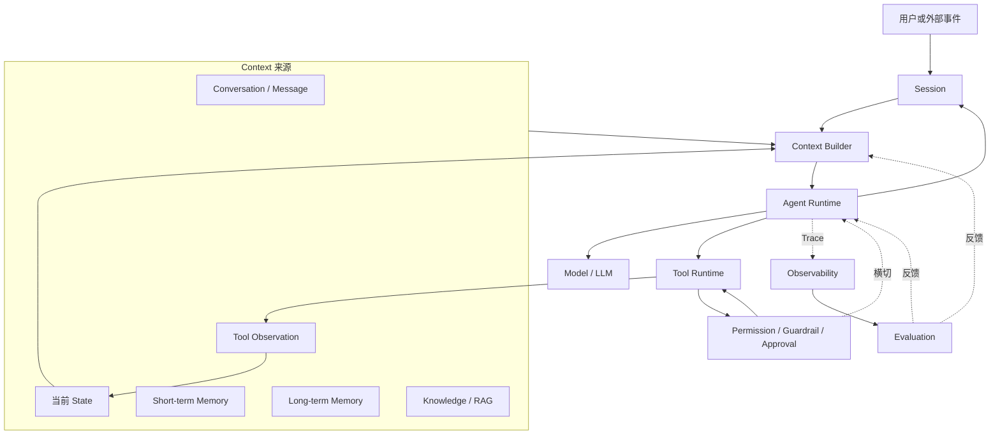
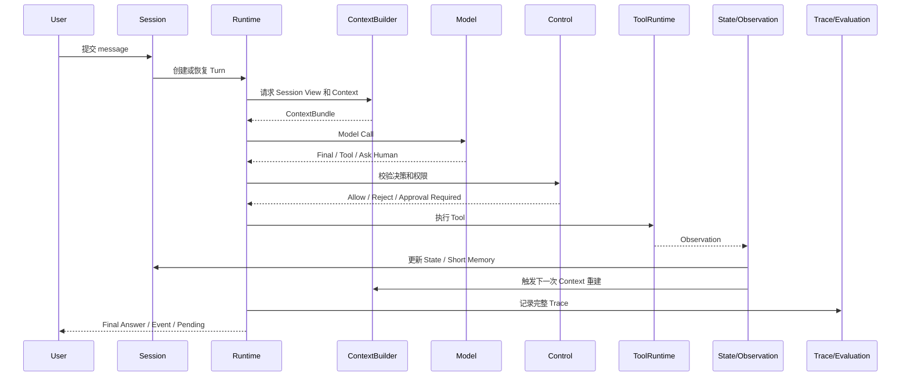
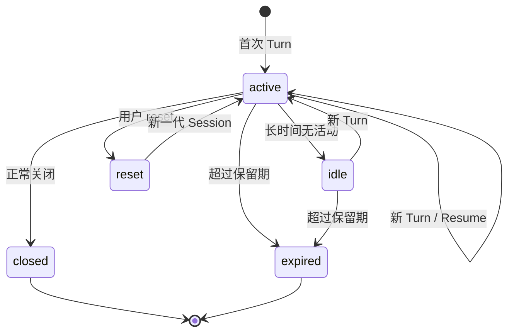
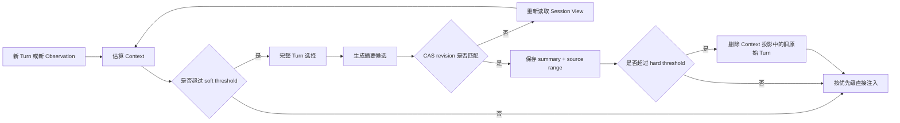

# Agent Harness 设计总览：从总观聚焦到 Session / Context

> 本文是一张架构地图，不是所有模块的实现细节清单。阅读顺序固定为：先理解 Harness 总体，再理解 Session，再理解 Context，最后进入 Runtime、Memory、Tool、Control、Trace 和 Evaluation。

参考方法论：[harness 方法论](../reference/harness方法论.md)。

专项落地文档：[Context、Session 与 Memory 一体化设计](./2026-08-20-agent-context-session-memory-system-design.md)。

## 1. 设计目标

Farm Manager Agent 不是一次“用户请求 → LLM → 文本回复”的调用，而是一个具有不确定性决策能力的执行系统。Harness 的职责是把这种不确定性包裹在可恢复、可控制、可观测、可评估的运行环境中。

```text
Agent = LLM + Prompt + Tools + State + Memory + Runtime

Harness = Context + Runtime + State + Memory + Tools
        + Control + Recovery + Observability + Evaluation
```

本设计先解决两个基础问题：

1. 一次 Agent 运行空间是什么——Session；
2. 某一次模型调用真正看到什么——Context。

其余能力必须围绕这两个对象展开，不能在 `react.py`、Prompt 或 `memory.py` 中各自定义一套隐式规则。

## 2. 总体架构地图

### 2.1 八个领域

```text
Agent Harness
│
├── Session              一次持续交互和执行的容器
├── Context              某一次 LLM 调用的输入投影
├── Runtime              驱动 Observe → Decide → Act 的执行引擎
├── State                当前任务执行到哪里
├── Memory / Knowledge   历史事实与外部知识
├── Tools / Control      与外部世界交互及风险约束
├── Observability        Trace、Log、Metric、Token、Cost
└── Evaluation           答案、Context、工具和轨迹质量
```

其中：

- Runtime 是纵向主线，负责推进一次 Agent Run；
- Session、State、Memory、Knowledge 为 Context 提供来源；
- Tools 产生新的 Observation，促使 State 和 Context 更新；
- Control、Observability、Evaluation 横向贯穿整个生命周期。

### 2.2 目标组件图



### 2.3 主循环和横切能力

```text
纵向执行主线：

Session → Context → Runtime → Model / Tool → Observation
    ↑                                      │
    └──────────── State / Memory ─────────┘

横向基础设施：

Control       约束每一次模型决策和工具执行
Observability 记录每一次输入、决策、执行和状态变化
Evaluation    评价最终结果和完整轨迹，并反哺策略
```

## 3. 核心对象边界

这些对象不能因为都包含 JSON 或都能被序列化，就合并成一个“大 Session 对象”。

| 对象 | 回答的问题 | 生命周期 | 是否直接注入 LLM |
|---|---|---|---|
| Session | 这次持续交互和执行属于哪个空间 | 多个 Turn | 不直接注入，提供 Session View |
| Conversation | 用户可见的哪段对话 | 跨多个 Turn | 通过历史 Block 投影 |
| Message | 对话中的一条可见消息 | 长期历史 | 选择后注入 |
| Turn | 本次用户请求如何被执行 | 单次请求 | 产生当前输入、Observation 和 Trace |
| State | 当前任务执行到哪一步 | 当前任务/Session | 以结构化 State Block 注入 |
| Context | 本次模型调用真正看到什么 | 单次 LLM Call | 是 |
| Short Memory | 当前 Session 最近知道了什么 | 当前 Conversation | 通过摘要、最近 Turn 注入 |
| Long Memory | 跨 Session 哪些事实仍然有效 | 长期 | 按需检索后低优先级注入 |
| Knowledge | 外部领域知识是什么 | 知识库生命周期 | 通过 RAG 注入 |
| Runtime | 下一步调用模型、工具还是等待 | Turn/Run | 否 |
| Control | 这次动作是否允许执行 | 每次决策/工具调用 | 否 |
| Trace | 这次运行实际上发生了什么 | 诊断与评估生命周期 | 否 |

最重要的区别：

```text
State   = 现在正在发生什么
Memory  = 过去留下了什么
Context = 这一次模型调用看到什么
Session = 这一次交互和执行的容器
```

## 4. 一次完整 Agent Run



标准执行不是一次完成，而是：

```text
Session
  ↓
Context
  ↓
Runtime
  ↓
Model
  ↓
Decision
  ├── Final Answer
  ├── Tool Call → Control → Execute → Observation
  ├── Ask Human → Pause → Resume
  └── Continue → Rebuild Context
```

## 5. 第一聚焦：Session

### 5.1 Session 的定义

Session 是“一次持续交互和执行的运行空间”，它不是单独一张消息表，也不是本地 JSON 文件。

```text
Session
├── identity：user / farm / conversation
├── lifecycle：active / idle / closed / expired / reset
├── conversation reference
├── current task and pending action
├── short-memory reference
├── revision / reset generation
└── active Turn reference
```

产品层继续使用 `conversation_id` 作为公开会话标识；内部把它扩展为带可信身份范围的 Session Scope：

```text
Session Scope = user_id + farm_uid + conversation_id
```

### 5.2 Session 与存储的职责映射

| 存储 | 保存什么 | 不保存什么 |
|---|---|---|
| Mongo `conversationMessages` | 用户/助手最终可见消息 | 完整工具轨迹、逐 token 增量 |
| Mongo `conversationStates` | Session metadata、summary、revision、pending action、临时任务状态 | 活动 Turn 的完整执行状态 |
| Redis Turn Hash | 活动 Turn、租约、审批、终态、恢复信息 | 长期会话真相 |
| Redis Event Stream | SSE 实时事件和短期重放 | 永久诊断 Trace |
| Mongo Trace | Model、Tool、State、Context、错误和预算决策 | 用户可见对话 |
| Memory Records | 跨 Session 的稳定事实 | 未确认的模型推测 |

当前迁移前状态和目标结构已在 [Context/Session/Memory 专项设计](./2026-08-20-agent-context-session-memory-system-design.md) 中逐项记录。核心迁移结论是：`memory.py` 的本地 JSON 不能继续作为生产 Session/Short Memory 的平级事实源。

### 5.3 Session 生命周期



Session reset 只清理 Session 工作记忆、summary、pending action 和临时任务状态；不得删除用户可见历史，除非另有明确的数据删除操作。

### 5.4 Session 的读取接口

Runtime 不应直接读取 Mongo 字段或 `memory.py` 文件，而应依赖统一的 Session View：

```python
session_view = session_service.load_view(
    user_id=user_id,
    farm_uid=farm_uid,
    conversation_id=conversation_id,
)
```

Session View 至少包含：

```text
conversation_revision
reset_generation
recent_turns
summary
pending_action
active_task_state
source_status
```

## 6. 第二聚焦：Context

### 6.1 Context 的定义

Context 是某一次 Model Call 的输入集合，不是永久状态，也不是完整历史。

```text
Conversation / State / Memory / Knowledge / Tool Result
                         ↓
                   Context Builder
                         ↓
                    ContextBundle
                         ↓
                         LLM
```

每次 LLM 调用都必须重建 Context。尤其是 Tool 返回、审批恢复、State 变化或外部业务数据刷新后，不能复用上一次完整 Prompt。

### 6.2 Context 来源与优先级

```text
P0  system contract / safety / output contract
P1  当前用户输入和当前任务目标
P2  pending action / approval / active task state
P3  当前 Turn 的 Tool Observation
P4  相关实体和业务事实
P5  最近完整 Turn
P6  Session Summary
P7  按需 Long Memory / RAG
P8  可丢弃的旧历史和低相关结果
```

预算不足时按 `P8 → P7 → P6 → P5` 逐级丢弃，不能丢弃当前任务、审批状态、未完成步骤和当前 Turn 的关键 Observation。

### 6.3 ContextBundle 的结构

```text
ContextBundle
├── system_contract
├── task_input
├── session_summary
├── recent_turns
├── active_task_state
├── pending_action
├── current_observations
├── selected_memory_hits
├── selected_knowledge_hits
├── candidate_tool_schemas
├── budget_decision
└── source_revisions / content_hashes
```

每个 Block 必须带：

```text
block_type
source
priority
token_estimate
revision
freshness / expires_at
trust_boundary
```

这样 Trace 才能回答：模型看到了哪些信息、哪些信息被裁剪、哪些信息已经过期。

### 6.4 Short Memory 的注入

Short Memory 是当前 Session 的工作上下文，由以下部分组成：

```text
Session View
├── recent complete turns
├── rolling summary
├── pending action
├── active task state
└── current Turn observations
```

注入顺序：

```text
system contract
→ tool schema
→ trusted entity context
→ pending action
→ active task state
→ session summary
→ recent turns
→ current user input
→ current Turn observations
```

最近历史必须按完整 Turn 选择，不能简单截取最后 N 条 Message；摘要必须标记为历史数据，不能被模型当作新的系统指令。

### 6.5 Long Memory 的注入

Long Memory 暂不作为第一阶段实现重点，只先定义边界：

- 跨 Conversation 的稳定事实才有资格进入 Long Memory；
- 用户明确表达、业务成功提交或人工确认是主要事实来源；
- 模型猜测、临时工具结果、审批前参数和失败结果不能直接写入；
- 只有当前意图需要时才检索；
- 以低优先级 `memory_hits` Block 注入，预算不足时优先丢弃。

详细写入、检索和沉淀生命周期见专项设计文档，不在本阶段扩大运行时代码范围。

## 7. Context 压缩设计

压缩的目标不是删除历史，而是把“窗口外仍然需要的事实”从原始消息转换为可验证的摘要和 State。

```text
原始历史事实
      ↓ 选择完整 Turn
      ↓ 提取目标、约束、已完成、待完成、关键结果
      ↓ 带 source range / revision / hash 写入 summary
      ↓ Context 使用 summary + 最近完整 Turn
```

### 7.1 三层机制

| 层级 | 触发 | 处理 | 目的 |
|---|---|---|---|
| 自动衰减 | Context 每次接近预算 | 保留最近完整 Turn，裁剪低优先级旧结果 | 日常控制规模 |
| 阈值压缩 | 超过 soft/hard threshold | 生成滚动摘要，CAS 更新 `conversationStates` | 形成稳定窗口 |
| Checkpoint | 计划完成、Tool Batch、审批、提交、恢复边界 | 固化 State、摘要和执行证据 | 保证长任务可恢复 |

### 7.2 压缩不可丢失的信息

```text
任务目标和用户约束
用户/农场/实体 ID
已确认的业务事实
已完成步骤与待完成步骤
pending action / approval
成功 Tool 的关键结果和来源
失败原因及重试状态
summary source range / revision / content hash
```

### 7.3 压缩状态机



压缩只改变 Context 投影和 Session summary，不删除 `conversationMessages` 的用户可见历史。摘要更新必须幂等、可验证、带来源范围，并通过 CAS 防止异步任务覆盖新摘要。

## 8. 其他 Harness 领域的定位

第一阶段不实现所有领域，但必须先固定边界，避免后续各自发明协议。

| 领域 | 后续职责 | 当前与 Session/Context 的关系 |
|---|---|---|
| Runtime | 调度 Model、Tool、Human、Retry、Timeout、Recovery | 消费 ContextBundle，产生 Observation |
| State | 保存任务计划、步骤、变量、错误、pending action | 是 Context 的高优先级来源 |
| Tools | 查询、计算、写入业务系统 | 结果进入当前 Turn，不默认进入长期记忆 |
| Control | 权限、Guardrail、参数校验、审批 | 在 Tool 执行前后约束 Runtime |
| Observability | 记录 Context、决策、工具、状态、错误 | 必须记录 Context revision 和预算决策 |
| Evaluation | 评价答案、Context、工具、轨迹、安全和成本 | 反哺 Selector、压缩和 Runtime 策略 |

## 9. Harness 目录与模块设计

目录设计遵循一个原则：**领域模块表达 Harness 语义，平台模块表达存储和外部依赖，Application 负责编排，API 只负责协议适配。**

### 9.1 目标目录

```text
agri_backend_v2/
├── agent/
│   ├── bootstrap/                 # 启动、依赖装配、Worker 生命周期
│   │   ├── app.py
│   │   ├── dependencies.py
│   │   └── lifecycle.py
│   │
│   ├── api/                       # HTTP / SSE / HITL 协议适配，不承载 Harness 规则
│   │   ├── chat.py
│   │   ├── turns.py
│   │   ├── approve.py
│   │   ├── conversations.py
│   │   └── traces.py
│   │
│   ├── application/               # 用例编排：把请求接入 Harness
│   │   ├── submit_turn.py
│   │   ├── resume_turn.py
│   │   ├── reset_session.py
│   │   └── inspect_trace.py
│   │
│   ├── domains/
│   │   └── harness/
│   │       ├── session/           # SessionScope、SessionView、生命周期、reset
│   │       │   ├── models.py
│   │       │   ├── service.py
│   │       │   └── repository.py
│   │       ├── context/            # ContextBundle、Block、Selector、Budget、Builder
│   │       │   ├── models.py
│   │       │   ├── builder.py
│   │       │   ├── blocks.py
│   │       │   ├── selectors.py
│   │       │   ├── budget.py
│   │       │   └── compression.py
│   │       ├── runtime/            # Observe、Decide、Act、暂停、恢复、重试
│   │       │   ├── engine.py
│   │       │   ├── decisions.py
│   │       │   ├── recovery.py
│   │       │   └── checkpoint.py
│   │       ├── state/              # Task State、步骤、变量、transition
│   │       │   ├── models.py
│   │       │   ├── transitions.py
│   │       │   └── service.py
│   │       ├── memory/             # Short Memory、Summary、Long Memory 策略
│   │       │   ├── models.py
│   │       │   ├── short_term.py
│   │       │   ├── long_term.py
│   │       │   └── policy.py
│   │       ├── tools/              # Tool 定义、选择、参数校验、执行结果
│   │       │   ├── models.py
│   │       │   ├── registry.py
│   │       │   ├── selector.py
│   │       │   └── executor.py
│   │       ├── control/             # Permission、Guardrail、Approval
│   │       │   ├── policy.py
│   │       │   ├── guardrail.py
│   │       │   └── approval.py
│   │       ├── observability/       # Trace、Span、Context/State/Tool 事件
│   │       │   ├── models.py
│   │       │   ├── recorder.py
│   │       │   └── events.py
│   │       └── evaluation/          # Answer、Context、Tool、Trajectory 评估
│   │           ├── cases.py
│   │           ├── evaluators.py
│   │           └── regression.py
│   │
│   ├── platforms/                  # 外部依赖适配，不能反向定义 Harness 业务语义
│   │   ├── llm/                    # Model Client、token usage、retry
│   │   ├── persistence/
│   │   │   ├── mongo/              # conversationMessages、conversationStates、Trace
│   │   │   ├── redis/              # Turn、Lock、Event Stream、Checkpoint
│   │   ├── mcp/                    # Business MCP Client
│   │   └── clock.py
│   │
│   ├── tools/                      # 具体 local / MCP Tool 实现与 skill.md
│   ├── prompts/                    # 静态系统契约和输出协议
│   └── config.py                   # 配置和 Feature Flag
│
├── business/                      # 业务 API、Service、MCP Tool；不依赖 agent Harness
├── shared/                         # 无业务副作用的跨项目类型和工具
└── tests/
    ├── harness/                    # Session、Context、Memory、Runtime 合同测试
    ├── integration/                # Redis、Mongo、MCP、LLM 边界测试
    └── e2e/                        # Chat、SSE、HITL、恢复验收
```

### 9.2 目录与 Harness 领域的对应关系

```text
API / Bootstrap
       ↓
Application
       ↓
Session ───────────────┐
       ↓               │
Context ← State/Memory/Knowledge
       ↓               │
Runtime → Model / Tools → Control
       ↓               │
Observation → State ───┘
       ↓
Observability → Evaluation
```

依赖方向固定为：

```text
api / bootstrap
        ↓
application
        ↓
domains.harness
        ↓
platforms / tools
        ↓
shared
```

领域模块只能依赖领域模型和抽象接口；Mongo、Redis、JSON、MCP、LLM 等具体实现只能放在 `platforms/`，通过依赖注入进入领域服务。

### 9.3 当前模块迁移映射

| 当前路径 | 目标归属 | 迁移说明 |
|---|---|---|
| `agent/core/context.py`、`context_models.py` | `domains/harness/context/` | 收敛为 ContextBuilder、Block、Budget 和 Selector |
| `agent/core/memory.py` | `domains/harness/memory/` + `platforms/persistence/mongo/` | Memory Service 统一读取 Mongo Conversation snapshot，不保留本地 JSON 适配 |
| `agent/core/summarizer.py` | `domains/harness/context/compression.py` | 摘要属于 Context 压缩，不是独立的隐式 Memory |
| `agent/core/turn.py`、`react.py` | `domains/harness/runtime/` | `react.py` 收敛为 Runtime 编排入口，不直接读存储 |
| `agent/core/planner.py`、`verify.py` | `domains/harness/runtime/`、`state/` | Planner 产出 State；Verify 负责结果验证和终态判定 |
| `agent/core/hitl.py` | `domains/harness/control/approval.py` | 审批状态通过 Session/Turn State 传递 |
| `agent/infra/turn_store.py`、`worker.py`、`coordination.py` | `platforms/persistence/redis/` + `application/` | Redis 存储和 Worker 编排分离 |
| `agent/infra/chat_store.py` | `platforms/persistence/mongo/` | 只实现 Conversation/Session Repository |
| `agent/infra/trace/` | `domains/harness/observability/` + `platforms/persistence/mongo/` | Trace 语义与 Trace 持久化分离 |
| `agent/infra/llm.py` | `platforms/llm/` | 只提供 Model Client，不拼接业务 Context |
| `agent/infra/mcp_client.py` | `platforms/mcp/` | 只负责 Business MCP 通信 |
| `agent/skills/` | `agent/tools/` | 统一命名为 Tool；local 与 MCP 是两种执行适配 |
| `agent/api/` | `agent/api/` | 保留协议入口，调用 Application，不直接操作 Domain Store |

### 9.4 目录设计中的硬边界

- `api/` 不生成 Prompt、不选择 Memory、不直接调用 Mongo/Redis；
- `application/` 只编排用例，不实现 Context 压缩算法；
- `domains/harness/context/` 不读取文件或数据库，只消费 Repository/Provider 接口；
- `domains/harness/memory/` 定义记忆资格、衰减、检索和注入策略，不拥有具体存储连接；
- `domains/harness/runtime/` 不拼接消息，不绕过 Control 执行 Tool；
- `platforms/` 不反向依赖 `api/` 或具体业务 Skill；
- `business/` 只负责业务事实和业务 Tool，不负责 Agent Session、Context 和 Prompt；
- `tests/` 按领域合同、平台集成和端到端链路分层，不把所有测试堆在一个文件中。

### 9.5 目录迁移状态

本轮已完成目录级迁移：

1. `agent/core`、`agent/infra`、`agent/skills` 已删除，不保留兼容空目录；
2. Context、Runtime、Memory、Control、Trace 已进入 `domains/harness`；
3. Mongo、Redis、LLM、MCP 已进入 `platforms`；
4. Worker、Sweeper、启动入口已进入 `application`、`bootstrap`；
5. 具体 Tool 目录位于 `agent/tools`，Tool 契约、Loader、Registry 位于 `domains/harness/tools`；
6. 原 `agent/core/data` 已从运行目录移除；Short Memory 统一由 Mongo Conversation snapshot 提供。

后续迁移只允许在新目录内继续拆分，不得重新引入 `core`、`infra` 或 `skills` 聚合目录。

## 10. 当前代码的改动边界

### P0：先统一事实源和对象边界

改动范围：

- `agri_backend_v2/agent/domains/harness/memory/service.py`：负责 Memory Service 入口；只读取 Mongo Conversation snapshot，不提供本地文件 fallback；
- Session View / `conversationStates` 读取与写入适配；
- `conversationMessages`、Redis Turn、Trace 的职责边界；
- summary revision、reset generation、pending action 的并发和幂等规则；
- Session/Turn/Context 的 trace 字段。

不在 P0 做：Long Memory 自动提取、向量检索、全量 Runtime 重写。

### P1：完成 Context 和压缩

改动范围：

- ContextBuilder 和 ContextBundle；
- Block 类型、优先级、token budget、response reserve；
- 最近完整 Turn 选择；
- soft/hard threshold 压缩；
- Checkpoint 和摘要 CAS；
- active tool schema / candidate tool selector；
- Context build trace、source revision 和裁剪决策。

### P2：完善 Runtime 控制面

改动范围：

- Observe → Decide → Act 主循环边界；
- Tool permission、validation、retry、timeout、recovery；
- Human-in-the-loop pause/resume；
- State transition 和 checkpoint 恢复。

### P3：Memory、Trace、Evaluation 闭环

改动范围：

- Long Memory observation → fact eligibility → record upsert；
- Context、Tool、Trajectory、Safety Evaluation；
- 回归样例、线上质量指标和策略反馈。

### 10.1 明确不改动

- 不把所有历史消息永久拼进 Prompt；
- 不把 Redis Event Stream 伪装成永久历史数据库；
- 不让 `memory.py` 继续承担 Session、Short Memory、Long Memory 三种职责；
- 不在 Context 中混入未经验证的模型推测；
- 不在本次设计中提前实现完整 Long Memory 检索体系。

## 11. 实施顺序

```text
Phase 0  事实源盘点与只观测
   ↓
Phase 1  Session View / conversationStates / revision
   ↓
Phase 2  ContextBundle / Block / budget
   ↓
Phase 3  Short Memory 窗口与 summary CAS 压缩
   ↓
Phase 4  Tool schema、Observation、Checkpoint
   ↓
Phase 5  Runtime Control、Recovery、HITL
   ↓
Phase 6  Long Memory、Trace Evaluation、数据闭环
```

每个 Phase 都必须先有观测字段和 focused tests，再打开运行时开关；不能先改 Prompt，再通过自然语言结果判断架构是否正确。

## 12. TODO 总表

### P0：Session 和事实源

- [ ] 定义 `SessionScope`、`SessionView`、`Turn`、`ContextBundle` 的稳定类型
- [ ] 完成 `conversationStates` 的 schema、索引、revision 和 reset 规则
- [x] 移除原 `memory.py` 本地 JSON 存储，Short Memory 统一由 Mongo Conversation snapshot 提供
- [ ] 统一 `conversationMessages`、Redis Turn、Trace 的职责
- [ ] 为 Session View 增加 source status 和 revision trace

### P1：Context 和 Short Memory

- [ ] 实现 Context Block 注册和优先级选择
- [ ] 将 Short Memory 从按 Message 截断改为按完整 Turn/token 选择
- [ ] 实现 soft/hard threshold 压缩
- [ ] 实现 summary CAS、source range、content hash
- [ ] 实现 pending action、active task state、current observation 注入
- [ ] 实现 Tool Schema 和 response reserve 预算
- [ ] 增加 Context 构建、裁剪和压缩 focused tests

### P2：Runtime 和可靠性

- [ ] 收敛 `react.py` 到 Runtime 编排边界
- [ ] 增加 Tool permission、validation、retry、timeout、recovery
- [ ] 增加 Checkpoint 和 HITL pause/resume
- [ ] 让每次恢复都关联 Session revision、Turn ID 和 Context snapshot

### P3：Long Memory 和 Evaluation

- [ ] 建立 Memory Observation 幂等写入
- [ ] 建立稳定事实判定和人工确认策略
- [ ] 实现按需 Long Memory 检索和低优先级注入
- [ ] 建立 Context、Tool、Trajectory、Safety Evaluation
- [ ] 建立线上 Trace → 回归样例 → 策略调优闭环

## 13. 验收标准

设计进入实现完成状态，至少要能回答并验证：

1. 一个 Session 的唯一范围是什么，Session 状态保存在哪里；
2. Short Memory 从哪里读、何时写、以哪些 Block 注入；
3. Context 是如何在每次 Model Call 前重建的；
4. Context 超预算时先裁剪什么，哪些信息绝不能裁剪；
5. 摘要如何避免异步覆盖和来源丢失；
6. Tool Observation、State、Trace 如何回到下一次 Context；
7. `memory.py` 不可用时，单 Worker、多 Worker、恢复流程是否仍然正确；
8. Long Memory 未启用时，系统是否明确表现为未启用，而不是伪造记忆成功。

最终目标不是拥有一份更长的 Prompt，而是形成如下确定边界：

```text
Session 定义运行空间
Context 定义模型输入
Runtime 推进执行
State 保存当前进度
Memory 保存可复用事实
Tool 改变外部世界
Control 限制风险
Trace 记录事实
Evaluation 驱动改进
```

后续实现任务应严格按照 TODO 顺序推进；每次只聚焦一个节点，完成后再进入下一个节点。
