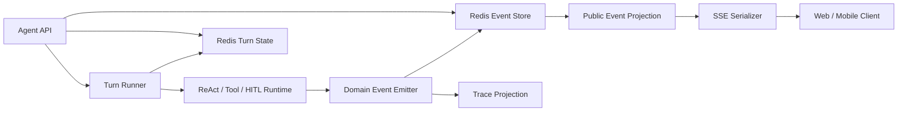

# v2 Agent SSE 执行事件契约与终态收口方案

> 本方案结合 `docs/reference/agent_sse_design_methodology.md` 与
> `docs/reference/max_steps_control_design.md`，并以当前 v2 的 Worker、ReAct、
> Redis Event Stream 和 SSE API 为落地边界，供 review。目标是把 SSE 从“若干
> 运行日志”收敛为可重放、可恢复、可解释的 Agent Execution Event Stream。

关联文档：

- `docs/reference/agent_sse_design_methodology.md`
- `docs/reference/max_steps_control_design.md`
- `docs/spec/2026-08-16-agent-run-loop-streaming-parallel-design.md`

## 1. 请优先 review 的决策

本方案希望先确认以下五个架构决策，其他字段和实现步骤都依赖它们：

1. `max_steps`、`timeout`、`max_tokens`、`cancelled` 是否统一视为受控终止；
   真正的 Provider、Tool、Worker 异常才进入 `failed`。
2. 是否接受新增持久化状态 `terminated`。本方案建议接受；迁移期间保留旧
   `failed + error_code` 读取兼容，但不再把预算耗尽写成 `failed`。
3. `done` 是否继续作为唯一的传输关闭事件。本方案建议继续保留：
   `turn.completed/terminated/failed` 表达语义终态，`done` 表达 SSE 流关闭，
   且每个 Turn 只允许一个 `done`。
4. 普通用户是否禁止接收原始模型思考文本。本方案建议默认不暴露隐藏推理，
   只允许发送可公开的状态、工具意图、进度和最终答复；管理员调试视图可以
   通过权限显式开启受控的诊断字段。
5. finalization 是否作为独立的、最多一次的无 Tool 收尾阶段，而不是继续占用
   ReAct 决策步数。本方案建议独立建模，但它仍受总 Turn timeout 和 token budget
   约束。

## 2. 目标与非目标

### 2.1 目标

- Runtime 产生结构化 Domain Event，SSE 只负责传输公共事件投影。
- 客户端能判断当前 Turn、Step、LLM、Tool、HITL 和 Finalizer 所处阶段。
- 所有正常完成、受控终止和真正失败路径都具有用户可读答复和唯一 `done`。
- 断线后通过 `after_seq` 或 `Last-Event-ID` 只重放事件，不重新执行 Turn。
- Trace、Redis Turn 状态、Redis Event Stream 和 SSE 共享可关联的 `turn_id`、
  `event_id`、`trace_id`、`seq` 和 `stop_reason`。
- 新协议能兼容当前 `/api/v2/chat`、`/api/v2/turns/{turn_id}/events`、
  `/api/v2/approve` 和已有前端事件类型，分阶段迁移。

### 2.2 非目标

- 本方案不引入 WebSocket、Kafka 或新的外部消息队列。
- 本方案不把所有内部 Debug/Trace 事件暴露给前端。
- 本方案不改变 Business REST、Business MCP 和 Agent SSE 的边界。
- 本方案不允许前端通过发送普通聊天文本来代替 HITL `approve` 请求。
- 本方案不在本次设计中解决模型质量、Skill 路由质量或业务 Tool 语义。

## 3. 当前基础与主要缺口

### 3.1 已有基础

当前实现已经具备以下可复用能力：

- `Turn` 已有 `phase`、`step_count`、`stop_reason`、`finalization_pending`、
  `committed_result` 和结构化错误字段。
- `turn_store.publish_event()` 已生成每 Turn 的 `seq`、`event_id`、`trace_id`、
  `status_before/status_after`、`phase`、`step` 和 `terminal` 字段，并写入 Redis
  Stream。
- `stream_events()` 已支持 `after_seq` 重放、等待终态、旧状态补发 `done` 和
  `stream_timeout`。
- `done` 已通过 `hsetnx` 保证每个 Turn 只认领一个终态事件。
- LLM、Tool、HITL、Heartbeat、最终答复和错误事件已经有部分 SSE helper。

### 3.2 需要收敛的缺口

1. 当前 Domain Event 和 SSE payload 没有明确分层，Runtime 仍直接使用 `sse.*`
   helper，导致传输协议反向渗入执行逻辑。
2. 当前事件名混合了 `started`、`action`、`assistant_delta`、`final_answer`、
   `tool_finished` 等兼容名，没有形成 Turn/Step/LLM/Tool/Control 五类目录。
3. 当前 `max_steps` 最终仍通过 `error` 和 `status=failed` 收口，和受控终止语义
   不一致。
4. 当前 `turn_store` 只把 `done` 视为 Stream 终态；语义终态事件和传输关闭事件
   的关系没有写成契约。
5. `/api/v2/turns/{turn_id}/events` 没有把 `event_id` 写入 SSE `id:` 字段，无法
   直接利用标准 `Last-Event-ID`。
6. 当前 `assistant_delta` 在 LLM 生成期间发送，必须明确它是公开进度、管理员诊断
   还是禁止透传的模型内部内容。
7. 当前 ReAct 循环允许 `finalization_pending` 额外执行一次迭代，需要明确它不属于
   Agent 决策步数，但不能绕过总耗时和 Token 预算。

## 4. 总体架构



职责边界：

| 层 | 负责什么 | 不负责什么 |
|---|---|---|
| Runtime | 产生执行事实和终止请求 | 不拼 SSE 字符串 |
| Domain Event | 描述一次稳定的执行事实 | 不依赖 HTTP/SSE |
| Event Store | 分配 `seq`、持久化、重放 | 不决定模型下一步动作 |
| Public Projection | 过滤敏感字段、兼容旧事件名 | 不改变执行结果 |
| SSE Serializer | 设置 `event:`、`id:`、`data:` 和响应头 | 不写 Turn 业务状态 |
| Finalizer | 统一生成最终答复和终态事件 | 不重新执行业务写 Tool |
| Trace | 记录完整诊断信息 | 不作为前端状态源 |

Runtime 可以暂时通过 `ProgressPublisher` 适配当前 `sse.*` helper，但新业务代码
只能依赖 Publisher/Domain Event 接口。这样后续才能复用同一事件到 SSE、Trace、审计
和其他传输协议。

## 5. Turn 状态与终止模型

### 5.1 两个维度

Turn 必须同时保存：

```text
status       = 当前持久化生命周期状态
stop_reason  = 进入终态或停止继续执行的确定性原因
phase        = Runtime 当前阶段
```

三者不能互相替代：

- `status=terminated` 说明受控终止，但必须通过 `stop_reason` 说明是步数、超时、
  Token、取消还是其他预算原因。
- `status=failed` 说明发生了真正执行故障，必须有结构化 `error_code`。
- `phase=terminal` 只说明 Runtime 已经收口，不能单独表示任务成功。

### 5.2 推荐状态集合

```python
TurnStatus = Literal[
    "accepted",
    "queued",
    "running",
    "awaiting_approval",
    "completed",
    "terminated",
    "failed",
    "rejected",
    "cancelled",
    "timeout",  # 兼容现有 API；新事件同时携带 stop_reason=turn_timeout
]
```

其中：

| 状态 | 语义 | 典型 `stop_reason` |
|---|---|---|
| `completed` | 已生成可信最终答复，必要的业务写入已确认 | `model_completed` |
| `terminated` | Runtime 正常工作，但策略/预算要求停止 | `step_budget_exhausted`、`token_budget_exhausted`、`doom_loop_detected` |
| `failed` | LLM、Tool、MCP、Worker 或 Pipeline 发生故障 | `llm_failed`、`tool_failed`、`pipeline_crash` |
| `rejected` | 用户拒绝待审批动作 | `approval_rejected` |
| `cancelled` | 用户或系统取消 | `user_cancelled` |
| `timeout` | 兼容现有状态，表示清理器或运行时超时 | `turn_timeout`、`approval_expired` |

### 5.3 终止原因

沿用当前 `StopReason`，并统一以下语义：

```text
MODEL_COMPLETED
STEP_BUDGET_EXHAUSTED
TOKEN_BUDGET_EXHAUSTED
DOOM_LOOP_DETECTED
LLM_FAILED
TOOL_FAILED
APPROVAL_REJECTED
APPROVAL_EXPIRED
USER_CANCELLED
TURN_TIMEOUT
CONTEXT_UNAVAILABLE
SOURCE_DIVERGENCE
PIPELINE_CRASH
```

未来新增原因必须同时更新：

1. `Turn.stop_reason`；
2. Redis Turn 状态与事件状态映射；
3. Public SSE 事件数据；
4. Trace 终止字段；
5. 前端终态展示和回归测试。

### 5.4 终止优先级

一次 Step 结束后按以下顺序选择最终原因：

1. 用户取消、进程取消或 Turn 超时；
2. 已提交业务写入，进入确定性成功收尾；
3. HITL 拒绝或过期；
4. 不可重试业务错误；
5. Doom Loop；
6. Token/Context 预算耗尽；
7. Agent 决策步数耗尽；
8. 模型无 Tool Call 且产生最终文本，正常完成。

如果最后一个允许的 Agent Step 已经生成最终文本，必须优先使用
`MODEL_COMPLETED`，不能被 `STEP_BUDGET_EXHAUSTED` 覆盖。

## 6. Step、Tool Batch 和 finalization 计数

### 6.1 Step 定义

一个 Agent Step 是一次完整的：

```text
step.started
  -> LLM decision
  -> zero or one Tool Batch
  -> Observation（如有）
  -> step.completed
```

同一个 LLM 响应中的多个并行 Tool Call 属于同一个 Step；每个 Tool 仍然有独立
`tool_call_id`、开始、完成和错误事件。

### 6.2 max_steps 规则

```text
step_count = 已开始的 Agent 决策 Step 数
允许开始下一 Step 的条件：step_count < max_steps
```

Runtime 必须在开始下一 Step 之前检查预算，而不是执行后再检查。`max_steps=3`
的执行序列必须是：

```text
step_count=0 -> Step 1
step_count=1 -> Step 2
step_count=2 -> Step 3
step_count=3 -> 不再开始 Agent Step，进入 Finalizer
```

### 6.3 Finalization 规则

Finalizer 是 Turn 收口阶段，不是新的 Agent 决策 Step：

- 最多执行一次无 Tool 的低预算 LLM 收尾；
- `tools=[]`，不能重新暴露业务写 Tool；
- 仍受 Turn timeout、Token budget 和取消信号约束；
- finalization 失败时使用最近可靠 Observation 或结构化确定性答复；
- 已有 `committed_result` 时禁止输出“可能未完成”的失败答复。

因此事件中的 `step_count` 和 `finalization_count` 必须分开：

```json
{
  "step_count": 5,
  "finalization_count": 1,
  "stop_reason": "step_budget_exhausted"
}
```

## 7. Domain Event 与 Public SSE 事件

### 7.1 统一 Envelope

内部事件和 Redis/SSE 公共事件都使用同一组可关联字段；SSE Serializer 再负责格式化
为 wire protocol：

```json
{
  "seq": 42,
  "event_id": "evt_01J...",
  "type": "tool.completed",
  "occurred_at": "2026-08-21T13:00:00Z",
  "trace_id": "trace_123",
  "request_id": "req_123",
  "turn_id": "turn_123",
  "conversation_id": "conversation_123",
  "step_id": "step_3",
  "step_index": 3,
  "message_id": "msg_3",
  "phase": "observing",
  "status_before": "running",
  "status_after": "running",
  "terminal": false,
  "data": {}
}
```

字段要求：

- `seq`：每个 Turn 内单调递增，作为重放游标；
- `event_id`：全局唯一，必须写入 SSE `id:`；
- `type`：稳定的 Domain/Public Event 类型；
- `terminal`：只标识事件是否结束事件流，当前兼容方案中只有 `done=true`；
- `data`：事件专属 payload，不把业务字段平铺到顶层；
- `trace_id/request_id`：用于跨 Agent、Business、MCP 和 Trace 关联；
- `step_id/message_id`：没有归属时为 `null`，不得伪造空字符串含义。

### 7.2 事件分类

#### Turn Events

```text
turn.started
turn.completed
turn.terminated
turn.failed
turn.cancelled
```

#### Step Events

```text
step.started
step.completed
step.failed
step.cancelled
```

`step.completed` 必须包含 `outcome`，例如 `completed`、`terminated` 或 `failed`，
避免 Step 已开始但异常结束后客户端一直等待。

#### LLM/Answer Events

```text
reasoning.started
reasoning.delta
reasoning.completed
answer.started
answer.delta
answer.completed
```

`reasoning.*` 只承载经过策略允许公开的状态或摘要，不承载隐藏 Chain of Thought。
当前 `assistant_delta`、`thought` 作为兼容事件保留，但新客户端应使用
`reasoning.delta`；普通用户默认只接收 `answer.*`。

#### Tool Events

```text
tool.call.delta
tool.started
tool.finished
tool.failed
observation.created
```

`action` 表示模型意图，`tool.started` 表示 Runtime 已实际开始执行，二者不能混用。
并行 Tool Batch 中每个 Tool 必须拥有独立 `tool_call_id`。

#### Control Events

```text
heartbeat
progress
context.usage
approval.required
approval.result
retrying
stream.timeout
```

Heartbeat 是传输保活，不作为业务执行事实；不写入 Trace 明细，可按需要写入 Redis
事件流或由 SSE 层直接发送。

### 7.3 当前事件兼容映射

第一阶段不强制更改已有前端事件名，使用 `event_type` 标记规范类型，并逐步迁移：

| 当前 Wire Event | 规范 Event | 迁移说明 |
|---|---|---|
| `started` / `meta` | `turn.started` | 保留兼容字段，补充 `turn_id` 和 envelope |
| `action` | `tool.intent` | 只表示准备调用，不表示已执行 |
| `tool_call_delta` | `tool.call.delta` | 同时保留旧名 |
| `tool_started` | `tool.started` | 直接对齐 |
| `tool_finished` | `tool.finished` | `error` 时补 `outcome=failed` |
| `observation` | `observation.created` | 保留工具结果和结构化错误 |
| `assistant_delta` | `reasoning.delta` | 仅在允许公开时投影 |
| `final_answer_start` | `answer.started` | 保留旧名 |
| `final_answer_delta` | `answer.delta` | 保留旧名 |
| `final_answer` | `answer.completed` | 保留旧名 |
| `error` | `tool.failed` / `llm.failed` / `turn.failed` | 不能用一个 error 覆盖所有层级 |
| `done` | `stream.closed` | Wire 兼容事件，仍为唯一传输收口 |

不建议同时发送新旧两份完整事件，否则客户端会重复渲染。兼容方式应是：

- Redis 内部保存规范 `type`；
- SSE Projection 根据客户端版本输出规范名或旧别名；
- 同一事件只有一个 `seq`、一个 `event_id`。

## 8. 终态事件契约

### 8.1 语义终态

成功：

```json
{
  "type": "turn.completed",
  "status_after": "completed",
  "data": {
    "stop_reason": "model_completed",
    "step_count": 2
  }
}
```

受控终止：

```json
{
  "type": "turn.terminated",
  "status_after": "terminated",
  "data": {
    "stop_reason": "step_budget_exhausted",
    "step_count": 5,
    "finalization_count": 1,
    "result_complete": false
  }
}
```

真正失败：

```json
{
  "type": "turn.failed",
  "status_after": "failed",
  "data": {
    "stop_reason": "tool_failed",
    "error": {
      "code": "BUSINESS_TOOL_FAILED",
      "message": "业务查询失败",
      "phase": "tool_executing",
      "retryable": false,
      "attempt": 1
    }
  }
}
```

### 8.2 done 作为传输收口

为兼容当前 `turn_store` 和前端，`done` 继续是唯一的 Stream terminal event：

```json
{
  "type": "done",
  "terminal": true,
  "data": {
    "status": "terminated",
    "stop_reason": "step_budget_exhausted",
    "turn_id": "turn_123"
  }
}
```

统一事件顺序：

```text
...执行事件
  -> finalizing
  -> answer.started
  -> answer.delta*
  -> answer.completed
  -> turn.completed / turn.terminated / turn.failed
  -> done
```

异常收口没有可靠答复时，也必须生成明确的 `answer.completed`，内容要说明“尚未
完成”或“已取消”，不能只发送 `error` 后断流。

### 8.3 唯一 Finalizer

所有以下路径都只能提交 `FinalizationRequest`，不得各自拼接终态事件：

- 正常无 Tool 文本；
- max_steps、max_tokens、doom loop；
- Tool/LLM 不可重试错误；
- Worker 异常；
- timeout、cancelled；
- HITL rejected/expired；
- 已提交写入后的确定性成功收尾。

`TurnFinalizer` 是唯一拥有以下权限的组件：

1. 设置最终 `status`、`stop_reason` 和 `phase=terminal`；
2. 生成用户可读最终答复；
3. 发布语义终态事件；
4. 发布唯一 `done`；
5. 持久化最终 Turn 快照。

## 9. 事件顺序和幂等不变量

以下规则必须由单元、集成和真实 SSE 验收共同保证：

1. `turn.started` 在所有业务事件之前；
2. 每个开始的 Step 最终都有一个 `step.completed/failed/cancelled`；
3. `tool.started` 只在 Tool 真正开始后发送；Tool 未开始不能伪造 `tool.finished`；
4. `tool.started` 和 `tool.finished/failed` 通过同一个 `tool_call_id` 配对；
5. `approval.required` 后只能等待 approve/reject/expire/cancel，不得偷偷执行；
6. `answer.delta` 只能出现在 `answer.started` 之后；
7. `turn.*` 语义终态只允许一个；
8. `done` 只允许一个，且必须是该 Turn 最后一个可重放业务事件；
9. `done` 后不再发布任何事件；
10. 重连只返回 `seq > after_seq` 的事件，绝不重新调用 LLM、Tool 或 MCP；
11. 同一逻辑事件重试发布时保持 `event_id` 和 `seq`，不能生成重复业务事件；
12. 事件 payload 必须包含 `code` 的错误都必须提供上下文，包括 `phase`、
    `tool_name`、`retryable` 和 `attempt`（适用时）。

## 10. Redis Event Store 与断线恢复

### 10.1 写入流程

```text
Domain Event
  -> 分配 event_id
  -> INCR turn event seq
  -> 组装完整 envelope
  -> XADD events:{turn_id}
  -> 更新 turn.last_event_seq
  -> 有界交接 Trace
  -> SSE consumer 读取
```

`seq` 必须在 Turn 内单调递增；`event_id` 必须稳定；Redis Stream 的保留时间必须
覆盖客户端最大重连窗口。

### 10.2 API 兼容

保留现有 API：

```text
POST /api/v2/chat?after_seq=0
GET  /api/v2/turns/{turn_id}/events?after_seq=0
GET  /api/v2/turns/{turn_id}
POST /api/v2/approve
POST /api/v2/turns/{turn_id}/cancel
```

新增兼容行为：

- `after_seq` 继续可用；
- 若没有显式 `after_seq`，读取 `Last-Event-ID`，将其解析为 `event_id` 后从
  Redis 索引转换为 `seq`；若无法转换，安全回放最近窗口并由客户端去重；
- SSE `id:` 必须设置为 `event_id`，payload 同时保留 `event_id` 和 `seq`；
- `done`、`turn.*` 终态都从同一个 Event Stream 读取，不能由不同 API 各自合成；
- 流等待超时必须返回 `stream.timeout`，不能静默断开；若 Turn 仍未终态，由
  清理器或 Worker 生成最终 `timeout`。

### 10.3 Worker 崩溃和重连

重连只做：

```text
读取 Turn 状态
读取 seq > after_seq 的 Redis 事件
直到读取 done 或明确的 stream.timeout
```

重连不做：

```text
重新 dispatch Turn
重新调用 LLM
重新执行 Tool
重新写入业务数据
```

Worker 崩溃后由现有 lease/reclaim/sweeper 机制决定是恢复执行还是标记失败；SSE
消费者不能自行推断“没有事件就是失败”。

## 11. Heartbeat、超时与取消

### 11.1 Heartbeat

Heartbeat 分成两层：

- SSE 注释帧 `: heartbeat`：只保活，不进入业务事件序列；
- 结构化 `heartbeat` 事件：用于前端显示阶段和已耗时，进入 Redis Stream，必须
  限频，不能伪造业务进度。

建议 Tool/LLM 长时间无事件时每 5-15 秒发送一次，payload：

```json
{
  "phase": "tool_executing",
  "step": 2,
  "elapsed_ms": 12000,
  "message": "正在等待业务查询结果"
}
```

### 11.2 取消

取消请求必须经过 Turn 状态 CAS：

```text
活动态 -> cancelled -> Finalizer -> answer.completed -> done
终态   -> 409 turn_already_terminal
```

取消正在执行的 Tool 时，Runtime 尽力取消；无法取消的外部请求必须等待结果或由
Turn timeout 收口，不能在业务结果未知时伪造成功。

## 12. Trace、审计与公共 SSE 的分层

同一个 Domain Event 可以产生三种投影：

```text
Domain Event
  ├── Public SSE Projection：前端需要的状态和结果
  ├── Trace Projection：LLM/Tool/重试/Token/Provider 诊断
  └── Audit Projection：业务写入、审批和权限审计
```

要求：

- SSE 丢失不能证明 Runtime 没执行，最终事实以 Turn/Event Store/业务提交记录为准；
- Trace 不能反向修改 SSE 状态；
- `trace_id`、`turn_id`、`event_id` 必须能从 SSE 跳转到 Trace；
- Token usage 必须挂在对应 LLM message/step 事件或 Trace 节点，不放进所有事件；
- 审计记录不能用前端收到的文本推断业务写入，必须来自 Tool 提交结果。

## 13. 分阶段实施计划

### Phase 0：契约和回归基线

- 增加状态、终止原因、事件顺序和唯一 `done` 的契约测试；
- 固化当前 `/api/v2/chat` 和 `/turns/{id}/events` 的 `after_seq` 行为；
- 明确普通用户与管理员的 reasoning 可见性；
- 不改变前端默认事件名。

### Phase 1：Publisher 和 Envelope 收敛

- 新增 Domain Event/Publisher 边界，Runtime 不直接拼 SSE 字符串；
- 统一所有事件的 `event_id`、`seq`、`turn_id`、`phase`、`step`、`status` 字段；
- `/api/v2/turns/{id}/events` 和 `/api/v2/chat` 都写入 SSE `id:`；
- 保留旧事件名，通过 `event_type` 暴露规范事件名，不重复发送两份事件。

### Phase 2：终态和 Finalizer 统一

- 引入 `turn.terminated`、`turn.failed`、`turn.completed` 语义事件；
- 将 max_steps、doom、Tool error、Worker error、timeout、cancel 迁移到统一
  `TurnFinalizer`；
- 先在 Redis 和内部状态支持 `terminated`，API/前端保留旧字段读取兼容；
- `done` 继续作为唯一传输终态，补充 `stop_reason`。

### Phase 3：Step/Tool 事件完整化

- 增加 `step.started/completed`，明确并行 Tool Batch 属于一个 Step；
- 将 `tool_started/tool_finished` 的开始、完成、失败和取消配对；
- 将 `assistant_delta/thought` 划分为可公开 reasoning 和管理员诊断两种投影；
- finalization 独立计数，最多一次无 Tool 收尾。

### Phase 4：Replay/Resume 生产化

- 支持 `Last-Event-ID` 与现有 `after_seq`；
- 验证 Stream 保留窗口、断线重连、Worker 崩溃和旧 Turn 状态补发；
- 前端以 `event_id` 去重，以 `seq` 排序，不以数组下标作为唯一键；
- 完成真实 Agent `/api/v2/chat` 和 `/turns/{id}/events` SSE smoke。

## 14. 验收矩阵

| 场景 | 必须出现 | 最终状态 | 不允许出现 |
|---|---|---|---|
| 无 Tool 正常回答 | `turn.started`、`answer.*`、`turn.completed`、`done` | `completed` | 多个 `done` |
| Tool 成功后回答 | `step.*`、`tool.*`、`observation.*`、`answer.*`、`done` | `completed` | Tool 完成后丢 Observation |
| HITL 审批 | `approval.required`、`approval.result`、Tool 事件 | `completed` 或 `rejected` | 未审批执行写 Tool |
| max_steps | `step.completed`、`turn.terminated`、`answer.*`、`done` | `terminated` | `error=max_steps` 冒充系统异常 |
| Doom Loop | `progress/observation`、`turn.terminated`、`answer.*`、`done` | `terminated` | 继续请求下一次 LLM |
| 不可重试 Tool 错误 | `tool.failed`、`turn.failed`、`answer.*`、`done` | `failed` | 继续耗尽 max_steps |
| LLM/Provider 失败 | `llm.failed` 或 `turn.failed`、`answer.*`、`done` | `failed` | 只发错误无答复 |
| 已提交写入后收尾失败 | `operation_committed`、确定性成功答复、`done` | `completed` | 被 max_steps 覆盖成失败 |
| 用户取消 | `turn.cancelled`、`answer.*`、`done` | `cancelled` | 取消后继续新 Tool |
| 流断线重连 | `seq > after_seq` 的原事件 | 原终态 | 重新执行 Turn |
| Worker 崩溃 | reclaim/timeout/failed 的明确事件 | 明确终态 | 长时间静默或重复 done |
| Stream 等待超时 | `stream.timeout` 或明确 `turn.timeout` | 非静默 | HTTP 200 后直接断开 |

## 15. 需要新增或调整的代码边界

建议的最小文件边界如下，实际实现时仍需以当前目录地图和依赖约束为准：

| 文件/模块 | 调整方向 | 调用方 |
|---|---|---|
| `agent/domains/harness/runtime/events.py` | Domain Event 类型、Envelope 和终态枚举 | Runtime、Finalizer、Trace |
| `agent/domains/harness/runtime/publisher.py` | Event Publisher 抽象和公共投影入口 | Runner、ReAct、Tool、HITL |
| `agent/domains/harness/runtime/finalizer.py` | 唯一终态收口、答复和 done | Worker、Run Loop 各终止路径 |
| `agent/platforms/persistence/redis/turn_store.py` | seq、终态 CAS、重放和状态映射 | API、Worker、Publisher |
| `agent/platforms/persistence/redis/sse.py` | 纯 SSE Serializer/兼容事件构造 | API 层 |
| `agent/api/chat.py`、`turns.py` | `Last-Event-ID`、SSE id、投影字段 | Web/Mobile 客户端 |
| `tests/test_agent_stream_events.py` | Envelope、顺序、重放和终态契约 | CI |
| `tests/test_agent_run_loop_integration.py` | 真实 API/Worker/Redis 替身链路 | CI 和 smoke |

新增抽象的理由是隔离 Runtime 事实、Redis 持久化和 HTTP SSE 传输；这三者如果继续
混在 `sse.py` 或 `engine.py`，后续无法安全支持 Trace、重放和协议兼容。

## 16. Review 通过标准

方案通过 review 的最低条件：

1. 明确是否新增 `terminated` 状态；
2. 明确 `turn.*` 语义终态与 `done` 传输终态的关系；
3. 明确 reasoning 的客户端可见范围；
4. 接受 Step、Tool Batch 和 finalization 的计数定义；
5. 接受旧 Wire Event 的兼容迁移策略；
6. 接受所有终止路径进入唯一 Finalizer；
7. 接受 Redis `seq`/`event_id`/`after_seq`/`Last-Event-ID` 的恢复契约；
8. 验收矩阵中的正常、预算、异常、审批、取消、重连和 Worker 崩溃路径都有证据。

## 17. 最终结论

系统最终应形成以下关系：

```text
Turn Runtime
  -> Domain Events
  -> Redis Event Store（seq/event_id/replay）
  -> Public Event Projection
  -> SSE Serializer
  -> Client

Control / Finalizer
  -> status + stop_reason
  -> turn.completed / turn.terminated / turn.failed
  -> answer.completed
  -> done（唯一传输关闭事件）
```

核心原则是：

```text
SSE 不是日志流，而是公共执行事件流；
Turn 终态不是一个 error 字符串，而是可持久化、可重放、可解释的状态事实；
done 不是业务成功标志，而是事件流已经可靠收口的传输信号。
```
