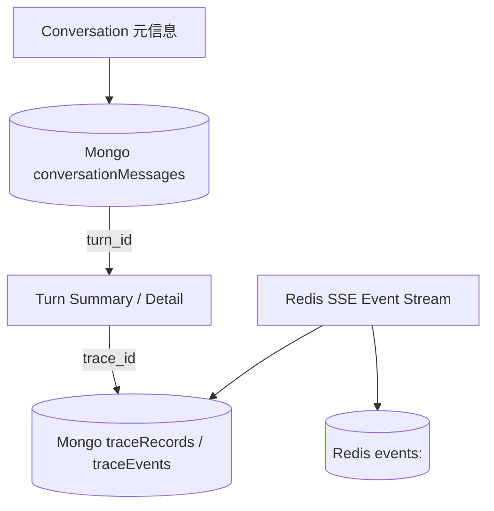

# Agent 历史会话查询工程计划

## 1. 文档目的

本文将 [历史会话查询详情方法论](../reference/历史会话查询详情方法论.md) 转化为可实施的 v2 工程计划，解决以下问题：

- 历史消息接口是否需要承载完整 SSE 执行事件；
- `message_id`、`turn_id`、`trace_id`、`message_kind`、`meta` 的职责如何划分；
- 会话恢复、历史分页、增量更新和 Agent 执行详情如何协同；
- 当前后端已返回但前端丢失的消息字段如何补齐；
- 如何在不暴露隐藏思维链、不复制大 payload 的前提下保留调试证据。

本文是方案和实施计划，不代表代码已经完成。

## 2. 评审结论

### 2.1 核心决策

1. 历史消息接口只负责恢复用户可见的对话状态，不直接返回完整 SSE 事件流。
2. Agent 执行详情通过 Turn/Trace 接口提供；现有 `GET /api/v2/traces/{trace_id}/timeline` 作为开发调试时间线的核心接口继续复用。
3. 消息、Turn、Trace 使用 `message_id -> turn_id -> trace_id` 形成稳定回链，不把 Redis 事件复制进 `conversationMessages`。
4. 普通用户只能看到公开事件投影和最终答复；管理员调试视图可以读取受控诊断字段，但不开放原始隐藏思维链。
5. 新接口采用面向“加载更早历史”的 cursor 分页。现有 `before` 参数保留兼容，但规范响应必须返回明确的 `pagination.next_cursor`；cursor 不承担实时刷新语义。
6. 先补齐契约和兼容接口，再迁移前端；不在第一阶段破坏当前 `GET /api/v2/conversations/{conversation_id}` 的响应形状。

### 2.2 当前问题判断

截图中的历史消息字段作为普通聊天恢复字段并不算少，已经包含消息身份、时间和 Turn/Trace 关联；不足之处主要在于：

- 没有明确的分页续读游标；
- `count` 容易被误解为整段会话总数，当前实现实际返回当前页数量；
- 没有 Turn 状态、终止原因、错误摘要和执行步骤；
- `meta` 当前通常为空，不能提供工具、审批和业务提交摘要；
- 前端 `ConversationMessage` 只声明并保存 `role`、`content`、`created_at`，会丢弃后端已返回的关联字段。

这些问题不应通过把所有 SSE 字段塞进 `items` 解决，而应通过接口分层和字段保留解决。

## 3. 当前实现基线

### 3.1 已有能力

- `GET /api/v2/conversations/{conversation_id}` 已返回消息列表、`conversation_revision`、`summary_revision`、`reset_generation` 和来源状态。
- 消息已经持久化 `message_id`、`turn_id`、`trace_id`、`message_kind` 和 `meta`。
- SSE 事件已经具备 `seq`、`event_id`、`trace_id`、`turn_id`、`conversation_id`、状态迁移、步骤和终态字段。
- `GET /api/v2/turns/{turn_id}/events` 支持短期 SSE 重放和 `Last-Event-ID`。
- `GET /api/v2/traces/{trace_id}/events` 与 `GET /api/v2/traces/{trace_id}/timeline` 提供长期 Trace/SSE 召回。
- `conversation_revision`、`summary_revision` 和 `reset_generation` 已经可以作为会话状态同步依据。

### 3.2 需要修正的基线问题

| 位置 | 现状 | 计划处理 |
|---|---|---|
| `agent/api/conversations.py` | 消息和会话状态在一个响应中返回 | 保留兼容入口，新增规范化的 messages/turns 资源 |
| `chat_store.get_conversation()` | 支持 `before`，但没有返回下一页游标；`count` 是当前页数量 | 增加 opaque cursor、`page_count` 和可选 `total_count` 语义 |
| `chat_store.append_message()` | 支持 `meta`，但当前 prompt/final answer 落库通常不传摘要 | 按安全白名单补充可见摘要，不保存原始思维链 |
| `message_kind` | 当前主要使用 `prompt`、`final_answer`、`error_answer` | 保留旧值读取兼容，新增稳定规范值和映射 |
| `agri_admin_web/src/api/agent.ts` | `ConversationMessage` 类型字段不完整 | 补齐历史消息契约和分页响应类型 |
| `agri_admin_web/src/pages/Playground/index.tsx` | 历史加载只映射 `role/content` | 保留消息 ID、Turn/Trace 链接和安全 meta |
| Turn/Trace 查询 | 已有 Trace timeline，但缺少会话范围的 Turn 汇总入口 | 增加会话 Turn 列表/详情聚合，避免前端逐条猜测执行状态 |

## 4. 目标架构



### 4.1 数据边界

| 数据 | 权威来源 | 主要用途 | 是否进入消息 `items` |
|---|---|---|---|
| 用户输入、最终回答、错误回答 | Mongo `conversationMessages` | 历史恢复、上下文事实 | 是 |
| 消息身份和回链 | Mongo 消息字段 | 从消息跳到 Turn/Trace | 是 |
| Turn 当前状态、审批态、终止原因 | Redis Turn 状态 | 运行中状态和操作入口 | 通过 Turn 摘要引用，不复制全部字段 |
| SSE 顺序、事件类型、状态迁移 | Redis Event Stream / Mongo `traceEvents` | 实时展示、重放、审计 | 否 |
| LLM、Tool、HITL、业务提交节点 | Mongo `traceRecords` | 调试和执行分析 | 否 |
| 隐藏思维链原文 | Runtime 临时数据 | 内部执行 | 禁止进入普通历史接口和普通用户 SSE |

## 5. 目标接口契约

### 5.1 会话元信息

```http
GET /api/v2/conversations/{conversation_id}
```

目标职责是会话元信息和同步状态。迁移期间保留当前响应中的 `items`，待前端切换到 `/messages` 后再逐步收窄兼容响应。

规范字段：

```json
{
  "conversation_id": "conv_xxx",
  "title": "农业咨询",
  "created_at": "2026-08-23T10:00:00Z",
  "updated_at": "2026-08-23T10:05:00Z",
  "message_count": 20,
  "status": "active",
  "conversation_revision": 4,
  "summary_revision": 1,
  "reset_generation": 0,
  "source_status": "mongo"
}
```

说明：`message_count` 表示整段会话数量；当前兼容响应中的 `count` 如果只表示当前页，不能继续作为同义字段使用。

### 5.2 历史消息

```http
GET /api/v2/conversations/{conversation_id}/messages?limit=100&cursor={cursor}
```

兼容期允许继续接收 `before`，但规范接口使用 opaque `cursor`。接口必须明确区分两种动作：

| 动作 | 请求 | 语义 |
|---|---|---|
| 首次加载/刷新最新消息 | `limit=100`，不带 `cursor` | 返回最新的一页消息，按时间正序返回，便于直接渲染 |
| 加载更早历史 | `limit=100&cursor={next_cursor}` | 从上一页最早消息之前继续加载，不受后来新增消息影响 |

`cursor` 只用于向历史更早方向翻页，不能拿旧 cursor 请求“最新消息”。用户看到新消息或 `conversation_revision` 变化时，应重新请求不带 cursor 的首屏，或者使用单独的增量同步能力。

服务端返回的 `next_cursor` 为 opaque 值，客户端不得解析其内部结构。cursor 至少需要绑定 `conversation_id`、租户身份、分页方向、排序版本和锚点位置，防止跨会话复用。

```json
{
  "conversation_id": "conv_xxx",
  "items": [
    {
      "message_id": "msg_001",
      "turn_id": "turn_001",
      "trace_id": "trace_001",
      "role": "user",
      "content": "帮我查询番茄病害",
      "message_kind": "user_input",
      "created_at": "2026-08-23T10:00:00.000Z",
      "meta": {}
    },
    {
      "message_id": "msg_002",
      "turn_id": "turn_001",
      "trace_id": "trace_001",
      "role": "assistant",
      "content": "番茄常见病害包括……",
      "message_kind": "assistant_answer",
      "created_at": "2026-08-23T10:00:05.000Z",
      "meta": {
        "outcome": "completed"
      }
    }
  ],
  "pagination": {
    "next_cursor": "opaque_cursor",
    "has_more": true,
    "page_count": 2,
    "limit": 100,
    "direction": "older",
    "snapshot_revision": 4,
    "consistency": "snapshot"
  },
  "conversation_revision": 4,
  "latest_message_id": "msg_020",
  "source_status": "mongo"
}
```

### 5.2.1 分页一致性和新增消息

首屏请求建立一个逻辑快照，响应中的 `snapshot_revision` 随后编码进 `next_cursor`。后续加载更早消息时：

1. 查询条件使用 `(created_at, message_id) < anchor`，其中 `message_id` 是同一时间下的稳定 tie-breaker；
2. 数据库查询先按 `created_at DESC, message_id DESC` 取一页，再反转为正序返回；
3. 新增消息只会出现在最新页，不会插入已经读取的旧页，因此不会造成重复或跳过；
4. 如果历史消息被编辑、删除或快照 revision 已失效，服务端返回 `consistency="changed"` 和明确的 `code`，前端重新加载首屏，不静默拼接；
5. `has_more=false` 表示当前快照下没有更早消息，不表示未来不会产生新消息。

`created_at` 不能单独作为 cursor 锚点；同一时间戳下必须使用 `message_id` 作为第二排序键。cursor 解码、签名和租户校验属于服务端边界，不能由前端拼接 Mongo `_id` 或时间字符串代替。

### 5.2.2 最新消息刷新

实时刷新与历史翻页使用不同机制：

- SSE 收到 `done` 后，前端使用 `conversation_revision` 判断是否需要刷新；`final_answer` 只更新当前屏幕内容，不作为历史落库完成信号；
- 只刷新最新页，不重置用户当前已经展开的历史页和滚动位置；
- 页面获得焦点或用户主动点击刷新时，重新请求不带 cursor 的首屏；
- 如果后续需要降低首屏重复读取成本，再增加 `since_revision`/增量接口，但不能复用 `next_cursor` 作为增量游标；
- 刷新失败时保留现有消息，并显示数据来源或同步失败状态，不清空历史。

消息字段规则：

| 字段 | 规则 |
|---|---|
| `message_id` | 稳定消息 ID，前端历史消息 key 不得用数组下标替代 |
| `turn_id` | 关联一轮 Agent 执行，允许用户消息和助手消息共享 |
| `trace_id` | 关联长期诊断链路；旧数据缺失时返回 `null`，不得伪造 |
| `role` | `user` 或 `assistant`，保持公开消息边界 |
| `content` | 用户可见文本；不存储隐藏思维链作为普通消息 |
| `message_kind` | 使用规范值；旧值只在读取兼容层映射 |
| `meta` | 只允许脱敏摘要，例如 outcome、tool_summary、approval_summary |
| `created_at` | ISO 时间字符串，作为展示和游标排序字段之一 |

### 5.3 Turn 汇总

```http
GET /api/v2/conversations/{conversation_id}/turns?limit=50&cursor={cursor}
```

用于历史页面快速展示每轮执行结果，避免前端为每条消息单独请求 Turn。

```json
{
  "conversation_id": "conv_xxx",
  "items": [
    {
      "turn_id": "turn_001",
      "trace_id": "trace_001",
      "status": "completed",
      "phase": "terminal",
      "stop_reason": "completed",
      "step_count": 2,
      "message_ids": {
        "prompt": "msg_001",
        "answer": "msg_002"
      },
      "business_result": null,
      "error": null,
      "events_status": "available",
      "started_at": "2026-08-23T10:00:00Z",
      "finished_at": "2026-08-23T10:00:05Z"
    }
  ],
  "pagination": {
    "next_cursor": null,
    "has_more": false
  }
}
```

`events_status` 必须区分 `available`、`missing`、`not_available` 和 `error`。Redis/Trace 不可用不能被转换为空执行记录。

### 5.4 Turn 执行详情

```http
GET /api/v2/conversations/{conversation_id}/turns/{turn_id}
```

该接口可以作为会话范围的聚合入口，内部复用：

- `GET /api/v2/turns/{turn_id}`：当前运行态和审批态；
- `GET /api/v2/traces/{trace_id}/summary`：一轮聚合状态和根错误；
- `GET /api/v2/traces/{trace_id}/timeline?include_payload=false`：合并执行时间线。

详情响应至少包含：

```json
{
  "turn_id": "turn_001",
  "trace_id": "trace_001",
  "conversation_id": "conv_xxx",
  "status": "completed",
  "stop_reason": "completed",
  "steps": [
    {
      "event_id": "evt_001",
      "seq": 1,
      "type": "tool_finished",
      "phase": "react",
      "step_index": 1,
      "occurred_at": "2026-08-23T10:00:03Z",
      "status_before": "running",
      "status_after": "running",
      "payload": {
        "tool_name": "web_search",
        "duration_ms": 123,
        "result_summary": "……"
      }
    }
  ],
  "business_result": null,
  "evidence": {
    "trace_summary": "available",
    "trace_nodes": "available",
    "trace_events": "available",
    "conversation_messages": "available",
    "runtime_turn": "available"
  }
}
```

普通用户请求默认使用公开事件投影；管理员调试请求可以显式请求受控 payload。两种视图都不能把原始隐藏思维链作为普通可见内容返回。

## 6. SSE 与历史查询的字段关系

SSE 继续使用以下通用关联字段：

```text
event_id       单个事件稳定 ID，同时作为 SSE id:
seq            Turn 内单调序号，用于 after_seq/Last-Event-ID 重放
trace_id       长期 Trace 回链
turn_id        一轮执行实例
conversation_id 多轮会话回链
event_type     事件语义类型
occurred_at    事件发生时间
phase/step     执行阶段和步骤
status_before/status_after 状态迁移
terminal       是否为传输终止事件
```

历史消息只保留 `turn_id` 和 `trace_id`，需要执行过程时再查询 Turn/Trace。不得把 `seq` 当作消息顺序，也不得把 SSE 临时事件直接当作永久消息。

事件到消息摘要的推荐映射：

| SSE 事件 | 历史消息处理 |
|---|---|
| `final_answer` | 持久化为 `assistant_answer` |
| `error` / `turn.failed` | 持久化为 `error_answer` 或 Turn error 摘要 |
| `operation_committed` | 写入 Turn/business result，必要时在 assistant `meta` 放摘要 |
| `approval_required` / `approval_result` | 写入 Turn 审批状态，必要时写安全 approval summary |
| `tool_started` / `tool_finished` / `observation` | 保留在 Trace/Event，必要时生成 `tool_summary`，不作为普通聊天消息 |
| `thought` / `assistant_delta` | 不持久化为普通历史消息；按 SSE 权限投影处理 |
| `done` | 只作为 SSE 传输栅栏，不生成独立聊天消息 |

## 7. 前端恢复策略

### 7.1 历史消息模型

前端 `ConversationMessage` 必须至少保留：

```text
message_id
turn_id
trace_id
role
content
created_at
message_kind
meta
```

渲染层可以只使用 `role/content`，但状态层不能丢弃关联字段。历史消息 key 使用 `message_id`；缺失旧数据时才使用带 role 和位置的兼容 key。

### 7.2 历史执行状态

- 初次打开会话：请求不带 cursor 的最新消息页和 Turn 汇总页；
- 用户向历史方向滚动到边界：使用上一响应的 `next_cursor` 追加更早消息；
- 点击某轮“查看详情”：请求 Turn detail 或 Trace timeline；
- SSE 实时完成后：使用 `conversation_revision` 判断是否刷新最新页，不复用历史 cursor；
- 用户主动刷新或页面重新获得焦点：重新请求最新消息页，保留当前滚动和详情展开状态；
- SSE 断线：使用 `event_id`/`seq` 重放，不重新创建 Turn；
- Trace/Redis 不可用：显示证据不可用状态，不伪装成“没有执行过程”。

## 8. 实施阶段

### Phase 0：契约冻结与兼容映射

- 固化消息字段、`message_kind` 规范值、`meta` 安全白名单和证据状态枚举；
- 明确当前 `GET /conversations/{id}` 的兼容字段语义；
- 增加 API/TypeScript 契约测试，覆盖旧数据缺失 `trace_id` 和 `meta` 的情况。

交付物：字段契约、兼容映射表、测试样例。

### Phase 1：规范化 Message History

- 增加 `/conversations/{id}/messages`；
- 实现“首屏最新、cursor 加载更早历史”的稳定分页和 `pagination.next_cursor`；
- 固化 `(created_at, message_id)` 排序、snapshot revision 和 cursor 失效策略；
- 将当前页数量改名为 `page_count`，兼容期保留旧 `count`；
- 统一时间字段和排序规则；
- 前端保留完整消息对象，但不改变现有聊天展示。

交付物：后端消息接口、分页测试、前端类型和历史恢复测试。

### Phase 2：Turn 汇总与执行详情

- 增加会话范围 Turn 列表和 Turn detail 聚合接口；
- 复用现有 Trace summary/timeline，不复制完整事件 payload；
- 返回 `events_status` 和证据状态；
- 补齐审批、业务提交、错误和终态摘要。

交付物：Turn API、Trace 回链测试、权限投影测试。

### Phase 3：Playground 历史执行恢复

- 历史消息使用 `message_id` 稳定渲染；
- 关联消息显示 Turn/Trace 入口；
- 支持按需展开执行时间线；
- 支持 SSE 断线续读和历史刷新；
- 普通用户和管理员调试视图使用不同的事件投影。

交付物：Playground focused tests、SSE replay regression、历史详情 UI 验收记录。

### Phase 4：兼容收敛

- 新调用方切换到 `/messages`、`/turns` 和 `/turns/{turn_id}`；
- 标记旧响应中的 `items/count` 为兼容字段；
- 评估是否将旧 `GET /conversations/{id}` 收窄为会话元信息接口；
- 更新 API spec、兼容矩阵和前端调用文档。

## 9. 验收标准

### 接口契约

- [ ] 历史消息每条稳定返回 `message_id`、`turn_id`、`trace_id`、`role`、`content`、`message_kind`、`created_at`、`meta`。
- [ ] 消息分页返回 opaque `next_cursor`，新增消息不会导致已读取页重复或跳过。
- [ ] 首屏不带 cursor 返回最新页；后续 cursor 只向更早历史翻页，不承担刷新最新消息的语义。
- [ ] cursor 绑定会话、租户、排序版本和锚点；跨会话或过期 cursor 返回结构化错误。
- [ ] 同一 `created_at` 下使用 `message_id` 作为第二排序键，并有重复、漏读和新增消息并发测试。
- [ ] `snapshot_revision`、`consistency` 和 `latest_message_id` 的语义有测试锁定。
- [ ] `message_count`、`page_count`、旧 `count` 的语义有测试锁定。
- [ ] Turn detail 能关联到正确的 Trace，并返回 `events_status`。
- [ ] 事件缺失、Mongo 不可用、Redis 不可用分别返回明确证据状态。

### SSE 与回放

- [ ] `event_id` 同时用于 SSE `id:` 和 payload 回链。
- [ ] `seq` 在 Turn 内单调递增，`after_seq` 和 `Last-Event-ID` 重连不重新执行 Turn。
- [ ] `turn.completed`、`turn.terminated`、`turn.failed` 与唯一 `done` 的关系保持一致。
- [ ] 普通用户不会收到隐藏思维链和管理员身份诊断字段。

### 前端

- [ ] 历史加载后消息 key 使用 `message_id`，不再只使用数组下标。
- [ ] 前端状态保留 Turn/Trace 关联字段和安全 `meta`。
- [ ] 历史聊天展示、执行详情展开和 SSE 实时消息不互相覆盖。
- [ ] Turn/Trace 不可用时显示“证据不可用”，不显示误导性的空执行记录。

### 质量门禁

- [ ] 后端新增接口和字段有 focused tests。
- [ ] 前端 API 类型、历史恢复和执行详情有 focused tests。
- [ ] 运行 Ruff、相关 pytest/Vitest、`bash scripts/check-layer-deps.sh` 和 `bash scripts/check-complexity-budget.sh`。
- [ ] 接口实现完成后运行 `bash scripts/check-doc-freshness.sh`，同步 API spec 和兼容矩阵。

## 10. 风险与约束

1. Redis Turn 状态和短期 SSE 事件会过期，历史审计不能只依赖 Redis；必须使用 Trace 持久化状态并返回证据状态。
2. 旧消息可能没有 `trace_id`、`message_kind` 或 `meta`，读取时应返回 `null`/空对象并保持兼容，不应伪造关联。
3. Tool 参数、结果和审批信息可能包含敏感业务数据，`meta` 和 timeline payload 必须经过脱敏和权限投影。
4. `message_kind` 扩展不能把每个内部事件都变成聊天消息，否则会污染上下文和普通用户视图。
5. `count` 语义和排序规则一旦改变，必须保留兼容字段或版本化响应，避免前端分页回归。
6. 当前工作区存在其他未提交改动；实施阶段必须只修改本计划涉及的 API、存储、前端类型/页面和测试文件。

## 11. 评审需要确认的事项

- 是否接受保留当前 `/conversations/{id}` 的兼容响应，并新增 `/messages` 作为规范接口；
- `message_count` 是否要求实时精确总数，还是允许按会话状态异步维护；
- Turn detail 是否直接复用 Trace timeline，还是增加轻量会话聚合 facade；
- `tool_summary` 是否需要作为独立历史消息，还是只放入 Turn/Trace 摘要；
- 管理员调试视图的 payload 上限和可见字段白名单是否沿用当前 SSE 投影策略。

## 12. 相关文档与实现入口

- `docs/reference/历史会话查询详情方法论.md`
- `docs/spec/2026-08-18-agent-trace-observability-and-recall-design.md`
- `docs/spec/2026-08-21-agent-sse-execution-event-contract-proposal.md`
- `agent/api/conversations.py`
- `agent/platforms/persistence/mongo/chat_store.py`
- `agent/platforms/persistence/redis/turn_store.py`
- `agent/platforms/persistence/redis/sse.py`
- `agri_admin_web/src/api/agent.ts`
- `agri_admin_web/src/pages/Playground/index.tsx`
