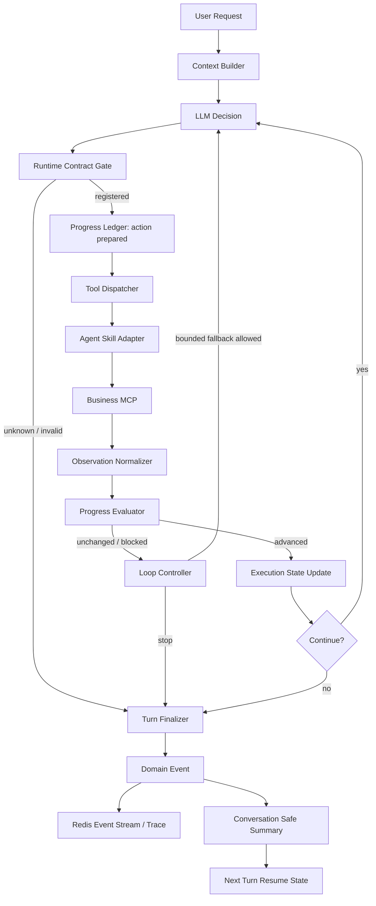

# Agent Runtime Control 与 Progress Ledger 总体设计

> 本文将 [Agent Harness Runtime Control 方法论](../reference/agent_loop_or_max_steps_methodology.md) 转化为适配当前 `agri_backend_v2` 的总体设计和实施计划。
>
> 本文是设计提案，不代表所有未勾选的实施项已经完成。设计以当前 Agent Runtime、Skill Registry、Business MCP、Turn/Trace、Redis SSE 和 Playground 导出代码为事实基线。

## 1. 文档目的

当前 Agent 已经具备 ReAct Loop、Skill Registry、HITL、结构化错误、Doom Loop 局部检测、Turn 状态和 SSE 终态收口。但这些能力还没有围绕一个统一的“任务是否推进”契约组织起来，导致以下问题可能被混在一起：

1. 模型选择了 Agent 侧不存在或运行时未加载的工具；
2. Agent 工具名与 Business MCP 工具名不同，错误信息容易误导；
3. 相同工具或相同业务目的被反复选择；
4. Tool 返回 Observation 后没有记录任务条件是否满足；
5. `max_steps` 既承担预算，又被动承担异常收口；
6. 用户发送“继续”时，系统可能重新执行刚刚被阻断的动作；
7. Playground 只能看到部分 Router 诊断，无法可靠区分决策轮、实际 Tool 执行和 Business MCP 错误。

本文的目标是建立以下单向控制链：

```text
User Request
    -> Turn Context
    -> LLM Decision
    -> Runtime Tool Contract Check
    -> Tool Execution
    -> Observation Normalization
    -> Progress Ledger Update
    -> Continue / Finalize / Persist Resume State
```

## 1.1 当前实施状态

本轮已实施 Phase 0、Phase 1 的运行时闭环，并落地 Phase 3 的跨 Turn 阻断保护切片；其余阶段仍需按本文验收条件继续推进：

- `ProgressLedger` 已承接原 `CallTracker` 的语义实现，并保留 `CallTracker` 兼容别名；每次 Observation 产生 `advanced`、`unchanged` 或 `blocked` 判定。
- SSE 新增结构化 `progress` 事件；Trace `tool_call` 节点记录 Agent 工具名、Business MCP 工具名、operation、`tool_call_id` 和观察指纹。
- Playground Debug Export 已同时读取历史 `skill_call` 与当前 Runtime 实际产生的 `tool_call`，并导出上述诊断字段。
- Doom Loop 终止会将阻断动作写入已有 `task_state`；跨 Turn 原样重试会在 Skill 执行前返回 `blocked_action_repeat`，不同动作才清理临时阻断状态并继续。
- 模板查询 operation 已声明 `capability_group`、`data_scope` 和 `freshness_requirement`，Registry catalog、Progress Ledger 和 Trace 具备读取这些字段的边界。
- Agent Registry 未命中返回 `agent_tool_not_registered`；Business 返回明确未知工具结果时归一为 `business_tool_not_registered`。
- Agent Registry、Business MCP 映射和不可暴露内部工具的确定性错误都会在当前调度批次进入 Finalizer，不再继续请求 LLM 或消耗后续决策轮。
- Runtime 已提供受控 `StepBudget` resolver：正式 ReAct 前由内部 Planner 预估调用返回 `estimated_steps` 和 `confidence`，没有有效估算时使用 `fallback_steps`；显式估计值只能在 1-20 的硬上限内按安全系数计算，结果会写回本轮 `turn.max_steps`。`safety_factor` 限定在 1.0-3.0，低置信度估算会将有效系数提升到至少 2.0，预算证据包含 `confidence` 和 `reason`。
- 同一动作连续两次得到相同 Observation 时，Runtime 会设置 `no_progress_detected` FinalizationRequest，由统一终态收口器停止继续消耗决策轮；一次相同结果不会单独触发终止。
- `no_progress_detected` 与 Doom Loop 都会持久化最小 `blocked_action` 摘要（工具映射、语义范围和 Observation 指纹），跨 Turn 的“继续”不能原样重放该动作。
- Business 返回 `status=needs_information` 时保留业务错误码和 `missing` 字段，但 Agent 不再把它包装成 `tool.failed`；Runtime 以 `user_input_required` 受控终态向用户索取缺失信息，避免把可恢复业务前置条件误报为系统故障。
- `prepare_planting_plan` 的 `custom_template_required` 已按上述规则修复：Trace Tool 节点为 `blocked`，不再产生 `tool.failed`；空系统模板目录的重复查询会转为自定义模板准备指引，完整种植目标可由 Agent 生成 `custom_template` 后继续 prepare，模板写入仍由审批后的聚合提交完成。
- Trace summary 已统计真实 `decision_steps`，并通过并行执行路径生成的 `parallel_batch_id` 统计 `parallel_batches` 和 `parallel_tool_calls`，不会从同一 step 的工具数量推断并发。
- 已实施 Semantic Group 的最小证据：显式 `capability_group + data_scope` 生成语义范围键，账本分别记录 exact progress 与 semantic progress；不同数据范围不会被合并。尚未实施语义 fallback、完整 ExecutionState/requirements/evidence 模型，以及 Trace Monitor 的完整可视化。

## 2. 范围与非目标

### 2.1 范围

- Agent-facing Tool Schema 与 Business MCP Tool 的映射契约；
- `Turn` 内的 `ExecutionState` 和 `ProgressLedger`；
- Exact Action、Semantic Action、No Progress 三层循环控制；
- `max_steps`、Tool 次数、Token、超时和取消的预算边界；
- Doom Loop、不可重试错误和预算耗尽的统一 Finalizer 收口；
- 跨 Turn 的“继续”恢复规则；
- Trace、Redis SSE 和 Playground Debug Export 的证据字段；
- 以真实农业业务前置条件为基础的实施阶段和验收标准。

### 2.2 非目标

- 本阶段不重新设计 LLM Provider、MCP 协议或 Business 领域模型；
- 不把所有 ReAct 动作改造成强制 Planner；
- 不把隐藏 Chain-of-Thought 写入 Mongo、Redis、Trace 或普通用户 SSE；
- 不因为循环控制而自动绕过 HITL 或重试非幂等写操作；
- 不用动态 `max_steps` 替代工具能力注册、业务前置条件校验或错误分类。

## 3. 设计结论

| 编号 | 决策 | 说明 |
|---|---|---|
| D1 | LLM 负责弹性决策，Runtime 负责确定性控制 | 模型可以提出下一步 Tool，但不能决定是否绕过注册、权限、HITL、预算和终态规则。 |
| D2 | 不新增第二套完整 State Machine | 当前已有 `Turn`、`TurnPhase`、`StopReason`、`task_state` 和 `Plan`；新增的是统一 `ExecutionState`/`ProgressLedger` 契约，而不是无边界拆分文件。 |
| D3 | Agent Tool 名和 Business MCP 名必须分层展示 | 例如 `list_system_crop_templates` 是 Agent-facing operation skill，Business MCP 实际调用 `manage_crop_cycle(operation="system_templates")`。 |
| D4 | 循环检测以“动作 + 结果 + 进度”判断 | 不能只看 Tool 名；也不能仅用整个 Turn 的 State Hash 判断读操作是否有进展。 |
| D5 | Recovery 默认关闭，按能力显式声明 | 只读替代查询可以有一次受约束 fallback；写操作、审批后继和非幂等动作禁止自动换方案或重试。 |
| D6 | `max_steps` 是硬预算，不是成功判断 | 达到预算必须进入 Finalizer，并明确任务可能未完成；不能把预算耗尽伪装成业务成功。 |
| D7 | “继续”是恢复请求，不是重复授权 | 系统必须根据持久化的任务状态恢复下一合法步骤，不能自动重放被阻断动作。 |
| D8 | Conversation、Turn、Trace 分层保存 | 用户可见历史保存最终答复和安全摘要；执行细节进入 Turn/Trace；Redis 负责短期事件和恢复状态。 |

## 4. 当前基线与问题证据

### 4.1 本次调试会话

调试导出 `playground-1787817064892-53059j` 包含：

```text
list_system_crop_templates
query_crop_templates
list_system_crop_templates
list_system_crop_templates
```

用户可见结果是连续两次“检测到死循环”，第二次发送“继续”后仍得到相同终态。

导出中 `skill_calls=[]`、`pending_actions=[]`，因此该导出本身不能证明每个选择都已经到达 Business MCP，也不能单独证明三次执行结果完全相同。`router_diagnostics` 只能作为模型选择证据，不能替代 Tool 执行记录。

当前 Playground 的 `getTimeline()` 将后端 flat nodes 按 `step_index` 分组，使用 `round_index` 作为旧组件兼容键；因此 `round_index` 不是独立的 Runtime 事实。实际调试必须使用 `turn_id`、`step_index`、`tool_call_id`、Trace 节点 ID 和时间顺序。

### 4.2 当前代码已经具备的能力

| 能力 | 当前实现 | 结论 |
|---|---|---|
| Turn 生命周期 | `agent/domains/harness/runtime/turn.py` | 已有 phase、status、step_count、stop_reason、task_state、finalization_pending。 |
| ReAct 循环 | `agent/domains/harness/runtime/engine.py` | 已有每步 LLM 决策、Tool dispatch、Observation 回灌和 Finalizer 入口。 |
| Tool Registry | `agent/domains/harness/tools/loader.py`、`registry.py` | 已有 YAML 展开、名称校验、公开 Schema 和 operation skill。 |
| Exact Doom Loop | `agent/domains/harness/runtime/verify.py` | 已按有效参数和 Observation fingerprint 做局部重复检测；系统模板空目录的重复动作在执行前转为 `prepare_planting_plan/create_custom` 指引，并阻止再次访问 Business MCP。 |
| Plan | `agent/domains/harness/runtime/planner.py` | `make_plan` 可生成 2-5 步计划，但不是所有 ReAct 动作的统一状态账本。 |
| Trace/SSE | `agent/domains/harness/observability/trace`、Redis SSE | 已有 step、Tool、Router 诊断和终态事件，但进度证据字段不完整。 |
| 调试导出 | `agri_admin_web/src/pages/Playground/sessionDebugExport.ts` | 已导出消息、Skill、Router 诊断和 pending plan，缺少可信的执行关联字段。 |

### 4.3 当前关键缺口

1. `CallTracker` 记录调用，但没有统一记录“该动作满足了哪个任务条件”；
2. `task_state` 没有统一承载目标、计划条件、事实增量、阻断动作和恢复策略；
3. Semantic Action Group 没有明确的 Registry 元数据契约；
4. `unknown_tool` 可能把 Agent Registry 缺失、Business MCP 缺失和模型错误混为一类；
5. 当前重复检测达到阈值后直接终止，没有通用 Recovery，但方法论文档描述了 Recovery 阶段；
6. 动态预算尚未有可靠的任务复杂度分类、估算校准和独立预算指标；
7. “继续”没有一个稳定的跨 Turn resume policy。

## 5. 目标架构



Runtime 的控制顺序必须固定为：

```text
1. 读取当前 Turn 的不可变 Context Snapshot
2. 接收 LLM Tool Call
3. 校验 Agent-facing Tool 是否在 Registry
4. enrich 默认参数并生成 canonical action key
5. 校验循环策略、权限、HITL 和预算
6. 执行 Agent Skill 到 Business MCP 的适配调用
7. 记录结构化 Observation 和结果指纹
8. 计算 ProgressDelta 并更新 ExecutionState
9. 决定继续、受控恢复或 Finalizer 收口
```

## 6. 状态、账本和数据边界

### 6.1 三种状态的职责

| 对象 | 生命周期 | 权威内容 | 不承载 |
|---|---|---|---|
| `Turn` | 单次用户请求 | 当前执行 phase、status、预算计数、终止原因、审批和最终答复 | 跨 Turn 的完整任务事实 |
| `ExecutionState` | Turn 内，可按安全摘要持久化 | 目标、阶段、计划条件、已知事实、阻断动作、恢复策略 | 原始 LLM 思维链和完整 Tool payload |
| `ProgressLedger` | Turn 内逐动作追加 | action key、Tool 调用、Observation fingerprint、ProgressDelta、状态转换 | 业务数据库的权威写入结果 |

Business 数据库仍是作物模板、种植单元、茬口和成本等业务事实的权威来源。Ledger 只记录本轮执行如何获得或改变这些事实。

### 6.2 ExecutionState 契约

```json
{
  "schema_version": 1,
  "goal": "生成虎丘20亩水稻种植方案",
  "phase": "information_collection",
  "plan": {
    "source": "react|make_plan",
    "requirements": [
      {
        "id": "crop_template",
        "description": "获得与水稻一致的可绑定模板",
        "status": "pending",
        "evidence_refs": []
      },
      {
        "id": "location_context",
        "description": "获得虎丘位置或天气所需地区信息",
        "status": "pending",
        "evidence_refs": []
      }
    ]
  },
  "facts": [],
  "blocked_actions": [],
  "resume_policy": "next_requirement|ask_user|stop",
  "last_progress_at": "2026-08-27T15:00:00+08:00"
}
```

`requirements.status` 只能由结构化结果或明确的用户输入推进，不能因为 Tool 返回 HTTP 成功就自动标记为 `completed`。状态建议使用：

```text
pending -> running -> completed
pending -> running -> blocked
pending -> running -> failed
```

业务写入还必须记录 `committed` 或 `commit_id` 等可验证证据。仅仅生成待审批动作不能标记为已写入。

### 6.3 ProgressLedger 契约

```json
{
  "schema_version": 1,
  "turn_id": "turn_xxx",
  "entries": [
    {
      "sequence": 1,
      "step_index": 1,
      "tool_call_id": "call_xxx",
      "agent_tool_name": "list_system_crop_templates",
      "business_tool_name": "manage_crop_cycle",
      "operation": "system_templates",
      "canonical_args": {
        "category": null,
        "limit": 20,
        "skip": 0
      },
      "action_key": "list_system_crop_templates|{...}",
      "observation_fingerprint": "sha256:...",
      "observation_summary": {
        "status": "success",
        "new_fact_count": 1,
        "entity_refs": ["system_template:rice"]
      },
      "progress": "advanced",
      "requirement_refs": ["crop_template"],
      "external_status": "completed",
      "duration_ms": 120
    }
  ]
}
```

完整 Observation 仍按现有消息、Trace 和 payload 策略保存；Ledger 只保存进行控制所需的摘要、指纹和关联 ID。任何敏感字段、令牌和原始隐藏推理不得进入 Ledger 公共投影。

### 6.4 ProgressDelta

ProgressEvaluator 输出结构化结果：

```json
{
  "progress": "advanced",
  "new_facts": ["找到水稻系统模板"],
  "completed_requirements": ["crop_template"],
  "blocked_requirements": [],
  "durable_effect": null,
  "reason": "observation_added_new_entity"
}
```

允许的 `progress`：

| 值 | 含义 | 是否可继续 |
|---|---|---:|
| `advanced` | 得到新事实、满足计划条件或完成业务提交 | 是 |
| `unchanged` | 结果等价且没有新事实或状态转换 | 受循环策略限制 |
| `blocked` | 结构化错误明确表示缺参数、能力缺失或不可恢复 | 否，除非有声明的 fallback |
| `committed` | 业务写入已获得可验证提交证据 | 进入收尾或后继阶段 |

## 7. Agent Tool 与 Business MCP 契约

### 7.1 当前模板工具映射

| Agent-facing Tool | Agent Skill 来源 | Business MCP 实际调用 | 业务范围 |
|---|---|---|---|
| `list_system_crop_templates` | `manage-crop-cycle/skill.md` 的 `system_templates` operation | `manage_crop_cycle(operation="system_templates")` | 系统作物模板，不能直接绑定茬口 |
| `list_crop_templates` | `manage-crop-cycle/skill.md` 的 `templates` operation | `manage_crop_cycle(operation="templates")` | 当前农场可用模板 |
| `query_crop_templates` | `manage-crop-templates/skill.md` 的 `query` operation | `manage_crop_templates(operation="query")` | 当前农场已有模板管理查询 |
| `import_system_crop_template` | `manage-crop-templates/skill.md` 的 `import_system` operation | `manage_crop_templates(operation="import_system")` | 将系统模板导入当前农场后再绑定 |

因此，`list_system_crop_templates` 不是 Business MCP 的独立工具名，但在当前 Agent Registry 中是合法的公开操作 Skill。`OperationSkill` 必须把它映射到 `manage_crop_cycle`，并注入 `operation=system_templates`。

### 7.2 错误分类

Runtime 必须区分以下错误：

| 错误 | 发生层 | 稳定 code | 默认策略 |
|---|---|---|---|
| Agent Registry 未找到模型调用名 | Agent Runtime | `agent_tool_not_registered` | 不调用 Business，不再请求 LLM，进入 Finalizer |
| Agent Skill 未声明 Business 映射 | Registry 启动校验 | `agent_mcp_mapping_missing` | 启动或加载失败，不能进入运行态 |
| Business MCP 未注册映射目标 | MCP Client/Business | `business_tool_not_registered` | 不重试 Tool，不自动换写方案 |
| Business 返回业务错误 | Business Tool | 业务 code，如 `system_template_not_imported` | 根据 `retryable` 和 fallback 声明处理 |
| 结果为空但请求成功 | Observation | `empty_observation` 或业务状态 | 不直接判错，交给 ProgressEvaluator 判断 |

错误响应至少包含：

```json
{
  "code": "business_tool_not_registered",
  "message": "Business MCP 未注册 manage_crop_cycle",
  "phase": "tool_executing",
  "agent_tool_name": "list_system_crop_templates",
  "business_tool_name": "manage_crop_cycle",
  "operation": "system_templates",
  "retryable": false,
  "attempt": 1
}
```

### 7.3 启动和执行前校验

1. Loader 解析 `skill.md` 并展开 OperationSkill；
2. Registry 校验公开名称唯一、参数 Schema、MCP 映射和 operation；
3. Business MCP 建立会话后，执行一次受控的只读工具目录校验或缓存工具目录版本；
4. 运行时在执行前同时记录 Agent-facing 名称和 Business 名称；
5. 任何名称映射错误都不能被包装为“重复调用”或继续消耗 `max_steps`。

## 8. 三层循环控制

### 8.1 Level 1：Exact Action

`action_key` 在参数 enrich、默认值展开和 canonical JSON 序列化之后生成：

```text
agent_tool_name
+ business_tool_name
+ operation
+ canonical_args
```

默认策略：

1. 第一次允许执行；
2. 第二次相同动作产生一次 `verification_warning`，Observation 明确标注已有结果；
3. 第三次相同动作且结果未产生新进展时，设置 `StopReason.DOOM_LOOP_DETECTED`；
4. 第三次不得再发起外部 Tool 调用，也不得继续请求下一次 LLM；
5. 结果发生可证明的业务变化时，保留执行记录，不按重复死循环终止。

阈值必须集中在 Runtime Control 配置中，不能散落在 Tool 实现和 Prompt 中。

### 8.2 Level 2：Semantic Action

Semantic Group 必须由 Skill 元数据显式声明，不能只按名称或 LLM Embedding 推断：

```yaml
control:
  capability_group: crop_template_discovery
  data_scope: system_template_catalog
  fallback_group: null
```

`list_system_crop_templates` 和 `query_crop_templates` 不能仅因为都含有“模板查询”就自动视为等价。系统模板、农场模板、已导入模板和详情查询拥有不同的数据范围，只有在 `capability_group`、`data_scope`、查询目标和结果条件都一致时，才能共享语义重复计数。

语义控制至少比较：

- capability group；
- 数据范围和租户范围；
- 查询目标实体和过滤条件；
- read/write set；
- freshness requirement；
- 最近 Observation 是否已经满足同一 requirement。

### 8.3 Level 3：No Progress

No Progress 不等于“数据库没有变化”。只读 Tool 可以增加事实，写 Tool 可以等待审批，计划也可以从 `pending` 转为 `blocked`。只有以下条件全部成立时才记为 `unchanged`：

```text
相同或语义等价动作
+ Observation fingerprint 等价
+ 没有新实体、字段或事实
+ 没有 requirement 状态转换
+ 没有 durable effect
+ 没有新的可执行下一步
```

连续 `unchanged` 达到阈值后进入 Doom Loop；如果结果明确返回不可恢复错误，则进入 `FinalizationRequest`，不得为了等待 `max_steps` 而继续喂给模型。

### 8.4 Recovery 策略

Recovery 是 Runtime Policy，不是默认 Prompt 文案：

| 场景 | Recovery |
|---|---|
| 相同只读查询但存在 Registry 声明的安全 fallback | 最多一次，改用明确声明的 fallback，记录原因 |
| 相同只读查询且没有 fallback | 直接 Finalizer 收口 |
| 缺少业务参数 | 生成具体追问，不自动猜测 |
| Business 永久错误 | 直接收口，保留 code 和最后 Observation |
| 写操作或审批后继失败 | 禁止自动换 Tool 或重复写入 |
| Agent/Business 工具未注册 | 直接收口并报告能力边界 |

当前阶段默认采用“Warning -> Terminate”。待有真实回归样本证明 fallback 不会扩大副作用后，才启用单次只读 Recovery。

## 9. Step Budget 与多维预算

### 9.1 Step 定义

当前 Step 定义为一次 LLM 决策轮；同一轮返回的多个独立只读 Tool Call 属于一个 decision step，但每个 Tool Call 仍单独计数和记录。`make_plan` 的 plan step 不直接等同于 ReAct decision step。

必须分别记录：

```text
decision_steps
tool_calls
parallel_batches
prompt_tokens / completion_tokens
wall_time_ms
```

### 9.2 实施策略

1. P0 保留当前 `Turn.max_steps` 硬上限和 Finalizer 语义；
2. P1 增加 Tool Call、Token、耗时和并行批次指标；
3. P2 先按任务类型使用 Runtime 配置的确定性预算；
4. Runtime 在正式 ReAct 前调用内部 Planner 估算 `estimated_steps` 和 `confidence`，并通过上下限约束；估算调用失败或输出无效时使用 `fallback_steps`：

```python
final_steps = min(max(ceil(estimate * safety_factor), minimum), maximum)
```

5. LLM 只能提供估计输入，不能修改最终预算；
6. 动态预算不得覆盖更具体的 Doom、取消、超时、不可重试错误或已提交结果。

当前链路不把预算估算器作为公开业务 Skill。它使用内部 `estimate_step_budget` 结构化工具调用，解析后只将数值交给 Runtime resolver；模型不能直接设置 `turn.max_steps`，也不能突破调用方提供的 `maximum_steps`。

当前 Runtime 使用 `minimum=1`、`safety_factor=1.5`、`maximum=20`；安全系数必须位于 1.0-3.0，Planner 还应提供 0-1 的 `confidence`，低于 0.5 时有效系数至少为 2.0。配置必须集中在 Agent Runtime Control 设置中，并通过 Trace 记录实际预算来源、最终值和计算 `reason`。

### 9.3 预算耗尽收口

```text
step_budget_exhausted
    -> committed_result 存在：确定性成功收尾
    -> 无 committed_result：一次无 Tool 的有限摘要收尾
    -> 摘要失败：基于最后 Observation 生成“尚未完成”答复
    -> turn.terminated + final_answer + done
```

预算耗尽不能报告未验证的模板、种植单元、茬口或成本已经创建。

## 10. 跨 Turn 的“继续”恢复

### 10.1 终止时持久化的最小状态

```json
{
  "task_state": {
    "schema_version": 1,
    "goal": "生成虎丘20亩水稻种植方案",
    "stop_reason": "doom_loop_detected",
    "blocked_actions": [
      {
        "agent_tool_name": "list_system_crop_templates",
        "business_tool_name": "manage_crop_cycle",
        "operation": "system_templates",
        "action_key": "...",
        "reason": "unchanged_observation",
        "last_observation_ref": "trace-node-xxx"
      }
    ],
    "completed_requirements": [],
    "next_allowed_action": null,
    "resume_policy": "ask_user"
  }
}
```

`task_state` 是短期可恢复状态，不替代 Mongo 中的业务事实，也不把原始执行消息全部复制进会话历史。

### 10.2 用户发送“继续”时

Runtime 按以下顺序处理：

1. 读取同一会话的最新 `task_state`；
2. 如果存在明确的未完成 requirement，恢复下一个合法动作；
3. 如果存在 Registry 声明的只读 fallback，最多执行一次；
4. 如果缺少用户才能决定的信息，直接追问；
5. 如果没有安全后继动作，重复上次终态说明原因；
6. 禁止把“继续”解释为重新执行被阻断的相同 action，也禁止把它解释为写入授权。

## 11. Finalizer、Trace、SSE 和调试导出

### 11.1 终态职责

`TurnFinalizer` 是唯一负责产生 `final_answer` 和 `done` 的组件。Doom、工具未注册、不可重试错误、预算耗尽、超时和取消都提交 `FinalizationRequest`，不能各自拼接终态事件。

终态顺序保持兼容：

```text
warning/observation（可选）
  -> finalizing
  -> final_answer_start
  -> final_answer_delta*
  -> final_answer
  -> turn.completed / turn.terminated / turn.failed
  -> done
```

### 11.2 新增或补齐的进度事件

内部规范事件：

```text
action.prepared
progress.updated
verification.warning
doom_loop.warning
tool.started
tool.finished
tool.failed
observation.created
turn.terminated
```

旧事件名继续兼容，单个领域事件只能拥有一个 `seq` 和一个 `event_id`，不能因兼容映射造成前端重复渲染。

### 11.3 Trace 节点字段

涉及 Tool 或进度判断的 Trace 节点至少记录：

```json
{
  "turn_id": "turn_xxx",
  "step_index": 2,
  "tool_call_id": "call_xxx",
  "agent_tool_name": "list_system_crop_templates",
  "business_tool_name": "manage_crop_cycle",
  "operation": "system_templates",
  "action_key": "...",
  "observation_fingerprint": "sha256:...",
  "progress": "advanced",
  "requirement_refs": ["crop_template"],
  "error_code": null
}
```

隐藏思维链只允许以受控的 reasoning 状态或摘要投影出现，不保存原文。

### 11.4 Debug Export 契约

`farm-manager.chat-session-debug.v1` 保留现有字段，同时补充：

```json
{
  "skill_calls": [
    {
      "step_index": 1,
      "tool_call_id": "call_xxx",
      "agent_tool_name": "list_system_crop_templates",
      "business_tool_name": "manage_crop_cycle",
      "operation": "system_templates",
      "status": "success",
      "progress": "advanced",
      "observation_fingerprint": "sha256:...",
      "error_code": null
    }
  ]
}
```

`round_index` 仅作为旧前端兼容字段，不作为 Runtime 事实。导出必须能回答：

- 模型选择了什么；
- Runtime 是否实际执行；
- 执行调用了哪个 Business MCP 名称；
- Tool 返回什么结构化错误；
- Observation 是否产生新进展；
- 哪个动作触发了终止。

## 12. 实施阶段

### Phase 0：工具契约和观测基线

目标：先解决“到底有没有这个 Tool、执行到了哪一层”的证据问题。

- 补充 Agent Tool -> Business MCP 的映射字段和 Trace 字段；
- Registry 启动校验公开名称、operation 和 MCP 映射；
- 区分 `agent_tool_not_registered` 与 `business_tool_not_registered`；
- Debug Export 增加 `step_index`、`tool_call_id`、Business 名称、operation 和执行状态；
- 增加 `list_system_crop_templates`、`list_crop_templates`、`query_crop_templates` 的映射契约测试；
- 不改变当前业务行为和默认 Doom 阈值。

主要位置：

```text
agent/domains/harness/tools/base.py
agent/domains/harness/tools/loader.py
agent/domains/harness/tools/registry.py
agent/domains/harness/runtime/engine.py
agent/domains/harness/observability/trace/collector.py
agri_admin_web/src/pages/Playground/sessionDebugExport.ts
```

### Phase 1：Progress Ledger 与 Exact Loop

目标：让每次动作有可解释的生命周期。

- 增加 `ActionRecord`、`ProgressDelta` 和 `ProgressLedger`；
- 在参数 enrich 后、外部执行前生成 canonical action key；
- Observation 归一化并生成稳定 fingerprint；
- 将当前 `CallTracker` 逐步适配为 Ledger，而不是同时维护两套重复计数；
- 保持第二次 warning、第三次终止的安全默认策略；
- 统一由 Finalizer 收口 Doom。

### Phase 2：ExecutionState 与 No Progress

目标：从“重复工具”升级为“任务是否推进”的判断。

- 引入目标、阶段、requirements、facts、blocked_actions 和 resume policy；
- 为 `make_plan` 的 Plan 增加 requirement/evidence 关联，但不强迫普通 ReAct 都调用 Planner；
- 定义查询新增事实、计划状态转换和 durable effect 的 ProgressDelta；
- 对空结果、部分结果、业务错误和相同结果增加 focused tests；
- 禁止通过单一 State Hash 判断所有 Tool 的进度。

### Phase 3：受控 Semantic Group 和跨 Turn 恢复

目标：避免错误地把不同数据范围的工具视为重复，同时让“继续”可恢复。

- 在 `skill.md` 中增加显式 control metadata；
- 为模板系统查询、农场模板查询和模板详情分别定义数据范围；
- 只读 fallback 必须由 Registry 声明，默认最多一次；
- 持久化阻断动作、最后 Observation 引用和下一合法动作；
- 实现“继续”恢复、追问和终态重放测试；
- 保持“继续”不等于写入授权。

### Phase 4：多维和动态预算

目标：在有观测数据后再减少简单任务浪费、提高复杂任务上限。

- 增加 decision step、Tool Call、Token、并行批次和 wall time 指标；
- 使用确定性任务类型预算作为第一版动态预算；
- 对 LLM `estimated_steps` 使用 clamp、最大值和最小值；
- 分别验证简单查询、单业务写流程、多实体查询和复杂规划；
- 任何预算都不能覆盖更具体的错误和副作用保护。

### Phase 5：Playground 和运维验收

目标：让管理员能从导出和 Trace 复盘一次完整执行。

- 时间线显示 decision step、真实 Tool 执行、Business 映射、Observation 和进度；
- 区分 Router/LLM 选择记录与实际 Tool Call；
- 显示证据不可用、Agent 注册缺失和 Business MCP 缺失；
- 普通用户只看到安全进度和最终答复；
- 增加真实 Business MCP、Redis SSE、Mongo Trace 的联调样例。

## 13. 测试与验收标准

### 13.1 Registry 与 MCP 契约

- [x] 当前 Registry 能加载 `list_system_crop_templates`，并显示其 Business 映射为 `manage_crop_cycle/system_templates`；
- [x] `query_crop_templates` 映射为 `manage_crop_templates/query`，不会被错误合并为系统模板查询；
- [x] Agent-facing 名称缺失时返回 `agent_tool_not_registered`；
- [x] Business 映射缺失时返回 `business_tool_not_registered`；
- [x] 所有映射错误不会继续请求 LLM，也不会退化为 `max_steps`。

### 13.2 Loop 与 Progress

- [x] 相同有效参数第二次产生一次 warning；
- [x] 相同调用和等价 Observation 达到阈值后，在下一次 LLM 调用前终止；
- [x] 同一 Tool 返回不同业务结果时不会误判 Doom；
- [x] 不同数据范围的模板查询不会仅因名称相似而互相阻断；
- [x] 查询虽不修改数据库，但产生新实体/事实时记录 `advanced`；
- [x] 系统模板目录明确返回空集合后，不重复访问 Business MCP；完整种植目标进入自定义模板 prepare 指引，无法生成计划时才返回可解释的输入要求；
- [x] 不可重试错误不会被重复喂回模型直到 `max_steps`；
- [x] 写入成功后不会因收尾模型再次请求 Tool 而重复写入。

### 13.3 跨 Turn 恢复

- [x] Doom 终止后发送“继续”不会自动重放相同 action；
- [x] 有明确下一计划条件时可以恢复下一步；
- [x] 没有安全下一步时会追问或重复说明阻断原因；
- [x] “继续”不会改变 HITL 授权状态；
- [x] Redis/Conversation state 版本冲突时不会执行旧的恢复动作。

### 13.4 预算和终态

- [x] `max_steps` 是硬上限，不产生第 N+1 个决策轮；
- [x] `step_budget_exhausted`、Doom、Tool 错误、取消和超时保留各自最具体的 `stop_reason`；
- [x] 所有终止路径都有用户可读 `final_answer` 和唯一 `done`；
- [x] 已有 `committed_result` 时不能因预算或 LLM 收尾失败报告为业务失败；
- [x] 动态预算 resolver 只允许 Runtime 计算，且受到 min/max clamp；正式 ReAct 前的内部 Planner 预估会提供 `estimated_steps` 和 `confidence`，无效或失败时回退 `fallback_steps`，并把 `resolved_steps` 应用到本轮 `turn.max_steps`。

### 13.5 调试证据

- [x] Debug Export 能同时显示 Agent Tool、Business MCP Tool、operation、step、tool_call_id 和错误 code；
- [x] `round_index=0` 不再被解释为所有动作发生在同一 ReAct 轮；
- [x] `skill_calls` 为空时，导出明确标记“无实际 Tool 执行记录”，不把 Router 选择当作执行成功；
- [x] Trace、Redis Event 和 Conversation Message 的身份关联保持 `message_id -> turn_id -> trace_id`；
- [x] 普通用户和管理员调试投影均不暴露隐藏思维链原文。

## 14. 质量门禁与验证命令

每个实施阶段都必须至少运行：

```bash
cd agri_backend_v2
PYTHONDONTWRITEBYTECODE=1 pytest -q tests/test_agent_runtime_streaming.py
PYTHONDONTWRITEBYTECODE=1 pytest -q tests/test_agent_run_loop_integration.py tests/test_skill_registry.py tests/test_crop_template_tool_contract.py
ruff check agent tests
```

涉及架构和工作区文件时继续运行：

```bash
bash scripts/check-layer-deps.sh
bash scripts/check-complexity-budget.sh
bash scripts/check-guide-sensor-pairing.sh
git diff --check
```

真实验收必须另外记录：

- Business MCP `list_tools` 中实际注册的名称；
- Agent Registry 启动时的公开 Tool 名称和映射；
- 一次成功查询的 Tool/Observation/Progress Trace；
- 一次未注册工具错误的终态；
- 一次 Doom 后“继续”的恢复结果；
- SSE 重连后的 `seq`、`event_id` 和唯一 `done`。

## 15. 风险与待评审决策

### 15.1 已作决定

- 当前阶段不启用通用 Recovery，只保留显式 fallback 扩展点；
- `list_system_crop_templates` 作为 Agent-facing operation 保留，不新增同名 Business MCP 工具；
- `round_index` 降级为前端兼容字段，`step_index` 才是 Runtime 执行步骤；
- 业务成功必须有结构化提交或查询证据，不能由模型文本自行声明；
- 普通用户历史和 SSE 不承载原始 Tool 调试 payload 或隐藏思维链。

### 15.2 待评审问题

1. Business MCP 工具目录是否支持启动后版本快照，还是每个 Turn 只校验 Agent-side 静态映射；
2. `capability_group`、`data_scope`、`freshness_requirement` 是否纳入 `skill.md` 的正式 Schema；
3. 只读 fallback 是否允许重新请求一次 LLM，还是由 Runtime 直接选择已声明的 Tool；
4. `task_state` 的 Redis TTL 和 Mongo 安全摘要保留期限；
5. 动态预算是否按业务场景分类，还是只按 Tool/Plan 数量确定；
6. Debug Export v1 是否向后兼容新增字段，还是发布 v2 格式并提供迁移器。

## 16. 关联文档

- [Agent Harness Runtime Control 方法论](../reference/agent_loop_or_max_steps_methodology.md)
- [Agent Run Loop、并行 Skill 与流式事件设计](2026-08-16-agent-run-loop-streaming-parallel-design.md)
- [Agent Harness 系统设计](2026-08-20-agent-harness-system-design.md)
- [Agent Context、Session、Memory 系统设计](2026-08-20-agent-context-session-memory-system-design.md)
- [Agent SSE 执行事件契约](2026-08-21-agent-sse-execution-event-contract-proposal.md)
- [Agent 会话历史查询工程计划](2026-08-23-agent-conversation-history-query-engineering-plan.md)
- [Skill MD YAML 标准](2026-08-07-skill-md-yaml-standard.md)
