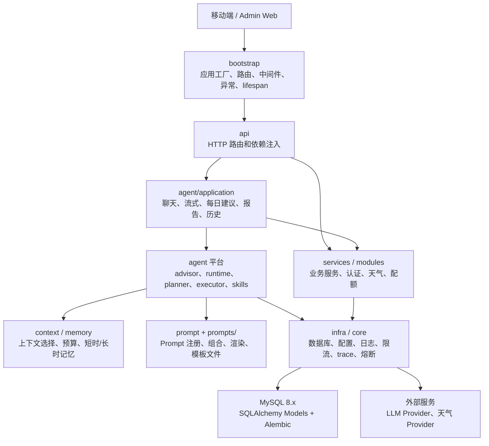
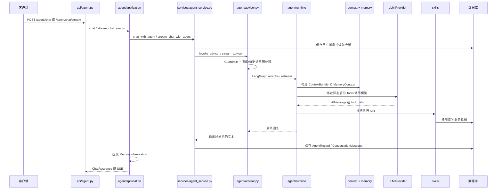
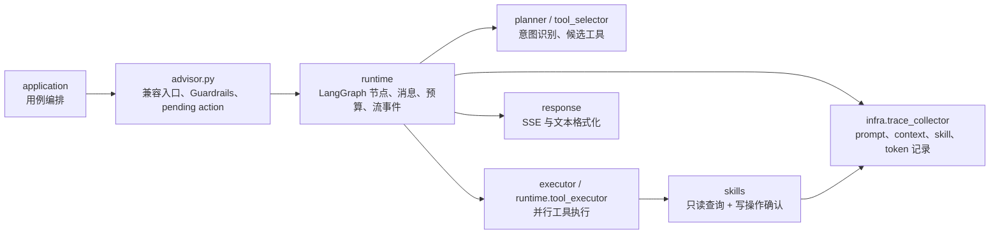
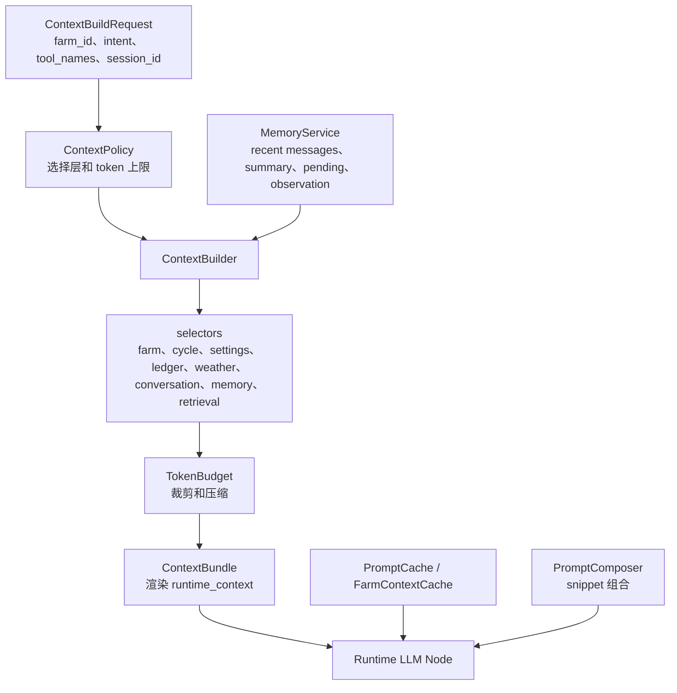
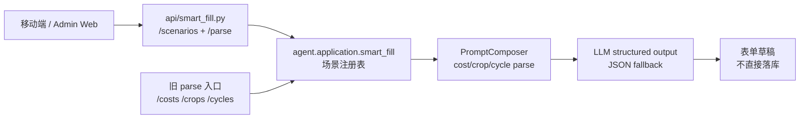
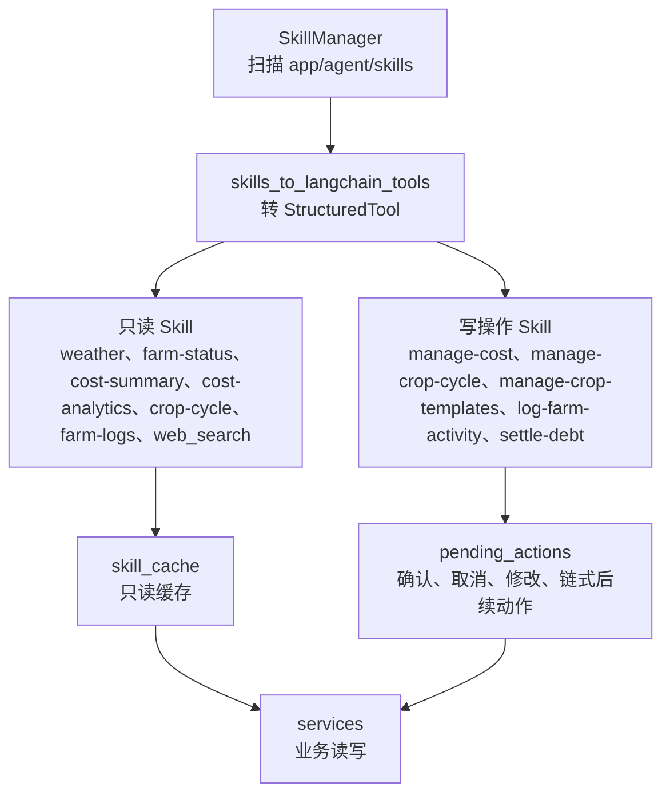
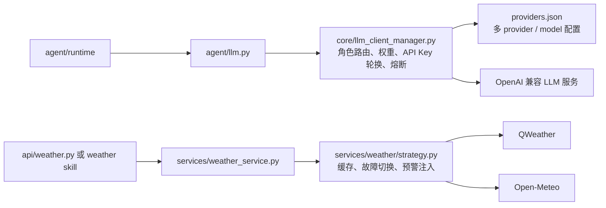
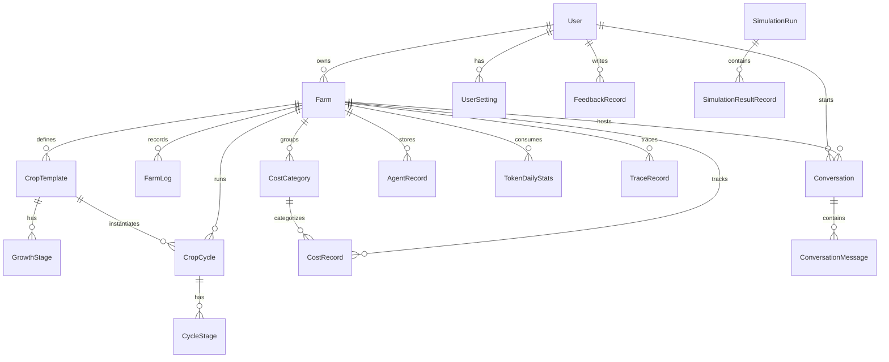

# 后端系统架构

> 基于 `backend/app` 当前代码扫描更新。本文只描述真实落地结构；历史兼容入口见 [compatibility-entries.md](/Users/ljn/Documents/demo/explore/docs/architecture/compatibility-entries.md)。

## 1. 当前分层

后端是 FastAPI + SQLAlchemy + LangGraph + Skillify Skill 体系。入口已从单文件启动迁移到 `app/bootstrap/`，Agent 平台也已拆出 application、runtime、planner、executor、response、context、memory、evaluation 等子域。

## 2. 目录职责

| 目录 | 当前职责 |
| --- | --- |
| `app/main.py` | 仅创建 FastAPI app；本地运行时读取 `settings.server` 启动 uvicorn。 |
| `app/bootstrap/` | 应用工厂、路由注册、中间件、异常处理、lifespan。 |
| `app/api/` | HTTP 入口、参数校验、FastAPI Depends；Agent 路由已主要调用 application use case，智能填写通过 `api/smart_fill.py` 暴露统一场景入口。 |
| `app/modules/auth`、`app/modules/farm` | 已迁移的模块化认证和农场依赖能力。 |
| `app/services/` | 迁移期业务服务：作物、周期、日志、成本、债务、天气、会话、报告、配额。 |
| `app/agent/application/` | Agent 应用用例：聊天、SSE、每日建议、报告、历史、上下文失效。 |
| `app/agent/runtime/` | LangGraph 图工厂、节点、消息压缩、工具执行、最终 prompt 预算、流式事件。 |
| `app/agent/executor/` | Tool call 执行计划和并行执行适配。 |
| `app/agent/skills/` | Skillify Skill 实现，目前仍位于 Agent 域下。 |
| `app/context/` | ContextBundle、selector、token budget、压缩、缓存、预加载和失效。 |
| `app/memory/` | 短时记忆、长时记忆接口、检索空实现、observation event。 |
| `app/prompt/` 与 `backend/prompts/` | Prompt registry/composer/renderer/replay 代码与 Jinja2 模板文件。 |
| `app/infra/` | trace、pending action、limiter、skill cache、circuit breaker、兼容 settings/database/json_repair。 |
| `app/core/` | 配置、数据库、日志、安全、日期上下文、LLM client manager。 |
| `app/evaluation/`、`app/simulation/`、`app/observability/` | 回放评测、仿真测试、平台观测事件骨架。 |

## 3. Agent 请求链路

## 4. Agent 平台拆分

当前 `app.agent.graph` 仍是 Runtime 兼容入口；Prompt 相关调用已迁移到 `app.prompt`。新增实现应优先进入 `agent/runtime`、`prompt/`、`context/`、`memory/` 对应边界。

## 5. Context、Prompt、Memory 链路

设计边界：Runtime 可以消费 `ContextBundle` 和已构造好的 memory view，但不应直接实现 selector、memory store 或 prompt 版本治理。

## 5.1 智能填写统一入口

智能填写统一为“自然语言 → 表单草稿”，当前注册 `ledger.record`、`crop.template`、`crop.cycle` 三个场景。场景注册项声明 prompt、输出 schema、上下文构建和业务校验；新增业务不再新增专属 parse 路由，优先扩展 `agent.application.smart_fill`。旧 `/costs/parse`、`/crops/templates/parse`、`/cycles/parse` 保留为兼容入口，内部转调统一服务并返回旧响应格式。

## 6. Skill 系统

写操作不会直接静默落库，通常注册为 pending action，由用户确认后再执行。作物周期创建、日期调整和阶段推进统一由 `manage_crop_cycle` 承接；`update_crop_stage` 只作为 registry legacy alias 兼容旧名。

## 7. LLM 与天气外部依赖

LLM 路由按 `role` 选择模型，支持 provider/model 级错误分类和指数退避。天气策略优先使用配置了密钥的 QWeather，失败或未配置时使用 Open-Meteo。

## 8. 数据域概览

主要 ORM 位于 `app/models/`：用户、农场、作物模板、生长阶段、种植周期、周期阶段、日志、成本、分类、会话、消息、Agent 记录、反馈、trace、token 统计、幂等键和仿真记录。

## 9. 迁移关注点

- `api/agent.py` 已经瘦身，但仍通过 `services.agent_service` 进入旧 `advisor.py` 兼容入口。
- `agent/runtime/llm_support.py` 当前会构建 runtime context bundle，后续可继续向 application 注入端口的方向收敛。
- `services/` 仍承担大量业务模块职责，后续可逐步迁移到 `modules/farm`、`modules/ledger`、`modules/weather`、`modules/conversation` 等真实模块。
- `app/agent/skills/` 当前是平台能力和业务写入的交汇点，新增 Skill 要明确只读/写操作权限、缓存策略和 pending action 行为。
- 架构图应保持分图维护；不要把 API、Agent、Skill、DB、外部服务全部塞进一张图。
