# 后端系统架构详细文档

> 生成时间: 2026-05-30 | 基于 backend/ 完整代码分析

---

## 目录

1. [总体架构图](#1-总体架构图)
2. [分层依赖图](#2-分层依赖图)
3. [请求流转图](#3-请求流转图)
4. [Agent 内部架构图](#4-agent-内部架构图)
5. [Skill 系统架构图](#5-skill-系统架构图)
6. [LLM 多 Provider 路由图](#6-llm-多-provider-路由图)
7. [天气双 Provider 架构图](#7-天气双-provider-架构图)
8. [数据模型 ER 图](#8-数据模型-er-图)
9. [模块职责清单](#9-模块职责清单)

---

## 1. 总体架构图

```mermaid
flowchart TB
    subgraph 客户端
        Mobile["📱 FarmManager Mobile<br/>(React Native + TS)"]
        Admin["🖥️ Admin Web<br/>(React + Vite)"]
    end

    subgraph "FastAPI 应用 (app/)"
        direction TB
        subgraph "API 层 (app/api/)"
            Auth["/auth<br/>认证路由"]
            AgentAPI["/agent<br/>AI 对话路由"]
            CropAPI["/crops<br/>作物模板路由"]
            CycleAPI["/cycles<br/>种植周期路由"]
            CostAPI["/costs<br/>记账路由"]
            WeatherAPI["/weather<br/>天气路由"]
            OtherAPI["/logs /debts<br/>/feedback /user-settings<br/>/admin"]
            Deps["deps.py<br/>DI: get_db<br/>get_current_user<br/>get_current_farm<br/>require_admin"]
        end

        subgraph "Agent 系统 (app/agent/)"
            Advisor["advisor.py<br/>Agent 入口"]
            Graph["graph.py<br/>LangGraph 状态机"]
            ToolSelector["tool_selector.py<br/>三层工具过滤"]
            Guardrails["guardrails.py<br/>输入/输出安全"]
            PromptReg["prompt_registry.py<br/>模板注册中心"]
            PromptRender["prompt_renderer.py<br/>Jinja2 渲染"]
            PromptComposer["prompt_composer.py<br/>snippet 组合"]
        end

        subgraph "服务层 (app/services/)"
            AgentSvc["agent_service.py"]
            AuthSvc["auth_service.py"]
            ConvSvc["conversation_service.py"]
            CostSvc["cost_service.py"]
            CropSvc["crop_service.py"]
            CycleSvc["cycle_service.py"]
            FarmCtx["farm_context_service.py"]
            WeatherSvc["weather_service.py"]
        end

        subgraph "基础设施 (app/infra/)"
            Limiter["limiter.py<br/>SlowAPI 限流"]
            CB["circuit_breaker.py<br/>三态熔断器"]
            Pending["pending_actions.py<br/>写操作确认"]
            Trace["trace_collector.py<br/>异步 Trace"]
            SkillCache["skill_cache.py<br/>TTL 缓存"]
        end
    end

    subgraph "Skill 系统 (app/agent/skills/)"
        S1["get_weather_forecast"]
        S2["get_farm_status"]
        S3["get_cost_summary"]
        S4["get_cost_analytics"]
        S5["create_cost_record"]
        S6["get_crop_cycle_info"]
        S7["create_crop_cycle"]
        S8["create_crop_template"]
        S9["get_recent_farm_logs"]
        S10["log_farm_activity"]
        S11["update_crop_stage"]
        S12["settle_debt"]
    end

    subgraph "核心层 (app/core/)"
        Config["settings/<br/>pydantic-settings"]
        DB["database.py<br/>MySQL 连接池"]
        Security["security.py<br/>JWT + bcrypt"]
        Logger["logger.py<br/>结构化日志"]
        LLMMgr["llm_client_manager.py<br/>多 Provider 路由"]
    end

    subgraph "外部服务"
        LLMProv["LLM Providers<br/>Ollama / NVIDIA / DashScope"]
        QWeather["和风天气 API"]
        OpenMeteo["Open-Meteo API"]
    end

    subgraph "数据层"
        MySQL[("MySQL 8.x<br/>farm_manager<br/>20 张表")]
        PromptFiles["prompts/<br/>snippets/ + templates<br/>config.yaml"]
        ProvidersJSON["providers.json<br/>LLM 路由配置"]
    end

    Mobile --> Auth & AgentAPI & CropAPI & CycleAPI & CostAPI & WeatherAPI & OtherAPI
    Admin --> OtherAPI
    Auth & AgentAPI & CropAPI & CycleAPI & CostAPI & WeatherAPI & OtherAPI --> Deps
    Deps --> Config & DB & Security

    AgentAPI --> Advisor
    Advisor --> Graph
    Graph --> ToolSelector & Guardrails & Composer
    Composer --> PromptReg & PromptRender
    PromptRender --> PromptFiles
    ToolSelector --> S1 & S2 & S3 & S4 & S5 & S6 & S7 & S8 & S9 & S10 & S11 & S12

    Auth --> AuthSvc
    AgentAPI --> AgentSvc
    CostAPI --> CostSvc
    CropAPI --> CropSvc
    CycleAPI --> CycleSvc
    WeatherAPI --> WeatherSvc

    AgentSvc --> Advisor & ConvSvc
    Advisor --> FarmCtx & LLMMgr
    LLMMgr --> LLMProv & CB
    WeatherSvc --> QWeather & OpenMeteo

    S1 & S2 & S3 & S4 --> SkillCache
    S5 & S7 & S8 & S10 & S11 & S12 --> Pending
    AgentSvc --> Trace
    AgentAPI --> Limiter

    AuthSvc & CostSvc & CropSvc & CycleSvc --> MySQL
    ConvSvc & FarmCtx --> MySQL
```

---

## 2. 分层依赖图

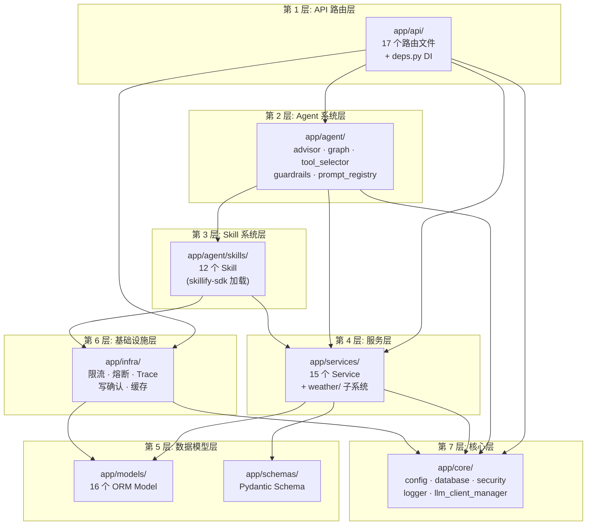

### 分层职责说明

| 层级 | 目录 | 职责 | 文件数 |
|------|------|------|--------|
| API 路由层 | `app/api/` | HTTP 入口，参数校验，调用 service 返回响应 | 17 + deps |
| Agent 系统层 | `app/agent/` | LangGraph 状态机编排，工具选择，Guardrails，Prompt 管理 | 8 |
| Skill 系统层 | `app/agent/skills/` | 12 个可执行 Skill，通过 skillify-sdk 加载为 LangChain Tool | 12 目录 |
| 服务层 | `app/services/` | 业务逻辑，事务编排，天气子系统 | 15 + weather/ |
| 数据模型层 | `app/models/` + `app/schemas/` | SQLAlchemy ORM 模型 + Pydantic 请求/响应 Schema | 16 + 11 |
| 基础设施层 | `app/infra/` | 限流、熔断、Trace 追踪、写操作确认、缓存 | 7 |
| 核心层 | `app/core/` | 配置、数据库连接、安全、日志、LLM 路由 | 7 |

---

## 3. 请求流转图

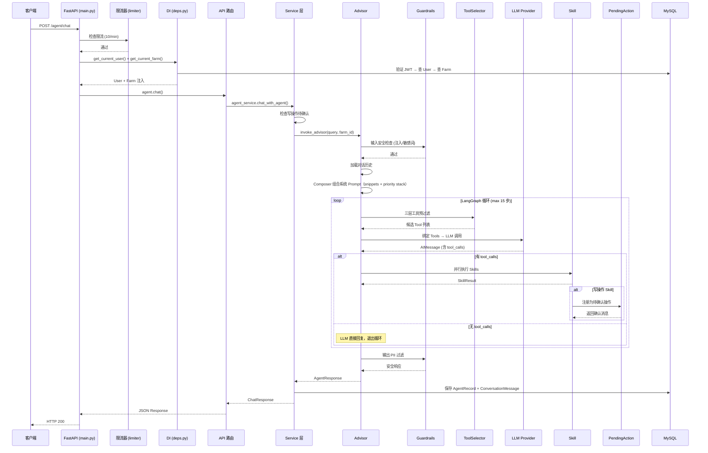

---

## 4. Agent 内部架构图

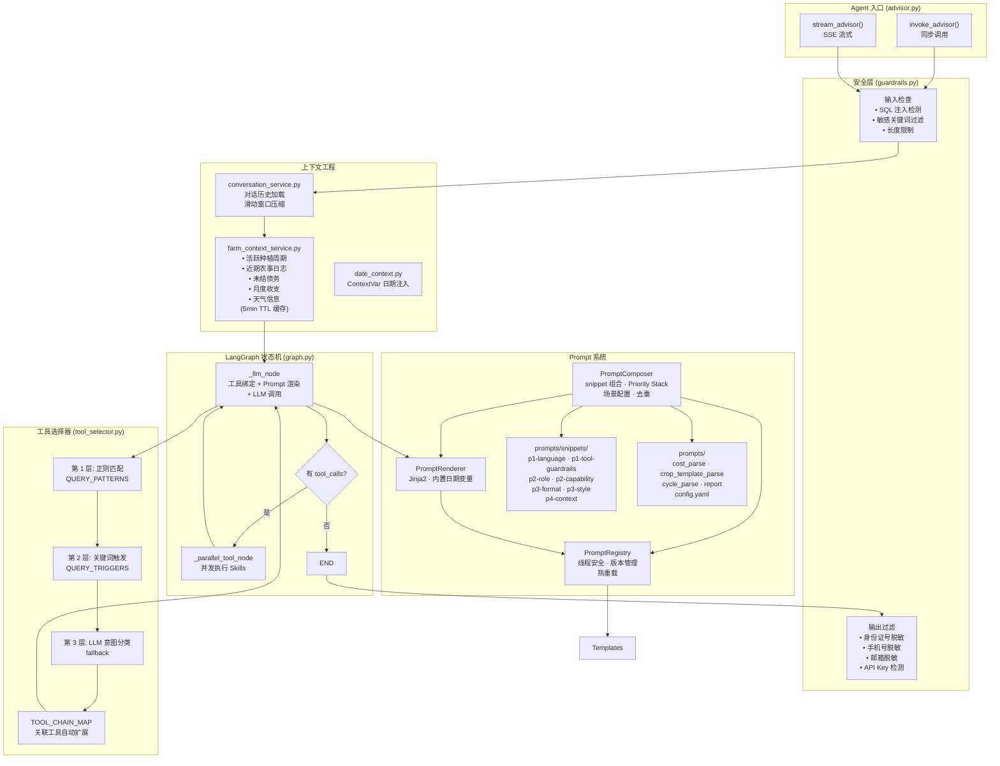

### Agent 模块职责

| 文件 | 职责 |
|------|------|
| `advisor.py` | Agent 入口，提供同步和流式调用，处理 Guardrails 和对话历史 |
| `graph.py` | LangGraph StateGraph，`_llm_node` + `_parallel_tool_node`，最大 15 步递归 |
| `state.py` | `AgentState` TypedDict，`messages` 使用 `add_messages` reducer |
| `llm.py` | LLM 客户端工厂，优先 LLMClientManager，回退 config.yaml |
| `tool_selector.py` | 三层工具预过滤：正则 → 关键词 → LLM 意图，含 TOOL_CHAIN_MAP |
| `guardrails.py` | 输入安全（注入检测、敏感词）+ 输出 PII 过滤 |
| `prompt_registry.py` | 线程安全 Prompt 模板注册中心，支持版本管理和热重载 |
| `prompt_renderer.py` | Jinja2 渲染器，内置日期/时间变量 |
| `prompt_composer.py` | Prompt 组合器，按场景组合 snippet 片段渲染最终 prompt。Priority Stack 排序（P1-P4），snippet 去重，全局单例。设计参考 Anthropic Tool Design + PE Collective |
| `report.py` | 种植周期报告生成，通过 LLM + Tool 调用 |

### Prompt 加载流程

#### 三层架构总览

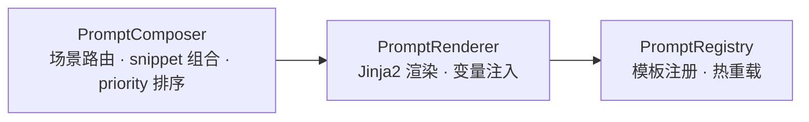

#### 启动阶段（服务启动时执行一次）

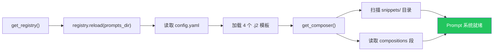

#### 运行时：两种组合模式

```mermaid
flowchart TB
    subgraph "模式 A：完整组合 system_base（graph.py）"
        direction LR
        A1["compose('system_base')"] --> A2["查 compositions 配置"]
        A2 --> A3["取 7 个 snippets"]
        A3 --> A4["去重 → 渲染 → 排序 P1→P4"]
        A4 --> A5["拼接 → 标题去重"]
        A5 --> A6["最终 system prompt"]
    end

    subgraph "模式 B：模板组合 cost_parse（cost.py）"
        direction LR
        B1["compose('cost_parse')"] --> B2["查 compositions 配置"]
        B2 --> B3["取 p1-language snippet"]
        B3 --> B4["渲染 snippet"]
        B4 --> B5["Registry 取任务模板"]
        B5 --> B6["渲染模板"]
        B6 --> B7["snippet + template 拼接"]
        B7 --> B8["标题去重"]
        B8 --> B9["最终 cost_parse prompt"]
    end

    style A6 fill:#22c55e,color:#fff
    style B9 fill:#22c55e,color:#fff
```

**5 个调用点：**

| 调用位置 | 场景 | Snippets | Task Template |
|----------|------|----------|---------------|
| `graph.py:227` | `system_base` | 7 个（完整组合） | — |
| `report.py:33` | `report` | p1-language | report.j2 |
| `cost.py:120` | `cost_parse` | p1-language | cost_parse.j2 |
| `crop.py:123` | `crop_template_parse` | p1-language | crop_template_parse.j2 |
| `cycle.py:152` | `cycle_parse` | p1-language | cycle_parse.j2 |

---

## 5. Skill 系统架构图

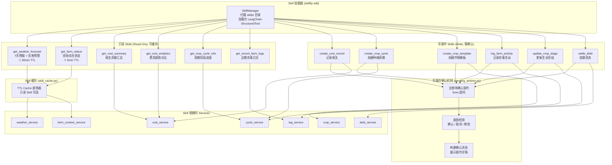

### 12 个 Skill 清单

| Skill | 类型 | 功能 | 缓存 | 触发词 |
|-------|------|------|------|--------|
| `get_weather_forecast` | 只读 | 7天天气预报 + 灾害预警 | 30min | 天气、预报、下雨 |
| `get_farm_status` | 只读 | 农场综合状态（周期/日志/债务/收支/天气） | 5min | 农场状态、概况、总览 |
| `get_cost_summary` | 只读 | 收支余额汇总 | - | 账户余额、收支、总共 |
| `get_cost_analytics` | 只读 | 费用趋势分析 | - | 费用趋势、分析、对比 |
| `get_crop_cycle_info` | 只读 | 种植周期阶段进度 | - | 种植、周期、阶段 |
| `get_recent_farm_logs` | 只读 | 近期农事活动日志 | - | 日志、记录、最近操作 |
| `create_cost_record` | **写** | 记录收/支条目 | 禁止 | 记账、花费、买了 |
| `create_crop_cycle` | **写** | 创建新种植周期 | 禁止 | 开始种植、新周期 |
| `create_crop_template` | **写** | 创建作物模板 | 禁止 | 新作物、添加模板 |
| `log_farm_activity` | **写** | 记录农事操作 | 禁止 | 记录、操作、施肥/打药 |
| `update_crop_stage` | **写** | 更新作物生长阶段 | 禁止 | 更新阶段、进入下一阶段 |
| `settle_debt` | **写** | 结算债务记录 | 禁止 | 还钱、结算、清账 |

---

## 6. LLM 多 Provider 路由图

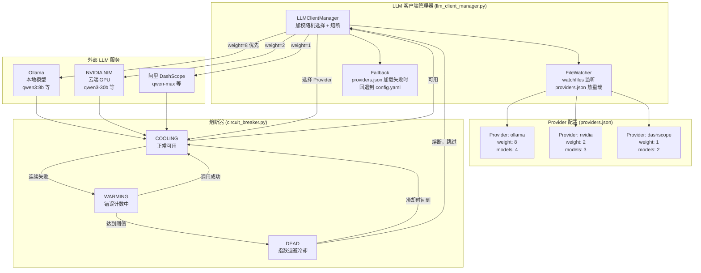

### 路由策略说明

| 机制 | 说明 |
|------|------|
| **加权随机** | 按 weight 比例分配请求，ollama(8) : nvidia(2) : dashscope(1) |
| **模型级熔断** | 每个 model 独立维护 COOLING/WARMING/DEAD 三态 |
| **指数退避** | DEAD 状态后冷却时间指数增长 |
| **热重载** | watchfiles 监听 providers.json 变更，无需重启 |
| **Fallback** | providers.json 加载失败自动回退 config.yaml |

---

## 7. 天气双 Provider 架构图

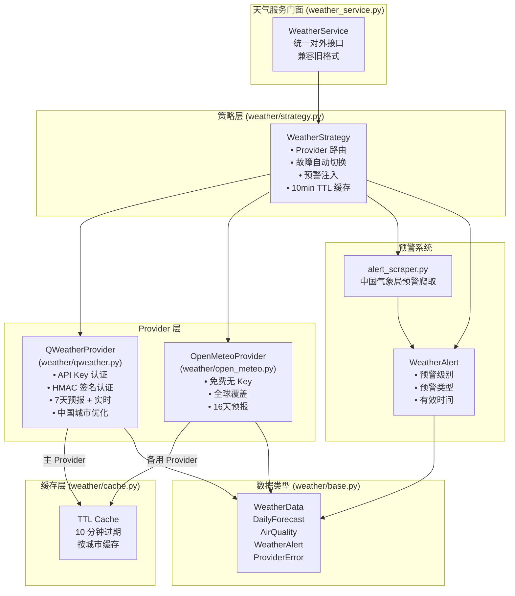

### 天气策略说明

| 场景 | 行为 |
|------|------|
| **正常请求** | 优先 QWeather → 缓存命中直接返回 |
| **QWeather 失败** | 自动切换 Open-Meteo |
| **预警注入** | 爬取结果自动合并到预报响应中 |
| **缓存** | 10min TTL，按城市独立缓存 |

### 天气子系统文件

| 文件 | 职责 |
|------|------|
| `weather_service.py` | 门面类，对外统一接口，兼容旧数据格式 |
| `weather/base.py` | 数据类型定义：WeatherData, DailyForecast, AirQuality, WeatherAlert, ProviderError |
| `weather/qweather.py` | 和风天气 Provider，支持 API Key 和 HMAC 签名两种认证 |
| `weather/open_meteo.py` | Open-Meteo 免费 Provider，全球覆盖 |
| `weather/strategy.py` | 路由策略：Provider 选择、故障切换、预警注入、缓存 |
| `weather/cache.py` | TTL 缓存实现 |
| `weather/alert_scraper.py` | 中国气象局天气预警爬取 |

---

## 8. 数据模型 ER 图

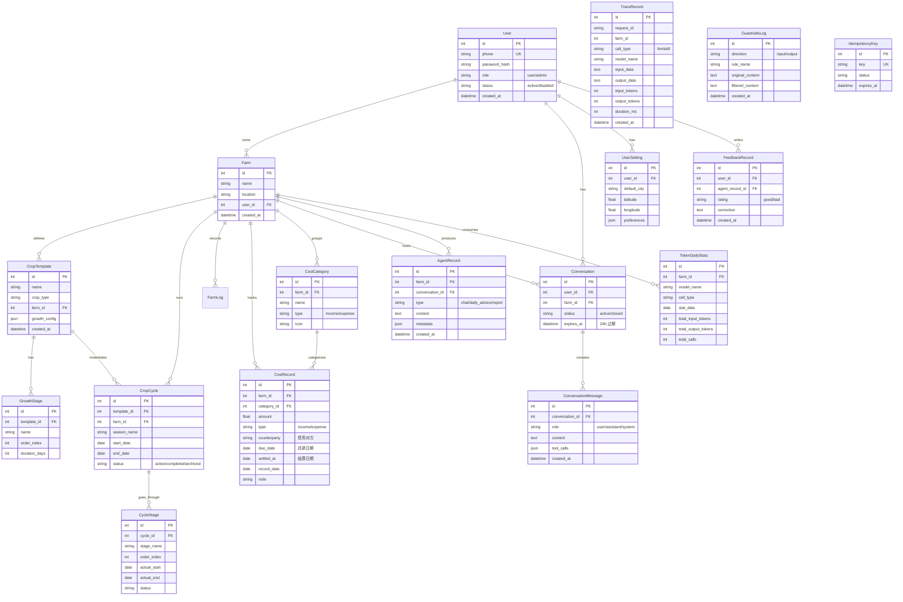

---

## 9. 模块职责清单

### app/core/ — 核心层

| 文件 | 职责 |
|------|------|
| `settings/` | pydantic-settings 配置中心，加载优先级：init_settings > env_vars > config.yaml |
| `database.py` | SQLAlchemy MySQL 引擎 + Session 工厂，连接池启用 pre_ping/recycle |
| `security.py` | JWT 创建/验证 (PyJWT) + bcrypt 密码哈希 |
| `logger.py` | 结构化日志：stdout 彩色 + rotating files，request_id 上下文变量 |
| `seed.py` | 数据库初始化：默认农场、管理员用户、字段迁移 |
| `date_context.py` | ContextVar 日期注入，从 X-Current-Date Header 读取 |
| `json_repair.py` | JSON 解析工具：从 Markdown 代码块提取、自动修复 LLM 输出错误 |
| `llm_client_manager.py` | 多 Provider LLM 路由，加权随机选择，模型级熔断，文件热重载 |

### app/models/ — 数据模型层 (16 个模型)

| 模型 | 表名 | 职责 |
|------|------|------|
| `User` | users | 用户认证（手机号+密码），角色(user/admin)，状态(active/disabled) |
| `Farm` | farms | 多租户农场实体，关联 user_id |
| `CropTemplate` | crop_templates | 作物定义模板，含可配置生长阶段 |
| `GrowthStage` | growth_stages | 生长阶段定义（名称、顺序、天数） |
| `CropCycle` | crop_cycles | 种植周期（季），关联模板和农场 |
| `CycleStage` | cycle_stages | 周期中的实际阶段记录 |
| `FarmLog` | farm_logs | 农事活动日志 |
| `CostRecord` | cost_records | 收支记录，支持债务（对方、到期日、结算日） |
| `CostCategory` | cost_categories | 每农场收支分类，含图标 |
| `Conversation` | conversations | 对话会话（active/closed，24h 过期） |
| `ConversationMessage` | conversation_messages | 对话消息（含 tool_calls JSON） |
| `AgentRecord` | agent_records | Agent 输出记录（chat/daily_advice/report） |
| `FeedbackRecord` | feedback_records | 用户对 AI 回复的评价（good/bad + 纠正建议） |
| `TraceRecord` | trace_records | LLM/Skill 调用追踪（输入/输出/耗时/Token） |
| `TokenDailyStats` | token_daily_stats | 每日 Token 使用统计（按农场/模型/类型） |
| `GuardrailsLog` | guardrails_logs | 输入/输出安全拦截日志 |
| `IdempotencyKey` | idempotency_keys | 幂等性缓存，自动清理 |
| `UserSetting` | user_settings | 用户偏好（默认城市、经纬度） |

### app/schemas/ — Pydantic Schema 层

| 文件 | 包含 Schema | 职责 |
|------|------------|------|
| `agent.py` | ChatRequest, ChatResponse, PendingActionResponse, AdviceItem, DailyAdviceResponse, ReportRequest, ReportResponse 等 | Agent 对话/建议/报告的请求响应 |
| `auth.py` | LoginRequest, RegisterRequest, TokenResponse, UpdateProfileRequest, UserResponse | 认证相关 |
| `cost.py` | CostRecordCreate, CostRecordResponse, CycleProfit, YearlySummary | 记账 CRUD + 分析 |
| `cost_category.py` | CostCategory 相关 Schema | 分类管理 |
| `crop.py` | CropTemplateBase/Create/Response, GrowthStageBase/Create/Response | 作物模板 |
| `cycle.py` | CropCycleCreate/Response/ListResponse, CycleStageResponse | 种植周期 |
| `log.py` | FarmLogCreate, FarmLogResponse | 农事日志 |
| `feedback.py` | Feedback 相关 Schema | AI 反馈 |
| `settings.py` | UserSettings Schema | 用户设置 |
| `common.py` | PaginatedResponse | 通用分页响应 |
| `admin_user.py` | AdminUser Schema | 管理员用户管理 |

### app/api/ — 路由层

| 文件 | 路径前缀 | 关键端点 |
|------|---------|---------|
| `auth.py` | `/auth` | POST /register, /login, GET /me, PUT /me |
| `agent.py` | `/agent` | POST /chat, /chat/stream (SSE), GET /daily, POST /daily/refresh, POST /report, GET /conversations, /advice-history, /report-history |
| `crop.py` | `/crops` | 作物模板 CRUD |
| `cycle.py` | `/cycles` | 种植周期 CRUD |
| `cost.py` | `/costs` | 收支 CRUD + 分析 |
| `cost_categories.py` | `/cost-categories` | 分类 CRUD |
| `log.py` | `/logs` | 农事日志 CRUD |
| `debt.py` | `/debts` | 债务管理 |
| `weather.py` | `/weather` | 天气预报 |
| `feedback.py` | `/feedback` | AI 反馈提交 |
| `user_settings.py` | `/user-settings` | 用户偏好 |
| `admin.py` | `/admin` | 管理面板 |
| `admin_config.py` | `/admin/config` | LLM 配置管理 + 热重载 |
| `admin_stats.py` | `/admin/stats` | 统计数据 |
| `admin_trace.py` | `/admin/trace` | Trace 数据查看 |
| `admin_users.py` | `/admin/users` | 用户管理 |
| `deps.py` | (共享) | DI: get_db, get_current_user, get_current_farm, verify_resource_owner, require_admin |

### app/services/ — 服务层

| 文件 | 职责 |
|------|------|
| `agent_service.py` | Agent 编排：chat, stream_chat, get_daily_advice, refresh_daily_advice, generate_report, 历史查询 |
| `auth_service.py` | 用户注册（自动创建 Farm）、登录、用户查询 |
| `conversation_service.py` | 对话生命周期：创建/关闭会话、保存消息、加载历史 |
| `cost_service.py` | 收支 CRUD + 分析 |
| `cost_category_service.py` | 分类管理 |
| `crop_service.py` | 作物模板管理 |
| `cycle_service.py` | 种植周期管理 |
| `debt_service.py` | 债务结算 |
| `farm_context_service.py` | 构建农场状态摘要（活跃周期/日志/债务/月度收支/天气），5min TTL 缓存 |
| `feedback_service.py` | 反馈记录 |
| `log_service.py` | 农事日志管理 |
| `quota_service.py` | Token 每日配额检查 |
| `weather_service.py` | 天气门面：双 Provider 策略，旧格式兼容 |
| `weather/base.py` | 天气数据类型定义 |
| `weather/qweather.py` | 和风天气 Provider |
| `weather/open_meteo.py` | Open-Meteo Provider |
| `weather/strategy.py` | Provider 路由、故障切换、预警注入、缓存 |
| `weather/cache.py` | 天气数据 TTL 缓存 |
| `weather/alert_scraper.py` | 天气预警爬取 |

### app/infra/ — 基础设施层

| 文件 | 职责 |
|------|------|
| `limiter.py` | 全局 SlowAPI 限流器（IP 级） |
| `circuit_breaker.py` | 三态熔断器（CLOSED/OPEN/HALF_OPEN），指数退避重试 |
| `pending_actions.py` | 写操作确认系统：内存存储（5min 超时），意图检测（确认/取消/修改） |
| `trace_collector.py` | 异步 Trace 收集：后台 flush 批量写入 MySQL |
| `trace_context.py` | ContextVar 追踪上下文：request_id, session_id, farm_id, round |
| `trace_dao.py` | 批量 INSERT + Token 统计 UPSERT |
| `trace_cleaner.py` | TTL 清理：Trace 7天，Token 统计 90天，每日执行 |
| `skill_cache.py` | Skill 结果 TTL 缓存装饰器 |

### prompts/ — Prompt 模板（Composer + Snippet 架构）

**设计理念：** 基于 Anthropic Tool Design、LangChain Context Engineering、PE Collective Priority Stack 等成熟实践。

核心原则：
- **工具路由不在 prompt 中** — tool_selector.py 三层过滤 + Tool.description 自动注入已覆盖，prompt 只保留行为约束（"禁止编造数据"）
- **可组合 Snippet** — 按关注点拆分为 p1-p4 优先级片段，PromptComposer 按场景组合
- **Priority Stack** — P1 Safety > P2 Accuracy > P3 Format > P4 Context，消除多个"最高优先级"矛盾

| 文件 | 职责 |
|------|------|
| `config.yaml` | Prompt 配置：templates（任务模板）+ compositions（场景组合） |
| `cost_parse.j2` | 记账解析任务模板 |
| `crop_template_parse.j2` | 作物模板解析任务模板 |
| `cycle_parse.j2` | 种植周期解析任务模板 |
| `report.j2` | 报告生成任务模板 |
| `snippets/p1-language.j2` | P1 Safety：语言规则（全程中文） |
| `snippets/p1-tool-guardrails.j2` | P1 Safety：工具调用安全护栏（禁止编造数据） |
| `snippets/p2-role.j2` | P2 Accuracy：角色定义（农业技术顾问） |
| `snippets/p2-capability.j2` | P2 Accuracy：能力范围 |
| `snippets/p3-format.j2` | P3 Format：回复格式约束 |
| `snippets/p3-style.j2` | P3 Format：回复风格 |
| `snippets/p4-context.j2` | P4 Context：动态上下文（时间/用户信息，Jinja2 变量注入） |

**场景组合示例：**

| 场景 | Snippets | Task Template |
|------|----------|---------------|
| `system_base` | p1-language + p1-tool-guardrails + p2-role + p2-capability + p3-format + p3-style + p4-context | — |
| `cost_parse` | p1-language | cost_parse.j2 |
| `crop_template_parse` | p1-language | crop_template_parse.j2 |
| `cycle_parse` | p1-language | cycle_parse.j2 |
| `report` | p1-language | report.j2 |

### 其他

| 目录/文件 | 职责 |
|-----------|------|
| `skillify-sdk/` | 本地 SDK 包，Skill 加载框架，扫描目录并注册为 LangChain Tool |
| `data/` | 静态数据（天气城市代码映射） |
| `scripts/` | 运维脚本（数据库备份、迁移） |
| `config.yaml` | 运行时配置（YAML，gitignored） |
| `providers.json` | 多 Provider LLM 路由配置（3 Provider, 9 Model） |
| `model_list.json` | 可用 LLM 模型目录 |
| `requirements.txt` | Python 依赖（20 个包） |
| `Dockerfile` | 生产容器（Python 3.11, uvicorn） |
