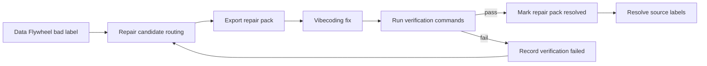

# Data Flywheel Repair Pack Workflow

本文说明 Data Flywheel 中已标注的 bad case 如何进入 vibecoding 修复闭环。

## 闭环入口

管理员在 Data Flywheel 中确认失败样本后，系统不会直接把 bad reply 当训练数据使用。失败样本先被路由为 repair candidate，包含：

- `fix_target`：建议修复线，例如 `router`、`pending_plan`、`tool_result_state`、`guardrail`
- `priority`：修复优先级
- `regression_ready`：是否已有足够断言可直接沉淀回归
- `suggested_action`：给 coding agent 的修复方向
- `verification_commands`：推荐验证命令

## 导出 Repair Pack

单个 repair pack 只面向一个主 `fix_target`。如果选中的样本混合了多个修复目标，API 返回 `MIXED_FIX_TARGETS` 和分组建议，管理员应拆成多包，或使用 `fix_target_override` 人工指定本包修复线。

repair pack 的逻辑文件结构为：

```text
manifest.json
cases.jsonl
README.md
debug/
regression-drafts/
```

`manifest.json` 是入口，记录 `pack_id`、`fix_target`、标签、样本 ID、warnings 和验证命令。`cases.jsonl` 描述 observed failure、expected behavior、debug 路径和 regression draft 路径。`debug/` 中证据会脱敏 API key、token、secret、`.env`、手机号等敏感信息。

## Vibecoding 使用顺序

1. 读取 `README.md` 和 `manifest.json`，确认本包只修哪条 `fix_target`。
2. 读取 `cases.jsonl`，为每条失败样本补回归测试或复现路径。
3. 按 `debug/` 和 `regression-drafts/` 中证据定位根因。
4. 做最小范围修复，禁止顺手改无关模块。
5. 运行 `manifest.verification_commands` 中的验证命令。
6. 输出修复目标、改动文件、回归测试、验证结果和剩余风险。

## 回写规则

修复并验证通过后，调用 repair pack resolved API，写入修复说明和验证摘要，系统会把关联 open labels 标记为 resolved。

如果验证失败，调用 verification-failed API。系统记录失败摘要，但保留关联 labels 为 open，方便继续下一轮 vibecoding 修复。


