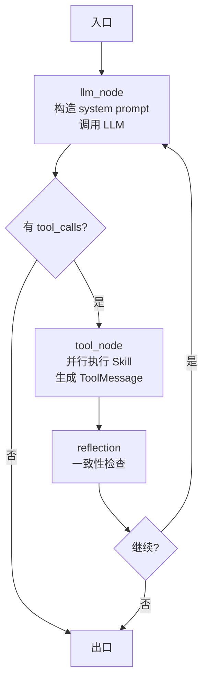

# 01 — Agent 平台架构

> 状态：草稿 | 维护：BlockShip | 关联：[02_Skill引擎与契约](./02_Skill引擎与契约.md)、[03_Context工程](./03_Context工程.md)、[04_Memory工程](./04_Memory工程.md)、[05_Prompt工程](./05_Prompt工程.md)

---

## 1. 边界定义

Agent 平台是 Farm Manager 的核心，由顶层 `application/` use case、`agent/` runtime 子域和若干工程化支撑域组成。以下路径按 2026-07-24 代码现状校准：

| 子域 | 路径 | 职责 | 不负责 |
| --- | --- | --- | --- |
| **Application** | `application/` | Use Case 编排：聊天、流式、每日建议、报告、历史、Skill 目录、Smart Fill | HTTP request 细节、DB 表直接操作 |
| **Chat Application** | `application/chat/` | 同步/流式聊天、持久化、SSE tail、task state 更新 | Runtime 内部策略 |
| **Runtime** | `agent/runtime/` | 纯 Python ReAct loop、节点、消息、状态、tool_executor、LLM 调用、反思接入 | Prompt 版本治理、Context selector、Memory 存储 |
| **Router** | `agent/router/` | 意图识别、候选检索、Skill Catalog、RouterPolicy、决策 trace | HTTP 路由、Prompt 模板、Memory 存储 |
| **Executor** | `agent/executor/` | Skill 调用、并行执行、参数校验、Pending Action、tool_calls 适配 | API 路由、Prompt 模板、Memory 存储 |
| **Reflector** | `agent/reflector/` | 写操作风险检查、工具结果一致性、daily_advice 反思、reflection trace | Runtime/Executor 内部策略 |
| **Guardrails** | `agent/guardrails/` | 输入/计划/输出保护规则与模型 | 业务规则 |
| **Planning** | `agent/runtime/planning/` | Pending plan draft adapter、模型与校验 | HTTP 路由 |
| **Ports** | `agent/ports.py` | Agent 与外部依赖（LLM、Memory、Trace）的端口定义 | 实现 |

支撑域：

| 支撑域 | 路径 | 职责 |
| --- | --- | --- |
| **Prompt 工程** | `prompt/` + `backend/prompts/snippets/` | Registry / Composer / Renderer / Replay / Cache |
| **Context 工程** | `context/` | Bundle / Selector / Budget / Compressor / Cache / Preload |
| **Memory 工程** | `memory/` | Short-term / Long-term / Retrieval / Consolidation / Observation |
| **Skills** | `skills/` | 13 个 Skill 包 + registry YAML，按 `.claude/rules/skill-writing.md` 契约实现 |

## 2. Application 层（Use Case）

入口模块，API 层只调用 Use Case，不直接编排 Runtime。

| Use Case | 文件 | 用途 | 入口 API |
| --- | --- | --- | --- |
| `chat/use_case.py` | `chat/use_case.py` | 一次性同步对话 | `POST /agent/chat` |
| `chat/stream_chat.py` | `chat/stream_chat.py` | 流式对话（SSE） | `POST /agent/chat/stream` |
| `advice/use_case.py` | `advice/use_case.py` | 每日建议生成 | `GET /agent/daily`、`POST /agent/daily/refresh` |
| `report.py` | `report.py` | 周期报告 | `POST /agent/report` |
| `session/history.py` | `session/history.py` | 历史会话查询 | `GET /agent/conversations` |
| `session/summary.py` | `session/summary.py` | running summary | 内部 |
| `skill_catalog` | `skill_catalog.py` | Skill 目录服务 | 内部 |
| `smart_fill.py` | `smart_fill.py` | 智能填写场景注册表 | `GET /smart-fill/scenarios`、`POST /smart-fill/parse` |
| `session/flywheel.py` | `session/flywheel.py` | 会话级飞轮数据采集 | 内部 |

**约束**：
- Application 不直接读数据库表，通过 Service 或 Memory Service 端口。
- Application 不直接调 LLM，通过 Runtime 或 Advisor。
- Application 提交 Memory observation、Trace、Evaluation capture 是允许的。

## 3. 历史 Advisor 职责的当前落点

当前代码已没有 `agent/advisor.py` 文件。历史 Advisor 职责已拆到 `application/chat/`、`agent/guardrails/`、`agent/router/`、`agent/runtime/` 和 `agent/executor/`：

```
请求入口
  ├─ application/chat 初始化会话、trace、task state
  ├─ agent/guardrails 检查输入与写操作计划
  ├─ agent/router 生成候选工具和 RouterDecision
  ├─ agent/runtime/loop.py 执行 ReAct loop
  ├─ agent/executor 处理 tool_call、Pending Action 和并行执行
  ├─ agent/reflector 进行写操作和工具结果一致性检查
  ├─ application/chat/stream_* 输出 SSE 并持久化消息
  └─ 返回结果
```

文档中若仍出现 Advisor，应理解为上述职责集合的兼容术语，不应新增 `agent/advisor.py`。

## 4. Runtime（ReAct loop 核心）

| 文件 | 职责 |
| --- | --- |
| `loop.py` | 纯 Python ReAct loop：LLM 节点与工具节点循环执行 |
| `nodes.py` | 节点实现：LLM 调用、最终提示、工具绑定 |
| `state.py` | AgentState：messages、tool_calls、pending、reflection、metadata |
| `messages.py` | 消息适配：LangChain Message ↔ DB ConversationMessage |
| `tool_executor.py` | 工具执行节点：并行调用、错误处理、ToolMessage 适配 |
| `final_prompt_budget.py` | 最终 system prompt 的 token 预算裁剪 |
| `llm_support.py` | LLM 调用辅助（超时、重试、降级） |
| `chat_fallbacks.py` | LLM 失败兜底回复 |
| `direct_routing.py` | 快速路由（已知意图跳过首次推理） |
| `reflection.py` | 反思节点接入 |
| `planning/` | Pending plan draft adapter、模型与 validator |

**节点流程**（伪图）：



## 5. Router（意图与工具候选）

| 文件 | 职责 |
| --- | --- |
| `service.py` | `SkillRouter` 服务入口，组合 classifier、retriever 与 policy |
| `classifier*.py` | 规则意图分类与信号提取 |
| `candidate_retriever.py` | 候选工具检索 |
| `catalog.py` | 从 LangChain tools 构造 SkillCatalog |
| `policy.py` / `policy_selection.py` | 工具候选裁剪、确认策略和 fallback |
| `tool_selector.py` | 运行时工具绑定选择 |
| `registry.py` | 迁移期 fallback 注册表，长期事实源是 `app/skills/registry/*.yaml` |

**输出**：`RouterDecision(selected_tools, fallback, reason, clarification, evidence)`，候选 Skill 名称列表会绑定到 LLM 的 tools 参数，减少 token 并降低误触发。

## 6. Executor（Skill 调用）

| 文件 | 职责 |
| --- | --- |
| `tool_calls.py` | LangChain tool_call 适配 |
| `pending_actions.py` | Pending Action：保存/确认/取消/过期 |
| `models.py` | Executor 输入输出模型 |

**写操作确认流程**：

```
LLM 决定调用 create_cost_record
  ↓
Executor 检查 skill.meta.permission == "write_confirm"
  ↓
是 → 创建 PendingAction（带完整参数 + 过期时间）
     → 返回确认话术
     → 用户确认 → pending plan executor 真正执行 Skill
     → 用户取消 → 下一轮 /agent/chat 消息进入 pending handler → 丢弃
     → 超时 → 异步清理
否 → 直接执行 Skill
```

## 7. Reflector（反思）

| 文件 | 职责 |
| --- | --- |
| `service.py` | 反思服务入口 |
| `policy.py` | 反思策略：何时触发、检查项 |
| `checks.py` | 具体检查：写操作一致性、工具结果匹配、回复幻觉 |
| `daily_advice.py` | 每日建议反思 |
| `models.py` | 反思结果模型 |

**触发条件**：
- 任何写操作 Skill 调用后
- LLM 回复中提到「已记账/已创建/已删除」等动作动词
- Reflector 不阻塞主流程，但产出 reflection_trace 用于 DataFlywheel

## 8. 依赖矩阵（核心约束）

| 边界 | 可依赖 | 禁止依赖 |
| --- | --- | --- |
| `domains/*/*routes.py` | Pydantic schema、Depends、application use case、同领域 service | `app.memory`、`app.prompt`、`app.context` 直接 import |
| `platforms/*/*routes.py` | 平台 service、领域依赖、共享基础设施 | 绕过领域服务复制业务规则 |
| `application/` | Auth/Farm 依赖结果、Context Builder、Prompt Composer、Runtime、Memory Service、Evaluation、Observability | HTTP request 细节、数据库表直接操作 |
| `agent/runtime/` | Runtime state、nodes、loop、tool executor 协议、Agent ports | Prompt 版本治理、Context selector 实现、Memory 存储 |
| `agent/router/` | 工具候选、意图分类、Context 摘要、Skill registry 读模型 | HTTP 路由、Prompt 模板、Memory 存储 |
| `agent/executor/` | Skill registry、权限策略、参数校验、写操作确认 | API 路由、Prompt 模板、Memory 存储 |
| `agent/reflector/` | Skill 调用结果、ToolMessage、Pending 状态 | Runtime 内部状态机细节、API 路由 |
| `prompt/` | PromptInput、ContextBundle 摘要、版本配置、快照 | 数据库查询、Memory 存储 |
| `context/` | 业务 selector、Memory Service 接口、token budget | Prompt 版本治理、LLM Runtime 节点执行 |
| `memory/` | Memory models、schemas、retrieval、infra adapter | API 路由、Runtime 状态机细节 |
| `skills/` | Skill schema、权限、执行适配、业务领域端口 | API request 对象、Prompt/Context 存储实现 |

CI 门禁：`scripts/check-layer-deps.sh` 检查 import 违规。

## 9. 当前架构边界

| 维度 | Farm Manager 当前取舍 |
| --- | --- |
| Agent 形态 | 单主 Agent + 13 个 Skill 包，每个包可暴露多个 operation / alias |
| 上下文压缩 | `context/compressors` + token budget + cache 三层协作 |
| Memory | 内嵌 MemoryService，SQL 长期记忆已落地，外部 RAG 仅作为可选端口 |
| Pending | 写操作必须进入 Pending Action / Pending Plan，由用户确认后执行 |
| Reflector | 对写操作、工具结果一致性和幻觉执行进行拦截或记录 |
| DataFlywheel | 从真实会话、trace、仿真和评测中沉淀样本，支撑回归与修复 |
| 响应策略 | 查询和建议保持秒级体验；写操作优先保证可确认、可回溯、可恢复 |

## 10. 相关文档

- [02_Skill引擎与契约](./02_Skill引擎与契约.md)
- [03_Context工程](./03_Context工程.md)
- [04_Memory工程](./04_Memory工程.md)
- [05_Prompt工程](./05_Prompt工程.md)
- [06_数据飞轮与评测](./06_数据飞轮与评测.md)
- [03_接口协议/02_Agent内部接口](../03_接口协议/02_Agent内部接口.md)
- 现有：[../../../docs/architecture/boundaries.md](../../../docs/architecture/boundaries.md)、[../../../docs/architecture/backend-architecture.md](../../../docs/architecture/backend-architecture.md)
