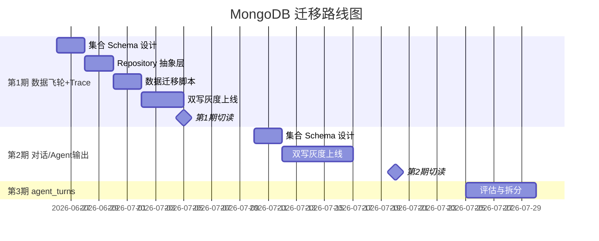
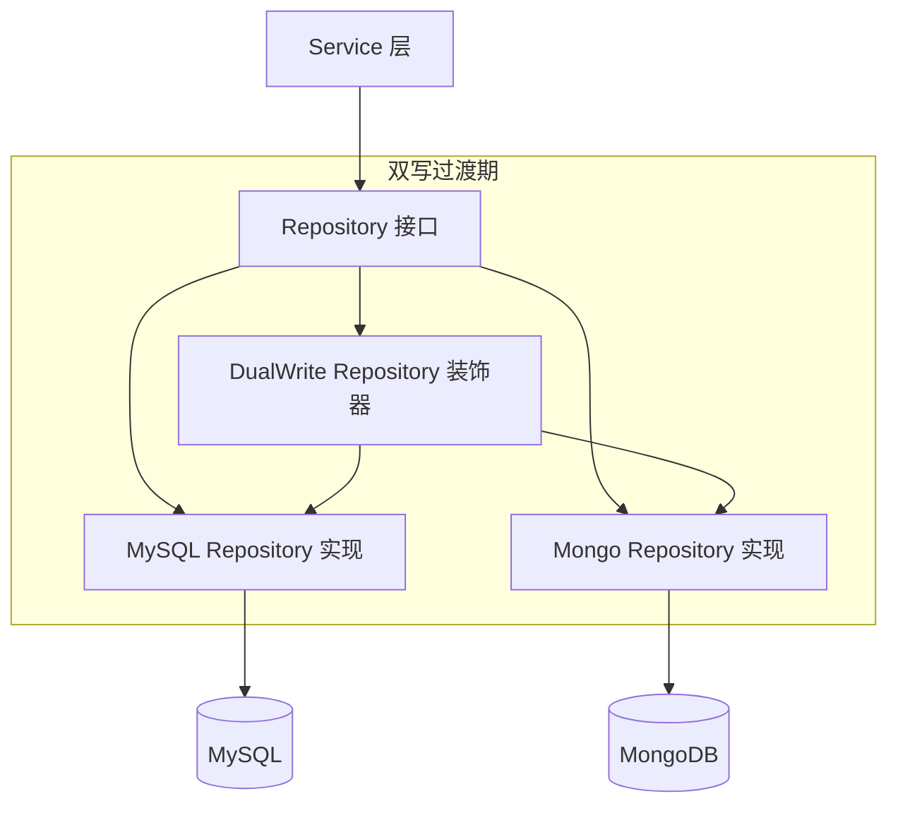

# 14 — MongoDB 迁移方案

> 状态：第 1 期工程已落地并通过启动验证 | 维护：BlockShip | 最近更新：2026-06-26 | 关联：[10_数据库结构设计](./10_数据库结构设计.md)、[06_数据飞轮与评测](./06_数据飞轮与评测.md)、[07_可观测与运维](./07_可观测与运维.md)、[04_相关规范/03_数据库与迁移规范](../04_相关规范/03_数据库与迁移规范.md)

---

## 1. 文档定位

本文档回答：**Farm Manager 现有 MySQL 库中哪些表适合迁移到 MongoDB、怎么迁、怎么不踩坑**。

| 文档 | 回答的问题 |
| --- | --- |
| 10_数据库结构设计 | MySQL 当前是什么结构 |
| 04_相关规范/03_数据库与迁移规范 | MySQL 改动通用规范（命名、迁移工具、连接池） |
| **本文档（14_MongoDB迁移方案）** | **哪些数据适合 MongoDB、如何分阶段迁移、应用层如何抽象** |

冲突时以代码为准；代码改动必须同步本文档与 [10_数据库结构设计](./10_数据库结构设计.md)。

## 2. 背景与动机

### 2.1 当前痛点

| 痛点 | 现状 | 影响 |
| --- | --- | --- |
| JSON 字段反模式 | `trace_records` 4 个、`agent_repair_packs` 5 个、`agent_review_issue_chains` 6 个 JSON 字段；`agent_records.meta` 用 `Text` 列存 JSON | SQL 无法有效索引嵌套结构，JSON 路径查询语法复杂，迁移 schema 时破坏性强 |
| 大文本膨胀 | `conversation_messages.content`、`trace_records.input_data/output_data` 都是 `Text`/`JSON` 类型，单条可达数 KB 至 MB | MySQL 表体积快速膨胀，备份/恢复变慢，热表缓存命中率下降 |
| Schema 频繁演进 | 数据飞轮预标注、修复包、问题链 schema 随评测迭代高频变化 | 每次字段调整需要 Alembic 迁移，跨环境同步成本高 |
| 跨表 JOIN 复杂 | `trace_records` ↔ `agent_turns` ↔ `conversation_messages` 链路 JOIN 多次 | 分析类查询慢，且飞轮分析查询路径与在线事务路径耦合 |

### 2.2 MongoDB 适配性判断

MongoDB 在以下场景显著优于 MySQL：

1. **半结构化数据**：JSON 字段密集，schema 不稳定
2. **追加写为主**：写入后很少更新，越写越多
3. **单文档聚合**：一次查询能拿到完整对象（避免多次 JOIN）
4. **大文本存储**：单文档可达 16MB，且 GridFS 支持更大文件
5. **灵活索引**：支持嵌套字段、数组索引

## 3. 候选表评估矩阵

### 3.1 评估维度

| 维度 | 取值 | 说明 |
| --- | --- | --- |
| JSON 密度 | 低 / 中 / 高 | JSON 字段数量与权重 |
| 写读比 | 追加型 / 读多写少 / 读写均衡 | 影响索引与分片策略 |
| Schema 稳定性 | 稳定 / 偶变 / 频变 | 频变适合文档库 |
| 跨表关联 | 弱 / 中 / 强 | 强关联不宜迁移 |
| 事务需求 | 无 / 弱 / 强 | 强事务必须留 SQL |
| 查询模式 | 按 ID 拉文档 / 范围聚合 / 多维分析 | 文档库擅长前者 |

### 3.2 13 张候选表评估

| 表 | JSON 密度 | 写读比 | Schema | 关联 | 事务 | 查询模式 | **推荐** |
| --- | --- | --- | --- | --- | --- | --- | --- |
| `trace_records` | 高 (4) | 追加 | 频变 | 中 | 无 | 按 request_id 拉文档 | 🌟 强烈迁移 |
| `agent_case_drafts` | 高 (1，整体) | 追加 | 频变 | 弱 | 无 | 按 draft_id 拉文档 | 🌟 强烈迁移 |
| `agent_repair_packs` | 高 (5) | 追加 | 频变 | 弱 | 无 | 按 pack_id 拉文档 | 🌟 强烈迁移 |
| `agent_review_issue_chains` | 高 (6) | 追加 | 频变 | 弱 | 无 | 按 chain_id 拉文档 | 🌟 强烈迁移 |
| `agent_data_flywheel_prelabels` | 高 (3) | 追加 | 频变 | 中 | 无 | 按 sample_id 拉文档 | 🌟 强烈迁移 |
| `conversation_messages` | 中 (1) | 追加 | 偶变 | 中 | 弱 | 按 conversation_id 翻页 | ⭐ 建议迁移 |
| `agent_records` | 中（meta 存 JSON） | 追加 | 偶变 | 中 | 无 | 按 conversation_id 拉文档 | ⭐ 建议迁移 |
| `guardrails_logs` | 低 | 追加 | 稳定 | 弱 | 无 | 按时间范围扫描 | ⭐ 建议迁移 |
| `agent_turns` | 中 (1, rule_hits) | 读写均衡 | 偶变 | 强 | 弱 | 多字段范围查询 | ⚠️ 拆分迁移 |
| `conversations` | 低 (1) | 读写均衡 | 稳定 | **强** | 强 | 多维查询 | ❌ 保留 MySQL |
| `feedback_records` | 低 | 读多写少 | 稳定 | 强 | 弱 | 按 message JOIN 查询 | ❌ 保留 MySQL |
| `token_daily_stats` | 无 | 写时聚合 | 稳定 | 弱 | 强 | 范围聚合 (GROUP BY) | ❌ 保留 MySQL |
| `agent_data_flywheel_labels` | 无 | 读写均衡 | 稳定 | 强 | 弱 | JOIN prelabels/users | ❌ 保留 MySQL |

### 3.3 迁移分类汇总

| 类别 | 数量 | 表 |
| --- | --- | --- |
| 🌟 强烈迁移（第 1 期） | 5 | `trace_records`、`agent_case_drafts`、`agent_repair_packs`、`agent_review_issue_chains`、`agent_data_flywheel_prelabels` |
| ⭐ 建议迁移（第 2 期） | 3 | `conversation_messages`、`agent_records`、`guardrails_logs` |
| ⚠️ 拆分迁移（第 2 期评估） | 1 | `agent_turns`（核心字段留 MySQL，`rule_hits` JSON 外迁） |
| ❌ 保留 MySQL | 4 | `conversations`、`feedback_records`、`token_daily_stats`、`agent_data_flywheel_labels` |

## 4. 分阶段迁移路径

> 第 1 期工程状态（2026-06-26）：已完成代码落地、Mongo 索引初始化、历史数据回填、一致性校验和后端启动验证。当前生产配置可进入 `dual` 双写观察；第 1 期仍保留 MySQL 表和 MySQL 主写作为回滚基准，不执行删表。



### 4.1 第 1 期：数据飞轮 + Trace（强烈迁移）

**目标**：清掉 JSON 反模式最严重的 5 张表，且都在离线/异步路径，不影响在线对话。

**当前状态**：工程实现已完成，后端可在 Mongo 启用和 `dual` 配置下启动；Mongo `farm_manager` 库中已创建第 1 期集合和索引，历史数据已完成幂等回填与一致性校验。

| 表 | MongoDB 集合 | 主要收益 |
| --- | --- | --- |
| `trace_records` | `traceRecords` | 4 个 JSON 字段 → 顶层字段，按 `request_id` 拉完整 trace |
| `agent_case_drafts` | `caseDrafts` | 整张表本质就是文档，无 schema 变更成本 |
| `agent_repair_packs` | `repairPacks` | 5 个 JSON 字段合一，导出/校验逻辑简化 |
| `agent_review_issue_chains` | `reviewIssueChains` | 6 个 JSON 字段合一，复杂嵌套查询变简单 |
| `agent_data_flywheel_prelabels` | `prelabels` | LLM judge schema 演进无成本 |

**已验证数据量**：

| MySQL 表 | MongoDB 集合 | 回填/校验结果 |
| --- | --- | --- |
| `trace_records` | `traceRecords` | 672 条，缺失 0，关键字段不一致 0 |
| `agent_case_drafts` | `caseDrafts` | 0 条，缺失 0，关键字段不一致 0 |
| `agent_repair_packs` | `repairPacks` | 3 条，缺失 0，关键字段不一致 0 |
| `agent_review_issue_chains` | `reviewIssueChains` | 3 条，缺失 0，关键字段不一致 0 |
| `agent_data_flywheel_prelabels` | `prelabels` | 45 条，缺失 0，关键字段不一致 0 |

**启动验证**：

- 后端依赖环境：`backend/.venv`，Python 3.11.5，已安装 `motor==3.6.0`。
- `/health` 返回 `status=ok`，Mongo 健康检查返回 `mongo_ping_ok`。
- `/docs` 可访问，鉴权路由可正常返回结构化 401。
- 新增 trace 归因修复：`final_reply_data_source` 可从 `ToolMessage.tool_call_id` 反查真实工具名，避免已调用工具却显示 `tool:unknown`。

### 4.2 第 2 期：对话消息 + Agent 记录 + Guardrails（建议迁移）

**目标**：把追加型日志与大文本数据搬出 MySQL，减轻 MySQL 体积与备份压力。

**风险**：涉及在线读路径，需要双写观察期。

### 4.3 第 3 期：agent_turns 拆分（评估后决定）

**思路**：
- 结构化热字段（`risk_score`、`judge_bad_prob`、`status`、`token_total`、`latency_ms`）留 MySQL，支持范围查询与索引
- `rule_hits` JSON 字段迁到 MongoDB，与 trace 关联查询

**前置条件**：第 1、2 期稳定运行 2 周后启动评估。

## 5. MongoDB 集合 Schema 设计

### 5.1 命名约定

| 项目 | 约定 | 示例 |
| --- | --- | --- |
| 数据库名 | snake_case | `farm_manager` |
| 集合名 | camelCase | `traceRecords`、`caseDrafts` |
| 字段名 | camelCase | `requestId`、`createdAt` |
| 主键 | `_id` ObjectId | 由 MongoDB 自动生成 |
| 业务 ID | 沿用 MySQL 的整数 ID，存为 `mysqlId` 字段并建索引 | `mysqlId: 12345` |
| 时间字段 | BSON Date | `ISODate("2026-06-25T08:51:34Z")` |

### 5.2 第 1 期集合 Schema

#### 5.2.1 `traceRecords`

```javascript
{
  _id: ObjectId("..."),
  // 业务索引字段（从 MySQL 同步）
  mysqlId: 3639866,                 // 原 trace_records.id
  requestId: "req_abc123",          // 唯一索引
  sessionId: "sess_xxx",            // 复合索引前缀
  farmId: 1,                        // 复合索引前缀
  conversationMessageId: 9876,      // 关联 MySQL 消息
  // Trace 元信息
  roundIndex: 3,
  nodeType: "llm_call",             // llm_call / skill_call / prompt_render
  nodeName: "generate_advice",
  status: "success",                // success / failed / timeout
  // 原 input_data JSON → 顶层嵌套文档
  input: {
    prompt: "...",
    context: { /* 任意结构 */ },
    toolParams: { /* 任意结构 */ }
  },
  // 原 output_data JSON
  output: {
    reply: "...",
    toolCalls: [ /* 任意结构 */ ]
  },
  // 原 token_usage JSON
  tokenUsage: {
    promptTokens: 1234,
    completionTokens: 567,
    totalTokens: 1801,
    model: "glm-4.6",
    estimatedCostCny: 0.012
  },
  errorMessage: null,               // 失败时填字符串
  // 时间信息
  startTime: ISODate("..."),
  endTime: ISODate("..."),
  durationMs: 1234,
  createdAt: ISODate("...")
}
```

**索引设计**：

```javascript
db.traceRecords.createIndex({ requestId: 1 }, { unique: true });
db.traceRecords.createIndex({ farmId: 1, sessionId: 1, createdAt: -1 });
db.traceRecords.createIndex({ farmId: 1, nodeType: 1, status: 1 });
db.traceRecords.createIndex({ conversationMessageId: 1 });
db.traceRecords.createIndex({ mysqlId: 1 }, { unique: true });  // 双写期防重
// TTL：18 个月后自动归档（可调整）
db.traceRecords.createIndex({ createdAt: 1 }, { expireAfterSeconds: 60 * 60 * 24 * 30 * 18 });
```

#### 5.2.2 `caseDrafts`

```javascript
{
  _id: ObjectId("..."),
  mysqlId: 1001,
  draftId: "draft_abc",             // 唯一业务 ID
  caseJson: { /* 整个 case 文档，schema 由评测模块定义 */ },
  sourceSampleId: "sample_xxx",
  targetType: "benchmark",          // benchmark / regression / golden
  status: "draft",                  // draft / approved / archived
  createdBy: 1,
  createdAt: ISODate("..."),
  updatedAt: ISODate("...")
}
```

**索引**：

```javascript
db.caseDrafts.createIndex({ draftId: 1 }, { unique: true });
db.caseDrafts.createIndex({ mysqlId: 1 }, { unique: true });
db.caseDrafts.createIndex({ status: 1, updatedAt: -1 });
db.caseDrafts.createIndex({ sourceSampleId: 1 });
```

#### 5.2.3 `repairPacks`

```javascript
{
  _id: ObjectId("..."),
  mysqlId: 2001,
  packId: "pack_xyz",               // 唯一业务 ID
  // 原 5 个 JSON 字段全部展开
  labels: [ /* label 文档数组 */ ],
  sourceSampleIds: ["sample_a", "sample_b"],
  sourceLabelIds: [1001, 1002],
  manifestJson: { /* 任意结构 */ },
  verificationSummary: { /* 任意结构 */ },
  // 元信息
  fixTarget: "intent_classifier",
  dedupKey: "hash_xxx",
  status: "ready",
  exportPath: "/data/exports/pack_xyz.json",
  exportError: null,
  repairNote: "..."
}
```

#### 5.2.4 `reviewIssueChains`

```javascript
{
  _id: ObjectId("..."),
  mysqlId: 3001,
  chainId: "chain_def",             // 唯一业务 ID
  sessionId: "sess_xxx",
  triggerTurnId: 4567,
  // 原 6 个 JSON 字段全部展开
  contextTurnIds: [4567, 4568],
  resultTurnIds: [4570],
  finalLabels: [ /* label 文档 */ ],
  sourceLabelIds: [1001, 1002],
  missingEvidence: [ /* 字符串数组 */ ],
  aiJudge: { /* LLM 判断结果 */ },
  // 审核字段
  status: "pending",
  severity: "high",
  dominantSignal: "intent_mismatch",
  rootCause: "...",
  expectedBehavior: "...",
  fixTarget: "..."
}
```

#### 5.2.5 `prelabels`

```javascript
{
  _id: ObjectId("..."),
  mysqlId: 4001,
  sampleId: "sample_yyy",
  sampleType: "turn",               // turn / message / session
  sessionId: "sess_xxx",
  turnId: 4567,
  requestId: "req_abc",
  // 原 3 个 JSON 字段
  labels: [ /* label 文档 */ ],
  rawResponse: { /* LLM 原始返回 */ },
  acceptedLabelIds: [5001, 5002],
  // 审核字段
  source: "llm_judge",
  status: "pending",
  severity: "medium",
  confidence: 0.85,
  reason: "...",
  recommendedFix: "...",
  judgeModel: "glm-4.6",
  promptVersion: "v1.3",
  reviewedBy: null,
  reviewedAt: null
}
```

### 5.3 多租户隔离

沿用 MySQL 的 `farmId` 隔离策略：

- 所有集合带 `farmId` 字段
- **应用层强制 `farmId` 过滤**：在 Repository 层注入 `farm_id`，所有查询必须带 `farm_id` 条件
- 索引设计把 `farmId` 放在复合索引前缀
- 严禁出现不带 `farmId` 的全表扫描查询

详细规则对齐 [04_相关规范/03_数据库与迁移规范 § 5.2](../04_相关规范/03_数据库与迁移规范.md)。

## 6. 应用层改造方案

### 6.1 分层架构



### 6.2 Repository 抽象

为每个迁移目标表定义接口，MySQL 与 MongoDB 各自实现：

```python
# backend/app/infra/trace_repository.py
from typing import Protocol

class TraceRepository(Protocol):
    async def insert(self, record: TraceRecord) -> int: ...
    async def get_by_request_id(self, request_id: str) -> TraceRecord | None: ...
    async def list_by_session(self, session_id: str, limit: int = 100) -> list[TraceRecord]: ...
    async def aggregate_by_node_type(self, farm_id: int, since: datetime) -> dict: ...

# MySQL 实现（保留兼容期）
class MySqlTraceRepository:
    async def insert(self, record: TraceRecord) -> int:
        # 原 SQLAlchemy 逻辑
        ...

# MongoDB 实现
class MongoTraceRepository:
    def __init__(self, db: AsyncMongoDatabase):
        self._col = db["traceRecords"]

    async def insert(self, record: TraceRecord) -> int:
        doc = record_to_mongo_doc(record)
        await self._col.insert_one(doc)
        return record.id  # MySQL ID 同步存入 mysqlId 字段

    async def get_by_request_id(self, request_id: str) -> TraceRecord | None:
        doc = await self._col.find_one({"requestId": request_id})
        return doc_to_trace_record(doc) if doc else None
```

### 6.3 双写装饰器（过渡期）

```python
class DualWriteTraceRepository:
    """双写期装饰器：先写 MySQL，再异步写 Mongo；读优先 Mongo，失败回退 MySQL。"""

    def __init__(self, primary: MySqlTraceRepository, secondary: MongoTraceRepository):
        self._primary = primary
        self._secondary = secondary

    async def insert(self, record: TraceRecord) -> int:
        # 1. 写 MySQL（事务一致性保证）
        new_id = await self._primary.insert(record)
        record.id = new_id
        # 2. 异步写 Mongo（失败仅记日志，不影响主流程）
        try:
            await self._secondary.insert(record)
        except Exception as e:
            logger.warning("mongo_secondary_write_failed",
                           request_id=record.request_id, error=str(e))
            # 加入补偿队列
            await self._enqueue_replay(record)
        return new_id

    async def get_by_request_id(self, request_id: str) -> TraceRecord | None:
        # 读优先 Mongo
        try:
            doc = await self._secondary.get_by_request_id(request_id)
            if doc:
                return doc
        except Exception as e:
            logger.warning("mongo_read_fallback_to_mysql", error=str(e))
        # 回退 MySQL
        return await self._primary.get_by_request_id(request_id)
```

### 6.4 依赖注入切换

```python
# backend/app/infra/repository_runtime.py
def get_trace_repository(
    mysql_db: Session = Depends(get_mysql_session),
    mongo_db: AsyncMongoDatabase = Depends(get_mongo_db),
    settings: Settings = Depends(get_settings),
) -> TraceRepository:
    if settings.trace_storage_backend == "mysql":
        return MySqlTraceRepository(mysql_db)
    elif settings.trace_storage_backend == "mongo":
        return MongoTraceRepository(mongo_db)
    elif settings.trace_storage_backend == "dual":
        return DualWriteTraceRepository(
            MySqlTraceRepository(mysql_db),
            MongoTraceRepository(mongo_db),
        )
    raise ValueError(f"Unknown backend: {settings.trace_storage_backend}")
```

**配置项**（`config.yaml`）：

```yaml
storage:
  trace:
    backend: "dual"  # mysql / mongo / dual
  flywheel:
    prelabels_backend: "dual"
    case_drafts_backend: "dual"
    repair_packs_backend: "dual"
    review_issue_chains_backend: "dual"
```

**切换流程**：

```
mysql → dual（双写）→ dual（双写+切读 Mongo）→ mongo（关 MySQL 写）
```

## 7. 数据迁移脚本

### 7.1 脚本骨架

```python
# backend/scripts/migrate_mysql_to_mongo.py
"""MySQL → MongoDB 一次性数据迁移脚本。

使用：
  python -m scripts.migrate_mysql_to_mongo \
      --table trace_records \
      --batch-size 1000 \
      --since 2026-01-01

特性：
  - 分批读取，避免内存爆炸
  - 幂等：以 mysqlId 为唯一键，重复执行自动跳过
  - 进度持久化：记录最后处理的 ID 到迁移状态表或补偿任务表
  - 失败重试：单批失败 3 次后跳过并记录
"""
import argparse
import logging
from datetime import datetime
from typing import Iterator

from app.shared.config import settings
from app.infra.repository_runtime import get_trace_repository
from app.platforms.evaluation.trace_models import TraceRecord

logger = logging.getLogger(__name__)

def iter_mysql_records(table: str, since: datetime, batch: int) -> Iterator[list]:
    """分批读 MySQL，按自增 ID 升序，每批 batch 条。"""
    repo = MySqlTraceRepository()
    last_id = 0
    while True:
        rows = repo.fetch_batch_after_id(last_id, since=since, limit=batch)
        if not rows:
            break
        yield rows
        last_id = rows[-1].id

def migrate_table(table: str, since: datetime, batch: int) -> None:
    mongo_repo = MongoTraceRepository()
    total = 0
    for batch_rows in iter_mysql_records(table, since, batch):
        # 幂等检查：批量查 Mongo 是否已存在
        existing_ids = await mongo_repo.find_existing_mysql_ids(
            [r.id for r in batch_rows]
        )
        to_insert = [r for r in batch_rows if r.id not in existing_ids]
        if to_insert:
            await mongo_repo.bulk_insert(to_insert)
        total += len(to_insert)
        logger.info("migrated_batch", table=table, batch=len(to_insert), total=total)
    logger.info("migration_completed", table=table, total=total)

if __name__ == "__main__":
    parser = argparse.ArgumentParser()
    parser.add_argument("--table", required=True)
    parser.add_argument("--batch-size", type=int, default=1000)
    parser.add_argument("--since", type=str, default="2020-01-01")
    args = parser.parse_args()
    migrate_table(args.table, datetime.fromisoformat(args.since), args.batch_size)
```

### 7.2 迁移策略

| 阶段 | 策略 |
| --- | --- |
| **历史数据回填** | 脚本分批同步存量，按 `id ASC` 顺序，幂等重跑 |
| **增量同步** | 双写开启后，新数据同时写入 MySQL 和 Mongo，无遗漏 |
| **数据校验** | 跑校验脚本：`COUNT(*)` 对比、随机抽样字段对比 |
| **切读** | 配置切到 `mongo`，观察 1 周 |
| **下线 MySQL 写** | 配置切到 `mongo`，MySQL 表保留 30 天后归档 |

### 7.3 数据校验脚本

```python
# backend/scripts/verify_mysql_mongo_consistency.py
async def verify_trace_records():
    mysql_count = await mysql_repo.count()
    mongo_count = await mongo_repo.count()
    assert abs(mysql_count - mongo_count) / max(mysql_count, 1) < 0.001, \
        f"count mismatch: mysql={mysql_count} mongo={mongo_count}"

    # 随机抽样 100 条，对比关键字段
    samples = await mysql_repo.random_sample(100)
    for s in samples:
        m = await mongo_repo.get_by_mysql_id(s.id)
        assert m.request_id == s.request_id
        assert m.node_type == s.node_type
        assert (m.input == s.input_data_dict) or True  # JSON 解析后对比
```

## 8. 风险与回滚

### 8.1 风险清单

| 风险 | 影响 | 缓解措施 |
| --- | --- | --- |
| 跨库事务失效 | 写 MySQL + 写 Mongo 不是原子，可能不一致 | 双写装饰器 + 补偿队列 + 校验脚本；MySQL 始终是 source of truth |
| MongoDB 公网暴露 | 27017 端口被扫描爆破 | 强密码 + 腾讯云安全组 IP 白名单 + 启用 TLS（独立任务） |
| 索引设计错误 | 查询慢、CPU 高 | 上线前 `explain()` 验证；监控 slow queries |
| 内存争用 | WiredTiger cache 与 MySQL buffer pool 抢内存 | 限制 `cacheSizeGB: 1.0`（3.6G 内存机器）；后续按需扩 |
| Schema 不兼容 | 老数据迁移后字段缺失或类型错 | 迁移脚本加 schema 校验；不兼容字段统一存 `legacyExtra` 子文档 |
| 应用代码遗漏 | 部分 SQL 直写绕过 Repository | 上线前全量 `grep -r "FROM trace_records"` |

### 8.2 回滚预案

| 阶段 | 回滚动作 | 数据状态 |
| --- | --- | --- |
| 双写期 | 配置切回 `mysql` | 双库一致，无损失 |
| 切读 Mongo 后 | 配置切回 `mysql`（或 `dual`） | 增量数据仍在双库，无损失 |
| 下线 MySQL 写 | 已不可逆 | 需要从 Mongo 反向同步回 MySQL（提供反向脚本） |

**回滚判定标准**（任一触发立即回滚）：

- Mongo 读错误率 > 1%（5 分钟窗口）
- 双写期 Mongo 写失败率 > 0.1%
- 主流程 P99 延迟上升 > 50%
- 数据校验脚本不一致率 > 0.01%

## 9. 实施清单

### 9.1 第 1 期任务拆解

| # | 任务 | 状态 | 说明 |
| --- | --- | --- | --- |
| 1 | 安装 MongoDB 7.0.20 | 已完成 | Mongo 服务可连接 |
| 2 | 创建业务库 `farm_manager` + 集合 + 索引脚本 | 已完成 | `scripts/init_mongo_indexes.py` 已落地并执行 |
| 3 | 定义 Repository Protocol（5 张表） | 已完成 | Trace 与 Data Flywheel 文档对象均有 Repository 抽象 |
| 4 | 实现 Mongo Repository（5 张表） | 已完成 | 支持 Mongo 写入、查询、分页和对象映射 |
| 5 | 实现 DualWrite 装饰器（5 张表） | 已完成 | MySQL 主写，Mongo 二级写；失败写补偿任务 |
| 6 | 编写迁移脚本（5 张表） | 已完成 | `scripts/migrate_mysql_to_mongo.py backfill/verify/reverse-sync` |
| 7 | 编写校验脚本 | 已完成 | `verify` 支持数量、缺失 `mysqlId` 和抽样关键字段校验 |
| 8 | 单元测试（Repository 层） | 已完成 | 覆盖 MySQL、dual、mongo-read、mongo 模式 |
| 9 | 集成测试（Service → Repository） | 已完成 | Admin Trace 与 Data Flywheel 关键路径已覆盖 |
| 10 | 灰度环境跑全量迁移 + 校验 | 已完成 | 第 1 期五类对象一致性校验通过 |
| 11 | 后端启动与健康检查 | 已完成 | Mongo 启用后 `/health` 正常 |
| 12 | 生产双写上线 | 可执行 | 配置 `mongodb.enabled=true` 与五类 `storage=dual` |
| 13 | 灰度观察 3 天，切读 Mongo | 待观察 | 观察 Mongo 写失败率、补偿队列、接口 P99 |
| 14 | 观察 1 周，下线 MySQL 写 | 后续单独变更 | 第 1 期不删表，不关闭 MySQL 写入 |

**第 1 期工程结论**：代码、配置、迁移脚本、索引、回填校验和启动验证均已完成；当前可进入双写观察阶段。

### 9.2 索引初始化脚本

```javascript
// scripts/mongo/init_indexes.js
// 在 mongosh 中执行：mongosh "$MONGODB_URI" init_indexes.js

db.traceRecords.createIndex({ requestId: 1 }, { unique: true });
db.traceRecords.createIndex({ mysqlId: 1 }, { unique: true });
db.traceRecords.createIndex({ farmId: 1, sessionId: 1, createdAt: -1 });
db.traceRecords.createIndex({ farmId: 1, nodeType: 1, status: 1 });
db.traceRecords.createIndex({ conversationMessageId: 1 });

db.caseDrafts.createIndex({ draftId: 1 }, { unique: true });
db.caseDrafts.createIndex({ mysqlId: 1 }, { unique: true });
db.caseDrafts.createIndex({ status: 1, updatedAt: -1 });

db.repairPacks.createIndex({ packId: 1 }, { unique: true });
db.repairPacks.createIndex({ mysqlId: 1 }, { unique: true });
db.repairPacks.createIndex({ status: 1, fixTarget: 1 });

db.reviewIssueChains.createIndex({ chainId: 1 }, { unique: true });
db.reviewIssueChains.createIndex({ mysqlId: 1 }, { unique: true });
db.reviewIssueChains.createIndex({ sessionId: 1, status: 1 });
db.reviewIssueChains.createIndex({ severity: 1, createdAt: -1 });

db.prelabels.createIndex({ sampleId: 1, source: 1 });
db.prelabels.createIndex({ mysqlId: 1 }, { unique: true });
db.prelabels.createIndex({ status: 1, confidence: -1 });
db.prelabels.createIndex({ judgeModel: 1, promptVersion: 1 });

print("✅ All indexes created");
```

## 10. 待决策事项

| # | 决策点 | 选项 | 建议 |
| --- | --- | --- | --- |
| 1 | MongoDB 是否启用 TLS | 启用 / 不启用 | 启用（自签证书即可），避免明文密码走公网 |
| 2 | MongoDB 副本集 | 单节点 / 3 节点副本集 | 第 1 期单节点够用；第 2 期前升级副本集（支持选举与读扩展） |
| 3 | `agent_turns.rule_hits` 是否拆出 | 拆 / 不拆 | 第 3 期评估，建议拆 |
| 4 | 历史数据保留策略 | TTL 18 月 / 永久 / 归档到 S3 | TTL + 归档（trace 类 TTL，飞轮数据永久） |
| 5 | 备份策略 | mongodump 定时 / oplog 增量 | 第 1 期 mongodump 每日；第 2 期升级 oplog |

## 11. 关联文档

- [10_数据库结构设计](./10_数据库结构设计.md) — MySQL 表结构权威定义
- [06_数据飞轮与评测](./06_数据飞轮与评测.md) — 第 1 期迁移主战场
- [07_可观测与运维](./07_可观测与运维.md) — trace_records 与 JSONL 旁路策略
- [04_相关规范/03_数据库与迁移规范](../04_相关规范/03_数据库与迁移规范.md) — 多租户隔离、连接池、回滚原则
- [08_业务模块化](./08_业务模块化.md) — Repository 分层架构
