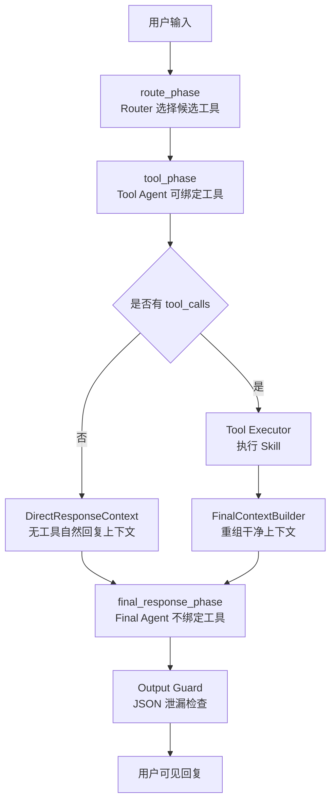

# 15 — Agent 运行协议与防泄漏设计

> 状态：草稿 | 维护：BlockShip | 最近校准：2026-07-30
> 关联：[01_Agent平台架构](./01_Agent平台架构.md)、[05_Prompt工程](./05_Prompt工程.md)、[16_Agent日志与诊断设计](./16_Agent日志与诊断设计.md)、[03_接口协议/02_Agent内部接口](../03_接口协议/02_Agent内部接口.md)

---

## 1. 设计目标

Agent Runtime 必须把“工具选择、工具执行、最终回复”拆成清晰阶段，避免代码迭代后把 ReAct 历史、工具协议和用户可见回复混在一起。

本文定义三个硬协议：

1. Tool Agent 只负责判断和发起工具调用。
2. Tool Executor 只负责执行工具并返回结构化结果。
3. Final Agent 只负责基于干净上下文生成自然语言回复。

非目标：

- 不新增第二套 Agent 框架。
- 不让规则层接管所有工具选择。
- 不通过 prompt 伪造工具结果。
- 不把原始 function call JSON 暴露给最终用户。

---

## 2. 分阶段运行模型



| 阶段 | 输入 | 输出 | 工具绑定 | 允许看到的消息 |
| --- | --- | --- | --- | --- |
| `route_phase` | 用户输入、相关 TaskState、轻量上下文 | `RouterDecision` | 不调用工具 | 用户输入、上下文摘要、Skill schema 摘要 |
| `tool_phase` | 用户输入、system prompt、候选 tools | `AIMessage(tool_calls)` 或直接文本 | `tools=selected_tools`，`tool_choice=auto|required` | 当前轮用户输入、必要上下文 |
| `tool_execution_phase` | `tool_calls`、权限、farm/user 上下文 | `ToolResultEnvelope` | 不调用 LLM | 工具参数和执行上下文 |
| `final_response_phase` | `FinalResponseRequest` | 自然语言 `AIMessage(content)` | `tools=[]`，`tool_choice=none` | 用户问题、工具结果摘要、允许引用的上下文 |
| `output_guard_phase` | 最终文本 | 通过、重试或 fail-closed 文案 | 不调用工具 | 最终文本和泄漏检测结果 |

---

## 3. Tool Agent 与 Final Agent 边界

### 3.1 Tool Agent 职责

Tool Agent 可以看到工具 schema，可以返回原生 `tool_calls`，也可以在兼容模型中输出可解析的工具 JSON。

Tool Agent 必须遵守：

- 只在 `selected_tools` 非空时绑定工具。
- 写操作必须进入 pending action 或 pending plan。
- 只读工具调用必须能在 trace 中解释选择原因。
- 如果应调用工具但未调用，可以在本阶段使用 `tool_choice=required` 做一次修正。

### 3.2 Final Agent 职责

Final Agent 是用户可见回复生成器，不是 ReAct 节点。

Final Agent 必须遵守：

- `tools=[]`。
- `tool_choice="none"`。
- 不传原始 `AIMessage(tool_calls)`。
- 不传原始 function call 参数 JSON，除非参数本身就是用户可见业务数据且已脱敏。
- 不输出 `tool_calls`、`function_call`、`arguments`、`name` 形式的工具协议。
- 不声称执行未发生的工具。
- 工具结果不足时说明缺失，不编造业务事实。

### 3.3 禁止共享的历史消息

Final Agent 禁止直接消费以下消息链：

```text
HumanMessage
AIMessage(tool_calls=[...])
ToolMessage(...)
```

原因：

- 多数兼容模型会把 `AIMessage(tool_calls)` 视为继续调用工具的格式示例。
- `ToolMessage` 往往包含内部字段、参数、错误栈或结构化 JSON。
- no-tools 场景下即使未绑定工具，模型也可能复刻工具 JSON。

---

## 4. FinalContextBuilder 设计

FinalContextBuilder 负责把 ReAct 内部历史投影为最终回复上下文。

```python
@dataclass(frozen=True)
class FinalResponseRequest:
    user_query: str
    tool_results: list[ToolResultSummary]
    context_blocks: list[FinalContextBlock]
    constraints: FinalResponseConstraints
    trace_meta: FinalTraceMeta
```

最终发送给模型的消息形态固定为：

```text
system:
当前处于最终回复阶段。
禁止调用工具，禁止输出 JSON，禁止输出 tool_calls/function_call 格式。
只返回给用户看的自然语言。

user:
用户问题：
<原始用户问题>

已执行工具结果：
1. <工具名>：<脱敏摘要>

可引用上下文：
- <上下文摘要>

回复要求：
- 基于工具结果回答。
- 数据不足时说明缺失。
```

### 4.1 ToolResultSummary

```python
@dataclass(frozen=True)
class ToolResultSummary:
    tool_name: str
    operation: str | None
    status: str
    permission_level: str
    summary: str
    facts: dict[str, object]
    error_code: str | None = None
```

要求：

- `summary` 是给模型看的摘要，不是原始工具返回。
- `facts` 只放可引用事实，例如数量、日期、名称、状态。
- 错误结果必须保留 `error_code` 和用户可理解原因。
- 敏感字段、连接串、密钥、内部路径、完整 SQL、完整栈不进入 summary。

---

## 5. Function Call 防泄漏协议

### 5.1 入口防线

Final 阶段调用 LLM 前必须校验：

| 检查 | 规则 |
| --- | --- |
| 工具列表 | `selected_tools == []` |
| 绑定参数 | `tools=[]` |
| 工具选择 | `tool_choice == "none"` |
| 消息类型 | 不含 `AIMessage.tool_calls` |
| 工具消息 | 不含原始 `ToolMessage` |
| system prompt | 含 final 阶段禁止规则 |

任一失败，必须阻断并写 trace：`final_context_contract_violation`。

### 5.2 输出检测

Final Agent 返回后，Output Guard 检查：

- 原生 `response.tool_calls` 非空。
- 文本含 `"tool_calls"`、`"function_call"`、`"arguments"`。
- 文本整体是 JSON 对象或 JSON 数组。
- 文本夹带 JSON 对象或 JSON 数组片段，例如 `结果如下：{"answer":"20"}`。
- 文本含疑似工具调用对象：`{"name": "...", "parameters": ...}`。
- 文本声称仍需或无需调用工具，例如“需要先调用工具”“无需再调用工具”；final 阶段不得暴露工具协议决策。
- 文本含兼容模型常见工具协议片段：`<tool_call>`、`</tool_call>`。

### 5.3 处理策略

```text
首次泄漏
  -> 使用同一 FinalResponseRequest 重试一次
  -> system 增加“上一版输出了工具协议，本轮必须只输出自然语言”

二次泄漏
  -> 若可安全抽取自然语言，保留自然语言
  -> 若不能安全抽取，返回 fail-closed 文案
  -> 写 trace 和 data flywheel issue
```

有工具结果时，fail-closed 文案不能写成“需要先调用工具”。应写成：

```text
我已经拿到工具结果，但刚才组织回复时格式异常。请你再问一次，我会基于已查询到的结果重新整理。
```

无工具结果时，可以写成：

```text
我刚才组织回复时格式异常，没有可靠结果可展示。请你换个说法再问一次。
```

---

## 6. Prompt 规则

Final system prompt 固定包含：

```text
当前处于最终回复阶段。

禁止：
- 调用工具
- 输出 JSON
- 输出 tool_calls/function_call 格式
- 输出工具参数或内部协议

只返回给用户看的自然语言。
```

工具结果回复场景增加：

```text
当前轮已有工具结果。回答必须基于“已执行工具结果”。
不要说“不需要调用工具”。
不要说“需要先调用工具”，除非本轮确实没有工具结果。
```

---

## 7. Trace 必备节点

| 节点 | 必备字段 |
| --- | --- |
| `tool_selection.tool_call_forced` | `selected_tools`、`tool_choice`、`reason` |
| `llm_call.*` | `selected_tools`、`tool_choice`、`message_count`、`finish_reason` |
| `final_context.build` | `source_message_count`、`final_message_count`、`tool_result_count`、`dropped_tool_call_history=true` |
| `output_guard.final_json_leak_check` | `passed`、`leak_type`、`action` |
| `agent_response.final_reply` | `reason`、`reply_preview`、`data_source` |

重点：trace 中展示的 `tool_choice` 必须等于真实 LLM invocation 参数，不允许用 `selected_tools=[]` 推导展示为 `none`。

---

## 8. 回归测试要求

涉及 final 阶段、工具绑定、消息压缩、输出过滤的改动，必须覆盖：

1. 工具执行后 final LLM 调用参数为 `tools=[]`、`tool_choice="none"`。
2. final 输入不包含原始 `AIMessage(tool_calls)`。
3. final 输入包含工具结果摘要。
4. 模型输出工具 JSON 时会重试或 fail-closed。
5. 有工具结果时不会返回“需要先调用工具”。
6. trace 中真实记录 `tool_choice=none`。
7. JSON 数组、夹带 JSON 片段和“不需要/无需/不用调用工具”变体会被 Output Guard 拦截。

推荐用 `eda446a0` 这类 case 做回归种子：用户要求规划茬口，先计算地块数，最终回复应基于 `30 / 1.5 = 20` 继续给出规划或说明还缺少哪些真实数据。

---

## 9. 落地顺序

1. 修正 final 阶段真实 LLM invocation 参数：`tool_choice="none"`。
2. 新增 `FinalContextBuilder`，隔离原始 ReAct 历史。
3. 补 final system prompt。
4. 调整 Output Guard 和 fail-closed 文案。
5. 补 trace 节点和回归测试。
6. 把坏例进入 DataFlywheel issue 仓，作为后续评测集。
