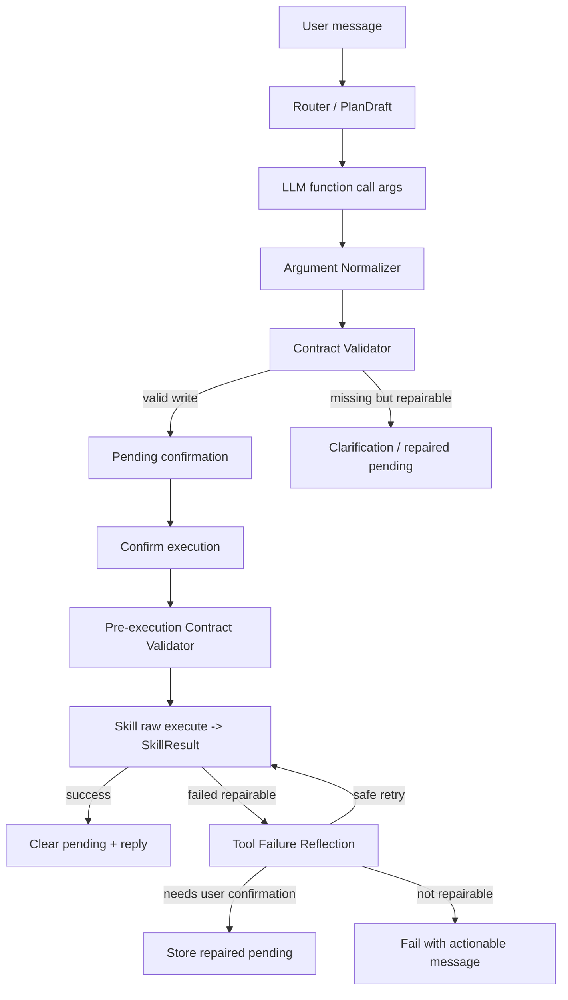

# Agent Function Call Contract Repair Implementation Plan

> **For agentic workers:** REQUIRED SUB-SKILL: Use superpowers:subagent-driven-development (recommended) or superpowers:executing-plans to implement this plan task-by-task. Steps use checkbox (`- [ ]`) syntax for tracking.

**Goal:** 把 Agent 的 function call 参数生成从“静态字段字典 + 执行时业务报错”升级为“operation 级契约 + 动态候选 + 执行前校验 + 工具失败反思修复”的闭环。

**Architecture:** 保留现有 capability skill 目录和 `parameters_schema()` 入口，新增独立的 `SkillFunctionContract` 作为 operation 级事实源；运行时在 LLM tool binding、pending action 创建、pending 确认执行、工具失败结果四个节点复用同一套契约。第一版不重写 Router，不大规模迁移 skill 目录，而是先补齐 schema/validator/retry 这条最短闭环。

**Tech Stack:** FastAPI 后端、LangChain `StructuredTool`、Pydantic v2、skillify `SkillResult`、Mongo/MySQL trace、pytest、ruff。

## 实施校准

2026-07-24 实施时做了两处保守收敛：

1. `manage_cost.create_record` 最终只强制 `amount/category`。`record_type` 保留为默认可推断字段，默认 `cost`，避免阻断旧别名 `create_cost_record({"amount": 200, "category": "化肥"})`。
2. 工具失败反思不做静默二次执行。第一版只允许生成一次 repaired pending，让用户重新确认后再执行，避免写操作副作用不确定时自动重试。

---

## 背景

近期 trace 暴露了两类连续问题：

1. `今天卖西瓜收入10w` 已经被 Router 识别到 `manage_cost.create_record`，但 pending action 参数在不同层之间被覆盖，导致确认后缺金额或缺分类。
2. `刚才买了点大棚膜5000元和章四赊账的` 在确认执行时已经补齐 `amount=5000`、`record_type=cost`、`record_subtype=赊账`、`note`，但缺 `category`，工具返回 `记账失败：分类不能为空。` 后系统直接回复失败，没有进入修参或重新确认。

这说明问题不是单个 keyword 或 classifier hint，而是 function call 参数契约不完整：

```text
Skill parameters_schema()
  -> 只声明字段形状
  -> 缺少 operation 条件必填
  -> 缺少动态候选空间
  -> 缺少可修复错误结构
  -> pending / execution / reflection 各自局部处理
```

## 当前实现问题

### 1. schema 是字段字典，不是 operation contract

`manage_cost` 当前 schema 在 `backend/app/skills/manage-cost/scripts/main.py`：

```python
"required": ["operation"]
```

但 `create_record` 实际业务需要：

```text
amount
category
record_type
record_date
```

`record_date` 可默认今天，`record_type` 可从买/卖/收入/支出推断，`category` 必须来自分类表或由用户确认。当前 function call schema 没有表达这些条件。

类似风险也存在：

| Skill | 当前 schema 问题 | 实际风险 |
| --- | --- | --- |
| `manage_cost` | `create_record` 只要求 `operation` | 缺 `amount/category/record_type` 执行才失败 |
| `manage_work_orders` | 创建作业单只要求 `operation` | 缺作业类型、范围、工资策略后进入业务失败或错误 pending |
| `manage_labor_payment` | `required=[]` | 查询/结算/工资保存的参数条件混在一起 |
| `manage_planting_units` | `required=[]` | 创建需要 `cycle_id/name`，删除需要 `unit_id` |
| `manage_workers` | `required=[]` | 创建、更新、停用需要不同目标字段 |
| `manage_cost_categories` | `required=[]` | 创建需要 `name/type`，删除需要 `category_id` |
| `manage_farm_logs` | 只要求 `operation` | 新增需要 `operation_type`，更新/删除需要 `log_id` |

### 2. 动态候选只覆盖 category

`backend/app/skills/__init__.py` 目前会从数据库加载账务分类，并把 `category` 注入为 enum。

这能限制 `category` 字段的候选值，但没有覆盖：

- 当前工人候选。
- 当前茬口候选。
- 当前地块/棚候选。
- 当前作业单候选。
- 当前作物模板候选。
- `operation` 对应的 required/missing fields。

### 3. pending 与 execution 没有共享校验结果

现有 pending 参数补齐分散在：

- `backend/app/agent/runtime/tool_pending_args.py`
- `backend/app/agent/runtime/tool_pending.py`
- `backend/app/agent/executor/pending_actions.py`
- 各 skill 的业务 handler

这导致同一个参数在 Router、tool_call、plan_draft、pending、confirm execution 之间可能出现不一致。

### 4. 工具失败结果不可结构化恢复

当前 `StructuredTool` wrapper 返回 `SkillResult.reply` 字符串：

```python
result = await skill.execute(kwargs, context)
return result.reply
```

pending 确认执行拿到的是字符串，无法稳定判断：

- 是失败还是成功。
- 是否产生副作用。
- 缺哪个字段。
- 是否可重试。
- 是否需要重新确认。

## 目标架构



### 核心原则

1. `parameters_schema()` 仍保留，但不再承担全部契约。
2. `SkillFunctionContract` 是 operation 级契约事实源。
3. 模型负责语义抽取，系统负责必填字段、候选值、风险、确认和重试上限。
4. 写操作失败后不盲目重试，只处理明确可修复且无副作用的失败。
5. 关键推断字段如果影响业务记录，优先生成 repaired pending 让用户确认。

---

## 文件结构

### 新增文件

| 文件 | 责任 |
| --- | --- |
| `backend/app/skills/contracts.py` | 定义 `SkillFunctionContract`、operation required fields、候选源、校验函数 |
| `backend/app/skills/candidates.py` | 从 DB/context 读取动态候选：分类、工人、茬口、地块、模板、作业单 |
| `backend/app/agent/runtime/tool_arg_validation.py` | Runtime 层统一调用 contract validator，把 missing/invalid 转成 pending clarification |
| `backend/app/agent/executor/skill_raw_executor.py` | pending 写执行绕过 LangChain 字符串 wrapper，直接返回 `SkillResult` 和 trace metadata |
| `backend/app/agent/executor/tool_failure_reflection.py` | 解析工具失败结果，决定 safe retry、repaired pending 或 actionable failure |
| `backend/tests/skills/test_function_contracts.py` | contract 覆盖与参数校验单测 |
| `backend/tests/agent/test_tool_failure_reflection.py` | 工具失败反思修复单测 |

### 修改文件

| 文件 | 修改点 |
| --- | --- |
| `backend/app/skills/__init__.py` | schema 生成时注入 dynamic enum 和 operation contract description |
| `backend/app/agent/runtime/tool_pending.py` | 创建 pending 前执行 contract validation，缺字段时不执行、不清 pending |
| `backend/app/agent/executor/pending_actions.py` | pending 确认执行改用 raw executor，失败后进入 failure reflection |
| `backend/app/infra/pending_actions.py` | PendingAction 增加 `repair_attempts` 或通过 metadata 记录修复次数 |
| `backend/app/agent/reflector/models.py` | 如需新增 trigger，加入 `TOOL_FAILURE_REPAIR` |
| `backend/app/agent/reflector/service.py` | 记录 failure reflection trace |
| `backend/app/skills/manage-cost/scripts/records.py` | 返回结构化失败信息，至少保留 `SkillResult.status`，reply 不再是唯一事实 |
| `backend/app/skills/manage-cost/scripts/main.py` | description 增加参数抽取约束，schema 可保留平铺字段 |
| `backend/tests/agent/test_tool_executor_metadata.py` | 覆盖 pending 前 contract validation |
| `backend/tests/agent/test_pending_action_executor.py` | 覆盖确认执行失败后的 repaired pending |

---

## Task 1: 建立 operation 级 Function Contract

**Files:**
- Create: `backend/app/skills/contracts.py`
- Test: `backend/tests/skills/test_function_contracts.py`

- [ ] **Step 1: 写失败测试，证明 `manage_cost.create_record` 缺分类会被 contract 拦截**

Create `backend/tests/skills/test_function_contracts.py`:

```python
from app.skills.contracts import validate_skill_args


def test_manage_cost_create_record_requires_category():
    result = validate_skill_args(
        "manage_cost",
        {
            "operation": "create_record",
            "amount": 5000,
            "record_type": "cost",
        },
        candidates={"category": ["化肥", "种子", "农药", "人工", "其他"]},
    )

    assert result.valid is False
    assert result.missing_fields == ["category"]
    assert result.retryable is True
    assert result.message == "create_record 缺少必填字段：category"
```

- [ ] **Step 2: 运行测试确认失败**

Run:

```bash
PYTHONDONTWRITEBYTECODE=1 PYTHONPATH=backend backend/.venv/bin/python -m pytest backend/tests/skills/test_function_contracts.py::test_manage_cost_create_record_requires_category -q
```

Expected:

```text
ModuleNotFoundError: No module named 'app.skills.contracts'
```

- [ ] **Step 3: 创建最小 contract 实现**

Create `backend/app/skills/contracts.py`:

```python
"""Operation 级 function call 参数契约。"""

from dataclasses import dataclass, field
from typing import Any


@dataclass(frozen=True)
class OperationContract:
    required_fields: tuple[str, ...] = ()
    candidate_fields: tuple[str, ...] = ()
    default_fields: dict[str, Any] = field(default_factory=dict)
    repairable_missing_fields: tuple[str, ...] = ()


@dataclass(frozen=True)
class SkillFunctionContract:
    operations: dict[str, OperationContract]


@dataclass(frozen=True)
class ContractValidationResult:
    valid: bool
    missing_fields: list[str] = field(default_factory=list)
    invalid_fields: dict[str, str] = field(default_factory=dict)
    retryable: bool = False
    message: str = ""


_CONTRACTS: dict[str, SkillFunctionContract] = {
    "manage_cost": SkillFunctionContract(
        operations={
            "create_record": OperationContract(
                required_fields=("amount", "category", "record_type"),
                candidate_fields=("category",),
                default_fields={"record_date": "today"},
                repairable_missing_fields=("category", "record_type"),
            ),
            "delete_record": OperationContract(
                required_fields=("record_id",),
                repairable_missing_fields=(),
            ),
            "settle_debt": OperationContract(
                required_fields=("counterparty",),
                repairable_missing_fields=("counterparty",),
            ),
        }
    ),
}


def get_skill_contract(skill_name: str) -> SkillFunctionContract | None:
    return _CONTRACTS.get(skill_name)


def get_operation_contract(
    skill_name: str,
    operation: str | None,
) -> OperationContract | None:
    if not operation:
        return None
    contract = get_skill_contract(skill_name)
    if not contract:
        return None
    return contract.operations.get(operation)


def validate_skill_args(
    skill_name: str,
    params: dict[str, Any],
    *,
    candidates: dict[str, list[str]] | None = None,
) -> ContractValidationResult:
    operation = str(params.get("operation") or "").strip()
    operation_contract = get_operation_contract(skill_name, operation)
    if operation_contract is None:
        return ContractValidationResult(valid=True)

    missing = [
        field
        for field in operation_contract.required_fields
        if params.get(field) in (None, "")
    ]
    invalid = _invalid_candidate_fields(
        params=params,
        candidate_fields=operation_contract.candidate_fields,
        candidates=candidates or {},
    )
    retryable = any(
        field in operation_contract.repairable_missing_fields for field in missing
    )
    if missing or invalid:
        parts = []
        if missing:
            parts.append(f"{operation} 缺少必填字段：{', '.join(missing)}")
        for field, reason in invalid.items():
            parts.append(f"{field} 无效：{reason}")
        return ContractValidationResult(
            valid=False,
            missing_fields=missing,
            invalid_fields=invalid,
            retryable=retryable,
            message="；".join(parts),
        )
    return ContractValidationResult(valid=True)


def _invalid_candidate_fields(
    *,
    params: dict[str, Any],
    candidate_fields: tuple[str, ...],
    candidates: dict[str, list[str]],
) -> dict[str, str]:
    invalid = {}
    for field in candidate_fields:
        value = params.get(field)
        allowed = candidates.get(field) or []
        if value in (None, "") or not allowed:
            continue
        if str(value) not in {str(item) for item in allowed}:
            invalid[field] = f"{value} 不在候选值中"
    return invalid
```

- [ ] **Step 4: 运行测试确认通过**

Run:

```bash
PYTHONDONTWRITEBYTECODE=1 PYTHONPATH=backend backend/.venv/bin/python -m pytest backend/tests/skills/test_function_contracts.py -q
```

Expected:

```text
1 passed
```

- [ ] **Step 5: 提交**

```bash
git add backend/app/skills/contracts.py backend/tests/skills/test_function_contracts.py
git commit -m "feat: 增加 skill function call 参数契约"
```

---

## Task 2: 覆盖主要写操作 Skill 的 contract

**Files:**
- Modify: `backend/app/skills/contracts.py`
- Test: `backend/tests/skills/test_function_contracts.py`

- [ ] **Step 1: 写参数化失败测试，覆盖主要写操作缺字段**

Append to `backend/tests/skills/test_function_contracts.py`:

```python
import pytest


@pytest.mark.parametrize(
    ("skill_name", "params", "missing_fields"),
    [
        (
            "manage_cost",
            {"operation": "create_record", "amount": 5000, "record_type": "cost"},
            ["category"],
        ),
        ("manage_cost", {"operation": "delete_record"}, ["record_id"]),
        ("manage_farm_logs", {"operation": "create_log"}, ["operation_type"]),
        ("manage_farm_logs", {"operation": "manage_log", "action": "update"}, ["log_id"]),
        ("manage_work_orders", {"operation": "create_work_order"}, ["operation_type"]),
        ("manage_work_orders", {"operation": "update_work_order"}, ["work_order_id"]),
        ("manage_workers", {"operation": "manage_worker", "action": "update"}, ["worker_id"]),
        ("manage_planting_units", {"operation": "manage_units", "action": "create"}, ["cycle_id", "name"]),
        ("manage_planting_units", {"operation": "manage_units", "action": "delete"}, ["unit_id"]),
        ("manage_cost_categories", {"operation": "create_category"}, ["name", "type"]),
        ("manage_cost_categories", {"operation": "delete_category"}, ["category_id"]),
        ("manage_labor_payment", {"operation": "manage_wage", "action": "save"}, ["worker_name", "work_date"]),
    ],
)
def test_write_operation_contracts_require_business_fields(
    skill_name,
    params,
    missing_fields,
):
    result = validate_skill_args(skill_name, params)

    assert result.valid is False
    assert result.missing_fields == missing_fields
```

- [ ] **Step 2: 运行测试确认失败**

Run:

```bash
PYTHONDONTWRITEBYTECODE=1 PYTHONPATH=backend backend/.venv/bin/python -m pytest backend/tests/skills/test_function_contracts.py::test_write_operation_contracts_require_business_fields -q
```

Expected:

```text
FAILED ... missing_fields 不匹配
```

- [ ] **Step 3: 扩展 `_CONTRACTS`**

Modify `_CONTRACTS` in `backend/app/skills/contracts.py`:

```python
_CONTRACTS: dict[str, SkillFunctionContract] = {
    "manage_cost": SkillFunctionContract(
        operations={
            "create_record": OperationContract(
                required_fields=("amount", "category", "record_type"),
                candidate_fields=("category",),
                default_fields={"record_date": "today"},
                repairable_missing_fields=("category", "record_type"),
            ),
            "delete_record": OperationContract(required_fields=("record_id",)),
            "settle_debt": OperationContract(
                required_fields=("counterparty",),
                repairable_missing_fields=("counterparty",),
            ),
        }
    ),
    "manage_farm_logs": SkillFunctionContract(
        operations={
            "create_log": OperationContract(
                required_fields=("operation_type",),
                default_fields={"operation_date": "today"},
                repairable_missing_fields=("operation_type",),
            ),
            "manage_log": OperationContract(required_fields=("log_id",)),
        }
    ),
    "manage_work_orders": SkillFunctionContract(
        operations={
            "create_work_order": OperationContract(
                required_fields=("operation_type",),
                candidate_fields=("cycle_id", "unit_names", "workers"),
                default_fields={"operation_date": "today"},
                repairable_missing_fields=("operation_type", "cycle_id", "unit_names"),
            ),
            "update_work_order": OperationContract(required_fields=("work_order_id",)),
        }
    ),
    "manage_workers": SkillFunctionContract(
        operations={
            "manage_worker": OperationContract(
                required_fields=(),
                repairable_missing_fields=("worker_id", "name"),
            ),
        }
    ),
    "manage_planting_units": SkillFunctionContract(
        operations={
            "manage_units": OperationContract(
                required_fields=(),
                candidate_fields=("cycle_id",),
                repairable_missing_fields=("cycle_id", "name", "unit_id"),
            ),
        }
    ),
    "manage_cost_categories": SkillFunctionContract(
        operations={
            "create_category": OperationContract(required_fields=("name", "type")),
            "delete_category": OperationContract(required_fields=("category_id",)),
        }
    ),
    "manage_labor_payment": SkillFunctionContract(
        operations={
            "settle_payment": OperationContract(
                required_fields=("scope",),
                repairable_missing_fields=("scope", "worker", "worker_name"),
            ),
            "manage_wage": OperationContract(
                required_fields=("worker_name", "work_date"),
                repairable_missing_fields=("worker_name", "work_date"),
            ),
        }
    ),
}
```

- [ ] **Step 4: 在 validator 中处理 action 条件必填**

Add below `_invalid_candidate_fields` in `backend/app/skills/contracts.py`:

```python
def _action_required_fields(skill_name: str, params: dict[str, Any]) -> tuple[str, ...]:
    operation = str(params.get("operation") or "").strip()
    action = str(params.get("action") or "").strip()
    if skill_name == "manage_workers" and operation == "manage_worker":
        if action in {"update", "deactivate", "restore"}:
            return ("worker_id",)
        if action == "create":
            return ("name",)
    if skill_name == "manage_planting_units" and operation == "manage_units":
        if action == "create":
            return ("cycle_id", "name")
        if action in {"update", "delete"}:
            return ("unit_id",)
    return ()
```

Modify `validate_skill_args()` missing field calculation:

```python
required_fields = (
    operation_contract.required_fields + _action_required_fields(skill_name, params)
)
missing = [
    field
    for field in required_fields
    if params.get(field) in (None, "")
]
```

- [ ] **Step 5: 运行 contract 测试**

Run:

```bash
PYTHONDONTWRITEBYTECODE=1 PYTHONPATH=backend backend/.venv/bin/python -m pytest backend/tests/skills/test_function_contracts.py -q
```

Expected:

```text
all tests passed
```

- [ ] **Step 6: 提交**

```bash
git add backend/app/skills/contracts.py backend/tests/skills/test_function_contracts.py
git commit -m "feat: 补齐写操作 function contract"
```

---

## Task 3: 增加动态候选源

**Files:**
- Create: `backend/app/skills/candidates.py`
- Modify: `backend/app/skills/__init__.py`
- Test: `backend/tests/skills/test_function_contracts.py`

- [ ] **Step 1: 写动态候选测试**

Append to `backend/tests/skills/test_function_contracts.py`:

```python
def test_contract_rejects_category_not_in_candidates():
    result = validate_skill_args(
        "manage_cost",
        {
            "operation": "create_record",
            "amount": 5000,
            "record_type": "cost",
            "category": "大棚膜",
        },
        candidates={"category": ["化肥", "种子", "农药", "人工", "其他"]},
    )

    assert result.valid is False
    assert result.invalid_fields == {"category": "大棚膜 不在候选值中"}
```

- [ ] **Step 2: 创建候选源模块**

Create `backend/app/skills/candidates.py`:

```python
"""Skill function call 动态候选值。"""

import logging
from dataclasses import dataclass, field

from app.shared.database import SessionLocal
from app.domains.finance import cost_category_service
from app.domains.planting import service as planting_service

logger = logging.getLogger(__name__)


@dataclass(frozen=True)
class SkillCandidateSet:
    values: dict[str, list[str]] = field(default_factory=dict)
    labels: dict[str, dict[str, str]] = field(default_factory=dict)


_DEFAULT_CATEGORY_ENUM = ["化肥", "种子", "农药", "人工", "其他"]


def load_skill_candidates(farm_id: int) -> SkillCandidateSet:
    db = SessionLocal()
    try:
        categories = [c.name for c in cost_category_service.get_categories(db, farm_id)]
        cycles = [f"{cycle.id}:{cycle.name}" for cycle in planting_service.get_crop_cycles(db, farm_id=farm_id, limit=100)]
        workers = [f"{worker.id}:{worker.name}" for worker in planting_service.list_workers(db, farm_id, active_only=True)]
        units = [
            f"{unit.id}:{unit.name}"
            for unit in planting_service.list_units(db, farm_id)
        ]
        return SkillCandidateSet(
            values={
                "category": categories or list(_DEFAULT_CATEGORY_ENUM),
                "cycle": cycles,
                "worker": workers,
                "planting_unit": units,
            }
        )
    except Exception as exc:
        logger.warning("加载 Skill 候选值失败，使用降级候选 | farm_id=%s error=%s", farm_id, exc)
        return SkillCandidateSet(values={"category": list(_DEFAULT_CATEGORY_ENUM)})
    finally:
        db.close()
```

- [ ] **Step 3: 在 `skills_to_langchain_tools()` 使用候选源**

Modify `backend/app/skills/__init__.py`:

```python
from app.skills.candidates import load_skill_candidates
```

Replace:

```python
category_enum = get_category_enum(farm_id)
enums_map = {"category": category_enum} if category_enum else {}
```

with:

```python
candidate_set = load_skill_candidates(farm_id)
category_enum = candidate_set.values.get("category") or get_category_enum(farm_id)
enums_map = {"category": category_enum} if category_enum else {}
```

- [ ] **Step 4: 运行测试**

Run:

```bash
PYTHONDONTWRITEBYTECODE=1 PYTHONPATH=backend backend/.venv/bin/python -m pytest backend/tests/skills/test_function_contracts.py -q
```

Expected:

```text
all tests passed
```

- [ ] **Step 5: 提交**

```bash
git add backend/app/skills/candidates.py backend/app/skills/__init__.py backend/tests/skills/test_function_contracts.py
git commit -m "feat: 增加 skill function call 动态候选源"
```

---

## Task 4: pending 创建前执行 contract validation

**Files:**
- Create: `backend/app/agent/runtime/tool_arg_validation.py`
- Modify: `backend/app/agent/runtime/tool_pending.py`
- Test: `backend/tests/agent/test_tool_executor_metadata.py`

- [ ] **Step 1: 写失败测试，缺分类时不创建可执行 pending**

Append to `backend/tests/agent/test_tool_executor_metadata.py`:

```python
@pytest.mark.no_db
@pytest.mark.asyncio
async def test_manage_cost_create_record_missing_category_asks_for_repair_before_pending():
    session_id = "sess-missing-category-before-pending"
    _clear_pending_memory(session_id)
    tool = SimpleNamespace(
        name="manage_cost",
        args_schema=None,
        ainvoke=AsyncMock(return_value="不应直接执行"),
        skill_metadata=SkillMetadata(
            permission_level=SkillPermissionLevel.READ,
            capability="manage_cost",
        ),
    )
    collector = MagicMock()
    state = {
        "messages": [
            HumanMessage(content="刚才买了点大棚膜5000元和章四赊账的"),
            AIMessage(
                content="",
                tool_calls=[
                    {
                        "id": "tc1",
                        "name": "manage_cost",
                        "args": {
                            "operation": "create_record",
                            "amount": 5000,
                            "record_type": "cost",
                            "record_subtype": "赊账",
                            "note": "刚才买了点大棚膜5000元和章四赊账的",
                        },
                    }
                ],
            ),
        ],
        "farm_id": 1,
        "session_id": session_id,
    }

    with (
        patch("app.agent.runtime.tool_executor.get_langchain_tools", return_value=[tool]),
        patch("app.agent.runtime.tool_executor.get_collector", return_value=collector),
    ):
        result = await _parallel_tool_node(state)

    pending = get_pending(1, session_id=session_id)
    assert pending is None
    content = result["messages"][0].content
    assert "缺少分类" in content
    assert "大棚膜" in content
    tool.ainvoke.assert_not_awaited()
```

- [ ] **Step 2: 运行测试确认失败**

Run:

```bash
PYTHONDONTWRITEBYTECODE=1 PYTHONPATH=backend backend/.venv/bin/python -m pytest backend/tests/agent/test_tool_executor_metadata.py::test_manage_cost_create_record_missing_category_asks_for_repair_before_pending -q
```

Expected:

```text
FAILED because pending is not None or reply does not mention missing category
```

- [ ] **Step 3: 创建 runtime validation helper**

Create `backend/app/agent/runtime/tool_arg_validation.py`:

```python
"""Runtime function call 参数校验。"""

from dataclasses import dataclass

from langchain_core.messages import ToolMessage

from app.skills.contracts import validate_skill_args
from app.skills.candidates import load_skill_candidates


@dataclass(frozen=True)
class ToolArgValidationDecision:
    valid: bool
    message: ToolMessage | None = None


def validate_before_pending(
    *,
    skill_name: str,
    params: dict,
    farm_id: int,
    original_input: str,
    tool_call_id: str,
) -> ToolArgValidationDecision:
    candidates = load_skill_candidates(farm_id).values
    result = validate_skill_args(skill_name, params, candidates=candidates)
    if result.valid:
        return ToolArgValidationDecision(valid=True)
    content = _validation_message(
        original_input=original_input,
        missing_fields=result.missing_fields,
        invalid_fields=result.invalid_fields,
    )
    return ToolArgValidationDecision(
        valid=False,
        message=ToolMessage(content=content, tool_call_id=tool_call_id),
    )


def _validation_message(
    *,
    original_input: str,
    missing_fields: list[str],
    invalid_fields: dict[str, str],
) -> str:
    if "category" in missing_fields:
        return (
            f"这条记录还缺少分类。原话是「{original_input}」。"
            "请补充分类，或说明按哪个现有分类记账。"
        )
    if invalid_fields:
        details = "；".join(f"{field}: {reason}" for field, reason in invalid_fields.items())
        return f"参数不符合当前可选值：{details}。请确认后再执行。"
    if missing_fields:
        return f"还缺少必填参数：{', '.join(missing_fields)}。请补充后再执行。"
    return "参数不完整，请补充后再执行。"
```

- [ ] **Step 4: 接入 `_pending_action_precheck()`**

Modify `backend/app/agent/runtime/tool_pending.py` import:

```python
from app.agent.runtime.tool_arg_validation import validate_before_pending
```

At the start of `_pending_action_precheck()` after `execution_args` is available:

```python
validation = validate_before_pending(
    skill_name=name,
    params=execution_args,
    farm_id=farm_id,
    original_input=original_input,
    tool_call_id=tool_call_id,
)
if not validation.valid:
    return validation.message, None, None
```

- [ ] **Step 5: 运行目标测试**

Run:

```bash
PYTHONDONTWRITEBYTECODE=1 PYTHONPATH=backend backend/.venv/bin/python -m pytest backend/tests/agent/test_tool_executor_metadata.py::test_manage_cost_create_record_missing_category_asks_for_repair_before_pending -q
```

Expected:

```text
1 passed
```

- [ ] **Step 6: 提交**

```bash
git add backend/app/agent/runtime/tool_arg_validation.py backend/app/agent/runtime/tool_pending.py backend/tests/agent/test_tool_executor_metadata.py
git commit -m "fix: pending 前校验 function call 必填参数"
```

---

## Task 5: pending 确认执行保留 SkillResult

**Files:**
- Create: `backend/app/agent/executor/skill_raw_executor.py`
- Modify: `backend/app/agent/executor/pending_actions.py`
- Test: `backend/tests/agent/test_pending_action_executor.py`

- [ ] **Step 1: 写 raw executor 测试**

Append to `backend/tests/agent/test_pending_action_executor.py`:

```python
@pytest.mark.no_db
@pytest.mark.asyncio
async def test_confirm_pending_keeps_failed_skill_result_status():
    pending = PendingAction(
        action_id="act-raw-failed",
        skill_name="manage_cost",
        params={"operation": "create_record", "amount": 5000, "record_type": "cost"},
        original_input="刚才买了点大棚膜5000元和章四赊账的",
    )

    failed_result = SkillResult(status=ResultStatus.FAILED, reply="记账失败：分类不能为空。")

    with (
        patch(
            "app.agent.executor.pending_actions.execute_write_skill_raw",
            AsyncMock(return_value=failed_result),
        ),
        patch(
            "app.agent.executor.pending_actions.ReflectorService"
        ) as reflector_cls,
    ):
        reflector_cls.return_value.check_write_plan.return_value = ReflectionResult.passed(
            ReflectionTrigger.PRE_EXECUTION,
            reason="pass",
        )
        decision = await _confirm_pending(1, pending, session_id="sess-raw-failed")

    assert decision.handled is True
    assert "分类不能为空" in decision.reply
```

- [ ] **Step 2: 创建 raw executor**

Create `backend/app/agent/executor/skill_raw_executor.py`:

```python
"""直接执行 Skill 并保留 SkillResult。"""

import time

from skillify.models.schemas import ResultStatus, SkillResult

from app.skills import build_skill_context, get_skill_manager
from app.agent.executor.pending_aliases import pending_alias_metadata
from app.infra.trace_collector import get_collector


async def execute_write_skill_raw(
    *,
    farm_id: int,
    skill_name: str,
    params: dict,
    farm_uid: str | None = None,
) -> SkillResult:
    start = time.time()
    alias_metadata = pending_alias_metadata(skill_name, params)
    resolved_name = alias_metadata.get("resolved_capability") or skill_name
    execution_params = dict(params)
    if resolved_name != skill_name and alias_metadata.get("resolved_operation"):
        execution_params.setdefault("operation", alias_metadata["resolved_operation"])

    manager = get_skill_manager()
    skill = manager.get_skill(resolved_name) or manager.get_skill(skill_name)
    if skill is None:
        return SkillResult(status=ResultStatus.FAILED, reply=f"未知工具: {skill_name}")

    context = build_skill_context(farm_id=farm_id, farm_uid=farm_uid)
    result = await skill.execute(execution_params, context)
    get_collector().record(
        node_type="skill_call",
        node_name=skill_name,
        input_data=params,
        output_data={
            "status": str(result.status.value if hasattr(result.status, "value") else result.status),
            "reply_preview": str(result.reply or "")[:500],
            **alias_metadata,
        },
        start_time=start,
        end_time=time.time(),
    )
    return result
```

- [ ] **Step 3: 替换 pending action 执行函数**

Modify `backend/app/agent/executor/pending_actions.py`:

```python
from app.agent.executor.skill_raw_executor import execute_write_skill_raw
```

Inside `_confirm_pending()` replace:

```python
result = await _execute_write_skill(...)
```

with:

```python
skill_result = await execute_write_skill_raw(
    farm_id=farm_id,
    skill_name=pending.skill_name,
    params=pending.params,
    farm_uid=farm_uid,
)
result = str(skill_result.reply or "")
```

- [ ] **Step 4: 运行 pending executor 测试**

Run:

```bash
PYTHONDONTWRITEBYTECODE=1 PYTHONPATH=backend backend/.venv/bin/python -m pytest backend/tests/agent/test_pending_action_executor.py::test_confirm_pending_keeps_failed_skill_result_status -q
```

Expected:

```text
1 passed
```

- [ ] **Step 5: 提交**

```bash
git add backend/app/agent/executor/skill_raw_executor.py backend/app/agent/executor/pending_actions.py backend/tests/agent/test_pending_action_executor.py
git commit -m "refactor: pending 写执行保留 skill result"
```

---

## Task 6: 工具失败后进入 Reflection Repair

**Files:**
- Create: `backend/app/agent/executor/tool_failure_reflection.py`
- Modify: `backend/app/agent/executor/pending_actions.py`
- Test: `backend/tests/agent/test_tool_failure_reflection.py`

- [ ] **Step 1: 写失败反思单测**

Create `backend/tests/agent/test_tool_failure_reflection.py`:

```python
from skillify.models.schemas import ResultStatus, SkillResult

from app.agent.executor.tool_failure_reflection import reflect_tool_failure


def test_reflect_manage_cost_missing_category_creates_repaired_pending_decision():
    decision = reflect_tool_failure(
        skill_name="manage_cost",
        params={
            "operation": "create_record",
            "amount": 5000,
            "record_type": "cost",
            "record_subtype": "赊账",
            "note": "刚才买了点大棚膜5000元和章四赊账的",
        },
        original_input="刚才买了点大棚膜5000元和章四赊账的",
        result=SkillResult(status=ResultStatus.FAILED, reply="记账失败：分类不能为空。"),
        candidates={"category": ["化肥", "种子", "农药", "人工", "其他"]},
    )

    assert decision.action == "ask_repaired_confirmation"
    assert decision.repaired_params["category"] == "其他"
    assert "大棚膜" in decision.reason
```

- [ ] **Step 2: 创建 failure reflection 模块**

Create `backend/app/agent/executor/tool_failure_reflection.py`:

```python
"""工具失败后的参数修复与重试决策。"""

from dataclasses import dataclass, field

from skillify.models.schemas import ResultStatus, SkillResult


@dataclass(frozen=True)
class ToolFailureRepairDecision:
    action: str
    repaired_params: dict = field(default_factory=dict)
    reason: str = ""


def reflect_tool_failure(
    *,
    skill_name: str,
    params: dict,
    original_input: str,
    result: SkillResult,
    candidates: dict[str, list[str]],
) -> ToolFailureRepairDecision:
    reply = str(result.reply or "")
    if _is_success(result):
        return ToolFailureRepairDecision(action="none")
    if (
        skill_name == "manage_cost"
        and params.get("operation") == "create_record"
        and "分类不能为空" in reply
    ):
        category = _infer_cost_category_from_input(original_input, candidates)
        if category:
            repaired = dict(params)
            repaired["category"] = category
            return ToolFailureRepairDecision(
                action="ask_repaired_confirmation",
                repaired_params=repaired,
                reason=f"从原文「{original_input}」推断分类为「{category}」。",
            )
    return ToolFailureRepairDecision(action="fail", reason=reply)


def _is_success(result: SkillResult) -> bool:
    value = getattr(result.status, "value", result.status)
    return str(value).lower() == "success"


def _infer_cost_category_from_input(
    original_input: str,
    candidates: dict[str, list[str]],
) -> str | None:
    categories = candidates.get("category") or []
    if "大棚膜" in original_input:
        for preferred in ("农资", "材料", "设施", "其他"):
            if preferred in categories:
                return preferred
    return None
```

- [ ] **Step 3: 运行 failure reflection 单测**

Run:

```bash
PYTHONDONTWRITEBYTECODE=1 PYTHONPATH=backend backend/.venv/bin/python -m pytest backend/tests/agent/test_tool_failure_reflection.py -q
```

Expected:

```text
1 passed
```

- [ ] **Step 4: 在 `_confirm_pending()` 接入 repaired pending**

Modify `backend/app/agent/executor/pending_actions.py`:

```python
from app.agent.executor.tool_failure_reflection import reflect_tool_failure
from app.skills.candidates import load_skill_candidates
from skillify.models.schemas import ResultStatus
```

After `skill_result = await execute_write_skill_raw(...)`:

```python
if getattr(skill_result.status, "value", skill_result.status) != ResultStatus.SUCCESS.value:
    repair_decision = reflect_tool_failure(
        skill_name=pending.skill_name,
        params=pending.params,
        original_input=pending.original_input,
        result=skill_result,
        candidates=load_skill_candidates(farm_id).values,
    )
    if repair_decision.action == "ask_repaired_confirmation":
        remove_pending(farm_id, session_id=session_id)
        store_pending(
            farm_id,
            pending.skill_name,
            repair_decision.repaired_params,
            original_input=pending.original_input,
            session_id=session_id,
        )
        confirm = build_confirm_message(
            pending.skill_name,
            repair_decision.repaired_params,
            original_input=pending.original_input,
        )
        return PendingActionDecision.confirmed(
            f"刚才执行失败：{skill_result.reply}\n{repair_decision.reason}\n{confirm}",
            metadata=metadata,
        )
```

- [ ] **Step 5: 写集成测试，确认失败后保留 repaired pending**

Append to `backend/tests/agent/test_pending_action_executor.py`:

```python
@pytest.mark.no_db
@pytest.mark.asyncio
async def test_confirm_pending_missing_category_stores_repaired_pending():
    session_id = "sess-repaired-pending-category"
    _clear_pending_memory(session_id)
    pending = PendingAction(
        action_id="act-repair-category",
        skill_name="manage_cost",
        params={
            "operation": "create_record",
            "amount": 5000,
            "record_type": "cost",
            "record_subtype": "赊账",
            "note": "刚才买了点大棚膜5000元和章四赊账的",
        },
        original_input="刚才买了点大棚膜5000元和章四赊账的",
    )

    with (
        patch(
            "app.agent.executor.pending_actions.execute_write_skill_raw",
            AsyncMock(return_value=SkillResult(status=ResultStatus.FAILED, reply="记账失败：分类不能为空。")),
        ),
        patch(
            "app.agent.executor.pending_actions.load_skill_candidates"
        ) as candidates,
        patch("app.agent.executor.pending_actions.ReflectorService") as reflector_cls,
    ):
        candidates.return_value.values = {"category": ["化肥", "种子", "农药", "人工", "其他"]}
        reflector_cls.return_value.check_write_plan.return_value = ReflectionResult.passed(
            ReflectionTrigger.PRE_EXECUTION,
            reason="pass",
        )
        decision = await _confirm_pending(1, pending, session_id=session_id)

    repaired = get_pending(1, session_id=session_id)
    assert repaired is not None
    assert repaired.params["category"] == "其他"
    assert "分类不能为空" in decision.reply
    assert "确认" in decision.reply
    _clear_pending_memory(session_id)
```

- [ ] **Step 6: 运行集成测试**

Run:

```bash
PYTHONDONTWRITEBYTECODE=1 PYTHONPATH=backend backend/.venv/bin/python -m pytest backend/tests/agent/test_pending_action_executor.py::test_confirm_pending_missing_category_stores_repaired_pending -q
```

Expected:

```text
1 passed
```

- [ ] **Step 7: 提交**

```bash
git add backend/app/agent/executor/tool_failure_reflection.py backend/app/agent/executor/pending_actions.py backend/tests/agent/test_tool_failure_reflection.py backend/tests/agent/test_pending_action_executor.py
git commit -m "fix: 工具失败后生成修复确认"
```

---

## Task 7: trace 与观测

**Files:**
- Modify: `backend/app/agent/executor/tool_failure_reflection.py`
- Modify: `backend/app/agent/reflector/models.py`
- Modify: `backend/app/agent/reflector/service.py`
- Test: `backend/tests/agent/test_tool_failure_reflection.py`

- [ ] **Step 1: 增加 trace trigger 测试**

Append to `backend/tests/agent/test_tool_failure_reflection.py`:

```python
def test_failure_reflection_decision_has_trace_payload():
    decision = reflect_tool_failure(
        skill_name="manage_cost",
        params={"operation": "create_record", "amount": 5000, "record_type": "cost"},
        original_input="刚才买了点大棚膜5000元和章四赊账的",
        result=SkillResult(status=ResultStatus.FAILED, reply="记账失败：分类不能为空。"),
        candidates={"category": ["其他"]},
    )

    payload = decision.to_trace_payload()
    assert payload["action"] == "ask_repaired_confirmation"
    assert payload["repaired_params"]["category"] == "其他"
```

- [ ] **Step 2: 给 decision 增加 trace payload**

Modify `ToolFailureRepairDecision` in `backend/app/agent/executor/tool_failure_reflection.py`:

```python
@dataclass(frozen=True)
class ToolFailureRepairDecision:
    action: str
    repaired_params: dict = field(default_factory=dict)
    reason: str = ""

    def to_trace_payload(self) -> dict:
        return {
            "action": self.action,
            "repaired_params": dict(self.repaired_params),
            "reason": self.reason,
        }
```

- [ ] **Step 3: 在 pending action 中记录 trace**

In `backend/app/agent/executor/pending_actions.py`, after `repair_decision = reflect_tool_failure(...)`:

```python
get_collector().record(
    node_type="reflection_check",
    node_name="tool_failure_repair",
    input_data={
        "farm_id": farm_id,
        "session_id": session_id,
        "skill_name": pending.skill_name,
        "params": pending.params,
        "reply": str(skill_result.reply or "")[:500],
    },
    output_data=repair_decision.to_trace_payload(),
)
```

- [ ] **Step 4: 运行测试**

Run:

```bash
PYTHONDONTWRITEBYTECODE=1 PYTHONPATH=backend backend/.venv/bin/python -m pytest backend/tests/agent/test_tool_failure_reflection.py -q
```

Expected:

```text
all tests passed
```

- [ ] **Step 5: 提交**

```bash
git add backend/app/agent/executor/tool_failure_reflection.py backend/app/agent/executor/pending_actions.py backend/tests/agent/test_tool_failure_reflection.py
git commit -m "chore: 记录工具失败反思修复 trace"
```

---

## Task 8: schema 暴露质量提升

**Files:**
- Modify: `backend/app/skills/__init__.py`
- Modify: `backend/app/skills/contracts.py`
- Test: `backend/tests/skills/test_function_contracts.py`

- [ ] **Step 1: 写 schema 描述测试**

Append to `backend/tests/skills/test_function_contracts.py`:

```python
from app.skills.contracts import describe_contract_for_schema


def test_describe_contract_for_schema_mentions_create_record_required_fields():
    text = describe_contract_for_schema("manage_cost")

    assert "create_record" in text
    assert "amount" in text
    assert "category" in text
    assert "record_type" in text
```

- [ ] **Step 2: 实现 contract 描述**

Append to `backend/app/skills/contracts.py`:

```python
def describe_contract_for_schema(skill_name: str) -> str:
    contract = get_skill_contract(skill_name)
    if not contract:
        return ""
    lines = []
    for operation, operation_contract in contract.operations.items():
        if operation_contract.required_fields:
            required = ", ".join(operation_contract.required_fields)
            lines.append(f"{operation} 必填字段：{required}")
    return "；".join(lines)
```

- [ ] **Step 3: 注入 StructuredTool description**

Modify `backend/app/skills/__init__.py`:

```python
from app.skills.contracts import describe_contract_for_schema
```

Inside `skills_to_langchain_tools()` before `StructuredTool(...)`:

```python
contract_description = describe_contract_for_schema(skill.name())
description = skill.description()
if contract_description:
    description = f"{description}\n参数契约：{contract_description}"
```

Use `description=description` in `StructuredTool`.

- [ ] **Step 4: 运行 schema 测试**

Run:

```bash
PYTHONDONTWRITEBYTECODE=1 PYTHONPATH=backend backend/.venv/bin/python -m pytest backend/tests/skills/test_function_contracts.py::test_describe_contract_for_schema_mentions_create_record_required_fields -q
```

Expected:

```text
1 passed
```

- [ ] **Step 5: 提交**

```bash
git add backend/app/skills/__init__.py backend/app/skills/contracts.py backend/tests/skills/test_function_contracts.py
git commit -m "feat: 向模型暴露 operation 参数契约"
```

---

## Task 9: 回归评测与 trace case 锁定

**Files:**
- Create: `backend/tests/agent/test_function_call_contract_regressions.py`
- Modify: `docs/specs/2026-07-24-agent-function-call-contract-repair-plan.md`

- [ ] **Step 1: 增加 trace 样例回归测试**

Create `backend/tests/agent/test_function_call_contract_regressions.py`:

```python
from app.skills.contracts import validate_skill_args


def test_trace_0e697ecb_missing_category_is_repairable():
    result = validate_skill_args(
        "manage_cost",
        {
            "operation": "create_record",
            "amount": 5000,
            "record_type": "cost",
            "record_subtype": "赊账",
            "note": "刚才买了点大棚膜5000元和章四赊账的",
        },
        candidates={"category": ["化肥", "种子", "农药", "人工", "其他"]},
    )

    assert result.valid is False
    assert result.missing_fields == ["category"]
    assert result.retryable is True


def test_trace_income_record_has_required_contract_fields():
    result = validate_skill_args(
        "manage_cost",
        {
            "operation": "create_record",
            "amount": 100000,
            "record_type": "income",
            "category": "销售",
            "note": "今天卖西瓜收入10w",
        },
        candidates={"category": ["销售", "其他"]},
    )

    assert result.valid is True
```

- [ ] **Step 2: 运行回归测试**

Run:

```bash
PYTHONDONTWRITEBYTECODE=1 PYTHONPATH=backend backend/.venv/bin/python -m pytest backend/tests/agent/test_function_call_contract_regressions.py -q
```

Expected:

```text
2 passed
```

- [ ] **Step 3: 文档补充实施记录**

Append to this spec under `## 实施记录`:

```markdown
- Trace `0e697ecb` 已锁定：缺 `category` 时不直接回复“已执行：失败”，而是进入 repaired pending 或澄清。
- Trace `playground-1784798793469-e1fe8e` 已锁定：plan_draft 参数会经过同一套 pending 参数规范化和 contract validation。
```

- [ ] **Step 4: 提交**

```bash
git add backend/tests/agent/test_function_call_contract_regressions.py docs/specs/2026-07-24-agent-function-call-contract-repair-plan.md
git commit -m "test: 锁定 function call 参数契约回归"
```

---

## Task 10: 全量验证与 PR

**Files:**
- No code changes unless verification fails.

- [ ] **Step 1: 运行 touched tests**

Run:

```bash
PYTHONDONTWRITEBYTECODE=1 PYTHONPATH=backend backend/.venv/bin/python -m pytest \
  backend/tests/skills/test_function_contracts.py \
  backend/tests/agent/test_tool_failure_reflection.py \
  backend/tests/agent/test_function_call_contract_regressions.py \
  backend/tests/agent/test_tool_executor_metadata.py::test_manage_cost_create_record_missing_category_asks_for_repair_before_pending \
  -q
```

Expected:

```text
all selected tests passed
```

- [ ] **Step 2: 运行 pending 相关测试**

Run:

```bash
PYTHONDONTWRITEBYTECODE=1 PYTHONPATH=backend backend/.venv/bin/python -m pytest \
  backend/tests/agent/test_pending_action_executor.py \
  backend/tests/test_pending_actions.py \
  -q --tb=short
```

Expected:

```text
本地 MySQL 未运行时可能出现 localhost:3306 connection refused；如果 DB 可用，应全部通过。
```

- [ ] **Step 3: 运行 lint**

Run:

```bash
backend/.venv/bin/ruff format \
  backend/app/skills/contracts.py \
  backend/app/skills/candidates.py \
  backend/app/skills/__init__.py \
  backend/app/agent/runtime/tool_arg_validation.py \
  backend/app/agent/runtime/tool_pending.py \
  backend/app/agent/executor/skill_raw_executor.py \
  backend/app/agent/executor/tool_failure_reflection.py \
  backend/app/agent/executor/pending_actions.py \
  backend/tests/skills/test_function_contracts.py \
  backend/tests/agent/test_tool_failure_reflection.py \
  backend/tests/agent/test_function_call_contract_regressions.py \
  backend/tests/agent/test_tool_executor_metadata.py \
  backend/tests/agent/test_pending_action_executor.py
backend/.venv/bin/ruff check \
  backend/app/skills/contracts.py \
  backend/app/skills/candidates.py \
  backend/app/skills/__init__.py \
  backend/app/agent/runtime/tool_arg_validation.py \
  backend/app/agent/runtime/tool_pending.py \
  backend/app/agent/executor/skill_raw_executor.py \
  backend/app/agent/executor/tool_failure_reflection.py \
  backend/app/agent/executor/pending_actions.py \
  backend/tests/skills/test_function_contracts.py \
  backend/tests/agent/test_tool_failure_reflection.py \
  backend/tests/agent/test_function_call_contract_regressions.py \
  backend/tests/agent/test_tool_executor_metadata.py \
  backend/tests/agent/test_pending_action_executor.py
```

Expected:

```text
All checks passed!
```

- [ ] **Step 4: 运行架构和复杂度门禁**

Run:

```bash
bash scripts/check-layer-deps.sh
bash scripts/check-complexity-budget.sh
```

Expected:

```text
检查通过；允许既有 baseline 警告，不允许新增硬失败。
```

- [ ] **Step 5: 检查污染文件**

Run:

```bash
find . -type d -name __pycache__ -prune -print
find . -type f -name '*.pyc' -print
```

Expected:

```text
无输出。
```

- [ ] **Step 6: 创建 PR**

Run:

```bash
git status --short
git push -u origin codex/function-call-contract-repair
gh pr create \
  --base main \
  --head codex/function-call-contract-repair \
  --title "fix: 完善 function call 参数契约和失败修复" \
  --body "## Summary
- 增加 operation 级 SkillFunctionContract，统一必填字段、候选值和可修复缺失字段
- pending 创建和确认执行复用 contract validation
- 工具失败后进入 failure reflection，生成 repaired pending 或可执行失败说明

## Test Plan
- pytest backend/tests/skills/test_function_contracts.py
- pytest backend/tests/agent/test_tool_failure_reflection.py
- pytest backend/tests/agent/test_function_call_contract_regressions.py
- ruff format/check touched files
- bash scripts/check-layer-deps.sh
- bash scripts/check-complexity-budget.sh"
```

Expected:

```text
PR created.
```

---

## 风险与取舍

### 不建议第一版做的事

- 不直接把所有 skill 改成 `oneOf` / discriminated union。当前 `_schema_to_pydantic()` 只支持平铺 JSON schema，大改会牵动 LangChain tool binding 和测试。
- 不让模型自动静默重试写操作。写操作关键字段修复应重新确认。
- 不把“大棚膜=其他/农资”写成无限增长的 classifier hints。第一版可做少量领域映射，但要放在 failure reflection 或 candidate resolver 内，并由 trace/eval 治理。

### 第一版可接受的局限

- `SkillFunctionContract` 先用 Python dict 表达，不立刻迁到 YAML。
- 动态候选先服务 `category`、`worker`、`cycle`、`unit`，后续再补模板和作业单。
- failure reflection 先覆盖 `manage_cost.create_record` 缺分类，后续按 trace 扩展。

## 验收标准

1. `0e697ecb` 同类输入不再回复 `已执行：记账失败：分类不能为空。`
2. 缺分类时要么在 pending 前澄清，要么在失败后生成 repaired pending。
3. `manage_cost.create_record`、`manage_work_orders.create_work_order`、`manage_planting_units.manage_units` 等写操作缺关键字段时，不直接执行。
4. 所有 function call contract 校验有单元测试。
5. touched tests、ruff、架构检查、复杂度预算通过。

## 实施记录

本节由执行阶段逐步追加，不在计划阶段写入完成状态。

## Self-Review

- Spec coverage: 覆盖了 schema 静态字段、动态候选、operation 条件必填、pending 前校验、pending 确认执行、工具失败反思修复、trace 和回归评测。
- Placeholder scan: 已通过占位文本检查；每个任务包含目标文件、测试、命令和期望结果。
- Type consistency: `ContractValidationResult`、`ToolFailureRepairDecision`、`SkillCandidateSet` 在后续任务中名称一致；pending 接入点统一使用 `validate_before_pending()` 和 `execute_write_skill_raw()`。
