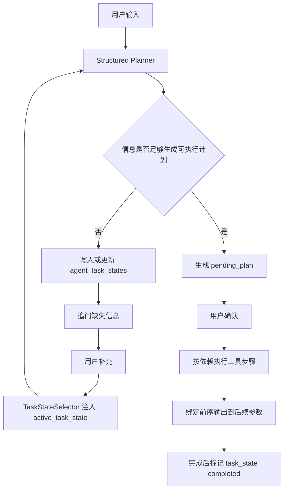

# 茬口创建多层语义任务规划设计

## 背景

用户输入“帮我创建一个西瓜茬口8424，大概种植20亩地”时，表面上是创建茬口，实际包含三层业务语义：

1. 确保作物模板存在：西瓜 8424。
2. 创建种植茬口：8424 西瓜茬口。
3. 记录种植面积或创建种植单元：20 亩地。

当前系统已经有 `agent_task_states` 表，可记录会话级可恢复任务状态；也已经有 `pending_action` / `pending_plan`，可承载写操作确认。但两者职责尚未打通：

- `agent_task_states` 现在主要记录自然语言 follow-up 和缺失信息。
- `pending_plan` 现在主要记录可立即确认执行的工具步骤。
- `manage_planting_units` 创建种植单元需要 `cycle_id` 和 `name`，其中 `cycle_id` 来自创建茬口后的结果，`name` 需要用户补充。
- `20亩` 同时可能表示茬口总面积，也可能表示具体地块或大棚面积，不能静默猜测为种植单元。

因此，这类请求不能只靠 classifier hint 或单次 tool call 修补，需要引入“任务状态驱动的计划生成与多轮交互”。

## 目标

把复杂写入意图处理成两个阶段：

1. Planning Task State：信息不完整时，将结构化目标、已知实体、缺失信息和下一步动作写入 `agent_task_states`。
2. Executable Pending Plan：信息完整后，基于 task state 生成可确认、可执行、可追踪的 pending plan。

目标行为：

- 用户一句话包含作物、品种、茬口、面积时，系统能识别为 `crop_cycle_setup` 任务。
- 系统能区分“可直接确认执行的步骤”和“需要用户补充后才能执行的步骤”。
- 对 `20亩` 这种歧义字段，默认可作为茬口总面积记录；若要创建具体种植单元，必须追问名称。
- 用户补充“叫东棚”后，系统能继续同一个任务，而不是重新分类成闲聊或单独创建地块。
- 最终确认计划应包含模板、茬口、种植单元三类步骤，并支持后续步骤引用前序步骤输出的 `cycle_id`。

## 非目标

- 不把 `manage_planting_units` 的 `cycle_id/name` 必填要求放宽。
- 不用固定作物词库或地块词库解决规划问题。
- 不让 LLM 在缺失关键字段时静默创建种植单元。
- 不把 pending plan 当成长期任务状态。
- 第一版不做多任务并行调度，只处理当前会话最近一个 active/waiting task。

## 当前能力边界

### agent_task_states

已有字段足够承载第一版任务草稿：

- `task_type`：可新增 `crop_cycle_setup`。
- `goal`：保存用户原始目标。
- `entities_json`：保存作物、品种、茬口名、面积、面积语义等结构化实体。
- `observations_json`：保存用户补充信息。
- `missing_information_json`：保存需要追问的信息。
- `next_action`：保存下一步动作。
- `status`：`active`、`waiting_user`、`completed`、`cancelled`。

当前 `TaskStateSelector` 已能把 active task 注入 runtime context。这个机制应该继续保留，但需要让 planner 明确读取并更新该状态。

### pending_plan

已有 `PendingPlanStep` 支持：

- `step_id`
- `tool_name`
- `params`
- `depends_on`

不足：

- 没有 step 级 `missing_fields`。
- 没有 `output_binding`，无法表达 `create_planting_unit.cycle_id` 来自 `create_crop_cycle.id`。
- 执行器按顺序执行步骤，但没有把上一步结构化结果注入下一步参数。

### manage_planting_units

创建种植单元的真实契约是：

```text
operation=manage_units
action=create
cycle_id 必填
name 必填
area_mu 可选
```

因此，“20亩”不能单独触发创建种植单元。缺少 `name` 时，应进入 task state 追问，而不是创建失败后再修补。

## 推荐架构



## 任务类型：crop_cycle_setup

新增逻辑任务类型 `crop_cycle_setup`。它不是新的业务表，也不是新的 Skill，而是 `agent_task_states.task_type` 的一种值。

### entities_json 建议结构

```json
{
  "crop_name": "西瓜",
  "variety": "8424",
  "cycle_name": "8424西瓜茬口",
  "season": "夏季",
  "start_date": "2026-07-24",
  "area_mu": 20,
  "area_target": "cycle_total",
  "planting_unit": {
    "name": null,
    "area_mu": 20,
    "should_create": "unknown"
  }
}
```

字段说明：

- `area_target=cycle_total`：默认把“20亩”作为茬口总面积记录，这是安全的低歧义选择。
- `planting_unit.should_create=unknown`：用户未明确地块/棚名称时，不生成种植单元步骤。
- 用户说“20亩地就叫东棚”或“同时建一个东棚 20 亩”后，更新为 `should_create=true` 且填入 `name`。

### missing_information 策略

第一版只追问会阻塞执行的字段：

- 缺作物：追问作物。
- 缺品种但用户明显提到模板/品种：追问品种；否则不阻塞。
- 缺种植单元名称：仅当用户表达“创建地块/棚/单元”或面积语义需要落到种植单元时追问。
- `20亩` 只有面积，没有地块名时，不阻塞模板和茬口创建，但应在确认文案中说明“暂按茬口总面积记录；如需创建具体地块/大棚，请补充名称”。

## Planner 决策规则

### 场景一：信息足够创建模板和茬口，但不足以创建种植单元

输入：

```text
帮我创建一个西瓜茬口8424，大概种植20亩地
```

Planner 输出：

- 写入或更新 `agent_task_states`：
  - `task_type=crop_cycle_setup`
  - `status=active`
  - 已知：`crop_name=西瓜`、`variety=8424`、`area_mu=20`
  - 缺失：无阻塞字段
  - 下一步：确认是否只创建模板和茬口，或补充种植单元名称
- 生成 pending plan：
  1. ensure crop template
  2. create crop cycle with area

确认文案需明确：

```text
请确认将执行 2 步：
1. 确认作物模板：西瓜 8424（不存在则创建）
2. 创建茬口：8424西瓜茬口，面积 20 亩

我会先把 20 亩作为茬口总面积记录。若还要创建具体地块/大棚，请告诉我名称。
确认执行吗？
```

### 场景二：用户明确要求创建种植单元但缺名称

输入：

```text
帮我创建一个西瓜8424茬口，再建20亩地
```

如果“地”被判定为具体种植单元，但没有名称：

- 不生成三步 pending plan。
- 写入 `agent_task_states.status=waiting_user`。
- `missing_information_json=["种植单元名称"]`。
- 回复：

```text
我理解你要创建西瓜 8424 茬口，并新增一个 20 亩的种植单元。还需要补充种植单元名称，比如“东棚”或“1号地”。
```

### 场景三：用户补充种植单元名称

已有 active task：

```json
{
  "task_type": "crop_cycle_setup",
  "missing_information_json": ["种植单元名称"],
  "entities_json": {
    "crop_name": "西瓜",
    "variety": "8424",
    "area_mu": 20
  }
}
```

用户输入：

```text
叫东棚
```

Planner 基于 `active_task_state` 合并实体：

```json
{
  "planting_unit": {
    "name": "东棚",
    "area_mu": 20,
    "should_create": true
  }
}
```

然后生成三步 pending plan：

1. `manage_crop_templates.create_template`
2. `manage_crop_cycle.create_cycle`
3. `manage_planting_units.manage_units(action=create)`

## Pending Plan 输出绑定

为了支持三步计划，`PendingPlanStep` 需要增加最小输出绑定协议。

建议在步骤参数中允许受控引用对象：

```json
{
  "step_id": "create_planting_unit",
  "tool_name": "manage_planting_units",
  "params": {
    "operation": "manage_units",
    "action": "create",
    "cycle_id": {
      "$from_step": "create_crop_cycle",
      "path": "id"
    },
    "name": "东棚",
    "area_mu": 20
  },
  "depends_on": ["create_crop_cycle"]
}
```

执行器规则：

- 执行每一步后保存结构化 `result_payload`。
- 下一步执行前解析 `params` 中的 `$from_step` 引用。
- 只允许引用当前 plan 内已成功执行步骤。
- 引用失败时暂停计划，返回可行动错误，不继续执行后续写操作。
- 第一版只支持简单 path，例如 `id`、`data.id`、`created.id`。

这要求写 Skill 的 raw executor 保留 `SkillResult` 结构化结果。如果某个 Skill 目前只返回中文 reply，执行器可先增加业务级解析适配，但最终应推动 Skill 返回标准结果 payload。

## agent_task_states 与 pending_plan 的职责分界

| 层 | 负责什么 | 不负责什么 |
| --- | --- | --- |
| `agent_task_states` | 多轮目标、已知实体、缺失信息、下一步动作 | 不表示用户已确认，不直接执行写操作 |
| `PlanDraft` | 单轮或基于 task state 的结构化计划草稿 | 不持久保存长期任务 |
| `pending_plan` | 用户即将确认的可执行写步骤 | 不追问长期缺失信息，不猜测关键参数 |
| Skill contract | 校验 operation 级必填和候选值 | 不决定用户真实意图 |

## 多轮交互策略

1. 每轮 planner 先读取 `active_task_state`。
2. 如果用户输入能补齐缺失字段，合并到 task state。
3. 如果仍缺阻塞字段，只更新 task state 并追问，不生成 pending plan。
4. 如果信息足够，生成 pending plan，并把 task state 保持为 `active`。
5. 用户确认 pending plan 并执行成功后，标记 task state 为 `completed`。
6. 用户取消 pending plan 时，不一定取消 task state；如果用户说“取消这个任务”，才标记 `cancelled`。
7. 用户中途问天气、查账等 side query，不覆盖 active task。

## 计划生成策略

### 第一版规则 Planner

先做一个保守的 domain planner，不要求一次完成通用 LLM planner：

- 输入：用户原文、`active_task_state`、router decision、LLM tool calls。
- 输出：`TaskPlanDecision`。
- 只覆盖 `crop_cycle_setup`。
- 不引入大范围 prompt 改造。

建议输出结构：

```json
{
  "task_type": "crop_cycle_setup",
  "entities": {},
  "missing_information": [],
  "next_action": "",
  "ready_for_pending_plan": true,
  "pending_steps": []
}
```

### 后续 LLM Structured Planner

规则 planner 稳定后，再让 LLM 生成同一结构的草稿，并由 DomainValidator 校验。LLM 负责语义抽取，系统负责契约、安全和缺参判断。

## 关键文件影响

| 文件 | 修改方向 |
| --- | --- |
| `backend/app/application/chat/task_state_updater.py` | 增加 `crop_cycle_setup` 的结构化任务写入和补全逻辑 |
| `backend/app/context/selectors/task_state.py` | 保持注入，但可优化 metadata，让 planner 更容易读取结构化实体 |
| `backend/app/agent/runtime/planning/models.py` | 为 PlanStep 增加 `missing_fields` 或保留在 validation issues 中 |
| `backend/app/agent/runtime/tool_pending.py` | 从 task plan 生成 pending plan，不再只从 tool calls 包装 |
| `backend/app/agent/executor/pending_actions.py` | 执行 pending plan 时解析 `$from_step` 输出绑定 |
| `backend/app/agent/pending_plan_service.py` | 持久化 params 中的绑定对象即可，第一版不必改表 |
| `backend/app/skills/manage-planting-units/skill.md` | 文档补充：从茬口创建流程来的单元创建必须有名称，面积不足以创建单元 |
| `backend/tests/agent/test_task_state_flow.py` | 覆盖缺单元名、多轮补齐、side query 不覆盖 |
| `backend/tests/agent/test_plan_draft_pending_execution.py` | 覆盖两步和三步 pending plan 生成 |
| `backend/tests/agent/test_pending_plan_executor.py` | 覆盖 `$from_step` 绑定解析和失败暂停 |

## 验收用例

### 用例 1：只创建模板和茬口

用户：

```text
帮我创建一个西瓜茬口8424，大概种植20亩地
```

期望：

- 不创建单个 `manage_crop_cycle` pending action。
- 生成两步 pending plan。
- pending plan 包含 `manage_crop_templates` 和 `manage_crop_cycle`。
- `manage_crop_cycle.params.area=20`。
- 回复说明 20 亩暂按茬口总面积记录。

### 用例 2：明确要创建地块但缺名称

用户：

```text
帮我创建西瓜8424茬口，再新增20亩地
```

期望：

- 不创建 pending plan。
- 写入 `agent_task_states.task_type=crop_cycle_setup`。
- `missing_information_json=["种植单元名称"]`。
- 回复追问地块或大棚名称。

### 用例 3：多轮补齐后生成三步计划

用户第一轮：

```text
帮我创建西瓜8424茬口，再新增20亩地
```

助手追问名称。

用户第二轮：

```text
叫东棚
```

期望：

- 读取同 session active task。
- 生成三步 pending plan。
- 第三步 `manage_planting_units.params.name=东棚`。
- 第三步 `cycle_id` 使用 `$from_step=create_crop_cycle` 绑定。

### 用例 4：pending plan 执行输出绑定

给定三步 pending plan：

- 第 2 步创建茬口返回 `{"id": 123}`。
- 第 3 步执行前解析 `cycle_id=123`。

期望：

- `manage_planting_units` 收到真实整数 `cycle_id=123`。
- 如果第 2 步失败，第 3 步不执行。

### 用例 5：side query 不覆盖任务

已有 `crop_cycle_setup` 等待用户补地块名。

用户：

```text
明天天气怎么样
```

期望：

- 正常回答天气。
- active task 不变。
- 下一轮用户说“叫东棚”仍能恢复任务。

## 分阶段实施建议

### Phase 1：任务状态识别与追问

- 新增 `crop_cycle_setup` task state 识别。
- 识别作物、品种、面积和种植单元名称缺失。
- 当用户明确要创建种植单元但缺名称时，写 `waiting_user` 并追问。

### Phase 2：两步 pending plan 与 task state 协同

- 当前已有模板前置两步计划，补充 task state 记录。
- 确认执行成功后标记相关 task completed。
- 确认文案说明面积语义。

### Phase 3：三步 pending plan 与输出绑定

- 增加 `$from_step` 解析。
- 支持创建茬口后自动把 `cycle_id` 传给种植单元。
- 增加执行失败暂停和 trace。

### Phase 4：LLM Structured Planner

- 在规则 planner 稳定后，让 LLM 生成统一 `TaskPlanDecision`。
- DomainValidator 负责安全收敛。
- data flywheel 用失败样本持续补充评测。

## 风险与约束

- `tool_pending.py` 已接近 1000 行，Phase 2 或 Phase 3 应考虑拆出 `crop_cycle_setup_planner.py`，避免继续堆在 pending 拦截层。
- 输出绑定依赖 SkillResult 结构化 payload；如果 Skill 只返回中文，需要先统一 raw executor 的结果格式。
- 不应把面积字段同时写入茬口和种植单元，除非用户明确同意，否则会形成重复统计风险。
- TaskState 是工作草稿，不代表用户授权写入；所有写操作仍必须经过 pending confirmation。

## 推荐结论

本问题应按“任务状态驱动的多步骤写入规划”修复：

1. 用 `agent_task_states` 承接跨轮语义和缺失信息。
2. 用 planner 从 task state 生成 pending plan。
3. 用 output binding 打通“创建茬口 -> 创建种植单元”的运行时依赖。
4. 保持 Skill contract 严格，不为了流畅而降低必填参数。

这样可以避免继续用硬编码词库修单点，也能让用户描述不充分时自然进入多轮交互。
