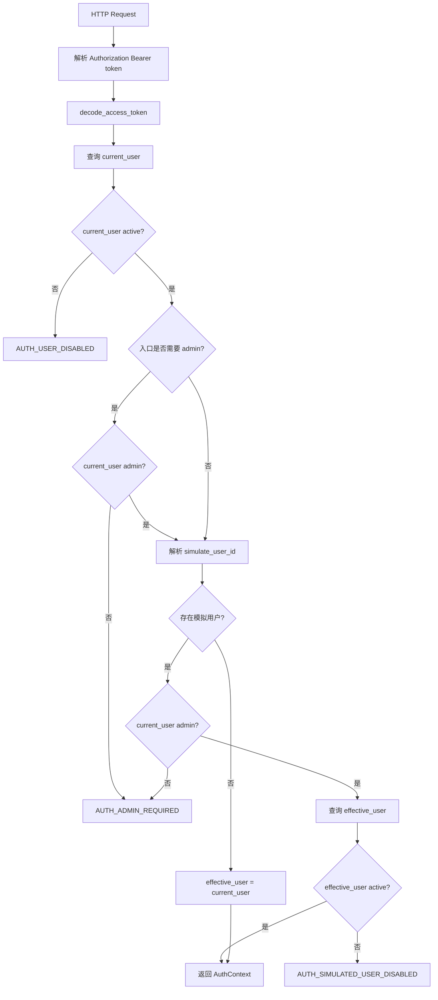

# Users 域统一鉴权上下文设计

## 背景

当前后端已经在 `backend/app/domains/users/dependencies.py` 的
`get_current_user()` 中检查 JWT 用户是否存在、是否启用、是否为管理员。但业务入口仍存在两类结构性风险：

1. 鉴权结果直接以 `User` 模型在路由和 application 层之间传递，调用方容易绕过统一依赖后自行查询用户。
2. 管理员模拟用户、Agent 会话、AI token 消耗、农场上下文解析等入口分散处理身份和权限，禁用用户的全局规则容易漏到业务代码里。

禁用用户应被视为全局访问封禁：只要请求的业务身份是禁用用户，所有业务能力都不可用，包括 AI 调用、普通业务 API、Agent 流式接口，以及管理员模拟该用户执行业务动作。

## 目标

- 在 Users 域提供统一鉴权层，业务入口只消费稳定的 `AuthContext`，不在业务代码中重复解析 token、检查用户状态、判断管理员。
- 明确 `current_user` 与 `effective_user` 的差异，覆盖管理员模拟用户场景。
- 将“禁用用户不可访问任何业务”沉淀为统一依赖的强制规则。
- 保持 Users/Auth 边界清晰：Users 只负责“谁在请求”和“是否有权限”，当前农场解析仍属于 Farm 边界。
- 为迁移 Agent、AI token、普通业务、管理员入口提供一致的依赖入口和测试策略。

## 非目标

- 不在本设计中重写 JWT、密码、注册登录、quota 计费实现。
- 不把 Farm 业务规则搬进 `domains/users`。
- 不一次性改造所有业务路由；本设计给出分阶段迁移路径。
- 不引入新的全局中间件替代 FastAPI 依赖注入。HTTP 级中间件无法自然表达管理员模拟、可选登录、farm scope 等业务鉴权语义。

## 核心规则

### 1. 全局禁用策略

所有受保护业务入口必须通过统一依赖得到 `AuthContext`。统一依赖必须保证：

- token 解析出的 `current_user` 必须存在且 `status == "active"`。
- 如果请求声明了 `simulate_user_id`、`X-Simulate-User-Id` 或等价模拟参数，模拟目标 `effective_user` 也必须存在且 `status == "active"`。
- 禁用用户不能通过自己的 token 调用任何业务。
- 管理员不能以禁用用户身份调用任何业务，包括 Agent/AI 流式接口。
- 只有少数明确匿名能力可以使用 `optional_user_context()`，例如公开健康检查或公开配置查询。

### 2. 身份语义

| 字段 | 含义 | 典型场景 |
|---|---|---|
| `current_user` | token 所属用户 | 普通用户请求、管理员请求 |
| `effective_user` | 本次业务实际代表的用户 | 普通请求等于 `current_user`；管理员模拟时为被模拟用户 |
| `is_admin` | `current_user.role == "admin"` | 后台管理接口、模拟能力前置判断 |
| `is_simulated` | `current_user.id != effective_user.id` | 管理员代用户排障或测试 |

业务层默认只使用 `auth.effective_user` 或 `auth.effective_user_id`。只有审计、后台管理、授权判断才读取 `current_user`。

### 3. 鉴权失败优先级

统一依赖应按稳定顺序失败，避免泄露多余信息，也让测试更可预期：

1. 缺少 token：`AUTH_MISSING_TOKEN`
2. token 过期：`AUTH_TOKEN_EXPIRED`
3. token 非法：`AUTH_INVALID_TOKEN`
4. 当前用户不存在：`AUTH_USER_NOT_FOUND`
5. 当前用户禁用：`AUTH_USER_DISABLED`
6. 需要管理员但当前用户不是管理员：`AUTH_ADMIN_REQUIRED`
7. 模拟目标不存在：`AUTH_SIMULATED_USER_NOT_FOUND`
8. 模拟目标禁用：`AUTH_SIMULATED_USER_DISABLED`
9. farm scope 不可用或不属于有效用户：Farm 域错误码

## 推荐架构

在 `backend/app/domains/users` 内收束认证上下文，建议新增或调整以下模块：

```text
backend/app/domains/users/
  context.py          # AuthContext / OptionalAuthContext 数据结构
  auth_resolver.py    # token、用户、管理员、模拟用户解析流程
  dependencies.py     # FastAPI Depends 入口，向路由暴露稳定依赖
  errors.py           # 统一错误码和 HTTPException 工厂
```

`dependencies.py` 保留为外部唯一推荐入口，避免业务侧直接依赖 resolver 细节。`auth_resolver.py` 用于把较长的解析流程从 FastAPI dependency 函数中拆出，便于单元测试。

### AuthContext

```python
from dataclasses import dataclass

from app.domains.users.models import User


@dataclass(frozen=True)
class AuthContext:
    current_user: User
    effective_user: User

    @property
    def current_user_id(self) -> str:
        return self.current_user.id

    @property
    def effective_user_id(self) -> str:
        return self.effective_user.id

    @property
    def is_admin(self) -> bool:
        return self.current_user.role == "admin"

    @property
    def is_simulated(self) -> bool:
        return self.current_user.id != self.effective_user.id
```

如确有匿名入口，可定义：

```python
@dataclass(frozen=True)
class OptionalAuthContext:
    current_user: User | None
    effective_user: User | None
```

但匿名上下文不得传入需要写业务数据、消耗 AI token、读取私有农场数据的用例。

### 依赖入口

| 依赖函数 | 返回 | 用途 |
|---|---|---|
| `require_auth_context()` | `AuthContext` | 默认业务入口；强制 active 当前用户 |
| `require_admin_context()` | `AuthContext` | 管理后台；强制 active 当前用户且为 admin |
| `require_effective_user_context()` | `AuthContext` | 支持管理员模拟的业务入口；强制 current/effective 都 active |
| `require_farm_context()` | `FarmAuthContext` 或 Farm 域结构 | 需要 farm scope 的业务入口，由 Farm 域组合 `AuthContext` |
| `optional_auth_context()` | `OptionalAuthContext` | 明确允许匿名的公开入口 |

兼容期可以保留 `get_current_user()` 与 `require_admin()`，但它们应改为包裹新入口：

```python
def get_current_user(auth: AuthContext = Depends(require_auth_context)) -> User:
    return auth.current_user


def require_admin(auth: AuthContext = Depends(require_admin_context)) -> User:
    return auth.current_user
```

这样旧路由仍可运行，新路由逐步迁移到 `AuthContext`。

## Resolver 流程



模拟用户 ID 的来源需要统一，优先级建议为：

1. 显式函数参数，例如 `simulate_user_id` query/body 字段。
2. HTTP header，例如 `X-Simulate-User-Id`。
3. 不存在时不模拟。

同一入口不要同时支持多个互相冲突的模拟来源；如果历史接口已有不同字段，统一 resolver 可以先兼容读取，但需要在文档和测试中固定优先级。

## Farm 边界

Users 域不应该解析“当前农场”。需要 farm scope 的业务由 Farm 域提供组合依赖：

```python
def require_farm_context(
    auth: AuthContext = Depends(require_effective_user_context),
    db: Session = Depends(get_db),
) -> FarmAuthContext:
    farm = resolve_farm_for_user(db, auth.effective_user_id)
    return FarmAuthContext(auth=auth, farm=farm)
```

这样业务层拿到的是已经过用户状态检查的 `auth` 和 Farm 域校验后的 `farm`，不会在业务代码里散落“用户是否禁用”“农场是否属于用户”的重复判断。

## 路由迁移策略

### Agent / AI 入口

优先迁移所有会调用 LLM、消耗 token、执行 tool 的入口：

- `/agent/chat`
- `/agent/chat/stream`
- conversations 相关接口
- skills/tool execution 相关接口

这些入口必须使用 `require_effective_user_context()`。Agent application 层只接收 `auth.effective_user_id`、`auth.current_user_id` 和审计字段，不再从 request 或 DB 自行解析身份。

### 普通业务入口

普通 CRUD 路由使用 `require_auth_context()` 或 Farm 域的 `require_farm_context()`。业务代码不能写：

```python
if user.status != "active":
    ...
```

除非该代码就在 Users 域 resolver 或兼容 dependency 内。

### 管理入口

后台管理接口使用 `require_admin_context()`。如果管理接口只是修改用户状态、重置额度等后台操作，业务对象可以是禁用用户；如果管理接口是“以某用户身份执行业务”，则必须走 `require_effective_user_context()` 并拒绝禁用目标用户。

### 匿名入口

匿名入口必须显式选择 `optional_auth_context()` 或不接入 auth dependency，并在路由注释或测试中说明其公开性。健康检查、登录、注册、发送验证码属于匿名入口；AI、业务数据读取、写业务数据不属于匿名入口。

## Application 层约束

Application/use case 层不接收 FastAPI `Request`，不解析 Authorization header，不直接调用 `decode_access_token()`。推荐输入形态：

```python
@dataclass(frozen=True)
class ChatCommand:
    current_user_id: str
    effective_user_id: str
    is_simulated: bool
    message: str
```

这样 HTTP 层负责鉴权，application 层负责业务编排，Agent runtime 只看到已经授权后的业务身份。

## 错误码设计

现有 `errors.py` 已有 `user_disabled_error()` 等工厂函数。建议补齐模拟用户相关错误码，并保持所有错误响应含 `code` 字段：

| 场景 | HTTP 状态 | code |
|---|---:|---|
| 缺少 token | 401 | `AUTH_MISSING_TOKEN` |
| token 过期 | 401 | `AUTH_TOKEN_EXPIRED` |
| token 非法 | 401 | `AUTH_INVALID_TOKEN` |
| 当前用户不存在 | 401 | `AUTH_USER_NOT_FOUND` |
| 当前用户禁用 | 403 | `AUTH_USER_DISABLED` |
| 需要管理员 | 403 | `AUTH_ADMIN_REQUIRED` |
| 模拟用户不存在 | 404 | `AUTH_SIMULATED_USER_NOT_FOUND` |
| 模拟用户禁用 | 403 | `AUTH_SIMULATED_USER_DISABLED` |

如果决定不区分当前用户禁用和模拟用户禁用，也可以复用 `AUTH_USER_DISABLED`，但响应上下文应包含 `scope=current_user|effective_user`，便于日志和测试定位。

## 测试计划

### Users 域单元测试

- active 用户 token 返回 `AuthContext(current_user == effective_user)`。
- disabled 用户 token 返回 `AUTH_USER_DISABLED`。
- 非管理员传入 `simulate_user_id` 返回 `AUTH_ADMIN_REQUIRED`。
- 管理员模拟 active 用户返回 `is_simulated == True`。
- 管理员模拟 disabled 用户返回 `AUTH_SIMULATED_USER_DISABLED` 或带 `scope=effective_user` 的 `AUTH_USER_DISABLED`。

### API 回归测试

- disabled 用户 token 调用普通业务接口失败。
- disabled 用户 token 调用 `/agent/chat` 失败。
- disabled 用户 token 调用 `/agent/chat/stream` 失败。
- 管理员模拟 disabled 用户调用 `/agent/chat/stream` 失败，且不会进入 LLM runtime。
- 管理员修改禁用用户资料的后台接口仍可用。

### 架构约束测试

- 业务模块不得直接 import `decode_access_token()`。
- 业务模块不得直接判断 `User.status`，例外只允许 `domains/users` 与用户管理后台状态修改逻辑。
- Agent application/runtime 不接收 FastAPI `Request`。

## 分阶段落地

1. 在 `domains/users` 新增 `context.py` 与 `auth_resolver.py`，让 `dependencies.py` 暴露新依赖，并用新依赖包裹旧函数。
2. 为 resolver 写单元测试，先锁住禁用用户和模拟用户规则。
3. 迁移 Agent/AI 入口到 `require_effective_user_context()`，保证禁用用户不能触发 LLM 或 token 计费。
4. 迁移 Farm 相关业务到 Farm 域组合依赖，清理业务内 `User.status` 判断。
5. 增加架构检查脚本，防止 `decode_access_token()` 和业务内状态判断重新扩散。
6. 移除或降级旧 `get_current_user()` 的直接使用，将新代码规范写入架构文档。

## 风险与缓解

| 风险 | 缓解 |
|---|---|
| 一次性迁移过大 | 先迁移 Agent/AI 高风险入口，再按路由分批 |
| 管理员禁用用户管理被误拦截 | 区分“管理禁用用户资料”和“模拟禁用用户执行业务” |
| Farm 解析被错误塞进 Users | 只在 Farm 域组合 `AuthContext`，Users 不 import Farm resolver |
| 旧接口依赖 `User` 返回值 | 兼容期保留 `get_current_user()` 包裹新 context |
| 错误码变化影响前端 | 先复用现有 `AUTH_USER_DISABLED`，新增 `scope` 或兼容映射 |

## 验收标准

- 新业务路由不直接解析 token，不直接判断用户禁用状态。
- 禁用用户通过自己的 token 不能访问任何受保护业务。
- 管理员模拟禁用用户不能访问任何业务能力，尤其不能调用 AI。
- 管理员仍可管理禁用用户的后台资料和状态。
- Agent/AI 入口在鉴权失败时不会创建 LLM 请求、不会消耗 token、不会产生业务写入。
- `domains/users` 只产出身份和权限上下文，Farm scope 由 Farm 域组合依赖负责。
