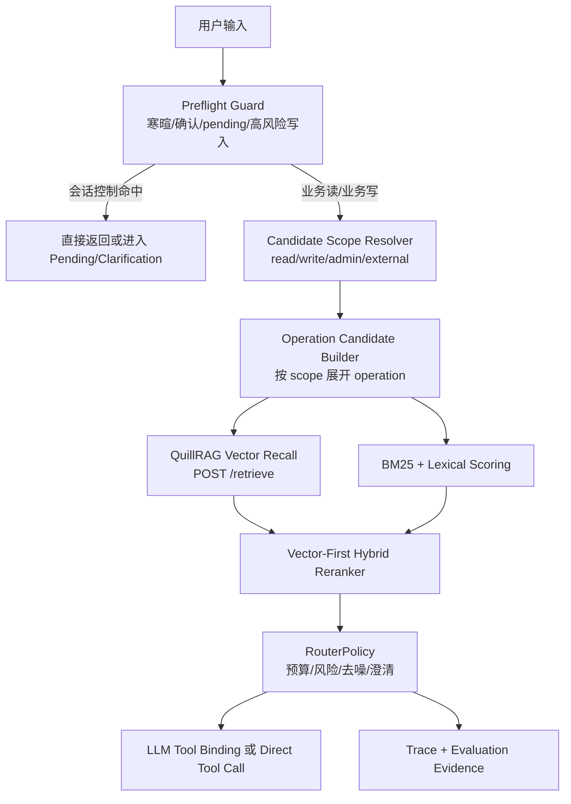

# Skill Router 向量优先路由设计

> 状态：设计中
> 日期：2026-07-28
> 取代：[2026-07-27-skill-router-hybrid-recall-eval-design.md](./2026-07-27-skill-router-hybrid-recall-eval-design.md) 中“规则/BM25/embedding 三路并列召回”的路由顺序
> 关联：`backend/app/agent/router/*`、`backend/app/ops/skill_route_eval.py`、`backend/app/platforms/admin/config_routes.py`、`backend/app/ops/skill_route_cases.json`、[2026-07-27-skill-vector-store-rag-design.md](./2026-07-27-skill-vector-store-rag-design.md)

## 1. 背景

当前 Skill Router 的问题不是 QuillRAG 向量检索不准确，而是线上 Agent Router 与 Admin 召回预览使用的路径不一致。

典型现象：

```text
Admin /admin/skills/route-recall
  输入：我的农事
  显示：RAG 已调用，Embedding: quillrag_service
  Top1：manage_farm_logs.query_logs

Agent /agent/chat/stream
  输入：我的农事
  日志：reason=not_retrievable_read
  结果：跳过 BM25 + RAG 向量召回
  最终：进入 model_choice_read_default，LLM 可能选择 get_farm_status
```

这说明系统存在两类漂移：

1. **路径漂移**：Admin 预览直接跑 operation 级 hybrid/vector 召回；真实 Agent Router 先经过规则分类和可检索读门控，短句经常被拦在向量召回前。
2. **候选池漂移**：Admin 预览曾把 read/write operation 混在同一候选池；真实 Agent Router 对读请求只展开 read operation。两边 Top1 可能不同。

新设计的核心结论：

```text
业务读请求默认走 QuillRAG 向量召回。
规则不再作为读类候选主路径，只作为 guard、risk classifier 和 fallback。
Admin route-recall 与 Agent Router 必须复用同一套候选池构建和排序策略。
```

## 2. 目标

1. 业务读问题尽可能进入 QuillRAG 向量召回，避免规则门控提前截断。
2. Admin 召回预览、离线评测、真实 Agent Router 使用同一套候选池和 rerank 逻辑。
3. 规则分类器从“候选主路径”降级为“安全 guard + 会话控制 + 兜底”。
4. 向量检索由 QuillRAG 服务完成，Farm Manager 不本地生成 query embedding 或 doc embedding。
5. Trace 必须能直接说明本轮是否调用 `rag.lllcnm.cn`、候选分数如何组成、最终为什么选中某个 Skill。
6. 所有策略变化必须通过 `skill_route_cases.json` 和真实坏会话样本回归。

## 3. 非目标

- 不把规则全部删除。写入、删除、确认、pending action、寒暄、权限和高风险操作仍需要规则 guard。
- 不在 Farm Manager 内部直接调用 embedding provider。
- 不在线遍历 Skill 文档生成 embedding。
- 不让 QuillRAG 结果绕过 `RouterPolicy`、schema budget、写确认和 runtime guard。
- 不继续通过堆 Python if/else 补救每个误召回样本；业务表达优先沉淀到 Skill Registry 文档、examples、tags、anti_examples 和测试集。

## 4. 路由原则

| 原则 | 说明 |
| --- | --- |
| 向量优先 | 业务读请求默认调用 QuillRAG `/retrieve`，由语义检索召回 operation candidates。 |
| 规则降级 | 规则不再决定读类业务候选 TopK；只识别安全边界、写入风险、会话控制和 fallback。 |
| Operation 粒度 | 候选必须是 `skill.operation`，不是仅 skill。`manage_farm_logs.create_log` 与 `query_logs` 必须分开。 |
| 候选池一致 | Admin 预览、CLI 评测、Agent Router 使用相同 `CandidateScope` 和 `HybridOperationRetriever`。 |
| 读写分池 | 读问题只召回 read operation；写问题只召回 write operation；不要把 `create_log` 混进“我的农事”这种读查询。 |
| 可降级 | QuillRAG 超时、空结果或缺索引时，回退 BM25 + lexical，再回退规则或默认读池。 |
| 可解释 | 每个候选保留 vector、bm25、lexical、registry、operation_prior、penalty 和 sources。 |

## 5. 总体流程



### 5.1 Preflight Guard

Preflight Guard 只做“是否允许进入业务召回”的判断，不直接给读类业务问题选候选。

| 输入类型 | 处理 |
| --- | --- |
| 寒暄、身份、感谢 | 不调用 RAG，不绑定业务 Skill。 |
| pending action 确认/取消 | 不调用 RAG，进入 pending action flow。 |
| 明确写入、删除、结算、付款 | 标记 write scope，后续可用向量召回 write operation，但必须 pending confirmation。 |
| 天气、外部网络高置信 | 可以规则直达，也可以作为 external scope，保留 trace 说明 `rag_service_used=false`。 |
| 普通业务读 | 默认进入 read vector recall。 |

### 5.2 Candidate Scope Resolver

Candidate Scope 只决定候选池范围，不决定最终 Skill。

| Scope | 候选范围 | 示例 |
| --- | --- | --- |
| `read` | `risk in {"read", "external_network"}` | 我的农事、我的花费、有哪些工人 |
| `write` | `risk in {"write_confirm", "write_high"}` | 记录今天打药、删除农事日志 8 |
| `conversation` | 无业务 Skill | 你好、确认、取消 |
| `fallback_read_pool` | 少量泛读工具 | 农场最近怎么样、你能查什么 |

关键约束：

```text
Admin route-recall 必须先算 CandidateScope，再构建候选。
Agent Router 必须使用同一个 CandidateScope。
```

## 6. 向量优先召回

### 6.1 QuillRAG 职责

Farm Manager 不感知 embedding 模型和向量维度。QuillRAG 负责：

- Skill operation 文档 embedding。
- Qdrant collection 存储。
- `/retrieve` 查询 embedding。
- dense/sparse/hybrid 检索。
- 可选 rerank。

Farm Manager 在线路由只调用：

```http
POST /retrieve
```

请求约束：

```json
{
  "query": "我的农事",
  "collection": "farm_manager_skill_routes_v1",
  "mode": "hybrid",
  "top_k": 8,
  "filters": {
    "project": "farm-manager",
    "category": "skill_route",
    "enabled": true,
    "status": "active"
  },
  "use_hyde": false
}
```

Router trace 必须满足：

```text
local_query_embedding_calls = 0
local_doc_embedding_calls = 0
embedding_location = quillrag_service
rag_service_used = true
```

### 6.2 RAG 调用策略

业务读请求的默认策略：

```text
if skill_vector_store.enabled and collection_ready:
    call QuillRAG /retrieve
else:
    vector_status = missing_index
    fallback to BM25 + lexical
```

RAG 请求失败策略：

| 状态 | Router 行为 |
| --- | --- |
| `success` | 使用 vector score 进入 hybrid rerank。 |
| `empty` | 记录 `vector_status=empty`，切换 BM25 + lexical fallback 权重。 |
| `timeout` | 记录 `vector_status=fallback` 和 error_code，不阻断 Agent，切换 fallback 权重。 |
| `missing_index` | 不请求 RAG，使用 BM25 + lexical fallback 权重 + rule fallback。 |

## 7. BM25 与 Lexical 的角色

BM25 和 lexical 不再是“硬筛 Top5”，而是向量召回的补强信号。

| 信号 | 作用 |
| --- | --- |
| `vector` | 主召回与主语义分。 |
| `bm25` | 精确业务词、短词、编号、金额、operation alias 的补强。 |
| `lexical` | 领域关键词命中，例如“农事、工资、欠款、茬口”。 |
| `anti_examples` | 降权冲突候选，例如“农事”对作业单的 anti-example。 |

命名约束：

```text
不要再把 lexical 命名为 strong_rule。
```

原因是 `strong_rule` 容易被误解成 RuleIntentClassifier 命中。这里实际只是词法强信号。

## 8. Vector-First Rerank

推荐默认公式：

```text
final_score =
  0.70 * vector_norm
+ 0.15 * bm25_norm
+ 0.05 * lexical_score
+ 0.10 * registry_prior
+ operation_prior
- anti_example_penalty
- low_signal_only_penalty
```

当 QuillRAG 没有返回有效向量分时，使用 fallback 公式：

```text
final_score =
  0.35 * bm25_norm
+ 0.35 * lexical_score
+ 0.15 * registry_prior
+ operation_prior
- anti_example_penalty
- low_signal_only_penalty
```

说明：

| 字段 | 含义 |
| --- | --- |
| `vector_norm` | QuillRAG 返回的 route score，优先级最高。 |
| `bm25_norm` | 词法 BM25 归一化分，用于补强精确词。 |
| `lexical_score` | 业务实体、tags、aliases 命中。 |
| `registry_prior` | active、read/write scope、operation 完整度。 |
| `operation_prior` | 同一个 skill 内区分 query/create/manage。 |
| `anti_example_penalty` | 命中反例时降权。 |
| `low_signal_only_penalty` | 只命中“我的/查询/多少/有哪些”时降权。 |

当前实现采用上述 vector-first 公式。历史公式 `0.35*bm25 + 0.35*vector + ...` 只作为回滚对照，不再作为默认策略。

权重调整原则：

1. 不频繁手工微调权重。
2. 每次调整必须基于失败集和指标。
3. 优先修 Skill 文档、examples、tags、anti_examples。
4. 只有多个业务域稳定排序错误时才调整全局权重。

## 9. 规则的保留边界

规则仍然需要，但不再作为读类候选主路径。

### 9.1 必须保留的规则

| 类型 | 原因 |
| --- | --- |
| pending 确认/取消 | 必须绑定上一轮待确认动作，不能向量召回。 |
| 写入风险识别 | 删除、结算、付款、修改等必须进入 pending confirmation。 |
| 寒暄/身份/感谢 | 不应调用 RAG 或业务 Skill。 |
| 权限和 admin-only | 安全边界不能靠向量判断。 |
| 明确外部天气 | 可规则直达，减少不必要 RAG。 |

### 9.2 不应保留为主路径的规则

| 类型 | 调整 |
| --- | --- |
| “我的农事” -> get_farm_status | 禁止，应该进 `manage_farm_logs.query_logs` 向量召回。 |
| “我的花费” -> finance rule 直达 | 可作为 guard，但应优先让 hybrid/vector 排序出 operation。 |
| “我的工人” -> rule 直达 | 可作为高置信兜底，但 Admin/Agent 仍应能展示 vector recall evidence。 |
| 泛业务词堆叠 if/else | 转为 Skill Registry metadata 和回归集。 |

## 10. Admin 与 Agent 一致性

`/admin/skills/route-recall` 是路由调试入口，必须模拟真实 Agent Router。

### 10.1 API 返回

返回必须包含：

```json
{
  "message": "我的农事",
  "recall_mode": "hybrid_vector",
  "vector_index_enabled": true,
  "recall": {
    "path": "bm25_vector_hybrid",
    "candidate_scope": "read",
    "vector_search_used": true,
    "rag_service_used": true,
    "quillrag_retrieve_used": true,
    "embedding_location": "quillrag_service",
    "vector_status": "success"
  },
  "top_candidates": [
    {
      "route": "manage_farm_logs.query_logs",
      "score": 0.8843,
      "vector": 0.9839,
      "bm25": 1.0,
      "lexical": 0.45,
      "sources": ["lexical", "bm25", "vector"]
    }
  ],
  "skill_router": {
    "selected_operations": {
      "manage_farm_logs": ["query_logs"]
    },
    "evidence": {
      "recall": "same shape as above"
    }
  }
}
```

### 10.2 一致性要求

| 项 | 要求 |
| --- | --- |
| CandidateScope | Admin 与 Agent 一致。 |
| Operation candidates | Admin 与 Agent 一致，不混读写。 |
| Vector search fn | Admin 与 Agent 使用同一 `build_skill_vector_search_fn()`。 |
| Top candidates | Admin 展示的 Top 候选必须来自真实候选池。 |
| `skill_router` JSON | 必须显示真实 Agent Router 的最终选择。 |

## 11. Trace 设计

Skill Router trace 默认落库结构：

```json
{
  "summary": {
    "selection_path": "hybrid_retrieval",
    "selected_routes": ["manage_farm_logs.query_logs"],
    "fallback": null,
    "policy_violations": []
  },
  "selected": {
    "tools": ["manage_farm_logs"],
    "operations": {
      "manage_farm_logs": ["query_logs"]
    }
  },
  "recall": {
    "status": "used",
    "path": "bm25_vector_hybrid",
    "candidate_scope": "read",
    "strategy": "quillrag_vector + bm25 + lexical",
    "external_rag_call": true,
    "embedding_location": "quillrag_service",
    "local_doc_embeds": 0,
    "vector_status": "success"
  },
  "candidate_explanations": [
    {
      "route": "manage_farm_logs.query_logs",
      "selected": true,
      "scores": {
        "final": 0.8843,
        "vector": 0.9839,
        "bm25": 1.0,
        "lexical": 0.45
      },
      "why_selected": "QuillRAG 向量召回 + BM25/lexical 均支持该 operation"
    }
  ]
}
```

读日志时应该能一眼回答：

```text
有没有调用 rag.lllcnm.cn？
embedding 是不是在 QuillRAG 内完成？
为什么不是 get_farm_status？
Top2/Top3 候选差多少？
有没有 fallback 或 policy violation？
```

## 12. 典型样例

| 输入 | Scope | 期望 Top1 | RAG |
| --- | --- | --- | --- |
| 我的农事 | read | `manage_farm_logs.query_logs` | yes |
| 查询农事日志 | read | `manage_farm_logs.query_logs` | yes |
| 今天打药了 | write | `manage_farm_logs.create_log` | yes 或 BM25 fallback |
| 我的花费 | read | `manage_cost.query_summary` | yes |
| 我有哪些欠款 | read | `manage_cost.query_debt` | yes |
| 当前有哪些工人 | read | `manage_workers.query_workers` | yes |
| 张三今天来了一天 | write | `manage_labor_payment.manage_wage` | yes 或 BM25 fallback |
| 明天天气怎么样 | external/read | `weather.query_forecast` | optional/no |
| 确认 | conversation | pending action | no |
| 你好 | conversation | no tool | no |

## 13. 测试与评测

必须覆盖三层：

### 13.1 Unit Tests

- `HybridOperationRetriever`：验证 vector-first 评分、lexical 命名、anti penalty。
- `SkillRouter`：验证业务读短句进入 QuillRAG 路径。
- `skill_route_eval`：验证 Admin 预览候选池与 Agent Router 一致。

核心回归：

```text
我的农事 -> manage_farm_logs.query_logs
查询农事日志 -> manage_farm_logs.query_logs
我的花费 -> manage_cost.query_summary
我有哪些欠款 -> manage_cost.query_debt
张三今天打药了 -> manage_farm_logs.create_log
张三今天来了一天 -> manage_labor_payment.manage_wage
```

### 13.2 Offline Evaluation

`backend/app/ops/skill_route_cases.json` 必须输出：

```text
recall@1
recall@5
operation_hit@5
vector_used_rate
fallback_rate
wrong_get_farm_status_rate
```

业务读样本中，`vector_used_rate` 应接近 100%。如果 RAG 服务不可用，应单独标记为环境失败，而不是把算法误判为失败。

### 13.3 Online Smoke

使用真实 dev 配置调用 QuillRAG：

```bash
FARM_MANAGER_ENV=dev PYTHONPATH=. python -m app.ops.skill_route_eval \
  app/ops/skill_route_cases.json --top-k 5
```

至少验证：

```text
rag_service_host=rag.lllcnm.cn
vector_search_used=true
embedding_location=quillrag_service
local_doc_embedding_calls=0
```

## 14. 落地计划

### Phase 1：统一路径（已落地）

- 抽出共享 `SkillRouteRecallService` 或等价函数，供 Admin、CLI、Agent Router 共用。
- 引入 `CandidateScope`，读写分池。
- 业务读请求默认进入 hybrid/vector，不再要求“查询/查看/多少”等显式查询词。
- `strong_rule` source 全部改为 `lexical`。

### Phase 2：向量优先评分（已落地）

- 将评分公式改为 vector-first。
- 补 `candidate_scope`、`vector_status`、`rag_service_host` 到 trace。
- Admin 页面展示 RAG 是否调用、Embedding 位置、Top 候选分数。

### Phase 3：规则治理

- 将读类规则候选降级为 fallback。
- 只保留 conversation、pending、write risk、external weather、permission guard。
- 把业务词表迁移到 Skill Registry metadata。

### Phase 4：评测闭环

- 扩展 `skill_route_cases.json`。
- 增加线上坏会话回流字段：`expected_route`、`actual_route`、`recall_path`、`vector_status`。
- 评测报告区分算法失败、RAG 服务失败、metadata 缺口和业务歧义。

## 15. 验收标准

1. Admin `/admin/skills/route-recall` 和真实 Agent Router 对同一输入返回同一 Top1 operation。
2. `我的农事` 不再选 `get_farm_status`，而是 `manage_farm_logs.query_logs`。
3. 业务读样本 trace 显示 `rag_service_used=true`，除非 RAG 服务明确 timeout/empty/missing_index。
4. `local_doc_embedding_calls` 恒为 `0`。
5. 写操作仍然 pending confirmation，不因向量优先而直接执行。
6. `get_farm_status` 只用于总览型问题或必要上下文，不再吞掉具体业务查询。
7. 路由测试集 `operation_hit@5=100%`，并新增 `wrong_get_farm_status_rate=0` 门禁。
