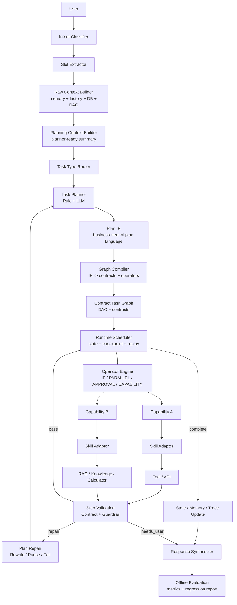
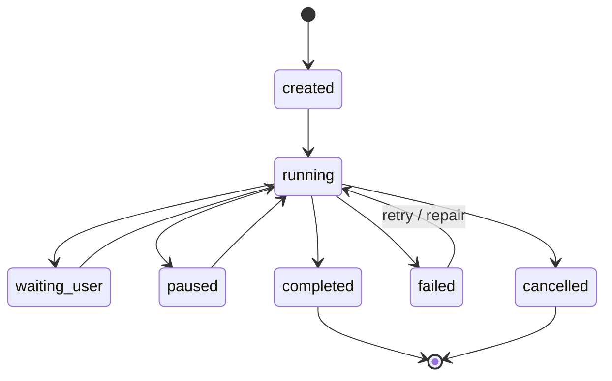
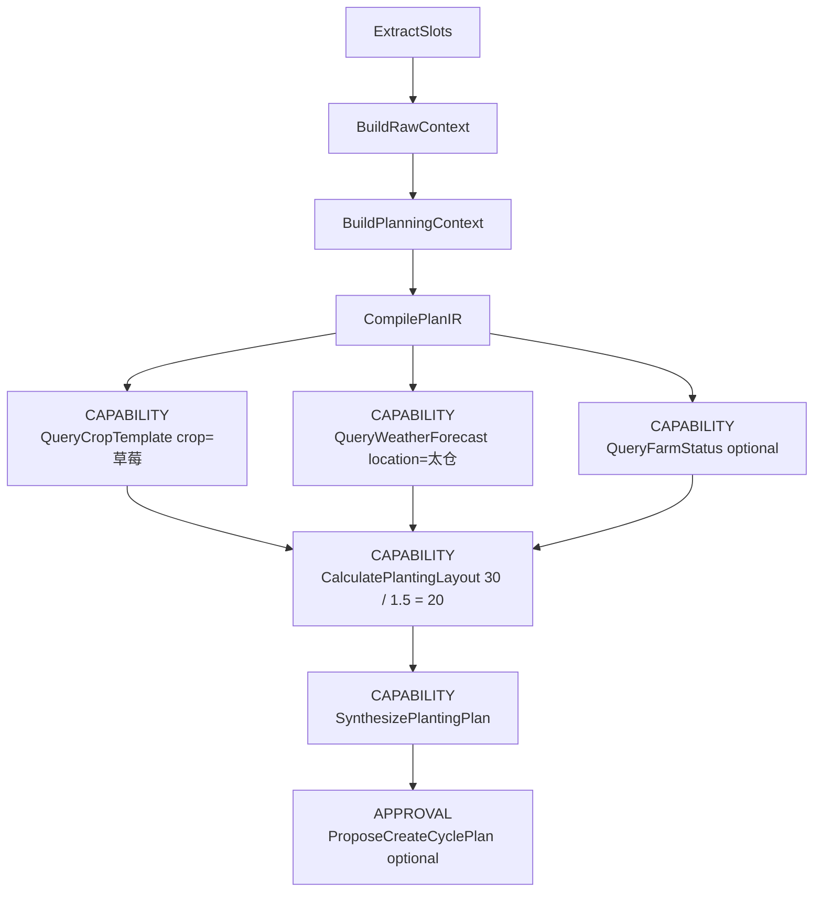

# Agent Task Graph 规划架构设计

## 状态

- 状态：设计中
- 日期：2026-07-29
- 目标读者：Agent 后端、Skill 治理、上下文引擎、Trace/评测维护者
- 关联文档：
  - [2026-07-10 Skill Capability Governance Design](./2026-07-10-skill-capability-governance-design.md)
  - [2026-07-24 Crop Cycle Setup Task Planning](./2026-07-24-crop-cycle-setup-task-planning.md)
  - [2026-07-26 Agent Context Engine And Observability Design](./2026-07-26-agent-context-engine-and-observability-design.md)
  - [2026-07-28 Skill Router Vector First Design](./2026-07-28-skill-router-vector-first-design.md)

## 背景

当前 Agent 主链的核心问题不是 Skill 数量变多，而是 LLM 在同一次请求里同时承担了三个职责：

- 理解用户意图和业务槽位。
- 决定业务流程和执行顺序。
- 直接选择 Skill/Tool 并解释结果。

这会导致同一句业务请求在不同轮次、不同上下文、不同模型采样下产生不稳定路径。例如：

```text
用户：帮我规划秋季草莓

今天：skillA -> skillB -> skillC
明天：skillA -> skillD
后天：直接 skillC
```

农业经营场景里，很多请求本质上不是单个 Skill，而是一个业务 Task。例如“太仓新租 30 亩，每块 1.5 亩，规划秋季草莓茬口”的真实入口应是 `planting_plan`，不是 `query_weather`、`query_crop_template`、`manage_cost` 或 `get_farm_status` 的自由组合。

最近 trace 也暴露了相同模式：

- request_id `a5cbb8ee`：用户输入“太仓新租30亩 每块1.5亩 规划秋季草莓”，链路进入 `fallback:model_choice_read_default`，选到 `get_farm_status`、`manage_cost`，最后 `30亩/1.5亩` 这类用户输入事实被 `tool_result_final_contradiction` 当作工具结果冲突误杀。
- request_id `6fbc60b7`：用户说“再试一下”，系统没有复用上一轮失败任务，独立路由到 `manage_cost.analyze_cost`，最后回复“需要先调用工具获取真实数据”，但真实问题是任务图丢失且工具调用错误。
- request_id `901b21ef`：用户说“今天就安排他们去芒果地吧”，Router 已选 `manage_work_orders.create_work_order`，但 `tool_choice=auto` 且模型没有 tool_calls，最终只做澄清。写操作不应靠模型临场决定是否进入确认流程，而应由 Task Graph 和 Capability 契约控制。

因此，本设计建议将入口从 “Skill Router + LLM 自由调用工具” 演进为：

```text
Raw Context -> Planning Context -> Task Planner -> Plan IR -> Graph Compiler -> Contract Task Graph -> Runtime Scheduler -> Operator Engine -> Capability -> Skill Adapter
```

Skill Router 仍然保留，但从主入口降级为 Capability Adapter 的候选机制、未知任务兜底机制和遗留兼容机制。

## 外部参考

本设计只采用成熟 Agent 系统中已经反复出现的工程模式，不引入大而全框架：

- [Anthropic: Building effective agents](https://www.anthropic.com/engineering/building-effective-agents)：区分预定义 workflow 与模型自主 agent，强调简单、可组合、可检查的模式。
- [OpenAI Agents SDK Orchestration](https://developers.openai.com/api/docs/guides/agents/orchestration)：强调 manager 持有最终响应、specialist 作为有边界能力参与的编排方式。
- [OpenAI Agents SDK Guardrails and human review](https://developers.openai.com/api/docs/guides/agents/guardrails-approvals)：强调 input/output/tool guardrails 与写操作审批，适合映射到节点级 validation 和 pending confirmation。
- [OpenAI Agents SDK Integrations and observability](https://developers.openai.com/api/docs/guides/agents/integrations-observability)：强调 model calls、tool calls、handoffs、guardrails、自定义 span 的结构化 trace。
- [LangGraph overview](https://docs.langchain.com/oss/python/langgraph/overview)：强调长流程、有状态、可持久化图执行，以及确定性步骤和 LLM 步骤混合。
- [Reflexion paper](https://arxiv.org/abs/2303.11366)：证明反馈信号和反思记忆能提升后续决策，但本系统更偏工程化的 step-level repair，而不是只在最终回复后做反思。

## 目标

1. 让 Task Type 成为农业 Agent 的业务入口，例如 `planting_plan`、`field_work_assignment`、`inventory_management`、`cost_analysis`、`pest_diagnosis`。
2. 引入 Plan IR，Planner 输出业务无关的计划中间表示，再由 Graph Compiler 编译成 Contract Task Graph。
3. Planner 输出 Plan IR，而不是固定 8 步模板，也不是直接输出 Skill 名称或底层 DAG 节点。
4. 在 Planner 前拆分 Raw Context Builder 和 Planning Context Builder，让 Planner 只消费结构化上下文，不直接翻 session、memory、RAG、DB、cache。
5. 将 Planner 拆成 Task Planner、Graph Planner、Execution Planner：分别负责业务任务、计划结构、执行策略。
6. 将“规则实现 + LLM 增强”作为每一层 Planner 的实现方式：规则负责必需槽位、硬约束、保守计划，LLM 负责模糊规划、可选节点判断和表达策略。
7. 在 Task Graph 和 Skill 之间增加 Operator Engine 与 Capability 层，Graph 面向 `IF`、`PARALLEL`、`APPROVAL`、`CAPABILITY` 等 Operator，Capability 面向 `QueryFarmStatus`、`QueryCropTemplate`、`CalculatePlantingLayout` 这类业务能力。
8. Task Graph 节点具备明确的 Input Contract 和 Output Contract，Graph Compiler 和 Runtime Scheduler 可以在运行前、运行中、运行后校验计划质量。
9. 增加 Runtime State，显式记录当前图、当前节点、重试次数、checkpoint、暂停、取消、等待用户等运行态。
10. Reflection 从最终回复兜底升级为节点级 Validation + Repair：每个节点执行后立即判断是否继续、重写、暂停或失败。
11. 增加 Offline Evaluation Layer，让 Planner、Slot、Graph、Tool、Repair、Latency、Token、Hallucination 可以跨版本对比。
12. 支持“再试一下”“按刚才的方案创建”等多轮语义，能复用 `last_failed_task_graph`、`pending_plan`、`agent_task_states`。
13. 保持对现有 Skill Registry、Vector-first Router、PendingPlan、Context Engine、Trace 结构的兼容。

## 非目标

1. 不一次性替换所有 Skill Router。
2. 不删除 vector-first router；它继续承担 unknown task、legacy skill、capability adapter 候选召回。
3. 不把 Planner prompt 做成唯一事实源；Schema、规则、契约、校验器必须和 prompt 分开版本管理。
4. 不建立 200+ 固定 Task Template；模板只描述候选能力、必选契约、业务约束，不复制成死流程。
5. 不在第一版实现完整通用 Workflow Engine；Operator Engine 先覆盖农业 Agent 必需的 `CAPABILITY`、`APPROVAL`、`IF`、`PARALLEL`。
6. 第一阶段不覆盖所有农业领域，只做可评测的垂直切片。

## 核心原则

### Task Type > Skill Type

用户说的是业务任务，不是 Skill 名称。系统先判断 `TaskType`，再由领域 Planner 生成执行图。Skill 是叶子节点背后的适配器。

### Template Constrains, Not Dictates

模板只约束可能需要哪些 Capability、哪些槽位必须补齐、哪些节点有风险，不固定执行顺序。

例如 `planting_plan` 的模板可以声明可能需要：

- `QueryFarmStatus`
- `QueryPlantingUnits`
- `QueryCropTemplate`
- `QueryWeatherForecast`
- `CalculatePlantingLayout`
- `SynthesizePlantingPlan`
- `ProposeCreateCyclePlan`

但如果用户已声明“我已经建好了地块”，Planner 可以跳过 `QueryPlantingUnits`；如果用户没有问预算，Planner 不应引入 `AnalyzeCost`。

### Rule-first Planning

Planner 不应一上来就把完整规划交给 LLM。Task Planner、Graph Planner、Execution Planner 都先由规则层处理确定性部分：

- 必需槽位：例如 `planting_plan` 必须有作物、季节或目标时间、面积范围。
- 补槽策略：缺少关键槽位时先问用户，不启动无关工具。
- 硬约束：写操作必须 pending confirmation，未知成本需求不自动查成本。
- 保守 Plan IR：当 LLM 输出失败或无效时，规则层可以生成最小可编译计划。

LLM 只处理规则难以穷举的部分，例如是否需要天气、如何组织种植批次、如何解释不确定性、如何把多个可选能力组合成更自然的业务方案。

### Plan IR Before Task Graph

Planner 不直接产出可执行图，而是产出 Plan IR。Plan IR 是业务无关、模型无关、运行时无关的计划语言。

```yaml
task: planting_plan
intent: plan_crop_cycle
steps:
  - id: crop_template
    op: query
    capability: QueryCropTemplate
    args:
      crop: 草莓
  - id: weather_window
    op: query
    capability: QueryWeatherForecast
    when: slots.location exists
  - id: layout
    op: calculate
    capability: CalculatePlantingLayout
    needs:
      - crop_template
  - id: response
    op: synthesize
    capability: SynthesizePlantingPlan
```

Graph Compiler 再把 Plan IR 编译成 Contract Task Graph。这样规则 planner、LLM planner、未来其他模型或人工模板都只需要输出同一套 IR，后续 Runtime、Operator、Skill Adapter 不必跟着改。

### Planner Has Three Layers

Planner 不只是一层 prompt。长期结构应拆成：

- Task Planner：识别业务任务、确认必需槽位、决定是否需要补问。
- Graph Planner：把任务表达为 Plan IR，确定步骤、依赖、可选能力和业务约束。
- Execution Planner：决定执行策略，例如缓存优先还是 API 优先、哪些节点可并行、哪些节点需要 checkpoint、哪些写操作进入 approval。

每层都可以采用 Rule + LLM 的组合，但默认先规则、后 LLM、再 schema validate。

### Planner Consumes PlanningContext

Planner 不直接读取 Memory、RAG、数据库、runtime cache。Context Builder 统一产出结构化 `PlanningContext`：

```json
{
  "task_type": "planting_plan",
  "slots": {
    "location": "太仓",
    "crop": "草莓",
    "season": "秋季",
    "total_area_mu": 30,
    "unit_area_mu": 1.5
  },
  "derived_facts": {
    "unit_count": {
      "value": 20,
      "formula": "30 / 1.5",
      "source": "user_input"
    }
  },
  "context_summary": {
    "default_farm_id": null,
    "farm_count": 0,
    "has_active_cycle": false,
    "last_failed_task_graph_id": null
  }
}
```

### Capability > Skill Adapter

Planner 看到的是业务能力，不是 `manage_cycle(operation=query)` 这种多操作 Skill。Capability 再映射到 Skill、RAG、知识库、确定性计算器或组合调用。

### Contract-first Task Graph

每个节点都声明输入、输出和失败语义。Graph Compiler 先校验图结构，Runtime Scheduler 再调度节点。

```text
QueryFarmStatus
  output: FarmStatus

QueryPlantingUnits
  input: FarmStatus
  output: PlantingUnitList

CalculatePlantingLayout
  input: PlanningSlotSet + CropTemplate
  output: PlantingLayout
```

### Validate After Each Step

节点执行后立即校验结果。如果 `QueryFarmStatus` 返回没有农场，不继续盲目执行 `QueryPlantingUnits`，而是进入 Plan Rewrite 或用户补充。

### Runtime State Is First-class

执行运行态不藏在局部变量里。每次执行都由 Runtime Scheduler 维护 `ExecutionState`，用于支持暂停、恢复、取消、节点重试、checkpoint、replay、图重写和用户确认。

这让“再试一下”“继续刚才的方案”“取消这个规划”“按这个创建”等多轮指令有稳定锚点，而不是重新进入 Skill Router。

### Graph Runs Operators

Task Graph 节点不直接等同于 Capability。节点应执行 Operator：

- `CAPABILITY`：调用 Capability，再由 Capability 选择 Skill/Tool/RAG/Calculator。
- `IF`：根据上下文或上游结果选择分支。
- `PARALLEL`：并行执行可独立节点。
- `MAP`：对多个地块、多个作物、多个日期窗口批量执行。
- `WAIT`：等待外部系统或用户补充。
- `APPROVAL`：进入 pending confirmation。
- `MERGE`：合并多路结果。

Capability 只是 Operator 的一种常见执行目标。这样以后多 Agent、人工审批、并行查询、批量地块规划不会被塞进 Capability 内部写 if/else。

### User Facts Are Evidence

用户输入事实和工具返回事实需要分层。用户说“30 亩、每块 1.5 亩”时，系统应记录为 `source=user_input`，并允许派生 `20 块`。不能因为工具没有返回 30 亩，就把最终回复中的 30 亩判定为工具冲突。

### Evaluation Is A Product Feature

Trace 只能回答“发生了什么”，Evaluation 要回答“新版本有没有更好”。每次 Task Graph 执行结束后，系统应生成结构化评测摘要，用于离线回放和版本对比。

关键指标包括：

- Task Type accuracy。
- Slot extraction accuracy。
- Plan IR validity。
- Graph compile success。
- Contract validation pass rate。
- Tool/capability success rate。
- Repair count and retry count。
- Hallucination / contradiction count。
- Latency and token cost。

## 总体架构



## 运行流程

1. Task Understanding：从用户输入和近期对话中识别业务任务，例如 `planting_plan` 或 `field_work_assignment`。
2. Slot Extraction：提取地点、作物、季节、面积、地块粒度、时间、人员、风险动作等结构化槽位。
3. Raw Context Build：汇总 session、memory、RAG、用户 profile、runtime cache、tool cache、DB 引用，形成未经裁剪的上下文集合。
4. Planning Context Build：从 Raw Context 中筛选 Planner 需要的摘要、事实、约束和引用，输出 `PlanningContext`。
5. Task Type Routing：选择领域 Task Planner。如果低置信度，进入 legacy skill router 或澄清。
6. Task Planning：规则层先做必需槽位检查、硬约束应用、风险动作策略；需要开放判断时再调用 LLM。
7. Plan IR Generation：Planner 输出 Plan IR，不直接输出可执行图。
8. Graph Compile：Graph Compiler 将 Plan IR 编译成 Contract Task Graph，绑定 Operator、Capability、Input/Output Contract、side effect policy。
9. Graph Validation：校验 Task Graph 无环、依赖存在、契约匹配、写操作有 confirmation 策略。
10. Runtime Init：创建 `ExecutionState` 和 checkpoint，记录当前图、可执行节点、重试次数、暂停/取消/等待用户状态。
11. Runtime Scheduling：Runtime Scheduler 根据依赖、状态、重试、并行策略选择下一批 Operator。
12. Operator Execution：Operator Engine 执行 `CAPABILITY`、`IF`、`PARALLEL`、`APPROVAL`、`WAIT`、`MERGE` 等节点。
13. Capability Execution：`CAPABILITY` Operator 调用 Capability；Capability 负责选择 Skill Adapter、RAG、工具或确定性计算。
14. Step Validation：每个节点完成后校验输出契约、业务一致性、事实来源、风险动作。
15. Repair or Continue：节点失败时进入 rewrite、retry、pause_for_user 或 hard_fail；节点通过后更新 Runtime State 并继续下游。
16. Response Synthesis：最终回复只消费 `PlanIR`、`TaskGraph`、`ExecutionState` 和通过校验的事实，不直接拼接原始工具日志。
17. Trace and Evaluation：写入 trace、task state、pending plan、reflection signal 和 offline evaluation report，为“再试一下”和“按这个创建”提供恢复点，也为 Planner 版本对比提供样本。

## 核心数据结构

以下为设计层伪代码，最终实现应使用 Pydantic，并和 trace serialization 保持兼容。

```python
from typing import Any, Literal

TaskType = Literal[
    "planting_plan",
    "field_work_assignment",
    "inventory_management",
    "cost_analysis",
    "pest_diagnosis",
    "legacy_skill_fallback",
]


class FactSource(BaseModel):
    kind: Literal["user_input", "tool_result", "memory", "rag", "derived", "system"]
    ref: str | None = None
    confidence: float = 1.0


class PlanningSlot(BaseModel):
    name: str
    value: Any
    source: FactSource
    normalized_unit: str | None = None


class PlanningSlotSet(BaseModel):
    task_type: TaskType
    slots: dict[str, PlanningSlot]
    missing_required_slots: list[str] = []


class RawContext(BaseModel):
    request_id: str
    session_id: str | None
    user_id: str | None
    memory_refs: list[str] = []
    history_refs: list[str] = []
    rag_refs: list[str] = []
    db_refs: list[str] = []
    tool_cache_refs: list[str] = []
    runtime_refs: list[str] = []


class PlanningContext(BaseModel):
    request_id: str
    session_id: str | None
    user_id: str | None
    task_type: TaskType
    slots: PlanningSlotSet
    context_summary: dict[str, Any]
    recent_task_refs: list[str]
    facts: dict[str, PlanningSlot]
    constraints: list[str]
    risk_policy: dict[str, Any]


class PlanIRStep(BaseModel):
    step_id: str
    op: Literal[
        "query",
        "calculate",
        "synthesize",
        "branch",
        "parallel",
        "approval",
        "wait",
        "merge",
    ]
    capability: str | None = None
    args: dict[str, Any] = {}
    needs: list[str] = []
    when: str | None = None
    optional: bool = False
    side_effect: Literal["none", "pending_only", "write"] = "none"


class PlanIR(BaseModel):
    ir_id: str
    task_type: TaskType
    intent: str
    planner_version: str
    context_hash: str
    steps: list[PlanIRStep]
    response_contract: str


class NodeContract(BaseModel):
    input_types: list[str]
    output_type: str
    required_slots: list[str] = []
    side_effect: Literal["none", "pending_only", "write"] = "none"
    failure_policy: Literal["repair", "ask_user", "skip", "hard_fail"] = "repair"


class CapabilityInvocation(BaseModel):
    capability: str
    operation: str | None = None
    args: dict[str, Any]
    adapter_hint: str | None = None


class OperatorInvocation(BaseModel):
    operator: Literal[
        "CAPABILITY",
        "IF",
        "FOR",
        "MAP",
        "PARALLEL",
        "WAIT",
        "APPROVAL",
        "MERGE",
    ]
    args: dict[str, Any] = {}
    capability_invocation: CapabilityInvocation | None = None


class TaskGraphNode(BaseModel):
    node_id: str
    label: str
    source_ir_step_id: str | None
    invocation: OperatorInvocation
    contract: NodeContract
    depends_on: list[str] = []
    optional: bool = False


class TaskGraph(BaseModel):
    graph_id: str
    source_ir_id: str
    task_type: TaskType
    planner_version: str
    context_hash: str
    nodes: list[TaskGraphNode]
    response_contract: str


class CompileResult(BaseModel):
    ir_id: str
    graph: TaskGraph
    compile_warnings: list[str] = []
    contract_errors: list[str] = []


class PlannerDecision(BaseModel):
    task_type: TaskType
    rule_planner_version: str
    llm_planner_version: str | None
    plan_ir: PlanIR
    compile_result: CompileResult
    required_slot_questions: list[str] = []
    hard_constraints_applied: list[str] = []
    llm_used_for: list[str] = []


class ExecutionState(BaseModel):
    execution_id: str
    graph_id: str
    status: Literal[
        "created",
        "running",
        "paused",
        "waiting_user",
        "cancelled",
        "completed",
        "failed",
    ]
    current_node_id: str | None
    checkpoint_id: str | None = None
    completed_node_ids: list[str] = []
    failed_node_ids: list[str] = []
    dead_node_ids: list[str] = []
    skipped_node_ids: list[str] = []
    retry_counts: dict[str, int] = {}
    visited_node_ids: list[str] = []
    pause_reason: str | None = None
    waiting_for: Literal["slot", "confirmation", "external_result"] | None = None
    timeout_at: str | None = None
    last_error_code: str | None = None


class NodeResult(BaseModel):
    node_id: str
    status: Literal["success", "skipped", "needs_user", "failed"]
    output_type: str | None
    output: dict[str, Any] | None
    facts: dict[str, PlanningSlot]
    error_code: str | None = None


class ValidationResult(BaseModel):
    status: Literal["pass", "repair", "ask_user", "fail"]
    reasons: list[str]
    accepted_facts: dict[str, PlanningSlot]
    rejected_facts: dict[str, str]


class PlanRewriteRequest(BaseModel):
    graph_id: str
    execution_id: str
    source_ir_id: str
    failed_node_id: str
    reason_code: str
    available_context: PlanningContext
    runtime_state: ExecutionState
    prior_results: list[NodeResult]


class EvaluationReport(BaseModel):
    evaluation_id: str
    request_id: str
    task_type: TaskType
    planner_version: str
    slot_score: float
    plan_ir_valid: bool
    graph_compile_success: bool
    contract_pass_rate: float
    capability_success_rate: float
    repair_count: int
    retry_count: int
    hallucination_count: int
    latency_ms: int
    token_count: int
```

## Planner 分层设计

Planner 分为 Task Planner、Graph Planner、Execution Planner。规则实现和 LLM 增强是每一层可以采用的实现策略，不再代表唯一 Planner 层级。

### Task Planner

Task Planner 负责回答“用户到底要完成什么业务任务”：

- 识别 `TaskType`，例如 `planting_plan`、`field_work_assignment`。
- 判断是否是 retry、resume、cancel、confirm 等运行时意图。
- 检查任务必需槽位，例如 `planting_plan` 的作物、季节/时间、面积。
- 缺少关键槽位时生成补问，而不是启动无关工具。

Task Planner 优先走规则；低置信度或跨领域请求才引入 LLM。

### Graph Planner

Graph Planner 负责把任务表达成 Plan IR：

- 选择业务步骤，例如查询作物模板、查询天气、计算地块拆分、生成方案。
- 决定步骤依赖和可选条件。
- 应用 Capability 白名单和黑名单，例如未提成本时不加入 `AnalyzeCost`。
- 应用风险动作策略，例如写操作只能进入 `approval` 或 `pending_only`。

Graph Planner 输出 Plan IR，不直接输出可执行 Task Graph。

### Execution Planner

Execution Planner 负责执行策略，不改变业务语义：

- 选择缓存优先还是 API 优先。
- 标记哪些节点可以并行。
- 标记哪些节点需要 checkpoint。
- 标记 timeout、retry limit、failure policy。
- 给 `APPROVAL`、`WAIT`、`PARALLEL`、`MERGE` 等 Operator 添加运行参数。

Execution Planner 的输出仍然写回 Plan IR 或 compile hints，再交给 Graph Compiler。

### Rule + LLM 组合

每一层默认都是规则优先：

- Rule 负责必需槽位、硬约束、风险动作、最小可执行计划。
- LLM 负责规则难以穷举的开放判断，例如是否需要天气、如何组织种植批次、如何解释不确定性。
- LLM 输出必须通过 schema validate。无法通过时使用规则层的保守 Plan IR。

### Planner 版本

每次计划都记录：

```json
{
  "task_planner_version": "task_router.v1",
  "graph_planner_version": "planting_plan.graph.v1",
  "execution_planner_version": "execution_policy.v1",
  "rule_planner_version": "planting_plan.rules.v1",
  "llm_planner_version": "planting_plan.llm.v1",
  "planner_version": "planting_plan.v1"
}
```

这些版本分别用于定位任务识别、计划结构、执行策略、规则、prompt 和整体计划行为的变化。

## Plan IR 与 Graph Compiler

Plan IR 是 Planner 和 Runtime 之间的边界。它应该保持三点：

- 业务可读：开发者能直接看懂步骤和意图。
- 执行无关：不绑定具体 Skill、Tool、Adapter 的内部细节。
- 可编译：每个 step 都能被 Graph Compiler 转换成 Operator 节点和 Contract。

Graph Compiler 负责：

- 将 `query/calculate/synthesize/approval/wait/parallel/merge` 这类 IR op 映射成 Operator。
- 将 Capability 名称解析为 Capability Catalog 条目。
- 绑定 Input Contract、Output Contract、side effect policy、failure policy。
- 根据 `needs`、`when`、`optional` 生成 DAG 依赖。
- 拒绝无 contract、未知 capability、写操作无 approval 的 IR。

示例编译：

```text
PlanIRStep(op=query, capability=QueryWeatherForecast)
  -> TaskGraphNode(operator=CAPABILITY, capability=QueryWeatherForecast)

PlanIRStep(op=approval, capability=ProposeCreateCyclePlan)
  -> TaskGraphNode(operator=APPROVAL, side_effect=pending_only)

PlanIRStep(op=parallel, needs=[crop_template, weather])
  -> TaskGraphNode(operator=PARALLEL)
```

## Runtime State 设计

`ExecutionState` 是 Task Graph 运行时的事实源。执行层不直接执行 Graph，而是 Runtime Scheduler 根据 `ExecutionState` 决定下一批可执行 Operator。

核心职责：

- 记录当前执行到哪个节点。
- 记录每个节点的完成、跳过、失败、重试次数。
- 表达暂停、取消、等待用户、等待确认、timeout、dead node 等状态。
- 维护 checkpoint，支持 replay 和断点恢复。
- 为 retry/rewrite 提供上一轮可恢复锚点。
- 为 trace/admin UI 展示当前进度。

状态流转：



运行约束：

- `waiting_user` 必须携带 `waiting_for` 和用户可回答的问题。
- `paused` 必须携带 `pause_reason`。
- 每个节点必须有最大重试次数，超过后进入 `repair` 或 `failed`。
- 图重写时保留旧 `graph_id` 引用，并生成新 `graph_id`，便于 trace 追踪。
- pending confirmation 不是 completed，而是 `waiting_user(waiting_for="confirmation")`。

建议 Runtime 子模块：

```text
backend/app/agent/task_graph/runtime/
  __init__.py
  state.py
  scheduler.py
  checkpoint.py
  replay.py
  timeout.py
```

其中：

- `state.py` 定义 `ExecutionState` 和状态流转。
- `scheduler.py` 根据 Graph、State、Operator policy 选择下一批节点。
- `checkpoint.py` 持久化关键执行点。
- `replay.py` 支持离线回放和失败恢复。
- `timeout.py` 处理节点级和图级超时。

## Operator Engine 设计

Operator Engine 是 Runtime Scheduler 的执行层。它不理解农业业务，只理解工作流控制语义。

| Operator | 语义 | 第一阶段是否需要 |
| --- | --- | --- |
| `CAPABILITY` | 调用一个 Capability | 必须 |
| `APPROVAL` | 生成待确认动作并等待用户确认 | 必须 |
| `IF` | 条件分支 | 建议 |
| `PARALLEL` | 并行执行多个独立节点 | 建议 |
| `WAIT` | 等待用户、外部任务或异步结果 | 建议 |
| `MERGE` | 合并多路结果 | 建议 |
| `MAP` | 对列表批量执行 | 第二阶段 |
| `FOR` | 有状态循环 | 第二阶段 |

第一阶段不需要实现完整编排语言，但接口应预留 Operator 层，避免把并行、审批、条件分支写死在 Capability 或执行层内部。

## Capability 层设计

Capability 是 Planner 能看到的稳定能力边界。Skill、Tool、RAG、知识库、确定性计算器都藏在 Capability 后面。

| Capability | 说明 | 首选实现 | 备注 |
| --- | --- | --- | --- |
| `QueryFarmStatus` | 查询用户农场概况 | `get_farm_status` | 读操作 |
| `QueryActiveCycles` | 查询当前茬口/种植周期 | `manage_crop_cycle.query_cycles` | 读操作 |
| `QueryPlantingUnits` | 查询地块/单元列表 | `manage_planting_units.query_units` | 读操作 |
| `QueryCropTemplate` | 查询作物模板和种植参数 | `manage_crop_templates.query_templates` | 读操作，可接 RAG |
| `QueryWeatherForecast` | 查询天气或气候窗口 | weather adapter | 读操作 |
| `CalculatePlantingLayout` | 面积、地块数、批次、时间窗口计算 | deterministic calculator | 不依赖 LLM |
| `SynthesizePlantingPlan` | 汇总成用户可读规划方案 | response synthesizer | 不是 Skill |
| `ProposeCreateCyclePlan` | 生成待确认的创建茬口计划 | pending_plan adapter | `pending_only` |
| `ProposeWorkOrderPlan` | 生成待确认的工单计划 | pending_plan adapter | `pending_only` |
| `AnalyzeCost` | 成本估算 | cost capability | 只在任务需要成本时进入 Task Graph |

设计约束：

- Planner 不直接输出 `manage_*` Skill 名称。
- Capability Catalog 中每个能力都声明输入 schema、输出 schema、风险级别、允许的 adapter。
- 多操作 Skill 需要拆成多个 Capability，例如 `QueryCurrentCycle`、`CreateCycleDraft`、`UpdateCycleDraft`。
- 写操作 Capability 默认只生成 pending plan，不直接落库；真正写入由确认链路控制。
- Capability 可以组合多个 Skill，但必须返回单一 Output Contract。

### Capability Draft 自动生成

Capability Catalog 不应完全手写。Skill 数量超过几十个后，手工维护会成为稳定性风险。

建议从 Skill Registry 自动生成 Capability Draft：

```yaml
skill: manage_crop_cycle
operations:
  query_cycles:
    draft_capability: QueryCropCycles
  create_cycle:
    draft_capability: ProposeCreateCropCycle
  update_cycle:
    draft_capability: ProposeUpdateCropCycle
```

自动生成内容：

- capability name。
- source skill 和 operation。
- 输入参数草稿。
- 输出 schema 草稿。
- read/write 风险初判。
- skill tags 和 domain。

人工补充内容：

- 业务描述。
- 精确 Input/Output Contract。
- side effect policy。
- failure policy。
- adapter priority。
- 是否允许 Planner 直接使用。

这样可以让 Skill Registry 继续作为资产入口，但 Capability Catalog 成为 Planner 和 Graph Compiler 面向的稳定协议。

## 建议目录结构

建议新增独立目录 `backend/app/agent/task_graph/`，因为 Task Graph 是 Agent 主链编排能力，不只是 `runtime` 的辅助工具。

```text
backend/app/agent/task_graph/
  __init__.py
  models.py
  router.py
  slot_extractor.py
  raw_context_builder.py
  planning_context_builder.py
  task_planner.py
  graph_planner.py
  execution_planner.py
  plan_ir.py
  compiler.py
  validator.py
  repair.py
  response.py
  evaluation.py
  runtime/
    __init__.py
    state.py
    scheduler.py
    checkpoint.py
    replay.py
    timeout.py
  operators/
    __init__.py
    engine.py
    builtins.py
  capabilities/
    __init__.py
    catalog.py
    adapters.py
    draft_generator.py
  tasks/
    __init__.py
    planting_plan/
      __init__.py
      schema.py
      task_planner.py
      graph_planner.py
      execution_planner.py
      rules.py
      prompts/
        planner.md
    field_work_assignment/
      __init__.py
      schema.py
      task_planner.py
      graph_planner.py
      execution_planner.py
      rules.py
      prompts/
        planner.md
```

版本管理方式：

```text
Planner v1
  task_schema/
  planning_rules/
  plan_ir_schema/
  graph_templates/
  slot_schema/
  validation_rules/
  execution_policy/
  planner_prompt.md
  runtime_state_schema/
  evaluation_schema/
```

落地到代码时可以用 Python package 表达版本，也可以先用 `planner_version="planting_plan.v1"` 写入 trace。关键是版本号必须进入 `TaskGraph`，这样线上 trace、回归评测和行为变化才能对齐。

## 第一阶段垂直切片：planting_plan

第一阶段建议只实现 `planting_plan`，覆盖“新租地、规划秋季草莓茬口”这类高频规划任务。它能同时验证 Task Type、Slot、Raw Context、Planning Context、Task Planner、Plan IR、Graph Compiler、Capability、Task Graph、Runtime State、Operator、Validation、Response Synthesis，不会把架构摊得太宽。

### 输入样例

```text
我在太仓新租了30亩地 每块地1.5亩 帮我规划下茬口，秋季草莓
```

### 期望槽位

```json
{
  "task_type": "planting_plan",
  "slots": {
    "location": "太仓",
    "crop": "草莓",
    "season": "秋季",
    "total_area_mu": 30,
    "unit_area_mu": 1.5
  },
  "derived_facts": {
    "unit_count": 20
  }
}
```

### 期望 Task Graph

Planner 先输出 Plan IR：

```yaml
task: planting_plan
intent: plan_crop_cycle
steps:
  - id: crop_template
    op: query
    capability: QueryCropTemplate
    args:
      crop: 草莓
  - id: weather_window
    op: query
    capability: QueryWeatherForecast
    args:
      location: 太仓
    optional: true
  - id: layout
    op: calculate
    capability: CalculatePlantingLayout
    args:
      total_area_mu: 30
      unit_area_mu: 1.5
    needs:
      - crop_template
  - id: response
    op: synthesize
    capability: SynthesizePlantingPlan
    needs:
      - layout
```

Graph Compiler 再编译成 Contract Task Graph：



### 动态裁剪规则

- 用户已说明“我已经建好了地块”：跳过 `QueryPlantingUnits`，只在回复里标注“按已建地块承接”。
- 用户没有提预算或成本：不加入 `AnalyzeCost`。
- 用户只问“能不能种”：输出可行性判断，不生成创建茬口 pending plan。
- 用户说“按这个创建”：复用上一轮 `PlantingPlan`，进入 `ProposeCreateCyclePlan`。
- 缺少关键槽位如作物或季节：先询问补槽，不调用无关 Skill。

### 响应契约

`planting_plan` 的最终回复应至少包含：

- 识别到的种植对象、地点、季节、面积。
- 面积拆分结果：例如 30 亩 / 1.5 亩 = 20 块。
- 推荐的茬口安排：播种/定植/管理/采收窗口。
- 依赖事实来源：用户输入、作物模板、天气、系统已有农场数据。
- 不确定项：缺少农场、缺少地块、缺少预算、天气不可用等。
- 下一步建议：仅当需要写入系统时生成可确认方案，不直接执行写操作。

## 与现有模块关系

### Skill Router

Skill Router 从入口主干降级为：

- legacy skill fallback：未知任务仍可走现有 vector-first router。
- capability adapter selection：Capability 内部可以借助 Skill Router 找候选 Skill。
- eval baseline：用于对比 Task Graph 前后的路由稳定性。

### Context Engine

`backend/app/context/` 继续作为事实和上下文来源，但进入 Planner 前拆成两层：

- Raw Context Builder：负责汇总 memory、history、RAG、tool cache、DB 引用、runtime refs。它可以宽一点，但只输出引用和结构化原始事实，不直接喂给 Planner。
- Planning Context Builder：负责从 Raw Context 中裁剪出 Planner 需要的摘要、槽位、约束、事实来源和最近任务状态。

新增 Builder 时应复用现有 builder、selectors、pack、task_state，不让 Planner 自己读散落的数据源。

### PendingPlan

现有 `pending_plan_models.py`、`pending_plan_service.py` 保留。Task Graph 中所有有副作用的 Capability 默认产出 pending plan，由确认链路执行。

### Reflector

Reflector 拆成两个层级：

- node-level validator：围绕每个 Capability 的输入、输出、事实来源、风险动作做校验。
- response-level guardrail：最终回复前做事实一致性和安全表达检查。

其中 `tool_result_final_contradiction` 必须识别事实来源，不能把 `source=user_input` 或 `source=derived` 的数字当成工具冲突。

### Trace

Trace 需要新增或补齐以下字段：

```json
{
  "task_type": "planting_plan",
  "raw_context_ref": "raw_ctx_...",
  "planning_context_hash": "...",
  "plan_ir_id": "pir_...",
  "task_graph_id": "tg_...",
  "planner_version": "planting_plan.v1",
  "task_planner_version": "task_router.v1",
  "graph_planner_version": "planting_plan.graph.v1",
  "execution_planner_version": "execution_policy.v1",
  "rule_planner_version": "planting_plan.rules.v1",
  "llm_planner_version": "planting_plan.llm.v1",
  "execution_state": {
    "execution_id": "exec_...",
    "status": "running",
    "current_node_id": "query_crop_template",
    "checkpoint_id": "chk_...",
    "retry_counts": {}
  },
  "nodes": [
    {
      "node_id": "query_crop_template",
      "operator": "CAPABILITY",
      "capability": "QueryCropTemplate",
      "status": "success",
      "validation_status": "pass"
    }
  ],
  "repair_events": [],
  "fact_sources": {
    "total_area_mu": "user_input",
    "unit_count": "derived"
  }
}
```

### Evaluation Layer

Trace 之后增加 Offline Evaluation。它不参与线上响应，但每次请求结束后都可以生成 `EvaluationReport`，供回归、A/B 和版本比较使用。

示例：

```json
{
  "task": "planting_plan",
  "planner_version": "planting_plan.v1",
  "task_score": 0.96,
  "slot_score": 1.0,
  "plan_ir_valid": true,
  "graph_compile_success": true,
  "contract_pass_rate": 1.0,
  "capability_success_rate": 0.95,
  "repair_count": 0,
  "retry_count": 1,
  "hallucination_count": 0,
  "latency_ms": 3200,
  "token_count": 6500
}
```

评测报告应支持按 `planner_version`、`task_type`、`capability`、`request_id` 聚合。这样 Planner v2/v3 上线前可以离线回放同一批 trace，比较是否真的变好。

## 坏会话修复映射

### request_id a5cbb8ee

原问题：

- 任务被错误当成普通 Skill 路由。
- 成本 Skill 被误选。
- 用户输入数字被最终反思误判为工具冲突。

Task Graph 后的行为：

- Task Type Router 识别 `planting_plan`。
- Slot Extractor 抽取 `location=太仓`、`crop=草莓`、`total_area_mu=30`、`unit_area_mu=1.5`。
- Task Planner 确认任务和槽位，Graph Planner 输出 Plan IR，LLM 只补充天气、风险提示和表达策略。
- Graph Compiler 编译出包含 `QueryCropTemplate`、`QueryWeatherForecast`、`CalculatePlantingLayout`、`SynthesizePlantingPlan` 的 Task Graph。
- `30`、`1.5`、`20` 分别标记为 `user_input`、`user_input`、`derived`，不触发工具结果冲突。

### request_id 6fbc60b7

原问题：

- “再试一下”没有复用上一轮失败任务。
- 系统重新路由到 `manage_cost.analyze_cost`。

Task Graph 后的行为：

- Retry Control 识别当前输入是 retry intent。
- Context Builder 注入 `last_failed_task_graph_id` 和失败节点。
- Runtime Scheduler 从 checkpoint 恢复上一轮 `planting_plan` 图的失败节点和重试次数。
- Repair 根据上一轮执行状态重试失败节点或重写图，不重新解释成成本分析。

### request_id 901b21ef

原问题：

- Router 选中写操作 Skill，但模型没有 tool_calls。
- 写任务没有稳定进入确认链路。

Task Graph 后的行为：

- Task Type Router 识别 `field_work_assignment`。
- Task Planner 先检查目标地块、人员、日期和写操作确认策略。
- Plan IR 经 Graph Compiler 后生成 `ResolveTargetField`、`ResolveWorkers`、`ProposeWorkOrderPlan`。
- `ProposeWorkOrderPlan` 的 contract 为 `side_effect=pending_only`。
- Operator Engine 必须执行 `APPROVAL` 或 ask_user，不允许静默退化为泛泛澄清。

## 分阶段落地计划

### Phase 0：Plan IR、观测和模型骨架

目标：建立 Raw Context、Plan IR、Task Graph、Runtime State、Evaluation 数据模型和 trace 观测，不改变主链行为。

建议变更：

- 新增 `backend/app/agent/task_graph/models.py`。
- 新增 `backend/app/agent/task_graph/plan_ir.py`。
- 新增 `backend/app/agent/task_graph/compiler.py` 的空壳和 schema validate。
- 新增 `backend/app/agent/task_graph/capabilities/catalog.py`。
- 新增 `backend/app/agent/task_graph/evaluation.py` 的报告模型。
- 在 trace payload 中预留 `raw_context_ref`、`planning_context_hash`、`plan_ir_id`、`task_graph_id`、`planner_version`、`execution_state`、`node_results`、`repair_events`、`evaluation_report`。
- 增加 `FactSource`，为用户输入、工具结果、记忆、RAG、派生事实分层。
- 增加 `ExecutionState`，为暂停、恢复、取消、重试和等待用户建立统一运行态。

验收：

- 现有 Agent 请求行为不变。
- trace 可记录空 Plan IR、空 Task Graph 和空 Execution State 字段。
- 单测覆盖模型 serialization 和事实来源分类。
- 单测覆盖 Runtime State 状态流转。
- 单测覆盖 Plan IR schema validate。

### Phase 1：planting_plan Plan IR 垂直切片

目标：让“太仓新租 30 亩，每块 1.5 亩，规划秋季草莓”先稳定产出 Plan IR，再编译成 Task Graph。

建议变更：

- 新增 `task_graph/router.py`，先支持 `planting_plan` 和 `legacy_skill_fallback`。
- 新增 `task_graph/slot_extractor.py`，覆盖地点、作物、季节、面积、地块粒度。
- 新增 `tasks/planting_plan/task_planner.py`、`graph_planner.py`、`execution_planner.py` 和 `rules.py`。
- 新增 `CalculatePlantingLayout` 确定性 Capability。
- 新增 `SynthesizePlantingPlan` response synthesizer。
- 新增 Graph Compiler 对 `query/calculate/synthesize/approval` 的编译支持。

验收：

- 输入样例稳定识别为 `planting_plan`。
- Plan IR 可读、可 validate、可编译。
- Task Graph 中不出现 `AnalyzeCost`，除非用户明确询问成本。
- 最终回复保留 30 亩、1.5 亩、20 块，并标明事实来源。
- `tool_result_final_contradiction` 不误杀用户输入和派生数字。

### Phase 2：Runtime Scheduler、Checkpoint 和 Repair

目标：让执行层不直接执行 Graph，而是由 Runtime Scheduler 基于 Execution State、checkpoint 和 replay 执行 Operator。

建议变更：

- 新增 `task_graph/repair.py`。
- 新增 `task_graph/runtime/state.py`，持久化当前节点、失败节点、dead node、重试次数和等待用户原因。
- 新增 `task_graph/runtime/scheduler.py`，选择下一批可执行 Operator。
- 新增 `task_graph/runtime/checkpoint.py` 和 `replay.py`。
- 在 Context Builder 中注入最近失败图、失败节点、失败原因。
- 支持节点级 retry、图级 rewrite、ask_user 三种修复动作。

验收：

- request_id `6fbc60b7` 的同类重试不再重新路由到成本分析。
- retry trace 指向原始 `task_graph_id` 和 `execution_id`。
- checkpoint 可以恢复到失败节点。
- 重试失败时能输出明确失败节点和需要用户补充的信息。

### Phase 3：Operator Engine 和 field_work_assignment 第二切片

目标：覆盖“今天就安排他们去芒果地吧”这类写任务。

建议变更：

- 新增 `task_graph/operators/engine.py`。
- 第一版支持 `CAPABILITY`、`APPROVAL`、`IF`、`PARALLEL`、`WAIT`、`MERGE`。
- 新增 `field_work_assignment` Task Type。
- 新增 `ResolveTargetField`、`ResolveWorkers`、`ProposeWorkOrderPlan` Capability。
- 写 Capability 默认进入 pending plan。
- pending confirmation 进入 `ExecutionState(status="waiting_user", waiting_for="confirmation")`。
- Tool choice 不再依赖模型是否自发发起 tool_calls。

验收：

- request_id `901b21ef` 的同类输入要么生成 pending work order plan，要么明确 ask_user 缺少哪些槽位。
- 不允许直接写库。
- 不允许只输出泛泛澄清。
- Trace 中能看到等待确认的 Execution State。

### Phase 4：Capability Catalog 自动生成和收敛

目标：逐步把高频 Skill 从直接暴露给 Planner 收敛到 Capability。

建议变更：

- 新增 `capabilities/draft_generator.py`，从 Skill Registry 生成 Capability Draft。
- 为现有 `manage_*` Skill 建立 Capability 包装和人工补充 contract。
- 将 Skill Registry 的描述、参数、风险标签同步到 Capability Catalog。
- 对 legacy vector router 增加统计，找出高频 fallback task。

验收：

- 新 Task 默认先看 Capability，不直接看 Skill。
- legacy fallback 率下降。
- capability adapter 的输入输出契约覆盖主要 Skill。

### Phase 5：Offline Evaluation

目标：让 Agent Runtime 的每次改动都能被离线回放和量化对比。

建议变更：

- 新增 `task_graph/evaluation.py`。
- 为 trace 生成 `EvaluationReport`。
- 支持按 `planner_version`、`task_type`、`capability` 聚合指标。
- 建立 `planting_plan` 和 `field_work_assignment` 的回归样例集。

验收：

- 每次 Task Graph 执行结束后生成评测摘要。
- Planner v1/v2 可以在同一批样例上比较 slot、plan_ir、graph_compile、contract、tool、repair、latency、token。
- 回归样例能暴露 `a5cbb8ee`、`6fbc60b7`、`901b21ef` 同类问题。

## 测试与评测

### 单元测试

- `tests/agent/task_graph/test_task_type_router.py`
  - `planting_plan` 识别。
  - retry intent 识别。
  - unknown task 进入 legacy fallback。
- `tests/agent/task_graph/test_slot_extractor.py`
  - 面积、地块粒度、作物、季节、地点抽取。
  - 用户输入数字保留 `source=user_input`。
- `tests/agent/task_graph/test_planning_context.py`
  - Raw Context Builder 汇总引用，不直接喂给 Planner。
  - Planning Context Builder 不泄漏全量 memory，只输出结构化摘要。
  - 注入 `last_failed_task_graph_id`。
- `tests/agent/task_graph/test_plan_ir.py`
  - `planting_plan` Plan IR schema validate。
  - 未知 op、未知 capability、写操作缺 approval 会被拒绝。
- `tests/agent/task_graph/test_graph_compiler.py`
  - Plan IR 可编译为 Contract Task Graph。
  - Task Graph 无环。
  - 节点依赖和 contract 匹配。
- `tests/agent/task_graph/test_planting_plan_planner.py`
  - Task Planner 识别任务和必需槽位。
  - Graph Planner 输出 Plan IR。
  - Execution Planner 标记 optional、parallel、checkpoint、retry policy。
  - 未提预算时不加入 `AnalyzeCost`。
- `tests/agent/task_graph/test_execution_state.py`
  - created/running/waiting_user/paused/completed/failed 状态流转。
  - retry count 达上限后进入 repair 或 failed。
  - pending confirmation 映射为 waiting_user。
- `tests/agent/task_graph/test_operator_engine.py`
  - `CAPABILITY` 调用 Capability。
  - `APPROVAL` 生成 pending confirmation。
  - `IF/PARALLEL/WAIT/MERGE` 的基本控制语义。
- `tests/agent/task_graph/test_runtime_validation.py`
  - 节点输出 contract 校验。
  - `QueryFarmStatus` 无农场时触发 rewrite 或 ask_user。
- `tests/agent/task_graph/test_capability_draft_generator.py`
  - 从 Skill Registry operation 生成 Capability Draft。
  - 写操作 draft 默认需要人工补充 side effect policy。
- `tests/agent/task_graph/test_evaluation.py`
  - Task Graph 执行结束后生成 `EvaluationReport`。
  - 同一批样例可按 planner version 聚合比较。
- `tests/agent/test_reflector.py`
  - 用户输入数字和派生数字不触发工具结果冲突。

### 回归样例

- “我在太仓新租了30亩地 每块地1.5亩 帮我规划下茬口，秋季草莓”
- “我已经建好了地块，帮我规划秋季草莓”
- “预算大概要多少，顺便规划一下秋季草莓”
- “再试一下”
- “按刚才那个方案创建”
- “今天就安排他们去芒果地吧”

### 建议命令

```bash
PYTHONDONTWRITEBYTECODE=1 .venv/bin/pytest tests/agent/task_graph tests/agent/planning tests/agent/test_reflector.py -q
PYTHONDONTWRITEBYTECODE=1 .venv/bin/ruff check app/agent/task_graph tests/agent/task_graph
bash scripts/check-complexity-budget.sh
```

## 风险与取舍

### 过度架构风险

Task Graph、Plan IR、Operator Engine 容易膨胀成一套通用平台工程。控制方式是先做 `planting_plan` 一个垂直切片，只实现最小 Plan IR 和最小 Operator 集，用 trace 和回归样例证明稳定性，再扩展第二个 Task。

### LLM 规划不稳定

LLM 输出必须经过 Plan IR schema validate。失败时使用规则层生成保守 Plan IR，不让无效 JSON、未知 op、未知 capability 或无 contract 节点进入 Graph Compiler。

### Plan IR 设计过早固化

Plan IR 第一版只覆盖高频农业任务需要的 `query/calculate/synthesize/approval/wait/parallel/merge`，并通过 `planner_version` 和 `ir_id` 进入 trace。新增 op 必须有 compiler、operator、contract 和测试，不把一次性业务分支塞进 IR 语言。

### Runtime State 膨胀

Runtime State 只记录执行控制所需字段，不保存全量节点输出。节点输出继续放在 `NodeResult` 和 trace 中，Runtime State 只持有引用和状态摘要。

### Operator Engine 复杂度

第一阶段只实现 `CAPABILITY` 和 `APPROVAL` 的完整执行，`IF/PARALLEL/WAIT/MERGE` 可以先做结构和测试桩。只有当 `planting_plan` 或 `field_work_assignment` 的回归样例证明需要时，才补真实并行和等待语义。

### Capability Catalog 维护成本

短期用 Python catalog 管理核心能力。中期从 Skill Registry 自动生成一部分只读 Capability，再人工补充业务语义、风险标签和 contract。

### Context 变胖

Raw Context 可以宽，PlanningContext 必须薄。PlanningContext 只放结构化摘要、引用 ID 和必要事实，不注入全量列表。需要详情时由 Capability 查询。

### Evaluation 指标失真

离线评测只能作为版本比较工具，不能替代人工审查。第一阶段先以回归样例和 trace-derived metrics 为主，不把低质量自动打分作为上线门禁。

### Vector-first Router 的位置

Vector-first Router 不再决定主流程，但仍保留价值：

- unknown task 的兜底。
- Capability 内部选择 adapter。
- 作为新旧链路 A/B 评测基线。

## 审核决策点

1. 第一阶段是否只做 `planting_plan`，还是同时纳入 `field_work_assignment`。
2. Task Graph 目录是否采用 `backend/app/agent/task_graph/`，还是放入 `backend/app/agent/runtime/task_graph/`。
3. Plan IR 第一版是否只支持 `query/calculate/synthesize/approval`，还是同步预留 `IF/PARALLEL/WAIT/MERGE`。
4. Operator Engine 第一阶段是否只执行 `CAPABILITY/APPROVAL`，其余 Operator 先做编译和验证。
5. Capability Catalog 第一版使用 Python catalog，还是直接引入 YAML/JSON registry。
6. Capability Draft Generator 是否在 Phase 4 做，还是提前到 Phase 1 降低人工 catalog 成本。
7. RawContext、PlanningContext、PlanIR、ExecutionState 是否进入 admin trace UI，并展示槽位、事实来源、Task Graph 节点、当前节点、等待原因和 repair event。
8. `CalculatePlantingLayout` 这类确定性计算是否作为 Capability 纳入 Catalog。
9. response-level reflector 是否只做最终表达检查，还是继续承担部分事实一致性判断。
10. Offline Evaluation 第一版采用 trace-derived metrics，还是加入人工标注集。

## 推荐结论

建议采用：

```text
Task Type Router
  -> Raw Context Builder
  -> Planning Context Builder
  -> Task Planner
  -> Plan IR
  -> Graph Compiler
  -> Contract-first Task Graph
  -> Runtime Scheduler
  -> Operator Engine
  -> Capability / Skill Adapter
  -> Step Validation / Repair
  -> Response Synthesizer
  -> Trace + Offline Evaluation
```

第一阶段只做 `planting_plan`，并以 request_id `a5cbb8ee` 和 `6fbc60b7` 的同类输入作为核心回归。第二阶段再做 `field_work_assignment`，覆盖 request_id `901b21ef` 暴露的写操作确认链路。

这样能保留现有 Skill 资产，又把不稳定的“自由选 Skill”收束为可验证、可编译、可恢复、可评测的农业业务 Runtime。
