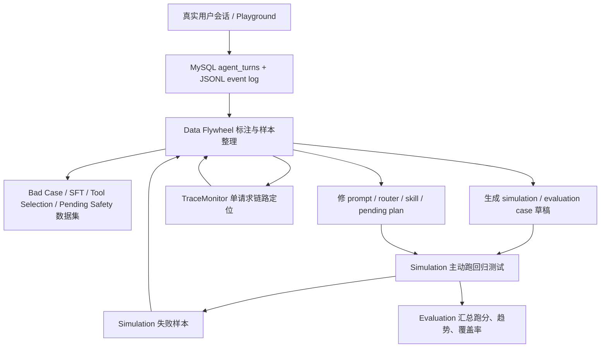

# Agent 数据飞轮前端页面设计

日期：2026-06-11

## 背景

farm-manager 已经具备 Agent 会话、trace、pending plan、debug export v2 和 JSONL event log 的基础能力。现有页面中：

- `Playground` 用于开发者模拟真实对话，并复制 session debug JSON。
- `TraceMonitor` 用于按 `request_id` 定位单次请求链路、节点输入输出和耗时。
- `Simulation` 用于主动运行仿真测试用例，检查当前 Agent 行为是否符合预期。
- `Evaluation` 后端模块已经有 replay case、metrics、report builder 等抽象，但前端还没有完整评测报告页面。

当前缺口是：真实会话和仿真失败中沉淀了大量可用样本，但缺少一个轻量工作台把它们整理成可标注、可导出、可转回归测试的数据资产。Agent 数据飞轮页面要补上这段链路。

## 目标

- 从真实会话、debug export、event log、仿真失败结果中发现可用样本。
- 以 turn 为主粒度展示 user input、assistant reply、tool、router、pending、token、latency 和来源证据。
- 支持人工标注好坏回复、工具选择错误、pending 安全问题、幻觉执行等质量标签。
- 支持把样本导出为 JSONL，或生成 simulation / evaluation case 草稿。
- 支持跳转 TraceMonitor 定位单次请求链路。
- 保持适配 2 核 2G / 2 核 4G 小服务器，不引入大数据平台、复杂队列或新存储组件。

## 非目标

- 不做独立 LLMOps 平台。
- 不引入 Kafka、ClickHouse、MongoDB、向量库或数据湖。
- 不在 MVP 中做自动 LLM-as-judge 批量打分。
- 不把 Simulation、Evaluation、TraceMonitor 合并成一个大页面。
- 不让页面直接扫描全量 JSONL 作为列表数据源。

## 成熟产品思想的轻量吸收

成熟 LLMOps / eval 产品通常围绕四件事组织：生产日志或 trace、可复用 dataset、人工或自动 score、实验/评测运行。Langfuse 的 dataset 可以从生产 trace 创建测试样本，score 可挂到 trace、session、observation 或 dataset run；Phoenix 将 dataset evaluator 作为类似单元测试的评测 harness；Humanloop 的 dataset datapoint 同时服务 evaluations 和 fine-tuning。

farm-manager 不照搬这些平台，只吸收一个小服务器可落地的模型：

```text
event / trace -> 样本 -> 人工标签和断言 -> simulation / evaluation case -> 回归结果 -> 回流样本池
```

参考资料：

- Langfuse Datasets: https://langfuse.com/docs/evaluation/experiments/datasets
- Langfuse Scores: https://langfuse.com/docs/evaluation/scores/data-model
- Phoenix Datasets and Experiments: https://arize.com/docs/phoenix/datasets-and-experiments/overview-datasets
- Humanloop Datasets: https://humanloop.com/docs/explanation/datasets

## 方案对比

| 方案 | 做法 | 优点 | 问题 |
| --- | --- | --- | --- |
| 合并到 Simulation | 在仿真页面增加样本和标注 Tab | 页面入口少，能快速触达测试用例 | Simulation 会同时承担样本整理、人工标注、测试运行，职责过重 |
| 新增 DataFlywheel 页面 | 在 Agent 平台新增 `/dev/data-flywheel` | 边界清楚，能长期承载样本、标签、导出、回流 | 需要新增页面、API 和少量存储模型 |
| 增强 TraceMonitor | 在 trace 列表中直接打标签和导出 | 单请求定位顺手 | 不适合 session / turn / dataset 视角，也不适合批量整理 |

## 推荐方案

新增独立 `DataFlywheel` 页面，菜单位置放在 Agent 平台分组中，建议顺序为：

```text
链路追踪
Token 看板
Playground
数据飞轮
Skill 注册表
Prompt 检查器
仿真测试
配置管理
```

推荐 MVP 为“人工标注优先，但直接打通回归测试草稿”。Data Flywheel 是样本工作台，Simulation 继续是测试运行台，Evaluation 继续汇总跑分和趋势，TraceMonitor 继续负责单请求链路定位。

## 模块边界

| 模块 | 职责 | 典型问题 |
| --- | --- | --- |
| Data Flywheel | 从真实会话和调试事件中发现样本、标注样本、导出数据、生成测试草稿 | 这条回复为什么坏，能不能沉淀为数据？ |
| Simulation | 主动运行测试用例，验证当前 Agent 行为是否正确 | 当前 prompt/router/skill 改动有没有回归？ |
| Evaluation | 汇总跑分、趋势、覆盖率和回归质量 | 最近版本通过率、工具选择准确率是否提升？ |
| TraceMonitor | 定位单次请求链路、节点输入输出和耗时 | 这个 request 具体在哪一步错了？ |
| Playground | 手工发起会话和开发调试 | 我想模拟一个用户输入看看 Agent 怎么回 |

## 数据闭环



## 信息架构

页面分为一个主页面和一个样本详情面板。

### 主导航

使用 Tabs 或 Segmented Control，MVP 包含 5 个队列：

- 会话样本：来自 `agent_turns`、conversation messages、debug export v2 和 event log。
- Bad Case：人工标记或仿真失败回流的坏例。
- Tool Selection：关注 router decision、selected tools、actual tools 和 fallback。
- Pending Safety：关注 pending plan 创建、确认、取消、纠正、漏拦截、误执行。
- SFT 回复调优：关注 user input、必要上下文、tool result 和 assistant reply。

### 筛选区

必须支持：

- 时间范围。
- 样本类型。
- 质量标签。
- `session_id` / `turn_id` / `request_id` 搜索。
- 是否只看未标注。
- 来源类型：真实会话、Playground、Simulation 失败、手工导入。

后续增强可增加：

- 工具名筛选。
- router fallback 筛选。
- token / latency 区间。
- pending plan 状态筛选。

## 页面布局草图

```text
Data Flywheel
[时间范围] [样本类型] [质量标签] [session/request 搜索] [只看未标注] [导出 JSONL]

左侧 / 上方：样本队列表格
┌ 类型 ┬ 标签 ┬ session_id ┬ turn_id ┬ request_id ┬ 输入摘要 ┬ tools ┬ latency/token ┬ 来源 ┬ 状态 ┐
│ bad  │ 未标注 │ sess...    │ 12      │ abc123     │ 王大妈... │ 2/1   │ 1320ms/680    │ event │ 草稿 │
└──────┴───────┴────────────┴─────────┴────────────┴──────────┴───────┴───────────────┴──────┴──────┘

中间：样本详情
- user input
- assistant reply
- selected_tools / actual_tools
- router decision
- tool input / output / error
- pending plan lifecycle
- token / latency
- source event file

右侧：标注与动作
[好回复] [坏回复] [工具选错] [pending 漏拦截]
[幻觉执行] [工资缺失] [禁用工人] [备注]

[复制 debug JSON]
[导出 JSONL]
[标记 bad case]
[生成 regression case]
[加入仿真测试集]
[重放 session]
[跳转 TraceMonitor]
```

## 必须展示字段

列表视图必须展示轻量字段，不直接加载完整 event payload：

- `sample_id`
- `sample_type`
- `quality_label`
- `session_id`
- `turn_id`
- `request_id`
- `user_input_preview`
- `assistant_reply_preview`
- `selected_tools`
- `actual_tools`
- `token_total`
- `latency_ms`
- `source_type`
- `created_at`
- `annotation_status`

详情视图必须展示完整证据：

- `session_id`
- `turn_id`
- `request_id`
- `user input`
- `assistant reply`
- `selected_tools`
- `actual_tools`
- `pending plan lifecycle`
- `token / latency`
- `router decision`
- `tool input / output / error`
- `quality label`
- `source event file`
- `event_seq_start / event_seq_end`
- `missing_event_segments`

## 标注体系

MVP 使用固定枚举 + 备注，避免标签无限增长。

质量标签：

- `good_reply`：好回复。
- `bad_reply`：坏回复。
- `wrong_tool_selection`：工具选错。
- `pending_missed`：pending 漏拦截。
- `hallucinated_execution`：幻觉执行。
- `missing_wage`：工资缺失。
- `disabled_worker_used`：禁用工人仍参与。
- `needs_regression`：需要回归测试。
- `not_actionable`：暂不处理。

标注记录需要保存：

- `sample_id`
- `label`
- `comment`
- `annotator_id`
- `created_at`
- `updated_at`

一个样本可以有多个标签，但 MVP 页面应鼓励少量明确标签。

### AI 自动预标注边界

后续可以引入 LLM-as-judge 做自动预标注，但它只能作为标注助理，不作为最终真值。推荐链路为：

```text
规则候选 -> LLM 预标注 -> 人工采纳/修改/驳回 -> 数据集和回归真值
```

预标注结果需要展示：

- 建议标签。
- 根因判断。
- 严重程度。
- 置信度。
- 判断理由。
- 推荐修复方向。
- judge model 和 prompt version。

标签记录必须区分来源：

- `rule`：确定性规则命中。
- `llm_judge`：LLM 自动预标注。
- `human`：人工确认或修改。

训练数据、regression case 和 evaluation 真值只使用人工确认后的标签，或经过明确白名单的高置信规则标签。`llm_judge` 结果可以用于排序、筛选和快速确认，但不能静默进入训练集。

## 操作设计

### 复制 debug JSON

复用 `GET /agent/conversations/{session_id}/debug-export`。如果样本来自单个 turn，前端可以在复制后仍保留完整 session debug JSON；后续再支持只导出 turn segment。

### 导出 JSONL

导出当前筛选结果或当前样本。MVP 优先支持当前样本和当前 Tab 的筛选结果。导出内容包含样本正文、标签、来源引用和必要证据，不直接包含敏感密钥。

### 加入仿真测试集

不要静默写入最终测试集。先生成 case draft，人工确认后再加入：

1. 从样本生成 `case_id`、`description`、`user_input`、`category`。
2. 根据标签生成初始断言，例如错误类型、期望工具、期望 pending、期望 DB diff。
3. 人工确认后写入 simulation case 存储。

MVP 中如果仍沿用 `backend/data/simulation_cases/*.json` 文件，需要明确部署环境的可写性；更推荐后续演进为 DB-backed simulation cases。

### 标记 bad case

给样本添加 `bad_reply` 或更具体标签，并将 `sample_type` 或队列视图归入 Bad Case。不要复制一份重复样本。

### 重放 session

MVP 可以先提供“复制 user input 到 Playground”或“打开 Playground 并带上 session_id / input”的轻量入口。真正按 event log 重放整段 session 放后续增强。

### 生成 regression case

生成更偏 evaluation replay 的草稿：

- `expected_skills`
- `expected_pending_action`
- `confirmation_flow`
- `expected_database_diff`
- `reply_assertions`
- `metadata.source_sample_id`

### 跳转 TraceMonitor

携带 `request_id` 和 `session_id` 跳转 `/dev/traces`，TraceMonitor 复用现有筛选参数加载 timeline。

## 后端 API 设计

### 复用 API

- `GET /agent/conversations/{session_id}/debug-export`
- `GET /admin/traces`
- `GET /admin/traces/{request_id}/timeline`
- `GET /simulation/cases`
- `POST /simulation/run`
- `GET /simulation/run/{run_id}`

### 新增 API

新增 admin 路由建议为 `backend/app/api/admin_data_flywheel.py`，统一前缀：

```text
GET    /admin/data-flywheel/samples
GET    /admin/data-flywheel/samples/{sample_id}
POST   /admin/data-flywheel/samples/{sample_id}/labels
DELETE /admin/data-flywheel/samples/{sample_id}/labels/{label_id}
POST   /admin/data-flywheel/samples/{sample_id}/bad-case
POST   /admin/data-flywheel/export-jsonl
POST   /admin/data-flywheel/samples/{sample_id}/case-draft
GET    /admin/data-flywheel/case-drafts/{draft_id}
POST   /admin/data-flywheel/case-drafts/{draft_id}/add-to-simulation
```

### 列表 API 响应

```json
{
  "items": [
    {
      "sample_id": "turn:1:sess-1:12",
      "sample_type": "session_turn",
      "quality_labels": ["wrong_tool_selection"],
      "annotation_status": "labeled",
      "session_id": "sess-1",
      "turn_id": 12,
      "request_id": "abcd1234",
      "user_input_preview": "王大妈工资100一天...",
      "assistant_reply_preview": "已为您记录...",
      "selected_tools": ["manage_workers", "create_operation_work_order"],
      "actual_tools": ["manage_workers"],
      "token_total": 680,
      "latency_ms": 1320,
      "source_type": "agent_event_log",
      "created_at": "2026-06-11T10:00:00+08:00"
    }
  ],
  "total": 1
}
```

### 详情 API 响应

详情 API 聚合 MySQL 轻量索引和 JSONL event segment：

```json
{
  "sample": {},
  "messages": [],
  "turn": {},
  "router_decision": {},
  "tool_events": [],
  "pending_lifecycle": [],
  "debug_export": {},
  "source": {
    "event_file": "data/agent-events/dt=2026-06-11/farm_id=1/session_id=sess-1/events.jsonl",
    "event_seq_start": 1,
    "event_seq_end": 8,
    "missing_event_segments": []
  }
}
```

## 后端存储设计

MVP 可以新增两张轻量表，不改变在线聊天热路径。

### agent_data_flywheel_labels

- `id`
- `farm_id`
- `sample_id`
- `sample_type`
- `session_id`
- `turn_id`
- `request_id`
- `label`
- `comment`
- `annotator_id`
- `created_at`
- `updated_at`

### agent_case_drafts

- `id`
- `farm_id`
- `draft_id`
- `source_sample_id`
- `target_type`：`simulation` 或 `evaluation_replay`
- `status`：`draft`、`accepted`、`rejected`
- `case_json`
- `created_by`
- `created_at`
- `updated_at`

列表数据优先从 `agent_turns`、`conversation_messages` 和 label 表查询。详情再读取 `event_file` 的 seq 范围。仿真失败回流可以从 `simulation_results` 生成虚拟样本或定期物化为 sample index，MVP 先用查询聚合即可。

## 前端设计

### 新增文件

- `admin-web/src/pages/DataFlywheel/index.tsx`
- `admin-web/src/api/dataFlywheel.ts`
- `admin-web/src/pages/DataFlywheel/components/SampleQueueTable.tsx`
- `admin-web/src/pages/DataFlywheel/components/SampleDetailPanel.tsx`
- `admin-web/src/pages/DataFlywheel/components/AnnotationPanel.tsx`
- `admin-web/src/pages/DataFlywheel/components/ToolComparison.tsx`
- `admin-web/src/pages/DataFlywheel/components/PendingLifecycleView.tsx`
- `admin-web/src/pages/DataFlywheel/components/CaseDraftPreview.tsx`

### 复用组件和工具

- `SkillOutputFormatter`
- `formatTracePayload`
- `hasTracePayload`
- `GanttTimeline` 的视觉语言，但不直接嵌入完整 timeline。
- Playground 的 debug export 概念。
- Simulation 的 case/result 展示结构。

### 页面交互原则

- 以样本处理效率为主，避免营销式 dashboard。
- 表格密度可以较高，但字段必须可扫读。
- 详情面板应把 user input、assistant reply、tools、pending、router 按证据顺序排布。
- 右侧标注区始终可见，减少标注操作成本。
- 所有危险或持久化动作需要明确确认，例如加入仿真测试集。

## 与 Skill Router 优化的关系

Data Flywheel 是 Skill Router 优化的反馈入口：

- `router.decision` 事件展示 selected/rejected/fallback/schema token 信息。
- `selected_tools` 与 `actual_tools` 对比，用于发现工具披露过多、选错工具、工具未调用。
- `wrong_tool_selection` 标签可生成 tool-selection 数据集样本。
- `pending_missed`、`hallucinated_execution`、`missing_wage` 等标签可生成 pending safety 或 bad case 样本。
- 回归 case 运行结果再回到 Data Flywheel，形成 router 修复闭环。

## MVP 范围

必须做：

- 新增 `/dev/data-flywheel` 页面入口。
- 支持 turn 级样本列表和详情。
- 支持固定标签和备注。
- 支持复制 debug JSON。
- 支持跳转 TraceMonitor。
- 支持当前样本 JSONL 导出。
- 支持生成 simulation / evaluation case 草稿。
- 支持人工确认后创建可运行的仿真用例；若当前部署环境不适合写入 `backend/data/simulation_cases/*.json`，则 MVP 先保留 case draft，并在页面明确提示尚未进入可运行测试集。

暂不做：

- 批量 LLM-as-judge。
- 大规模 dataset 版本管理。
- 复杂权限协作流。
- 事件日志全文搜索。
- 自动修 prompt/router/skill。

## 后续增强

- 批量标注和批量导出。
- 从 Simulation 失败结果自动创建 Bad Case 标签。
- DB-backed simulation cases，避免直接写部署包内 JSON 文件。
- Dataset 版本管理：`dataset_name`、`version`、`split`。
- 简单质量趋势：坏例类型分布、工具选择错误率、pending 漏拦截趋势、平均 token 和 latency。
- LLM-as-judge 辅助预标注，但人工标签保留最终优先级。
- Pairwise 回复对比，服务 prompt 版本优化。
- 一键重放 session，按 event log 重建多轮上下文。

## 风险点与缓解

| 风险 | 影响 | 缓解 |
| --- | --- | --- |
| 列表直接扫描 JSONL | 小服务器 CPU / IO 被打满 | 列表只查 MySQL 索引，详情再读 event segment |
| 标签体系膨胀 | 数据难以复用 | MVP 使用固定枚举和备注 |
| 自动生成 case 断言弱 | 回归测试误报或漏报 | 先生成草稿，人工确认后入库 |
| 真实会话含敏感数据 | 导出数据有泄漏风险 | 导出前脱敏，保留来源引用 |
| simulation case 仍是文件驱动 | 部署环境可能不可写 | MVP 保留 draft，后续做 DB-backed cases |
| Trace 过期或 event 缺失 | 详情证据不完整 | 显示 `missing_event_segments`，允许部分导出 |
| 页面职责变大 | 变成杂乱 dashboard | 坚持样本队列、详情、标注、动作四块结构 |

## 验收标准

- 管理员能在 Data Flywheel 中看到最近 Agent turn 样本。
- 点开样本能看到 user input、assistant reply、router、tools、pending、token、latency 和 event source。
- 管理员能给样本打固定标签并保存备注。
- 管理员能复制 debug JSON，并跳转到对应 TraceMonitor。
- 管理员能从一条坏例生成 regression case 草稿。
- 管理员能导出当前样本 JSONL。
- 页面不会在列表加载时读取大量 JSONL payload。

## 自审清单

- 无未决条目。
- 页面边界与 Simulation、Evaluation、TraceMonitor、Playground 不冲突。
- MVP 聚焦样本标注和回归草稿，不引入重型平台能力。
- API 设计区分列表轻量查询和详情证据读取。
- 风险点均给出缓解策略。
