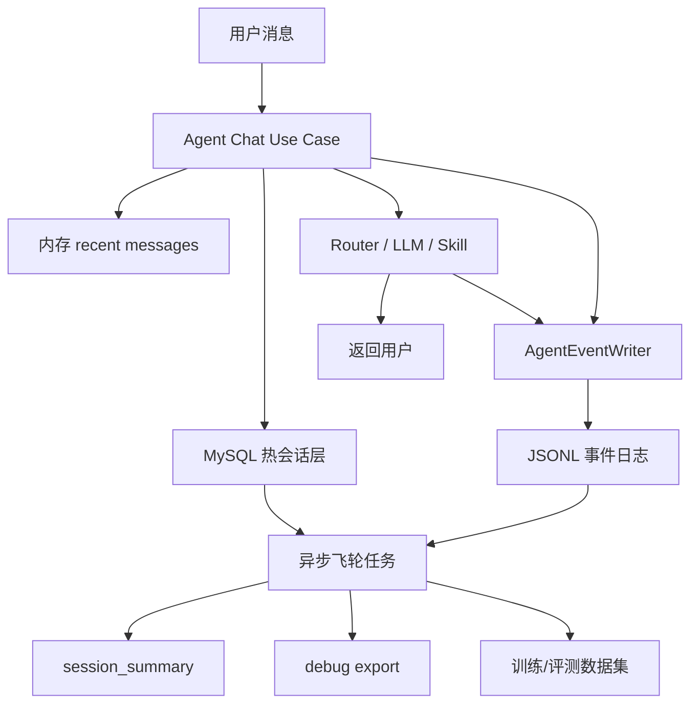

# Agent 会话存储与数据飞轮设计

日期：2026-06-11

## 背景

当前 Agent 会话已经具备基础持久化能力，但在线体验、调试追踪、后期训练数据沉淀仍混在同一组读写路径里。会话正文保存在 `conversations` / `conversation_messages`，trace 保存在 `trace_records`，pending action 主要保存在进程内存。这个结构能支撑早期调试，但在多轮对话、写操作确认、session debug export、训练数据抽取同时增长后，会出现三个问题：

1. 在线召回和调试数据查询互相干扰，长会话和大 trace 容易拖慢用户体验。
2. pending action 不具备完整可恢复性，服务重启或多意图链式写操作会增加丢状态风险。
3. 后期做回复调优、工具选择训练、坏例评测时，需要从业务表和 trace 表拼数据，抽取成本高且数据语义不稳定。

本设计目标是在小服务器资源约束下提升用户体验，并为后期 Agent 回复调优训练沉淀高质量数据。暂不引入 MongoDB。

## 目标

- 在线聊天响应稳定，不因完整历史、trace、debug export 查询变慢。
- 最近上下文召回快速，长会话依赖摘要而不是扫描全量消息。
- pending 确认流程可恢复，可支持多意图、多步骤计划。
- 每轮对话自动沉淀成可回放、可评测、可训练的数据。
- 兼容 2 核 2G / 2 核 4G 服务器，不增加高成本数据库组件。
- admin-web 可复制完整调试 JSON，包含消息、router、tool、pending、trace 关键证据。

## 非目标

- 不在本阶段引入 MongoDB、Kafka、ClickHouse、独立向量数据库。
- 不把 JSONL 事件日志用于在线实时召回。
- 不一次性迁移所有历史 trace 数据。
- 不改变业务主数据表的职责，例如作物、工人、成本、欠款仍由 MySQL 业务表承载。

## 推荐方案

采用三层存储：

1. **热会话层**：MySQL + 进程内短时缓存，服务在线对话。
2. **原始事件层**：本地 append-only JSONL 事件日志，服务回放、调试、训练数据源。
3. **飞轮加工层**：异步任务生成摘要、评测样本、SFT 样本、工具选择样本。

核心原则：在线回答只读小数据，离线飞轮保留全证据。

## 架构



## 热会话层

热会话层继续使用 MySQL，负责强一致状态和低延迟查询。它只保存在线路径必需的最小结构化数据。

### 会话表

保留现有 `conversations`，后续可演进为 `agent_sessions`：

- `id`
- `farm_id`
- `user_id`
- `session_id`
- `status`
- `created_at`
- `last_active_at`
- `summary`
- `summary_updated_at`
- `last_turn_id`
- `last_event_seq`
- `meta_json`

`summary` 用于长会话压缩。在线上下文构建优先使用摘要加最近消息，不扫描完整历史。

### 消息表

保留现有 `conversation_messages`，逐步补强：

- `id`
- `conversation_id`
- `turn_id`
- `role`
- `content`
- `content_hash`
- `meta_json`
- `created_at`

当前 `meta` 是 Text，建议新增 `meta_json`，迁移完成后再考虑废弃 `meta`。`meta_json` 只放在线需要的轻量字段，例如：

- `skills`
- `pending_action`
- `router_decision_id`
- `trace_request_id`
- `event_file`
- `event_seq_range`

### Turn 聚合表

新增 `agent_turns`，一轮用户输入到助手回复对应一条记录：

- `id`
- `farm_id`
- `session_id`
- `conversation_id`
- `request_id`
- `user_message_id`
- `assistant_message_id`
- `input_preview`
- `reply_preview`
- `intent_count`
- `selected_tools_count`
- `tool_calls_count`
- `token_total`
- `latency_ms`
- `status`
- `pending_plan_id`
- `event_file`
- `event_seq_start`
- `event_seq_end`
- `created_at`

这张表服务 admin 列表、问题定位、后续数据抽样，不保存完整大 JSON。

### Pending Plan

将当前内存 pending action 演进为可恢复的 pending plan：

`agent_pending_plans`：

- `id`
- `plan_id`
- `farm_id`
- `session_id`
- `status`
- `current_step_index`
- `raw_user_input`
- `router_decision_json`
- `created_at`
- `expires_at`
- `updated_at`

`agent_pending_plan_steps`：

- `id`
- `plan_id`
- `step_index`
- `skill_name`
- `params_json`
- `status`
- `requires_confirmation`
- `confirmation_text`
- `result_json`
- `error_message`
- `created_at`
- `updated_at`

pending 状态必须跟随会话恢复。确认、取消、纠正、过期都写入事件日志。

## 原始事件层

原始事件层使用 append-only JSONL 文件。它不参与在线召回，只负责完整证据保存和后期加工。

目录结构：

```text
data/agent-events/
  dt=2026-06-11/
    farm_id=1/
      session_id=playground-xxx/
        events.jsonl
```

压缩可延后到异步任务执行，冷文件可转为 `events.jsonl.zst`。

### 事件模型

每条事件包含统一外壳：

```json
{
  "event_id": "01J...",
  "event_type": "message.user",
  "schema_version": 1,
  "created_at": "2026-06-11T10:00:00+08:00",
  "farm_id": 1,
  "user_id": "u1",
  "session_id": "playground-xxx",
  "turn_id": 12,
  "request_id": "3d8f7cb9",
  "seq": 4,
  "payload": {}
}
```

关键事件类型：

- `message.user`
- `message.assistant`
- `router.decision`
- `prompt.rendered`
- `llm.call`
- `tool.selected`
- `tool.call.started`
- `tool.call.finished`
- `tool.call.failed`
- `pending.plan.created`
- `pending.step.confirmed`
- `pending.step.cancelled`
- `pending.step.executed`
- `guardrail.blocked`
- `feedback.created`
- `summary.generated`

事件 payload 可以保存完整调试数据，但需要遵守脱敏和体积限制。超大字段写入摘要、hash 和外部文件引用。

### 写入策略

- 在线请求中只做轻量 append，不做复杂加工。
- 事件写入失败不阻断用户回复，但必须记录结构化 warning。
- MySQL `agent_turns` 保存 event 文件和 seq 范围，便于 admin 快速定位。
- 单 session 文件过大时按 turn 或大小滚动。

## 飞轮加工层

异步任务从 JSONL 事件和 MySQL 索引生成后续资产。

### Session Summary

触发条件：

- 会话消息超过指定轮数。
- 最近摘要距离当前超过指定轮数。
- 用户关闭会话。

输出写回 `conversations.summary`，并记录 `summary.generated` 事件。

在线上下文规则：

- 最近 6-12 条消息优先来自内存。
- 内存未命中时查 MySQL 最近消息。
- 长会话注入 summary + 最近消息。
- 不从 JSONL 扫历史作为在线上下文。

### Debug Export

admin-web 复制调试 JSON 时：

1. MySQL 查询 session、messages、turns、pending plans。
2. 根据 `event_file` 和 seq 范围读取相关 JSONL。
3. 拼出 `farm-manager.chat-session-debug.v2`。

导出内容包括：

- messages
- pending plans / steps
- router decisions
- selected tools
- tool call input/output/error
- token usage
- latency
- guardrail events
- feedback

### 训练与评测数据

异步生成以下数据集：

- 回复调优 SFT 样本：用户输入、必要上下文、工具结果、最终回复。
- 工具选择样本：用户输入、router decision、候选工具、实际 tool calls、是否成功。
- pending 安全样本：写操作确认、取消、纠正、多步骤执行。
- 坏例样本：幻觉执行、pending 丢失、工具未调用、工资默认为 0、禁用工人仍参与等。

输出格式优先 JSONL，后续可转 Parquet。数据集生成时保留引用：

- `session_id`
- `turn_id`
- `request_id`
- `event_id`
- `source_event_file`

## 与 Skill Router 设计的关系

本设计承接 `2026-06-10-skill-router-optimization-design.md`：

- `router.decision` 事件保存 selected/rejected/fallback/schema token 估算。
- `agent_turns.selected_tools_count` 用于监控是否再次出现 33 tools 全量披露。
- pending plan 表承载多意图写操作计划，避免单 pending action 覆盖或丢步骤。
- debug export v2 同时包含 router 诊断和 pending plan 生命周期。

## 性能策略

- 在线上下文查询只走索引：`session_id`、`conversation_id`、`created_at/id`。
- 消息保存合并 commit，避免单轮多次提交放大。
- trace 大 JSON 不进入在线读取路径。
- JSONL 文件只 append，不在请求内扫描。
- admin debug export 是显式调试动作，可以读取事件文件，但需要分页或体积上限。
- 异步摘要和数据集加工限制并发，避免挤占在线请求资源。

## 资源约束

适配 2 核 2G / 2 核 4G：

- 不新增 MongoDB。
- 不新增常驻重型队列；第一阶段可用应用内后台任务或定时任务。
- JSONL 保存在本地磁盘，按 TTL 或对象存储策略归档。
- MySQL 只保留热数据、索引和轻量 JSON。

## 数据保留与清理

- MySQL 会话和消息按产品策略保留。
- trace 表继续执行 TTL 清理。
- JSONL 原始事件按日期归档，支持压缩。
- 训练集导出前进行脱敏，过滤密钥、手机号、地址等敏感信息。
- 删除农场或用户数据时，必须能根据 `farm_id` / `user_id` 定位并删除对应事件文件。

## 失败处理

- MySQL 写失败：请求失败或降级，由现有事务策略处理。
- JSONL 写失败：不中断用户回复，记录 warning，并在 `agent_turns` 标记 `event_write_status=failed`。
- 异步摘要失败：不影响在线会话，下次任务重试。
- pending plan 执行失败：保留失败 step，允许用户重试、取消或纠正。
- debug export 事件文件缺失：导出 MySQL 可用部分，并标记 `missing_event_segments`。

## 分阶段实施

### 阶段一：热路径止血

- 新增 `agent_turns`。
- 消息保存合并 commit。
- 最近消息读取继续使用 MySQL 索引，补充测试。
- pending action 保存增加数据库适配层，但保留旧接口兼容。
- debug export 标注 turn/request/event 引用。

退出标准：

- 普通会话召回只查最近消息，不扫完整历史。
- 服务重启后 pending 可恢复。
- 单轮保存消息不再出现不必要的多次 commit。

### 阶段二：事件日志

- 新增 `AgentEventWriter`。
- 写入 message、router、tool、pending、assistant、feedback 事件。
- `agent_turns` 保存 event 文件和 seq 范围。
- admin debug export v2 可从事件日志拼完整证据。

退出标准：

- session4/session5/session6 可从事件日志重建关键调试 JSON。
- 事件写失败不影响用户回复。
- selected tools、tool calls、tokens、pending 生命周期都可追踪。

### 阶段三：数据飞轮

- 后台生成 session summary。
- 生成 SFT、tool selection、pending safety、bad case JSONL 数据集。
- admin 增加坏例筛选入口。
- 建立基础质量指标报表。

退出标准：

- 长会话上下文使用 summary + 最近消息。
- 可按日期导出训练/评测样本。
- 可定位并复盘幻觉执行、pending 丢失、多意图遗漏等问题。

## 验收用例

- session5 中“我家有哪些作物栽种”只需要保存少量 turn 指标，不因 trace/debug 查询影响用户回复。
- session4 中多意图写操作生成 pending plan，确认后按步骤执行，不丢“创建工人后安排作业”。
- 服务重启后，用户发送“确认”仍能找到未过期 pending plan。
- admin-web 复制调试 JSON 能包含 messages、router decision、tool call、pending lifecycle。
- 长会话超过阈值后，在线 prompt 注入 summary + 最近消息，而不是完整历史。
- 数据飞轮可导出一条包含用户输入、上下文、工具结果、助手回复、质量标签的训练样本。

## 后续实施入口

用户确认本设计后，下一步使用 `superpowers:writing-plans` 编写实施计划。实施计划应按测试驱动拆分，优先覆盖热路径止血，再接入事件日志，最后做数据飞轮加工。
