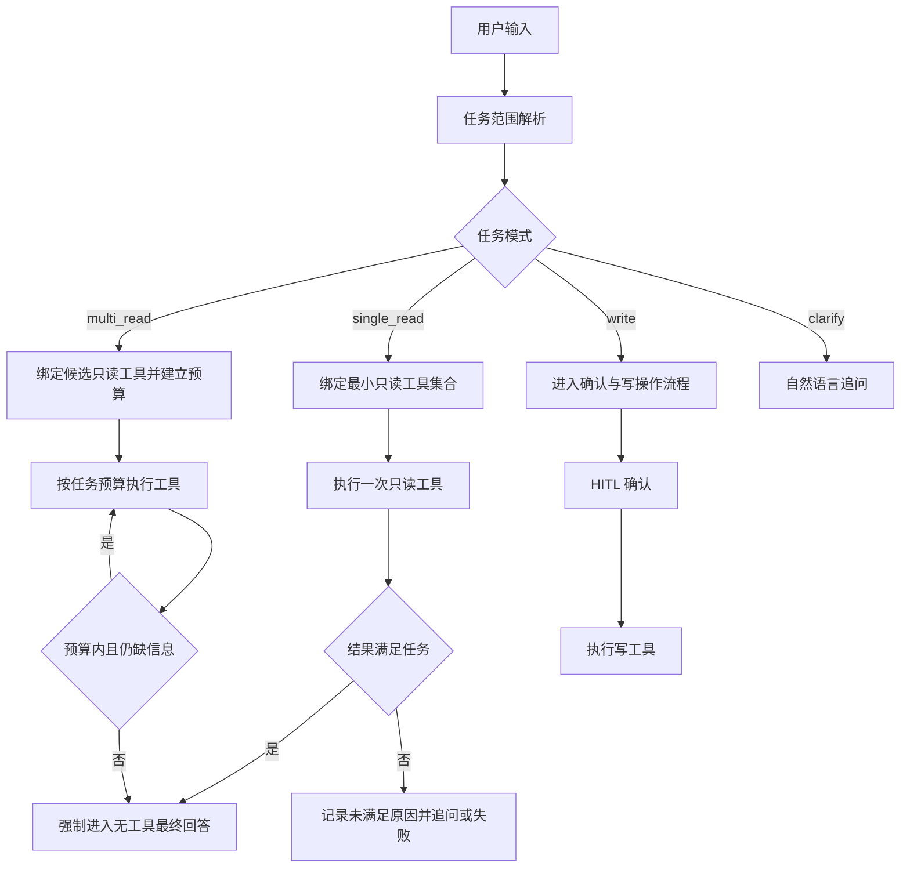

# v2 Agent 意图范围与 ReAct 收敛修复规范

## 1. 文档信息

| 项目 | 内容 |
| --- | --- |
| 状态 | proposed |
| 日期 | 2026-08-08 |
| 范围 | `v2/agent` 的请求理解、工具绑定、ReAct 循环、Trace 与回归测试 |
| 关联问题 | 用户询问“你分析一下我的基本信息”后无任何信息反馈 |
| 非目标 | 不通过继续堆积关键词词库修复单个用户表达；不把降级回复当作主流程 |

## 2. 修复目标

用户提出“基本信息”“基本情况”“农场概况”这类概览请求时，Agent 必须：

1. 将请求识别为单一的农场概览任务，而不是自动扩展成财务、赊账、工人等多个专项任务。
2. 只暴露和执行完成该任务所需的最小只读工具集合。
3. 在首个足够回答任务的工具结果返回后，主动结束工具循环并生成最终回答。
4. 即使模型异常，也必须记录清晰的终止原因；故障兜底只能防止空白，不能替代正常收敛。
5. Trace 能回答：任务范围是什么、允许哪些工具、调用了哪些工具、为什么继续、为什么结束。

## 3. 现象与证据

目标请求的 v2 trace 中，用户输入为“你分析一下我的基本信息”。该链路表现为：

```text
user
  -> LLM step 1 -> get_farm_status
  -> LLM step 2 -> query_cost_records
  -> LLM step 3 -> query_debts
  -> LLM step 4 -> query_workers
  -> LLM step 5 -> tool_call 未匹配执行记录
  -> max_steps
  -> 只有 error，没有 final_answer
```

证据表明问题不是 Business 查询失败，也不是单个 Skill 缺少参数：

- 已成功取得农场状态、成本、赊账和工人查询结果。
- 最后一次 LLM 仍产生了工具调用，但没有对应的工具执行记录。
- `Turn.max_steps=5` 后，`react.py` 只发送 `error` 和 `done`。
- `main.py` 只有收到 `final_answer` 才会保存 assistant 消息，因此会话表现为用户消息结束，没有助手回复。
- 原有 system prompt 只有“尽快回答”的软约束，没有任务范围、工具预算和强制终止条件。

## 4. 根因分析

### 4.1 任务范围没有成为运行时约束

当前流程把“用户输入 + 全量工具 schema”直接交给模型。模型可以自行把“基本信息”解释成多个业务维度，但 Runtime 没有保存或校验“本轮到底要完成什么任务”。

因此，模型每次拿到 observation 后都可以重新扩大范围，系统无法判断下一次工具调用是否仍属于原任务。

### 4.2 工具 schema 解决“怎么调用”，没有解决“调用到哪里为止”

Skill schema 能描述参数和风险，但当前没有表达以下信息：

- 该工具适合什么任务范围。
- 该工具结果是否足以结束某类任务。
- 某类任务最多允许多少次只读调用。
- 哪些工具不能被概览任务自动带入。

所以 Agent 具备工具选择能力，却没有收敛协议。

### 4.3 ReAct 循环只有全局步数上限，没有任务级终止条件

`max_steps=5` 只能防止无限循环，不能让 Agent 在正确时机结束。当前循环的结束条件主要是“模型不再返回 tool call”，这把终止责任完全交给模型。

当模型连续选择工具或产生无法执行的工具调用时，系统只能耗尽步数。

### 4.4 Prompt 不是可靠的控制面

新增“基本信息只调用一次状态查询”的 prompt 可以改善概率，但仍存在以下风险：

- 模型可能忽略或错误理解自然语言约束。
- 工具数量过多时，候选空间仍然包含所有业务 Skill。
- 多轮上下文和 system reminder 可能改变模型决策。
- Prompt 无法阻止 Runtime 执行越界工具。

因此 Prompt 只能作为决策提示，不能作为唯一的安全边界。

### 4.5 `_build_fallback_answer` 的定位

`_build_fallback_answer` 解决的是“失败后不要空白”的用户体验问题，属于故障保底：

- 它不阻止错误工具调用。
- 它不阻止任务范围扩张。
- 它不减少 LLM 和 Business 调用。
- 它不能保证正常回答质量。

本规范将其保留为最后一道输出保护，但明确不把它计为根因修复完成条件。

## 5. 设计原则

1. 不新增业务关键词词库，不用 `if "基本信息" in message` 作为通用路由方案。
2. 意图理解交给模型或已有结构化能力；任务边界、预算和终止由 Runtime 强制执行。
3. 工具描述负责说明能力，运行时元数据负责声明边界。
4. 简单任务必须优先走单动作路径；复杂任务才允许规划和多工具协作。
5. 失败路径必须可见、可追踪、可恢复，但不能掩盖正常流程缺陷。

## 6. 目标流程



## 7. 目标协议

### 7.1 TaskScope

每个 turn 在第一次工具调用前必须生成并保存一个结构化任务范围。字段保持最小化：

```json
{
  "mode": "single_read",
  "goal": "回答当前农场的基本概况",
  "required_capabilities": ["farm_overview"],
  "allowed_tools": ["get_farm_status"],
  "max_tool_calls": 1,
  "answer_sufficient_after": ["get_farm_status"]
}
```

字段含义：

| 字段 | 说明 |
| --- | --- |
| `mode` | `single_read`、`multi_read`、`write`、`clarify` |
| `goal` | 面向用户的任务目标，不使用内部 operation 表达 |
| `required_capabilities` | 能力类型，不绑定大量自然语言词库 |
| `allowed_tools` | 本 turn Runtime 实际允许执行的工具 |
| `max_tool_calls` | 当前任务级工具调用预算 |
| `answer_sufficient_after` | 哪些成功结果可以触发强制收敛 |

### 7.2 Skill 能力元数据

在现有 Skill 标准上只增加任务边界所需的最小字段，不改变现有单动作工具命名：

```yaml
capability:
  tags: [farm_overview]
  answer_sufficient_for: [farm_overview]
  default_tool_budget: 1
```

示例：

```yaml
name: get_farm_status
kind: mcp
risk_level: read
description: 查询当前农场概况，包括位置、活跃茬口、近期农事、天气和汇总信息。
capability:
  tags: [farm_overview]
  answer_sufficient_for: [farm_overview]
  default_tool_budget: 1
```

这些字段是运行时边界，不是关键词触发器。没有 `capability` 元数据的旧 Skill 继续按现有通用流程运行，但不能被标记为某类任务的强制收敛工具。

### 7.3 工具绑定规则

- `single_read`：只向 LLM 暴露 `allowed_tools`，禁止把全量 Skill schema 带入本轮。
- `multi_read`：只暴露任务范围内的只读工具，并按 `max_tool_calls` 计数。
- `write`：仍然走现有 HITL，不因任务范围机制绕过确认。
- `clarify`：不调用工具，直接自然语言追问。
- LLM 返回不在 `allowed_tools` 内的工具调用时，Runtime 不执行；记录 `tool_out_of_scope`，并要求模型直接回答或追问，不重新扩大候选工具集合。

### 7.4 强制收敛规则

当满足以下条件时，Runtime 必须进入最终回答阶段：

1. 工具调用成功。
2. 工具属于 `answer_sufficient_after`。
3. 当前任务是 `single_read`，或已达到任务声明的最小信息集合。

最终回答阶段调用 LLM 时使用 `tool_choice=none` 或不传 tools，避免模型在“准备回答”阶段再次发起工具调用。

这条规则比 system prompt 更高优先级，是本次修复的核心。

### 7.5 预算与终止状态

每个 turn 必须区分以下计数：

- `step_count`：LLM/ReAct 总步骤，用于防止无限循环。
- `tool_call_count`：实际执行的工具次数。
- `out_of_scope_count`：越界工具调用次数。
- `missing_param_count`：缺参调用次数。

任务预算耗尽时，必须先记录终止原因，再进入最终回答或澄清，不允许只发 `error` 后结束。

## 8. 代码改造边界

### 8.1 `v2/agent/core/turn.py`

增加 `task_scope` 和任务级计数，不改变 Turn 作为单一状态源的定位。

### 8.2 `v2/agent/core/context.py`

增加任务范围的结构化上下文渲染；不在这里实现业务关键词分类，不直接访问数据库。

### 8.3 `v2/agent/core/react.py`

- 在第一次 LLM 工具决策前初始化 TaskScope。
- 根据 TaskScope 过滤 tools schema。
- 执行前校验工具是否在 `allowed_tools` 内。
- 成功命中 `answer_sufficient_after` 后强制最终回答。
- 任务预算耗尽时走统一终止处理。
- 保留 `_build_fallback_answer`，但只处理异常兜底，不参与正常任务判断。

### 8.4 `v2/agent/skills/loader.py`

加载并校验 `capability` 元数据；缺失或非法元数据必须在启动检查中报告，不在运行时静默猜测。

### 8.5 `v2/agent/infra/trace/collector.py`

新增或补齐以下 trace 信息：

- `task_scope`
- `allowed_tools`
- `max_tool_calls`
- `tool_call_count`
- `termination_reason`
- `answer_sufficient_after`
- 越界工具名与拒绝原因

禁止记录完整用户敏感数据和完整工具参数；参数只保留字段名或脱敏摘要。

## 9. 测试要求

### 9.1 正向收敛

| 输入 | 预期 |
| --- | --- |
| 你分析一下我的基本信息 | 只调用 `get_farm_status`，然后 final_answer |
| 看看我的农场概况 | 同上 |
| 我现在农场什么情况 | 同上 |

### 9.2 不应过度收敛

| 输入 | 预期 |
| --- | --- |
| 分析我的财务和工人情况 | 允许多只读工具，但有明确预算 |
| 查一下最近农活和天气 | 允许对应的两个只读能力 |
| 新来一个工人 | 进入创建工人确认流程，不直接执行 |

### 9.3 越界和异常

- single_read 任务中模型请求 `query_cost_records`：不执行，记录 `tool_out_of_scope`。
- 工具返回 error：输出明确错误，不伪造已完成。
- LLM 连续返回工具调用：任务预算到达后必须有 `final_answer` 或自然语言澄清。
- LLM 流式异常：保留降级答复，但 trace 必须标记失败。
- 会话历史包含旧的多领域上下文：当前新任务必须重新建立 TaskScope。

### 9.4 验收指标

对概览类回归集统计：

- `single_read_tool_calls == 1` 的比例为 100%。
- `out_of_scope_tool_executed == 0`。
- `final_answer_emitted == 100%`。
- `assistant_message_persisted == 100%`。
- `max_steps_reached` 为 0；若发生，必须可解释且不能静默。

## 10. 实施顺序

1. 先实现 TaskScope 数据结构、trace 字段和回归夹具。
2. 给 `get_farm_status` 增加 `farm_overview` 能力元数据。
3. 实现单动作任务的工具过滤和任务预算。
4. 实现成功工具结果后的强制无工具 finalization。
5. 实现越界工具调用拒绝和统一终止状态。
6. 将同一机制扩展到天气、最近农事、财务概览等明确的只读入口。
7. 最后评估是否需要引入 `multi_read` 任务范围；不提前为所有业务设计复杂规划器。

## 11. 完成标准

只有同时满足以下条件，才算根因修复完成：

- 不依赖 `_build_fallback_answer`，概览请求正常完成并主动收敛。
- Runtime 能阻止概览任务执行越界工具。
- 工具结果满足任务目标后不会继续无边界查询。
- Trace 能解释任务范围、工具选择、预算和终止原因。
- 正向、负向、异常和多轮上下文测试全部通过。

仅仅看到用户收到一条降级文本，或仅仅修改 system prompt，不得标记为完成。
