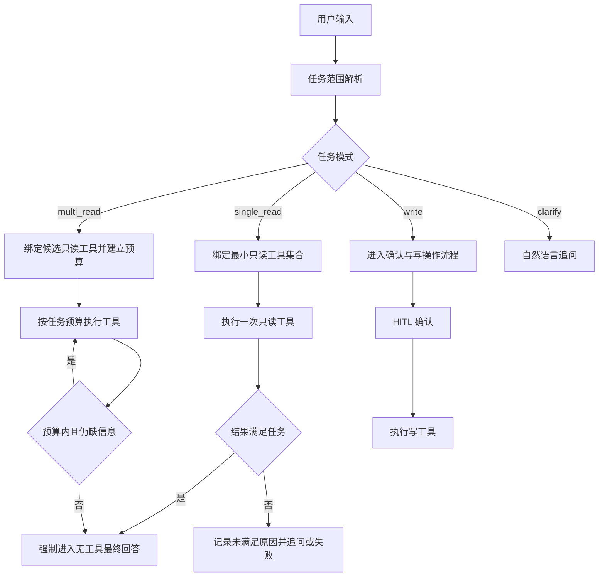

# v2 Agent 意图范围与 ReAct 收敛修复规范

## 1. 文档信息

| 项目 | 内容 |
| --- | --- |
| 状态 | implemented |
| 日期 | 2026-08-08 |
| 范围 | `v2/agent` 的请求理解、工具绑定、ReAct 循环、Trace 与回归测试 |
| 关联问题 | 用户询问“你分析一下我的基本信息”后无任何信息反馈 |
| 非目标 | 不通过继续堆积关键词词库修复单个用户表达；不把降级回复当作主流程 |

## 2. 修复目标

用户提出“基本信息”“基本情况”“农场概况”这类概览请求时，Agent 必须：

1. 将请求识别为单一的农场概览任务，而不是自动扩展成财务、赊账、工人等多个专项任务。
2. 只暴露和执行完成该任务所需的最小只读工具集合。
3. 在首个足够回答任务的工具结果返回后，主动结束工具循环并生成最终回答。
4. 即使模型异常，也必须记录清晰的终止原因；故障兜底只能防止空白，不能替代正常收敛。
5. Trace 能回答：任务范围是什么、允许哪些工具、调用了哪些工具、为什么继续、为什么结束。

## 3. 现象与证据

目标请求的 v2 trace 中，用户输入为“你分析一下我的基本信息”。该链路表现为：

```text
user
  -> LLM step 1 -> get_farm_status
  -> LLM step 2 -> query_cost_records
  -> LLM step 3 -> query_debts
  -> LLM step 4 -> query_workers
  -> LLM step 5 -> tool_call 未匹配执行记录
  -> max_steps
  -> 只有 error，没有 final_answer
```

证据表明问题不是 Business 查询失败，也不是单个 Skill 缺少参数：

- 已成功取得农场状态、成本、赊账和工人查询结果。
- 最后一次 LLM 仍产生了工具调用，但没有对应的工具执行记录。
- `Turn.max_steps=5` 后，`react.py` 只发送 `error` 和 `done`。
- `main.py` 只有收到 `final_answer` 才会保存 assistant 消息，因此会话表现为用户消息结束，没有助手回复。
- 原有 system prompt 只有“尽快回答”的软约束，没有任务范围、工具预算和强制终止条件。

## 4. 根因分析

### 4.1 任务范围没有成为运行时约束

当前流程把“用户输入 + 全量工具 schema”直接交给模型。模型可以自行把“基本信息”解释成多个业务维度，但 Runtime 没有保存或校验“本轮到底要完成什么任务”。

因此，模型每次拿到 observation 后都可以重新扩大范围，系统无法判断下一次工具调用是否仍属于原任务。

### 4.2 工具 schema 解决“怎么调用”，没有解决“调用到哪里为止”

Skill schema 能描述参数和风险，但当前没有表达以下信息：

- 该工具适合什么任务范围。
- 该工具结果是否足以结束某类任务。
- 某类任务最多允许多少次只读调用。
- 哪些工具不能被概览任务自动带入。

所以 Agent 具备工具选择能力，却没有收敛协议。

### 4.3 ReAct 循环只有全局步数上限，没有任务级终止条件

`max_steps=5` 只能防止无限循环，不能让 Agent 在正确时机结束。当前循环的结束条件主要是“模型不再返回 tool call”，这把终止责任完全交给模型。

当模型连续选择工具或产生无法执行的工具调用时，系统只能耗尽步数。

### 4.4 Prompt 不是可靠的控制面

新增“基本信息只调用一次状态查询”的 prompt 可以改善概率，但仍存在以下风险：

- 模型可能忽略或错误理解自然语言约束。
- 工具数量过多时，候选空间仍然包含所有业务 Skill。
- 多轮上下文和 system reminder 可能改变模型决策。
- Prompt 无法阻止 Runtime 执行越界工具。

因此 Prompt 只能作为决策提示，不能作为唯一的安全边界。

### 4.5 `_build_fallback_answer` 的定位

`_build_fallback_answer` 解决的是“失败后不要空白”的用户体验问题，属于故障保底：

- 它不阻止错误工具调用。
- 它不阻止任务范围扩张。
- 它不减少 LLM 和 Business 调用。
- 它不能保证正常回答质量。

本规范将其保留为最后一道输出保护，但明确不把它计为根因修复完成条件。

## 5. 设计原则

1. 不新增业务关键词词库，不用 `if "基本信息" in message` 作为通用路由方案。
2. 意图理解交给模型或已有结构化能力；任务边界、预算和终止由 Runtime 强制执行。
3. 工具描述负责说明能力，运行时元数据负责声明边界。
4. 简单任务必须优先走单动作路径；复杂任务才允许规划和多工具协作。
5. 失败路径必须可见、可追踪、可恢复，但不能掩盖正常流程缺陷。

## 6. 目标流程



## 7. 最小实现决策

初版方案中的 `TaskScope`、额外意图分类、工具预算和多套 trace 字段会引入新的控制层。对当前已定位的根因而言，它们不是必要条件，因此不实施。

本次只增加一个可复用的 Skill 元数据：

```yaml
finalize_after_success: true
```

其含义是：这个 Skill 的成功结果已经构成一个完整回答的事实来源。Runtime 在写入 observation 后，下一次模型调用不再传入 tools；模型只能基于已有结果生成最终文本。

`get_farm_status` 是首个使用该字段的 Skill，因为它已经返回农场名称、位置、活跃茬口、近期农事、天气、人员和收支汇总。该字段不依赖用户关键词，不改变写操作确认，也不影响未标记的多步任务。

## 8. 代码边界

- `v2/agent/skills/farm-status/skill.md`：声明概览结果足够回答。
- `v2/agent/skills/base.py`：读取一个布尔元数据属性。
- `v2/agent/core/react.py`：成功执行该 Skill 后清空下一轮 tools schema。
- `v2/agent/prompts/system.md`：删除针对“基本信息”的额外 Prompt 规则。
- `tests/test_v2_react_fallback.py`：验证第二次模型调用没有 tools，且最终只执行一次概览查询。

不新增 Router、Planner、TaskScope、关键词词库、上下文结构或数据库表。

## 9. 异常处理边界

`_build_fallback_answer` 已删除。模型或服务真实失败时，仍按原有 `error` 事件和 trace 状态报告；不能把部分 observation 拼成貌似完整的业务结论。

## 9.1 跨轮上下文边界

跨轮记录只保存已闭合的“用户消息 → 最终答复”对；工具调用、工具结果和没有最终答复的旧用户消息都不进入下一轮。构建 Prompt 时，这些历史对话作为一个只读的 `completed-history` system block 注入，当前输入是唯一的 `user` 消息。

这样保留“刚才那个茬口”等指代所需的上下文，同时不会把已经完成的“现在几点”“我是哪里人”重新解释为待办任务，也不会让上轮工具返回的农场全量数据污染天气等当前问题。Planner、HITL、重复调用和死循环检测继续保留；它们分别处理多步骤、写操作确认和运行期安全，不承担历史上下文的职责。

天气 Skill 的地点补全也遵循同一原则：用户没有给地点时传空值，由 Business 根据已认证农场的默认位置查询；不能把“查询天气如何”这类完整自然语言原句伪装成 `location` 参数。

## 10. 验收标准

| 场景 | 预期 |
| --- | --- |
| 基本信息、农场概况 | 首次选择 `get_farm_status` 后，下一轮没有 tools，输出 final_answer |
| 其他未标记只读 Skill | 保持原 ReAct 行为，不被提前终止 |
| 写操作 | 保持 HITL 确认流程 |
| 概览工具执行失败 | 不伪造总结，输出明确 error 并保留失败 trace |

只有正常路径不再扩展查询、且测试证明最终回答轮没有工具可调用，才算本问题修复完成。
