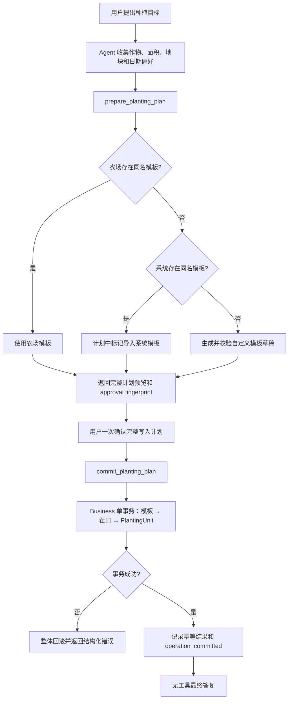

# v2 Agent 种植计划工作流与写操作收敛修复规格

## 1. 文档信息

| 项目 | 内容 |
| --- | --- |
| 状态 | draft |
| 目标版本 | v2 Agent + v2 Business |
| 问题来源 | 会话 `conv-mslhbasr` 的榴莲种植链路 |
| 核心范围 | 作物模板、茬口、种植单元、HITL、写后收敛、事件导出 |
| 实施原则 | 测试先行、Business 保证业务不变量、Agent 不编排数据库事务 |

## 2. 背景与问题定义

用户的真实目标是创建一份完整的种植计划：

```text
种植榴莲
  + 20 亩
  + 判断或建议开始日期
  + 创建“睢宁地块”
  + 没有榴莲模板时创建专属模板
  + 创建并绑定茬口
```

现有链路实际发生了以下错误：

1. Agent 只能查询系统模板和农场模板，不能创建或导入模板。
2. Agent 把系统模板 ID 当作农场模板 ID 创建茬口，首次写入失败。
3. 首次失败后，Agent 未停止，而是选择无关的“橘子”模板继续创建榴莲茬口。
4. `field_name` 只写入茬口字符串，没有创建真实 `PlantingUnit`，但回复声称地块已创建。
5. 用户选择“创建榴莲专属模板”后，Agent 实际又创建了一条绑定橘子模板的茬口。
6. 第二次错误写入已经成功，但 Turn 最终因 `max_steps` 标记为失败，用户无法确认数据库已经发生变更。
7. 前端导出 session 时重复记录 `final_answer`，污染调试证据。

这不是单一 Prompt 或模型能力问题，而是以下边界同时缺失：

- Agent 可用能力不完整；
- 系统模板与农场模板的 ID/生命周期未隔离；
- Business 没有校验“目标作物”和“绑定模板”的语义一致性；
- 多实体写入缺少事务、幂等和确定性收尾；
- Planner 只有静态步骤，没有步骤结果绑定、失败中止和补偿能力。

## 3. 目标

本次修改必须实现：

1. 用户表达“种某作物并创建模板、地块、茬口”时，Agent 能形成一份结构化种植计划，而不是自由拼接 CRUD。
2. 模板不存在时，系统只能选择“导入同名系统模板”或“创建同名自定义模板”，禁止使用无关作物模板兜底。
3. 模板、茬口和种植单元在 Business 的同一事务中创建；任何一步失败都不得留下半成品。
4. 同一次用户请求重复提交时返回同一执行结果，不重复创建模板、茬口或种植单元。
5. HITL 展示的操作必须与最终执行完全一致；审批后若计划内容改变，必须重新审批。
6. 写操作成功后必须进入确定性收尾，不能因为耗尽 ReAct 步数而把已提交写入报告为失败。
7. 独立的“创建模板”和“创建种植单元”请求也必须有对应 Agent Skill，不能错误映射成创建茬口。
8. session 导出中每个后端事件只记录一次。

## 4. 非目标

本次明确不做：

- 不重构全部 Agent 为通用 BPMN/工作流平台。
- 不为成本、债务、工人、工单等其他业务域同时建设聚合工作流。
- 不建设完整农业知识库，也不承诺仅凭短期天气判断某作物是否适种。
- 不依靠作物关键词表或正则路由修复“榴莲”单个案例。
- 不删除现有 `create_crop_cycle`、模板 CRUD 或种植单元 CRUD。
- 不自动删除历史异常数据，包括会话中已经创建的茬口 `25`、`26`；历史数据修复必须单独审计并经用户确认。
- 不修改 `archive/` 或旧版 `backend/` 链路。
- 不进行 Web UI 视觉重设计，只修复事件记录和必要的审批信息展示。

## 5. 必须成立的业务不变量

以下规则必须由 Business 校验，不能只写在 Prompt 中：

1. `CropCycle.crop_template_id` 必须指向当前农场可用的模板。
2. 创建种植计划时，标准化后的目标作物名必须与模板作物名一致。
3. 系统模板不能直接绑定到农场茬口；必须先通过导入流程复制成农场模板。
4. 不存在同名模板时，不得自动选择“最相近”或同分类的其他模板。
5. 用户要求创建地块/棚/区域时，必须生成真实 `PlantingUnit`；只填写 `CropCycle.field_name` 不算创建地块。
6. 模板、茬口和种植单元的聚合创建必须原子提交。
7. 相同 `farm_id + client_request_id` 只能产生一组业务实体。
8. 审批内容的指纹必须与提交内容一致，审批后不得静默替换模板、日期、面积或地块。
9. 工具返回业务错误后，Agent 不得未经重新规划和重新审批执行另一个写操作。
10. 最终回复只能依据已提交的结构化结果声明成功，不能依据 thought、搜索摘要或计划文本声明完成。

## 6. 目标流程



## 7. 总体解决方案

### 7.1 Business 提供种植计划聚合能力

新增一个跨服务的应用级工作流，由 Business 持有，不由 LLM 逐步编排数据库写入：

- `prepare_planting_plan`：只读，解析和校验种植计划，返回可审批草稿。
- `commit_planting_plan`：写操作，根据已准备草稿在一个事务中完成模板、茬口和种植单元创建。

Business 内部调用现有：

- `crop_service`：查询、导入或创建模板；
- `cycle_service`：创建茬口和阶段；
- `work_order_service`：创建真实种植单元。

新增 `planting_plan_service.py` 是允许的，因为它代表清晰的跨实体用例边界：调用方是 Business MCP 薄适配层，职责是事务编排和业务不变量，不能放进任意一个现有 CRUD Service。

### 7.2 Agent 补齐独立能力

除聚合种植计划 Skill 外，还需补齐：

- `create_crop_template`
- `import_system_crop_template`
- `create_planting_unit`
- `query_planting_units`

独立 Skill 用于用户只管理单一实体的场景；完整种植目标默认使用聚合种植计划 Skill。

### 7.3 不使用无关模板兜底

`create_crop_cycle` 增加目标作物语义校验：

- Agent-facing schema 必须提供 `crop_name`；
- Business MCP 将其作为 `expected_crop_name` 传给 Service，读取模板实际名称并标准化比较；
- 不匹配时返回 `crop_template_mismatch`；
- 系统模板 ID 返回 `system_template_not_imported`；
- 错误响应包含 `code`、目标作物、模板名称和可执行下一步，但不得自动发起替代写入。

现有 Business REST 创建茬口接口保持兼容，不新增必填字段；语义校验参数只在 Agent/MCP 写入链路中强制要求。

### 7.4 写后强制收敛

`max_steps` 只限制“可继续选择工具的决策轮次”，不占用写后最终答复轮次。

任何成功写操作必须：

1. 立即记录 `operation_committed` 事件及结构化结果摘要；
2. 清空下一轮 tools，强制进入无工具最终答复；
3. 允许额外一次不计入 `max_steps` 的 finalization LLM 调用；
4. 如果 finalization LLM 失败，使用工具成功结果生成受限的结构化确认，不得把 Turn 标记为普通 `failed`；
5. Trace 中区分 `business_committed=true` 和 `reply_generated=true/false`。

结构化确认只允许复述工具真实返回的实体 ID、名称、日期、面积和状态，不允许补充推测性农业结论。

### 7.5 HITL 与计划指纹

`prepare_planting_plan` 返回：

- 用户可读的审批摘要；
- 规范化计划；
- `approval_fingerprint`；
- `client_request_id`。

审批界面展示：

- 将使用、导入或创建哪个模板；
- 模板阶段；
- 茬口名称和开始日期；
- 地块名称和面积；
- 将创建的实体数量。

`commit_planting_plan` 必须携带原 `approval_fingerprint`。Business 对提交内容重新计算指纹，不一致时返回 `approval_stale`，要求重新预览和审批。

该指纹用于防止 Agent 在审批后意外修改计划，不替代服务鉴权。Business MCP 仍只接受已认证的 Agent Service Token。

### 7.6 农业建议与执行隔离

天气、Web 搜索和农业知识只用于生成建议或模板草稿，不直接证明可以执行。

当用户让 Agent 决定种植日期时：

- 必须明确建议所使用的位置；
- 农场默认位置与目标地块位置不一致时先澄清；
- 三天天气只能作为近期作业条件，不能单独证明多年生作物适种；
- 建议日期、证据摘要和不确定性进入计划预览；
- 用户确认后才提交写操作。

## 8. 接口契约

### 8.1 Agent-facing Skill：prepare_planting_plan

风险等级：`read`

请求示例：

```json
{
  "crop_name": "榴莲",
  "variety": null,
  "total_area_mu": 20,
  "field_name": "睢宁地块",
  "start_date": "2026-08-09",
  "field_location": "江苏省徐州市睢宁县",
  "field_location_confirmed": true,
  "template_strategy": "auto",
  "custom_template": null
}
```

`template_strategy`：

- `auto`：仅允许同名农场模板或同名系统模板；均不存在时返回需要自定义模板。
- `existing`：必须指定当前农场模板。
- `import_system`：必须指定同名系统模板。
- `create_custom`：必须提供完整自定义模板草稿。

当目标地块位置与农场默认位置冲突时，首次准备返回
`planting_location_ambiguous`；只有用户明确确认目标地块位置后，Agent 才能将
`field_location_confirmed` 设为 `true` 重新准备。

准备完成响应：

```json
{
  "status": "ready",
  "client_request_id": "uuid",
  "approval_fingerprint": "sha256:...",
  "plan": {
    "crop_name": "榴莲",
    "template_action": "create_custom",
    "template": {
      "name": "榴莲",
      "variety": null,
      "category": "果树",
      "stages": [
        {
          "name": "幼苗期",
          "duration_days": 1095,
          "order_index": 0,
          "key_tasks": "幼树管理"
        }
      ]
    },
    "cycle": {
      "name": "榴莲种植一季",
      "start_date": "2026-08-09",
      "total_area_mu": 20
    },
    "planting_unit": {
      "name": "睢宁地块",
      "area_mu": 20,
      "planted_date": "2026-08-09"
    },
    "advisory": {
      "location": "江苏省徐州市睢宁县",
      "basis": ["用户提供的地块位置", "近期天气和作物资料"],
      "confidence": "low",
      "warnings": ["短期天气不能单独证明该作物适合当地长期露天种植"]
    }
  },
  "approval_summary": "将创建榴莲模板、1 个榴莲茬口和 1 个 20 亩种植单元。"
}
```

以上阶段数据只用于展示接口结构，不作为榴莲种植标准；实施和验收不得把示例时长写成硬编码知识。

信息不足响应：

```json
{
  "status": "needs_information",
  "code": "custom_template_required",
  "missing": ["custom_template.stages"],
  "message": "农场和系统均没有榴莲模板，需要先生成并确认榴莲生长阶段。"
}
```

### 8.2 Agent-facing Skill：commit_planting_plan

风险等级：`write_confirm`

请求：

```json
{
  "client_request_id": "uuid",
  "approval_fingerprint": "sha256:...",
  "plan": {
    "crop_name": "榴莲",
    "template_action": "create_custom",
    "template": {},
    "cycle": {},
    "planting_unit": {}
  }
}
```

成功响应：

```json
{
  "status": "committed",
  "idempotent_replay": false,
  "template": {"id": 31, "name": "榴莲"},
  "cycle": {"id": 27, "name": "榴莲种植一季"},
  "planting_unit": {"id": 12, "name": "睢宁地块", "area_mu": 20}
}
```

重复请求返回相同实体 ID，并设置：

```json
{"status": "committed", "idempotent_replay": true}
```

### 8.3 错误码

| code | 触发条件 | 是否允许自动重试 |
| --- | --- | --- |
| `crop_template_mismatch` | 目标作物与模板名称不一致 | 否，必须重新准备计划 |
| `system_template_not_imported` | 系统模板 ID 被直接用于农场茬口 | 否，先导入 |
| `custom_template_required` | 农场和系统均无同名模板 | 否，先生成模板草稿 |
| `planting_location_ambiguous` | 农场位置与目标地块位置冲突 | 否，询问用户 |
| `approval_stale` | 提交内容与审批指纹不一致 | 否，重新审批 |
| `idempotency_conflict` | 同一请求 ID 对应不同请求内容 | 否，生成新请求 ID |
| `planting_plan_rollback` | 聚合事务任一步失败并已回滚 | 可在修正输入后新建计划 |
| `write_committed_reply_failed` | 写入成功但最终答复生成失败 | 不重试写入，只重试答复 |

## 9. 数据模型变更

新增聚合执行记录，用于幂等和审计：

```sql
CREATE TABLE planting_plan_executions (
  id BIGINT PRIMARY KEY AUTO_INCREMENT,
  farm_id BIGINT NOT NULL,
  client_request_id VARCHAR(64) NOT NULL,
  request_fingerprint VARCHAR(80) NOT NULL,
  approval_fingerprint VARCHAR(80) NOT NULL,
  status VARCHAR(20) NOT NULL,
  crop_template_id BIGINT NULL,
  crop_cycle_id BIGINT NULL,
  planting_unit_id BIGINT NULL,
  result_json JSON NULL,
  created_at DATETIME NOT NULL,
  updated_at DATETIME NULL,
  UNIQUE KEY uq_planting_plan_farm_request (farm_id, client_request_id)
);
```

约束：

- 当前版本只持久化 `committed` 执行记录；失败详情写入 Trace，不留下半提交的幂等记录；
- 相同请求 ID、相同 fingerprint 返回既有结果；
- 相同请求 ID、不同 fingerprint 返回 `idempotency_conflict`；
- 业务实体和 `committed` 执行记录必须在同一事务中提交。

数据库变更必须新增：

- `v2/business/migrations/20260809_planting_plan_executions_up.sql`
- `v2/business/migrations/20260809_planting_plan_executions_down.sql`

禁止在应用启动时调用 `metadata.create_all()` 隐式改表。

## 10. 修改范围

### 10.1 新增文件

| 文件 | 调用方 | 职责 | 为什么不能放入现有文件 |
| --- | --- | --- | --- |
| `v2/business/services/planting_plan_service.py` | Business MCP tool、测试 | 跨模板、茬口、种植单元的事务用例与幂等校验 | 任一 CRUD Service 都不应反向拥有其他领域 Service 的完整流程 |
| `v2/business/tools/planting_plan.py` | FastMCP 注册 | `prepare/commit` 薄协议适配 | 保持 MCP 协议与业务事务分离 |
| `v2/agent/skills/manage-planting-plan/skill.md` | Skill loader | 暴露准备和提交种植计划能力 | 这是独立业务能力，不属于单一茬口 CRUD |
| `v2/agent/skills/manage-crop-templates/skill.md` | Skill loader | 模板查询、创建、导入 | 当前 `manage-crop-cycle` 混入模板只读操作，无法表达模板写能力 |
| `v2/agent/skills/manage-planting-units/skill.md` | Skill loader | 种植单元查询和 CRUD | 地块/棚是独立实体，不应伪装成 `field_name` 字符串 |
| `v2/business/migrations/20260809_planting_plan_executions_up.sql` | 部署流程 | 创建 `planting_plan_executions` | 幂等唯一约束必须由数据库保证 |
| `v2/business/migrations/20260809_planting_plan_executions_down.sql` | 回滚流程 | 安全回滚新增执行记录表 | 数据模型变更必须有明确回滚路径 |

### 10.2 修改文件

| 文件 | 修改内容 |
| --- | --- |
| `v2/business/server.py` | 注册 planting plan、crop template、planting unit MCP tool |
| `v2/business/models.py` | 增加聚合执行记录模型和唯一约束 |
| `v2/business/services/crop_service.py` | 复用同名模板解析、导入和自定义模板创建；补标准化名称校验 |
| `v2/business/services/cycle_service.py` | 校验目标作物与模板一致；拒绝系统模板直接绑定 |
| `v2/business/services/work_order_service.py` | 复用真实 PlantingUnit 创建，不新增第二套地块模型 |
| `v2/business/tools/crop_cycle.py` | 增加 `crop_name` 语义参数和结构化错误码，删除无关模板兜底可能性 |
| `v2/agent/core/turn.py` | 记录已提交写操作和写后收尾状态 |
| `v2/agent/core/react.py` | 写成功后撤销工具、保留 finalization 轮次、禁止 max_steps 覆盖已提交结果 |
| `v2/agent/infra/sse.py` | 增加 `operation_committed` 与写后答复失败事件 |
| `v2/agent/prompts/system.md` | 说明完整种植目标优先使用聚合能力；错误后不得静默替换写入方案 |
| `v2/agent/static/index.html` | 修复 `final_answer` 被重复加入 `currentTurnEvents` |
| `v2/docs/spec/2026-08-05-api-spec.md` | 实施完成后同步最终 REST/MCP/SSE 契约和错误码 |

### 10.3 测试范围

新增或扩展现有 v2 测试目录中的相关测试，不在项目根目录创建临时脚本。

必须覆盖：

- Business Service 单元测试；
- MCP tool 契约测试；
- Agent Skill 元数据测试；
- ReAct/HITL/写后收敛测试；
- 七轮真实会话回归测试；
- 数据库事务和幂等并发测试；
- 前端 session 事件导出测试。

## 11. 实施顺序

### 阶段 0：建立失败回归

1. 将 `conv-mslhbasr` 精简为稳定测试夹具。
2. 断言“创建模板”不得调用 `create_crop_cycle`。
3. 断言模板不匹配不得写入茬口。
4. 断言写成功后不得以 `max_steps` 结束。
5. 断言 session 每轮只有一个 `final_answer`。

在生产代码修改前，以上用例应先失败。

### 阶段 1：Business 安全边界

1. 增加模板名称标准化和匹配校验。
2. 拒绝系统模板 ID 直接绑定。
3. 增加模板和种植单元 MCP 能力。
4. 实现种植计划聚合 Service、事务与幂等记录。
5. 验证任一步异常时模板、茬口、种植单元均不落库。

### 阶段 2：Agent 能力与 HITL

1. 新增种植计划、模板和种植单元 Skill。
2. 完整种植目标优先选择 `prepare_planting_plan`。
3. 准备完成后只允许对同一 fingerprint 执行 `commit_planting_plan`。
4. 禁止错误后自动换模板继续写。
5. 审批摘要使用业务名称，不向用户展示内部 operation 或数据库 ID。

### 阶段 3：写后收敛

1. 记录结构化写成功事实。
2. 将最终答复轮次从工具步数预算中分离。
3. 增加只基于已提交结果的安全确认降级。
4. Trace 能区分业务提交失败与答复生成失败。

### 阶段 4：前端事件与完整验收

1. 修复 session 导出重复事件。
2. 跑真实 API + MCP + Agent + UI 链路。
3. 审计历史异常数据，但不自动删除。
4. 更新 API 规范和实现状态。

## 12. 验收标准

### 12.1 标准成功场景

输入：

```text
我想种 20 亩榴莲，不知道什么时候合适，帮我新建一个睢宁地块并创建好。
```

必须满足：

- [ ] Agent 不使用任何非榴莲模板。
- [ ] 若无同名模板，先形成榴莲模板草稿并进入一次完整计划审批。
- [ ] 用户批准后只发生一次聚合写调用。
- [ ] 创建或复用一个名为榴莲的农场模板。
- [ ] 创建一个绑定该模板的茬口。
- [ ] 创建一个真实 `PlantingUnit`，名称为睢宁地块，面积为 20 亩。
- [ ] 模板、茬口和种植单元在同一事务提交。
- [ ] 最终回复中的实体名称、ID、面积和日期与数据库一致。
- [ ] Turn 状态为 completed，不出现 `max_steps`。
- [ ] 重放相同 `client_request_id` 不新增记录。

### 12.2 模板不匹配场景

- [ ] 目标作物为榴莲、模板为橘子时返回 `crop_template_mismatch`。
- [ ] 不触发第二次替代写入。
- [ ] 不产生 CropCycle、CycleStage 或 PlantingUnit。

### 12.3 系统模板场景

- [ ] 系统模板 ID 不能直接传给 `create_crop_cycle`。
- [ ] `commit_planting_plan` 在事务内先导入系统模板，再使用导入后的农场模板 ID。
- [ ] 重复导入复用既有农场模板。

### 12.4 事务失败场景

- [ ] 模板创建成功但茬口创建失败时，模板回滚。
- [ ] 茬口创建成功但种植单元创建失败时，模板和茬口全部回滚。
- [ ] 返回 `planting_plan_rollback` 和失败步骤，不声明任何实体已创建。

### 12.5 写后答复失败场景

- [ ] Business 写入成功后即使 LLM finalization 失败，也返回基于结构化结果的成功确认。
- [ ] 不再次调用写工具。
- [ ] Trace 标记 `business_committed=true`、`reply_generated=false`。
- [ ] 用户能够明确知道操作已经提交，不能看到普通“请重试”导致重复写入。

### 12.6 审批一致性场景

- [ ] 审批显示“创建榴莲模板”时，实际工具不能是单独 `create_crop_cycle`。
- [ ] 审批后任何模板、面积、地块或日期变化都会触发 `approval_stale`。
- [ ] 一份完整种植计划默认只需要一次聚合审批。

### 12.7 前端导出场景

- [ ] 每个 SSE `final_answer` 在 `currentTurnEvents` 中只记录一次。
- [ ] 导出 `total_turns` 与页面本轮完成数一致。
- [ ] failed、completed、写后答复降级状态均能正确导出。

## 13. 验证命令

实施阶段使用项目 `v2/.venv`，并禁止生成 bytecode：

```bash
PYTHONDONTWRITEBYTECODE=1 v2/.venv/bin/python -m pytest <本次新增和修改的定向测试> -q -p no:cacheprovider
PYTHONDONTWRITEBYTECODE=1 v2/.venv/bin/python -m ruff check <本次修改的 Python 文件>
PYTHONDONTWRITEBYTECODE=1 v2/.venv/bin/python v2/scripts/validate_skill_metadata.py
bash scripts/check-layer-deps.sh
bash scripts/check-complexity-budget.sh
bash scripts/check-guide-sensor-pairing.sh
git diff --check
```

最终验收还必须启动真实 Business 与 Agent 服务，验证：

```text
prepare → approval_required → commit → operation_committed → final_answer → done(completed)
```

不能只通过 mock 测试宣称完成。

## 14. 历史异常数据处理

会话已返回创建结果的茬口 `25`、`26` 只作为待审计候选，不在本变更中自动删除。

实施完成后提供只读审计结果：

- 茬口名称；
- 绑定模板名称；
- 创建时间；
- 关联种植单元；
- 是否存在名称/模板不一致；
- 建议动作：保留、改绑、删除。

实际修复数据前必须由用户确认精确实体和操作方式。

## 15. 完成定义

以下条件全部满足才可将状态改为 `implemented`：

1. 七轮真实链路回归通过，没有错误模板、虚假地块或重复茬口。
2. Business 事务、幂等、审批指纹和回滚测试通过。
3. 写成功后不再出现普通 `max_steps` 失败。
4. session 导出不再重复 `final_answer`。
5. 定向测试、ruff、Skill 元数据校验、架构约束和复杂度预算通过。
6. 真实 provider、真实 MCP、真实数据库和 UI 链路完成一次验收。
7. `2026-08-05-api-spec.md` 已同步最终实现契约。
8. 剩余风险和历史异常数据审计结果已单独报告。
