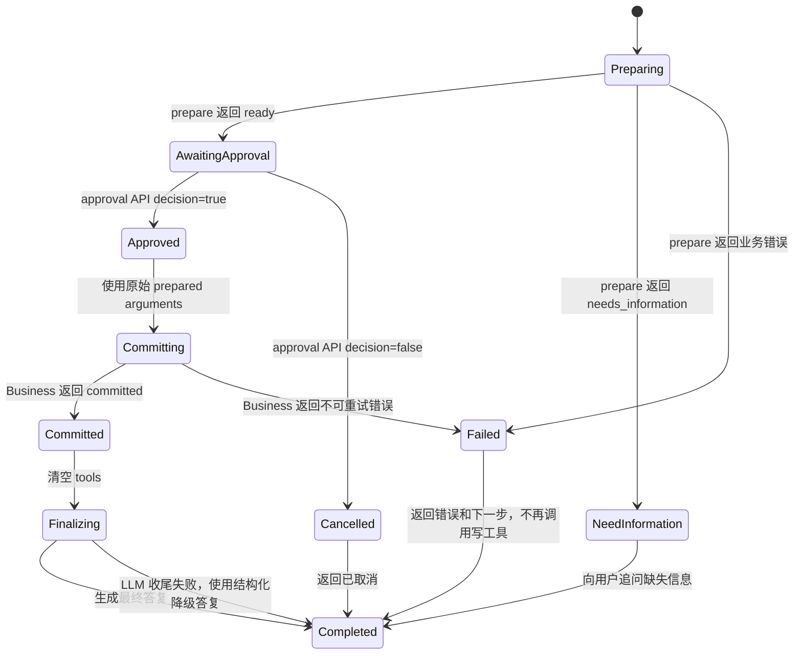
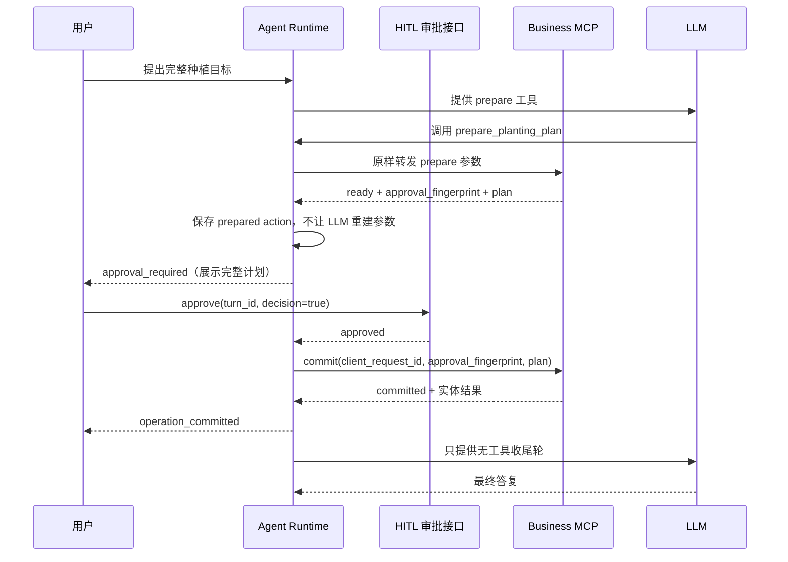

# v2 Agent 种植计划 HITL 审批状态修复规格

## 1. 文档信息

| 项目 | 内容 |
| --- | --- |
| 状态 | draft |
| 目标版本 | v2 Agent |
| 问题来源 | turn `c97fb3d3cb3b`，前置 prepare turn `c7a8a7a9` |
| 修复层级 | Agent Runtime、HITL、Skill 元数据、前端审批交互 |
| Business MCP | 保持现有审批指纹校验，不修改业务不变量 |
| 实施原则 | 结构化状态驱动、原始参数传递、失败立即收敛、禁止确认词词库 |

## 2. 问题证据

前置 turn `c7a8a7a9` 已真实调用 `prepare_planting_plan`，返回：

- `client_request_id`：由 Business 生成的请求 ID；
- `approval_fingerprint`：`sha256:<hash>` 格式的审批指纹；
- `plan`：包含模板、茬口、种植单元和建议的规范化计划。

当前 turn `c97fb3d3cb3b` 收到用户文本 `ok` 后，Agent 没有使用上述结构化结果，而是让模型自行重建提交参数，表现为：

1. 将普通 JSON 文本当作 `approval_fingerprint`；
2. 重建了与 prepare 返回值结构不同的 `plan`；
3. 使用了自行拼接的 `client_request_id`；
4. Business 返回 `approval_stale`，在写入校验前安全拒绝；
5. Agent 将该错误当作普通 observation，继续调用天气、城市搜索，并再次提交相同错误参数；
6. 最终因耗尽 ReAct 步数返回 `max_steps_reached`。

结论：Business MCP 的拒绝是正确行为；缺陷在 Agent 没有把 prepare 结果转换为 HITL 待审批状态，也没有在不可重试错误后终止当前写链路。

## 3. 目标

本次修复必须实现：

1. `prepare_planting_plan` 返回 `status=ready` 后，Runtime 在同一 turn 内创建结构化 HITL 待审批动作；
2. HITL 展示内容直接来自 prepare 返回值；
3. 用户通过审批接口确认后，Runtime 将原始 `client_request_id`、`approval_fingerprint` 和 `plan` 原样交给 `commit_planting_plan`；
4. Runtime 不允许模型重新生成、补全或改写提交参数；
5. `approval_stale`、`crop_template_mismatch`、`idempotency_conflict` 等不可重试业务错误立即结束当前 turn；
6. 成功提交后记录 `operation_committed`，进入无工具确定性收尾；
7. 纯文本 `ok`、`好`、`确认` 等不直接产生写入，也不作为确认词库参与路由。

## 4. 非目标

- 不新增“ok/好/确认”等自然语言确认词列表；
- 不通过 Prompt 或关键词规则猜测用户是否批准写入；
- 不把待审批计划写入长期记忆或普通对话历史；
- 不修改 Business 的指纹计算、事务、幂等和作物模板校验；
- 不让 Agent 在 Business 返回写错误后切换模板、作物、地块或日期继续写入；
- 不重构全部 ReAct Runtime，不建设通用 BPMN 工作流平台；
- 不处理历史会话已经产生的异常业务数据。

## 5. 状态模型



### 5.1 状态含义

| 状态 | 允许动作 | 禁止动作 |
| --- | --- | --- |
| `Preparing` | 调用只读 prepare | 直接调用 commit |
| `AwaitingApproval` | 等待审批接口 | 调用模型重新生成提交参数 |
| `Approved` | 使用已保存参数执行一次 commit | 修改计划字段或重新规划 |
| `Committing` | 等待 Business 结果 | 调用天气、城市、搜索或替代写工具 |
| `Committed` | 记录提交事件并收尾 | 再次调用写工具 |
| `Failed` | 返回结构化错误 | 自动重试或更换业务方案 |

## 6. 目标流程



关键要求：`approval_required` 必须在 prepare 成功后由 Runtime 产生，审批对象是结构化 prepared action，而不是模型生成的一段自然语言说明。

## 7. Agent 侧解决方案

### 7.1 Prepare Skill 声明审批后继动作

Prepare Skill 的 operation metadata 增加结构化后继关系，例如：

```yaml
approval_followup:
  tool_name: commit_planting_plan
  arguments_from_result:
    - client_request_id
    - approval_fingerprint
    - plan
```

Runtime 只读取该元数据，不写业务字段映射表。prepare 成功后，从结果中提取指定字段，形成：

```json
{
  "tool_name": "commit_planting_plan",
  "arguments": {
    "client_request_id": "<prepare 返回值>",
    "approval_fingerprint": "<prepare 返回值>",
    "plan": "<prepare 返回值>"
  },
  "source_turn_id": "<当前 turn>",
  "source_operation": "prepare_planting_plan"
}
```

缺少任一字段时不得进入审批，必须返回 `prepare_result_incomplete` 并结束当前 turn。

### 7.2 HITL 只接受结构化审批决定

现有 `approval_required`、`approval_waiter`、`approve` 作为唯一写操作确认链路：

- `approval_required` 负责展示动作、计划摘要和关键字段；
- `approve` 负责传递 `turn_id` 和 `decision`；
- `decision=true` 才能继续执行 commit；
- `decision=false` 清理待审批动作并结束当前 turn；
- 新的聊天消息（包括 `ok`）不直接恢复或执行写操作。

如果用户没有点击审批控件而发送文本确认，Agent 只能说明“请通过审批控件确认”，不得把该文本解释成写入授权。

### 7.3 Commit 参数不可变

执行 commit 前，Runtime 必须使用 `pending_approval.arguments`，不得使用模型在后续轮次生成的 arguments。可执行条件只有：

```text
pending_approval 存在
且 pending_approval.tool_name == commit_planting_plan
且 approval decision == true
```

Business 仍然重新计算指纹并做最终防线校验；Runtime 不替代 Business 校验。

### 7.4 业务错误立即收敛

工具返回结构化错误后，Runtime 必须先记录 observation，再根据错误策略结束当前 turn：

| 错误码 | Runtime 行为 |
| --- | --- |
| `approval_stale` | 清理待审批动作，提示重新 prepare，不再调用任何工具 |
| `crop_template_mismatch` | 返回模板不匹配原因，不自动寻找替代模板 |
| `system_template_not_imported` | 返回导入要求，不自动改调其他写操作 |
| `idempotency_conflict` | 返回请求冲突，要求生成新的 prepare 结果 |
| `planting_plan_rollback` | 返回已回滚和失败步骤，不声明任何实体成功 |
| 其他明确业务错误 | 默认结束当前写链路，除非 Skill 明确声明可重试 |

不能把上述错误继续喂给 LLM 让它自由选择天气、城市搜索或其他写工具。

### 7.5 成功后的确定性收尾

Business 返回 `committed` 后：

1. 记录一次 `operation_committed`，包含真实实体结果；
2. 清空 tools，禁止再次产生写调用；
3. 允许一次 finalization LLM 调用；
4. 收尾失败时使用结构化结果生成成功确认；
5. Trace 同时记录 `business_committed=true` 和 `reply_generated` 状态。

## 8. 前端交互要求

前端收到 `approval_required` 时必须展示：

- 模板动作：使用、导入或创建；
- 模板名称和阶段摘要；
- 茬口名称、开始日期、面积；
- 种植单元名称、日期、面积；
- “确认执行”和“取消”按钮。

按钮调用审批接口，不向聊天接口发送 `ok` 作为替代确认。重复点击必须被 `turn_id` 或服务端状态保护，不能产生第二次 commit。

## 9. 修改范围

### 9.1 必须修改

- Agent Runtime：处理 prepare ready、创建 pending approval、原样 commit、错误终止和成功收尾；
- HITL 状态对象：明确 pending approval 的来源和不可变 arguments；
- Skill metadata/schema：声明 prepare → commit 的结构化后继关系；
- Agent tests：覆盖同轮审批、参数不可变、错误终止和成功收尾；
- 前端审批组件或事件处理：消费 `approval_required` 并调用 approve API。

### 9.2 不修改

- `v2/business/services/planting_plan_service.py` 的指纹、事务和幂等实现；
- Business MCP 的 `approval_stale` 拒绝逻辑；
- 通用意图关键词、确认词库和领域分类器；
- 旧版 `backend/` 和 `archive/` 链路。

## 10. 验收标准

### 10.1 正常审批

- [ ] prepare 返回 `ready` 后，同一 turn 产生一次 `approval_required`；
- [ ] 审批展示内容与 prepare 返回的 plan 完全一致；
- [ ] approve 后只调用一次 commit；
- [ ] commit 参数与 prepare 返回的 request ID、指纹、plan 深度相等；
- [ ] Business 返回 committed 后产生一次 `operation_committed`；
- [ ] Turn 最终状态为 `completed`。

### 10.2 文本确认隔离

- [ ] 新聊天 turn 发送 `ok`、`确认` 或自然语言同意时，不直接调用 commit；
- [ ] 没有 pending approval 时，任何模型生成的 commit 调用都不能绕过审批；
- [ ] 不存在确认词列表或基于关键词的写入授权规则。

### 10.3 错误收敛

- [ ] `approval_stale` 后不再调用天气、城市、搜索或其他写工具；
- [ ] `crop_template_mismatch` 后不自动选择其他模板；
- [ ] 失败 turn 不因重复尝试变成 `max_steps_reached`；
- [ ] 错误答复不声明任何未提交实体已创建。

### 10.4 写后收尾

- [ ] finalization LLM 失败时仍返回基于结构化 commit 结果的成功确认；
- [ ] finalization 阶段不再暴露写工具；
- [ ] trace 可区分业务已提交和最终答复是否生成。

## 11. 验证命令

```bash
PYTHONDONTWRITEBYTECODE=1 PYTHONPATH=v2 python3 -m pytest \
  v2/tests/test_agent_planting_plan_workflow.py \
  tests/test_v2_skill_routing.py -q

ruff check \
  v2/agent/core \
  v2/agent/skills \
  v2/tests/test_agent_planting_plan_workflow.py \
  tests/test_v2_skill_routing.py

bash scripts/check-complexity-budget.sh
```

## 12. 完成定义

只有当正常审批、文本确认隔离、业务错误收敛、写后确定性收尾和前端审批交互全部通过验收，才可将本 spec 状态改为 `implemented`；仅修改 Prompt 或增加确认词列表不算完成。
