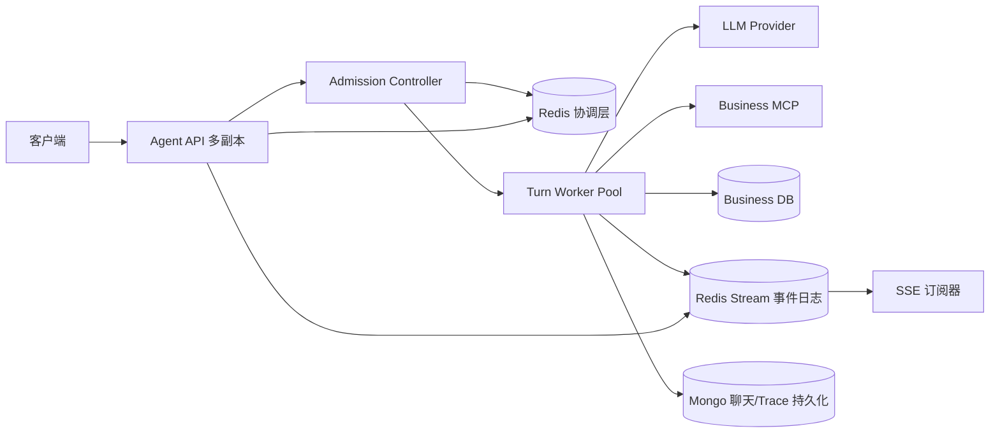

# Agent Chat 并发 Harness 与对话隔离设计

> Spec ID: 2026-08-12-agent-chat-concurrency-harness
> 状态: implemented
> 范围: v2 Agent `/api/v2/chat`、Turn 执行、HITL 审批、SSE 事件、Redis 协调层
> 关联代码: `v2/agent/api/chat.py`、`v2/agent/deps.py`、`v2/agent/core/react.py`、`v2/agent/infra/chat_store.py`
> 关联文档: `v2/docs/spec/2026-08-05-api-spec.md`

## 1. 背景与问题

当前 Agent Chat 已经使用 FastAPI 异步路由和 LLM 流式调用，但执行状态主要保存在单进程内存中：

- `active_turns` 和 `pending_approvals` 是模块级字典，只对当前进程可见；
- 同一 `conversation_id` 没有显式的串行闸门，两个 turn 可能同时读取和覆盖会话记忆；
- SSE 事件只通过当前 HTTP 流发送，客户端断线后无法从服务端事件日志继续消费；
- `/approve` 依赖当前进程内的 Future，多进程或多副本部署后可能无法找到待审批 turn；
- LLM、MCP、数据库和第三方网络调用的耗时没有统一的并发预算、排队预算和超时分层；
- 当前日志已经出现不同会话并发执行，但单次 LLM 调用可能等待几十秒，用户容易把下游慢、队列等待、同会话竞态和 SSE 断线混淆为“Chat 接口阻塞”。

本 Spec 的目标不是简单增加一个全局锁，而是建立可观测、可限流、可恢复、可横向扩展的 Chat Harness。

## 2. 目标

### 2.1 必须实现的目标

1. 同一个用户、农场、会话内的 turn 严格按顺序执行。
2. 不同用户或不同会话可以并行执行，互不因会话锁而阻塞。
3. 所有 Agent 副本共享 turn、审批、锁、队列和 SSE 事件状态。
4. 支持明确的全局、用户级、会话级并发上限，并在超限时快速返回结构化错误。
5. 支持客户端重试、SSE 断线重连和 `/approve` 跨进程处理。
6. 业务写操作具备幂等保护，不能因为网络重试或重复提交而重复写入。
7. 能通过自动化测试证明隔离并行、限流、超时、恢复和审批不串台。

### 2.2 非目标

- 本 Spec 不改变 Business 域业务事务语义，不把 Redis 当作业务数据主库。
- 本 Spec 不允许同一 conversation 内多个 turn 无序并行；如果未来需要支持，需要另行设计消息版本合并和业务冲突解决。
- 本 Spec 不承诺未经压测验证的绝对吞吐量。本文的容量数字是首版基线和验收门槛，最终生产值由压测结果校准。
- 本 Spec 不要求一次性把聊天全文和 Trace 全部迁移到 Redis；Redis 只承担短期协调、队列和可重放事件职责。

## 3. 并发模型

### 3.1 并发隔离键

会话锁和会话队列的逻辑键必须包含身份边界：

```text
conversation_scope = user_id + ":" + farm_id + ":" + conversation_id
```

推荐使用不可逆或稳定哈希作为 Redis key 的后缀，避免用户输入直接出现在 key 中：

```text
scope_hash = sha256(user_id + "|" + farm_id + "|" + conversation_id)
```

这样可以避免两个用户伪造相同 `conversation_id` 后共享上下文或互相阻塞。

### 3.2 隔离与并行规则

| 场景 | 行为 | 说明 |
|---|---|---|
| 同一 user + farm + conversation | 严格串行 | 后续 turn 排队或返回 busy，由 API 策略决定 |
| 同一用户不同 conversation | 可并行 | 受用户级并发上限限制 |
| 不同用户相同 conversation_id | 可并行 | 因身份隔离键不同，不共享锁和历史 |
| 不同 farm 相同 user/conversation | 可并行 | 农场是业务隔离边界 |
| 同一 turn 的重复提交 | 幂等返回原 turn | 不得创建第二个执行任务 |
| 同一 turn 的重复审批 | 返回 `409 approval_already_resolved` | 不得覆盖第一次决定 |
| SSE 客户端重复连接 | 允许订阅 | 只能读取同一 turn 的事件，不得重复执行 turn |

### 3.3 同一 conversation 的队列策略

首版采用“单活跃 turn + 有界等待队列”：

- 当前 conversation 没有活跃 turn：立即获得锁并执行；
- 当前 conversation 有活跃 turn，且队列未满：进入该 conversation 的 FIFO 队列；
- 队列达到上限：返回 `409 conversation_busy` 或 `429 conversation_queue_full`；
- 同一 conversation 的等待 turn 不得抢占当前 turn；
- 当前 turn 结束、取消、失败或超时后，按 FIFO 唤醒下一条；
- 排队等待超过 `conversation_queue_wait_timeout`：转为 `timeout`，不进入执行阶段。

默认建议：每个 conversation 最多 1 个运行中 turn、2 个排队 turn。产品若希望前端立即提示用户，可以选择 busy 直接返回，而不是排队。

### 3.4 执行阶段划分

每个 turn 必须经历明确状态：

```text
accepted
  -> queued
  -> running
  -> awaiting_approval
  -> running
  -> completed
```

异常终态：

```text
queued -> cancelled | timeout | rejected
running -> failed | timeout | cancelled
awaiting_approval -> rejected | timeout | cancelled
```

终态只能写入一次。任何重复完成、重复失败或重复取消都必须保持第一次终态，并记录幂等命中指标。

## 4. 目标架构



### 4.1 API 层职责

API 层只负责：

- 鉴权和解析 `user_id`、`farm_id`；
- 校验 `conversation_id`、消息长度和幂等键；
- 创建或读取 turn；
- 调用 Admission Controller 做容量和会话准入；
- 返回 SSE 订阅或 turn 状态；
- 读取 Redis Stream 并向客户端转发；
- 接收 `/approve`、`/cancel`、重连请求。

API 层不得把完整 ReAct 执行逻辑绑定在 HTTP 请求协程中，也不得把审批 Future 只保存在本地内存。

### 4.2 Worker 层职责

Worker 层负责：

- 从 Redis 队列领取 turn；
- 获取 conversation 分布式锁；
- 执行 ReAct、LLM、MCP、HITL 状态机；
- 定期刷新 turn lease；
- 写入事件 Stream 和最终状态；
- 释放锁、更新计数器和执行指标；
- 在进程退出或 lease 过期后允许任务恢复或转失败。

Worker 不应依赖某一个 API 进程内的 Python 对象才能完成 turn。

### 4.3 数据持久化边界

| 数据 | Redis | Mongo/业务库 |
|---|---|---|
| 当前 turn 状态 | 是，短期运行态 | 是，最终状态/审计 |
| 会话锁 | 是 | 否 |
| 排队信息 | 是 | 可选审计 |
| HITL 待审批 | 是 | 是，最终审批记录 |
| SSE 事件 | 是，短期可重放 | Trace 或审计按现有策略保存 |
| 聊天全文 | 否 | Mongo `conversationMessages` |
| 业务写入 | 否 | Business DB |

Redis 故障时不得假装继续执行写操作。应进入保护模式：拒绝新 turn 或只允许明确配置的降级路径，并返回 `coordination_unavailable`。

## 5. Redis 设计

### 5.1 Key 命名规范

统一前缀：

```text
fm:v2:agent:{environment}:{resource}:{identifier}
```

示例：

```text
fm:v2:agent:prod:turn:{turn_id}
fm:v2:agent:prod:conversation:{scope_hash}:lock
fm:v2:agent:prod:conversation:{scope_hash}:queue
fm:v2:agent:prod:user:{user_scope_hash}:active
fm:v2:agent:prod:events:{turn_id}
fm:v2:agent:prod:idempotency:{scope_hash}:{client_request_id}
fm:v2:agent:prod:approval:{turn_id}
fm:v2:agent:prod:worker:{worker_id}:heartbeat
```

`environment` 必须来自配置，禁止开发、测试和生产共用同一 Redis key 前缀。

### 5.2 Turn Hash

Key：

```text
fm:v2:agent:{env}:turn:{turn_id}
```

类型：Redis Hash。

字段：

```text
turn_id
user_id
farm_id
conversation_id
scope_hash
client_request_id
status
queue_entered_at
started_at
finished_at
worker_id
lease_token
version
step_count
pending_approval_id
last_event_seq
error_code
error_message
created_at
updated_at
```

要求：

- 使用 Lua 或带版本条件的事务更新状态；
- `version` 每次状态迁移递增；
- 终态写入后保留至少 24 小时，供重试、查询和故障分析使用；
- `error_message` 必须脱敏，不能写入 token、密码或完整连接串。

### 5.3 Conversation Lock

Key：

```text
fm:v2:agent:{env}:conversation:{scope_hash}:lock
```

类型：String，值为随机 `lease_token`。

获取：

```text
SET key lease_token NX PX lock_ttl_ms
```

释放必须使用 Lua 校验 token，禁止直接 `DEL`：

```lua
if redis.call('GET', KEYS[1]) == ARGV[1] then
  return redis.call('DEL', KEYS[1])
end
return 0
```

续租也必须校验 token：

```lua
if redis.call('GET', KEYS[1]) == ARGV[1] then
  return redis.call('PEXPIRE', KEYS[1], ARGV[2])
end
return 0
```

建议参数：

| 参数 | 初始值 | 说明 |
|---|---:|---|
| `lock_ttl_ms` | 30,000 | Worker lease 失效保护时间 |
| `renew_interval_ms` | 10,000 | 正常执行时续租间隔 |
| `lock_acquire_timeout_ms` | 100 | 不长时间阻塞 API 请求 |

Worker 必须在失去 lease 后停止继续调用 LLM/MCP，避免旧 Worker 和新 Worker 同时执行同一 conversation。

### 5.4 Conversation Queue

Key：

```text
fm:v2:agent:{env}:conversation:{scope_hash}:queue
```

类型：Redis List，使用 `RPUSH` 入队和 `BLPOP`/Lua 有条件出队。

队列项只保存 `turn_id`，完整 turn 数据保存于 Turn Hash。入队时必须同时检查：

- 当前 conversation 是否已有活跃 turn；
- 当前排队数量是否超过 `conversation_queue_limit`；
- `client_request_id` 是否已经创建过 turn。

如果需要跨副本统一调度，可增加全局 Stream：

```text
fm:v2:agent:{env}:turn:dispatch
```

其中消息包含 `turn_id`、`scope_hash`、`priority`、`created_at`。同 conversation 的顺序仍由 conversation lock 和 FIFO queue 保证，不能只依赖全局 Stream 顺序。

### 5.5 全局和用户并发计数

全局：

```text
fm:v2:agent:{env}:capacity:active_turns
```

用户：

```text
fm:v2:agent:{env}:user:{user_scope_hash}:active
```

建议使用 Redis Set 保存活跃 `turn_id`，避免计数器因进程崩溃长期漂移：

```text
SADD active_set turn_id
SCARD active_set
SREM active_set turn_id
```

清理任务依据 Turn Hash 的状态和 `updated_at` 回收超过 lease 的僵尸 turn。所有“加入活跃集合 + 检查容量 + 创建 turn”操作应由 Lua 或 Redis transaction 保证原子性。

### 5.6 HITL Approval

Key：

```text
fm:v2:agent:{env}:approval:{turn_id}
```

类型：Hash，建议字段：

```text
approval_id
turn_id
tool_name
risk_level
arguments_digest
status=pending|approved|rejected|expired
decision_reason
created_at
resolved_at
resolved_by
version
```

审批提交必须是条件更新：只有 `status=pending` 时才能更新为 `approved` 或 `rejected`。重复审批返回 `409 approval_already_resolved`，不能覆盖第一次决议。

审批等待不应使用本地 Future 作为唯一通知机制。可使用 Redis Pub/Sub 做低延迟唤醒，同时以 Approval Hash 为事实来源；Worker 收不到 Pub/Sub 时必须能通过短轮询或阻塞读取恢复。

审批 TTL 建议为 10 分钟。超时后由 Worker 或清理任务将状态更新为 `expired`，对应 turn 进入 `timeout` 或 `cancelled`，并写入终态事件。

### 5.7 Idempotency

Key：

```text
fm:v2:agent:{env}:idempotency:{scope_hash}:{client_request_id}
```

类型：String 或 Hash。

值至少包含：

```json
{
  "turn_id": "...",
  "request_fingerprint": "sha256(message + conversation_id)",
  "status": "accepted|completed|failed",
  "created_at": "..."
}
```

同一个 `client_request_id` 再次提交：

- 指纹一致：返回原 `turn_id` 和当前状态；
- 指纹不一致：返回 `409 idempotency_key_reused`；
- 不得创建第二个 turn。

建议 TTL：24 小时；业务写操作自己的幂等约束仍由 Business DB 保证，不能只依赖 Redis。

### 5.8 SSE Event Stream

Key：

```text
fm:v2:agent:{env}:events:{turn_id}
```

类型：Redis Stream。

事件字段：

```text
seq
event_id
turn_id
conversation_id
type
data_json
created_at
terminal
```

推荐使用单调递增的应用层 `seq`，不要让客户端依赖 Redis Stream ID 作为业务顺序。每个 turn 的事件必须包含：

1. `meta`；
2. `queued` 或 `started`；
3. ReAct 中间事件；
4. `approval_required`/`approval_result`（如适用）；
5. 恰好一个终态事件：`done`、`error`、`cancelled` 或 `timeout`。

事件保留 24 小时或直到 Mongo Trace/聊天持久化确认，取两者较晚者。SSE 重连通过 `after_seq` 读取未消费事件，不能重新执行 turn。

### 5.9 Worker Heartbeat

Key：

```text
fm:v2:agent:{env}:worker:{worker_id}:heartbeat
```

类型：String，TTL 15 秒。

值包含 worker 版本、进程号、主机和当前 turn 数量。Worker 每 5 秒刷新一次。监控需要区分：

- API 存活但 Worker 无心跳；
- Worker 有心跳但全局队列持续增长；
- Worker 有任务但 LLM/MCP 阶段无进展；
- Redis 可用但事件 Stream 写入失败。

## 6. 容量基线

### 6.1 首版目标配置

以下是单个 Agent 环境的初始基线，不是最终生产承诺：

| 指标 | 基线值 | 硬上限/行为 |
|---|---:|---|
| API 副本数 | 2 | 可无状态扩展 |
| Worker 数 | 2 | 每个 Worker 最大 4 个活跃 turn |
| Agent 全局活跃 turn | 8 | 超过后新请求进入有界队列或返回 429 |
| 单用户活跃 turn | 2 | 超过返回 `user_concurrency_limit` |
| 单 conversation 运行中 turn | 1 | 必须严格串行 |
| 单 conversation 排队 turn | 2 | 超过返回 `conversation_queue_full` |
| 全局等待队列 | 32 | 超过返回 `agent_overloaded` |
| 单 turn 最大 ReAct step | 5 | 沿用现有配置，可单独调节 |
| 单 turn 执行超时 | 120 秒 | 进入 `timeout`，释放资源 |
| 单 turn 排队超时 | 30 秒 | 进入 `timeout` 或返回 429 |
| HITL 等待超时 | 600 秒 | 审批过期并终止 turn |
| LLM 首 token 超时 | 15 秒 | 记录并按策略重试/失败 |
| LLM 单次读取超时 | 60 秒 | 不得无限等待 |
| MCP 单次调用超时 | 30 秒 | 返回结构化 tool error |
| SSE 心跳间隔 | 15 秒 | 防止代理误判连接空闲 |

### 6.2 容量计算方法

容量不能只看 HTTP QPS。应以 Agent turn 的外部调用占用为核心：

```text
所需活跃 turn ≈ 目标每秒完成 turn 数 × P95 turn 时长（秒）
```

例如 P95 turn 时长为 20 秒、目标吞吐为 0.3 turn/s，则至少需要约 6 个活跃槽位，再预留 30% 余量，初始值可设为 8。

LLM Provider 和 Business MCP 还必须分别设置预算：

```text
agent_active_limit >= llm_inflight_limit >= mcp_inflight_limit
```

如果下游容量更小，Agent 必须在下游入口做信号量或队列控制，不能让所有 turn 同时打满 Provider。

### 6.3 扩容规则

满足以下任一条件连续 5 分钟，应评估扩容或降低并发：

- 全局活跃 turn 使用率 > 80%；
- 全局队列长度 P95 > 16；
- 排队等待 P95 > 5 秒；
- LLM Provider 429 或 5xx > 2%；
- MCP 连接池等待 P95 > 1 秒；
- Redis 命令延迟 P95 > 20ms；
- turn 超时率 > 1%。

扩容后必须重新运行全部并发验收，不允许只增加 Worker 数而不重新校准 LLM、MCP、数据库和 Redis 连接池。

## 7. API 与协议调整

### 7.1 Chat 请求

兼容现有字段，并增加幂等和版本信息：

```json
{
  "message": "查询北京天气",
  "conversation_id": "conv-abc123",
  "client_request_id": "req-20260812-001",
  "expected_conversation_version": 12,
  "delivery_mode": "sse"
}
```

其中：

- `client_request_id` 推荐必填，缺失时由服务端生成但无法保证客户端重试幂等；
- `expected_conversation_version` 可选，提供时启用严格 CAS；
- `delivery_mode` 首版只支持 `sse`，后续可以扩展 WebSocket 或轮询。

### 7.2 Chat 响应

兼容现有 POST + SSE，同时在 `meta` 事件中返回：

```json
{
  "turn_id": "t-001",
  "conversation_id": "conv-abc123",
  "scope_hash": "...",
  "status": "queued",
  "queue_position": 1,
  "request_id": "...",
  "event_stream": "/api/v2/turns/t-001/events"
}
```

建议新增异步任务接口，便于移动端和长任务：

```http
POST /api/v2/turns
GET  /api/v2/turns/{turn_id}
GET  /api/v2/turns/{turn_id}/events?after_seq=0
POST /api/v2/turns/{turn_id}/approve
POST /api/v2/turns/{turn_id}/cancel
```

现有 `/chat` 可以作为“创建 turn 后立即订阅 SSE”的兼容外观。

### 7.3 错误码

| code | HTTP | 说明 |
|---|---:|---|
| `conversation_busy` | 409 | 当前会话已有运行中 turn，且策略不允许排队 |
| `conversation_queue_full` | 409 | 当前会话等待队列已满 |
| `user_concurrency_limit` | 429 | 用户级活跃 turn 达到上限 |
| `agent_overloaded` | 429 | Agent 全局容量或等待队列达到上限 |
| `idempotency_key_reused` | 409 | 幂等键对应了不同请求 |
| `conversation_version_conflict` | 409 | 会话版本已被其他 turn 推进 |
| `coordination_unavailable` | 503 | Redis 协调层不可用，拒绝执行 |
| `turn_timeout` | 504 | 排队或执行超时 |
| `approval_already_resolved` | 409 | 审批已经完成 |
| `approval_expired` | 409 | 审批等待已过期 |
| `turn_not_found` | 404 | turn 或事件已超过保留期/不存在 |

所有错误响应必须包含 `code`、`message`、`request_id`，必要时包含 `retry_after` 和 `turn_id`。

## 8. 状态迁移与一致性要求

### 8.1 Turn 创建原子流程

以下操作必须在 Redis transaction 或 Lua 中完成：

1. 检查幂等键；
2. 检查全局容量和用户容量；
3. 创建 Turn Hash；
4. 写入 conversation queue 或 dispatch stream；
5. 写入幂等键；
6. 写入首个 `accepted`/`queued` 事件。

任一步失败都不能留下“幂等键存在但没有 turn”或“队列有 turn 但找不到 Turn Hash”的半状态。

### 8.2 Worker 领取流程

Worker 领取 turn 时必须：

1. 原子地从队列取得 turn_id；
2. 获取 conversation lock；
3. CAS 更新 `queued -> running`；
4. 绑定 `worker_id` 和 `lease_token`；
5. 写入 `started` 事件；
6. 开始执行。

获取不到 conversation lock 时，turn 必须回到队列尾部或进入短暂重试状态，不能丢失。

### 8.3 终态流程

终态处理必须按以下顺序：

1. CAS 更新 Turn Hash 为终态；
2. 写入唯一终态事件；
3. 持久化最终聊天消息和 Trace 摘要；
4. 释放 conversation lock；
5. 从全局/用户 active set 移除；
6. 唤醒下一个 conversation turn；
7. 保留 turn 和事件，供客户端查询与重放。

释放锁失败时，必须依赖 TTL 自动释放，同时报警；不能因为释放锁失败就重复执行下一 turn。

### 8.4 进程崩溃恢复

清理器每 30 秒扫描：

- `status=running` 且 `updated_at` 超过 lease 的 turn；
- `status=awaiting_approval` 且审批已过期的 turn；
- active set 中不存在对应有效 Turn Hash 的 turn；
- 无 Worker heartbeat 但仍绑定该 worker 的 turn。

恢复策略：

- 尚未产生业务写入、且具备安全重试标记：可重新排队；
- 已经执行过不可确认幂等性的写操作：不得自动重试，进入 `failed` 并要求人工/业务侧查询；
- 已写入 `operation_committed` 的 turn：只允许生成确定性收尾，不重复调用写工具。

## 9. 观测与告警

### 9.1 必须记录的字段

每个日志、Trace 和事件至少包含：

```text
request_id
turn_id
user_id_hash
farm_id
conversation_id_hash
worker_id
status
queue_wait_ms
lock_wait_ms
llm_wait_ms
mcp_wait_ms
approval_wait_ms
turn_duration_ms
event_seq
```

原始用户消息、token、密码、Authorization 和连接串不得写入普通日志。

### 9.2 必须暴露的指标

```text
agent_turns_accepted_total
agent_turns_completed_total
agent_turns_failed_total
agent_turns_timeout_total
agent_turns_cancelled_total
agent_turns_rejected_total
agent_turn_queue_depth
agent_turn_active_count
agent_turn_queue_wait_seconds
agent_turn_duration_seconds
agent_conversation_lock_wait_seconds
agent_conversation_busy_total
agent_idempotency_hit_total
agent_approval_pending_count
agent_approval_timeout_total
agent_sse_reconnect_total
agent_sse_replay_event_total
agent_llm_inflight
agent_llm_timeout_total
agent_mcp_inflight
agent_mcp_timeout_total
agent_redis_command_latency_seconds
```

### 9.3 关键告警

- Redis 不可用超过 10 秒；
- 有 Worker heartbeat 但没有 turn 完成超过 2 分钟；
- 队列深度持续增长；
- 同一 conversation 出现两个 `running` turn；
- 同一 `client_request_id` 创建出多个 turn；
- 一个 turn 出现两个终态事件；
- 业务写工具调用次数与 `operation_committed` 数量异常不匹配；
- SSE 重连后事件序号出现跳号或重复。

## 10. 并发验收标准

验收必须使用真实 Agent API、真实 Redis 和与生产等价的 LLM/MCP 连接方式；只测 Python 单元函数不能作为通过依据。测试环境需要固定 `environment` 前缀，测试结束清理对应 Redis key 和测试会话数据。

### 10.1 A 类：对话隔离

#### A-1 不同用户相同 conversation_id

准备 20 个用户，全部使用 `conversation_id=shared-name`，同时发送不同消息。

通过标准：

- 20 个请求都能创建独立 turn；
- 不出现 `conversation_busy`，除非达到全局容量限制；
- 每个回答只引用自身用户/农场上下文；
- Redis 中生成 20 个不同 `scope_hash`；
- 不出现跨用户聊天记录、审批和 Trace 串台。

#### A-2 同一用户不同 conversation

同一用户启动 5 个不同 conversation，同时执行至少一个需要 MCP 的查询。

通过标准：

- 至少 4 个会话可以并行进入 LLM/MCP 阶段；
- 任一会话慢时，其他会话仍能产生 `started` 和最终事件；
- 不能因为单个 conversation lock 阻塞整个 Agent。

#### A-3 同一 conversation 串行

同一用户、同一农场、同一 conversation 在前一个 turn 未结束时发送 3 条消息。

通过标准：

- 同时最多一个 turn 为 `running`；
- 后续 turn 按 FIFO 排队，或按明确策略返回 `conversation_busy`；
- 如果排队，最终执行顺序必须为提交顺序；
- 第二、第三条不能读取到第一条未完成的中间工具消息；
- 不发生历史文件或 Mongo 消息后写覆盖前写。

### 10.2 B 类：容量与限流

#### B-1 基线并发

以 8 个活跃 turn、32 个全局等待队列为基线，发送 40 个不同用户/会话请求。

通过标准：

- 前 8 个进入运行或被调度执行；
- 最多 32 个进入等待队列；
- 超出容量的请求在 1 秒内返回 `429 agent_overloaded`；
- 不出现请求无限挂起；
- 活跃 turn 数不超过配置上限；
- 所有请求最终都有终态或明确拒绝结果。

#### B-2 用户级限流

同一用户同时提交 5 个不同 conversation。

通过标准：

- 不超过 2 个 turn 进入 `running`；
- 其余请求排队或收到 `429 user_concurrency_limit`；
- 不影响其他用户的运行配额。

#### B-3 慢下游隔离

将一个 LLM 请求人为延迟 60 秒，另一个会话使用快速 mock/provider。

通过标准：

- 慢请求不持有全局锁；
- 快请求在其自身预算内完成；
- 慢请求达到 timeout 后释放 conversation、用户和全局资源；
- 没有遗留 active set、锁或队列孤儿项。

### 10.3 C 类：Redis 与多副本

#### C-1 多 API 副本

启动至少 2 个 Agent API 副本，随机将 `/chat`、`/turns`、`/approve` 请求发送到不同副本。

通过标准：

- `/approve` 可以处理由另一副本创建的 pending turn；
- 任意副本都能订阅和重放事件；
- 同一 turn 只有一个 Worker 获得 lease；
- 不出现两个副本同时执行同一 turn。

#### C-2 Worker 崩溃

Worker 在 `running` 和 `awaiting_approval` 阶段分别强制退出。

通过标准：

- conversation lock 在 TTL 后可释放；
- turn 被检测为 lease expired；
- 可安全重试的 turn 能重新排队；
- 有潜在重复写风险的 turn 不自动重复调用业务写工具；
- Trace 中有明确的恢复或人工介入原因。

#### C-3 Redis 短暂不可用

阻断 Redis 10 秒后恢复。

通过标准：

- 新请求在保护模式下返回 `503 coordination_unavailable`，不能绕过 Redis执行；
- 已运行 turn 不会因为 API 单次 Redis 失败而无界阻塞；
- Redis 恢复后 Worker 和事件订阅能够继续；
- 不产生重复 turn 或重复终态事件。

### 10.4 D 类：SSE 与事件一致性

#### D-1 断线重连

客户端在收到事件 seq=3 后断开，等待 turn 继续执行，再使用 `after_seq=3` 重连。

通过标准：

- 只收到 seq>3 的事件；
- 事件顺序连续且无重复；
- 能收到唯一终态事件；
- 重连不会创建新 turn、重复 LLM 调用或重复业务写入。

#### D-2 多订阅者

同一个 turn 建立 3 个 SSE 订阅。

通过标准：

- 三个订阅收到相同事件序列；
- turn 只执行一次；
- 一个订阅断开不影响其他订阅和 Worker。

#### D-3 终态唯一性

对成功、失败、超时、取消、审批拒绝各执行 20 次。

通过标准：

- 每个 turn 恰好一个终态事件；
- `/turns/{turn_id}` 状态与最后事件一致；
- 重试和清理任务不会追加第二个终态。

### 10.5 E 类：幂等与审批

#### E-1 Chat 重复提交

使用相同 `client_request_id` 重复发送 5 次，包含并发发送。

通过标准：

- 只生成一个 turn；
- 其余请求返回同一个 `turn_id`；
- LLM 调用次数不因重复提交增加；
- Business 写工具最多执行一次。

#### E-2 幂等键复用

相同 `client_request_id` 但修改 message 内容再次提交。

通过标准：

- 返回 `409 idempotency_key_reused`；
- 原 turn 不受影响；
- 不创建新 turn。

#### E-3 并发审批

对同一 pending approval 同时发送批准和拒绝请求。

通过标准：

- 只有一个请求成功；
- 另一个返回 `409 approval_already_resolved`；
- turn 只按第一次决议继续或终止；
- 业务写工具不会执行两次。

### 10.6 F 类：性能门槛

在固定测试环境、固定模型和固定消息集下，基线容量测试至少满足：

| 指标 | 验收门槛 |
|---|---:|
| API 准入响应 P95 | ≤ 500ms，不含完整 turn 执行时间 |
| Redis 锁获取 P95 | ≤ 50ms |
| Redis 命令 P95 | ≤ 20ms |
| 排队等待 P95 | ≤ 5s（未超过容量时） |
| SSE 首个 meta/queued 事件 P95 | ≤ 500ms |
| SSE 心跳间隔 | 不超过 20s |
| 非下游故障 turn 丢失率 | 0 |
| 重复 turn 率 | 0 |
| 重复业务写入率 | 0 |
| 终态事件缺失率 | 0 |
| 终态事件重复率 | 0 |

LLM 首 token、MCP 调用和完整 turn 的 P95/P99 不设脱离模型能力的固定秒数，但必须分别报告，并验证 timeout、重试和隔离逻辑生效。

## 11. 实施计划

### 阶段 1：单进程并发安全基线

- 引入 conversation scope 计算；
- 增加同会话锁和全局/用户信号量抽象；
- 将同步记忆写入放到线程池或迁移到异步存储；
- 补充不同会话并行、同会话串行和重复审批测试；
- 增加 queue/lock/LLM/MCP 分阶段耗时日志。

### 阶段 2：Redis 协调层

- 实现 Turn Hash、conversation lock、queue、active set、idempotency key；
- 将 `active_turns`、`pending_approvals` 从唯一事实来源改为 Redis；
- 实现 Lua 锁释放、续租和 CAS 状态迁移；
- 引入 Redis Stream 事件日志和 `after_seq` 重放；
- 保留本地内存缓存只作为性能优化，不能作为正确性依赖。

### 阶段 3：Worker 化与恢复

- 将 ReAct 执行从 API 请求生命周期中抽离；
- 增加 Worker heartbeat、lease、超时清理和恢复策略；
- `/chat` 兼容为创建 turn 并订阅事件；
- `/approve`、`/cancel`、SSE 重连支持跨副本；
- 加入多副本和 Worker 崩溃测试。

### 阶段 4：容量校准与上线门禁

- 运行 8/16/32/64 活跃 turn 阶梯压测；
- 分别测量无工具、单 MCP、多 MCP、HITL 和下游慢请求场景；
- 根据 LLM、MCP、数据库和 Redis 的 P95/P99 校准并发配置；
- 形成生产容量表、告警阈值、回滚方案和应急降级开关；
- 只有 A-F 类验收全部通过，才允许多副本生产部署。

## 12. 风险与决策记录

### 12.1 为什么不允许同会话并行

当前上下文是 turn 开始时读取、turn 结束时写回。允许同会话并行会造成消息顺序不确定、上下文快照过期、工具结果覆盖和写操作竞态。除非引入消息版本、事件溯源和业务冲突合并，否则并行收益小于一致性风险。

### 12.2 为什么 Redis 不是聊天主库

Redis 适合做短期状态、锁、队列、事件重放和容量协调，不适合作为聊天全文和业务事实的长期存储。聊天消息继续写 Mongo，业务写入继续由 Business DB 事务保证。

### 12.3 为什么不能只增加 Uvicorn workers

增加进程数只能提高潜在并发，不能解决本地字典状态、审批 Future、会话记忆覆盖和事件断线恢复问题。多 Worker 必须以 Redis 共享协调状态和幂等状态为前提。

### 12.4 降级原则

发生 Redis、LLM 或 MCP 故障时，系统可以拒绝新请求、终止当前 turn 或返回结构化错误，但不得：

- 假装业务写入成功；
- 在无法确认写入结果时盲目重试写操作；
- 绕过 conversation lock；
- 丢失 pending approval；
- 发送没有对应 Trace/turn 的成功终态事件。

## 13. 完成定义

本 Spec 对应实现完成的最低条件：

1. 同一 scope 同时最多一个 running turn；
2. 不同 scope 在全局容量内真实并行；
3. Redis 状态、锁、队列、审批和事件均有 TTL/恢复策略；
4. 多 API 副本和多 Worker 场景通过 C 类验收；
5. 重复提交、断线重连和并发审批通过 E/D 类验收；
6. 无重复业务写入、重复 turn、缺失终态事件；
7. 生产容量数字来自压测报告，而不是只来自配置文件；
8. 文档、配置、监控指标、错误码和 API 契约同步更新。

## 14. 本次实施结果

本 Spec 已完成首版实施，落地范围如下：

- `agent/infra/redis_store.py`：Redis 异步连接池、命名空间、连接健康检查和关闭流程。
- `agent/infra/coordination.py`：同 scope lease、全局/用户 active set、会话 FIFO、全局等待队列、Lua 释放/续租/提升，以及 Redis 6 的 Stream pending 恢复兼容。
- `agent/infra/turn_store.py`：Turn Hash、状态版本、幂等键、Approval Hash、Redis Stream 事件、`after_seq` 重放、唯一终态和队列取消清理。
- `agent/infra/worker.py`：Redis Stream Worker、heartbeat、lease 续租、执行/排队超时、HITL 跨进程等待、完成后唤醒队列。
- `agent/infra/sweeper.py`：按 Turn Hash 事实状态回收 active Set、用户 active Set、会话/全局队列和 pending approval 索引；对 dispatch Stream 执行 `XTRIM + EXPIRE`。
- `agent/api/chat.py`、`turns.py`、`approve.py`：Chat 创建后订阅 SSE，状态查询、断线重连、取消和跨副本审批。
- `agent/infra/chat_store.py` 与 `agent/core/react.py`：聊天历史和记忆快照按 `user_id + farm_id + conversation_id` 隔离。
- `agent/config.py`、`config.example.yaml`：Redis 地址、认证、容量、TTL、队列和 Worker 配置集中管理；真实配置写入被 gitignore 的 `agent/config.yaml`，不进入版本库。

### 14.1 已执行验收

以下验收已在 2026-08-12 执行：

| 验收项 | 结果 | 证据 |
|---|---|---|
| Redis admission / queue promotion | 通过 | 真实 Redis：容量占满后进入 global queue，释放后提升并释放资源 |
| 40 请求容量阶梯 | 通过 | 真实 Redis：8 个 active、32 个 global queued；同会话 2 个排队后返回 `conversation_queue_full` |
| Redis 索引回收 | 通过 | 孤儿 Set/List 被删除，dispatch Stream 获得 TTL；有效 lease turn 保留 |
| 本地 Redis Worker 启动 | 通过 | Redis 7 `XAUTOCLAIM` 返回 2 项时正常兼容，Worker 与 sweeper 启动后无循环异常 |
| 幂等提交 | 通过 | 同一 scope/request id 第二次读取到原 turn，不创建第二个 turn |
| SSE 事件重放 | 通过 | `accepted(seq=1) → done(seq=2)`，重复 done 返回原 seq |
| Redis 6 Worker 兼容 | 通过 | `XAUTOCLAIM` 不可用时回退 `XPENDING/XCLAIM` |
| API 健康检查 | 通过 | 独立端口启动，`GET /api/v2/health` 返回 Redis reachable |
| 真实 Chat/SSE | 通过 | `accepted → meta → context_usage → final_answer → done` 完整序列 |
| 新增协调层测试 | 通过 | `PYTHONPATH=. uv run pytest -q tests/test_redis_coordination.py`：5 passed |
| 目标文件静态检查 | 通过 | 目标文件 `ruff check` 通过，`git diff --check` 通过 |

### 14.2 验收边界

本次已验证的是 Redis 协调、真实 API 链路、索引回收和首版基线行为；完整的 8/16/32/64 活跃 turn 阶梯压测仍需在固定模型、MCP 和数据库容量环境中单独执行，不能用单次真实 Chat 冒充生产吞吐结论。当前默认基线为全局 8、用户 2、会话运行中 1、会话排队 2、全局等待 32。

## 15. Redis 生命周期与清理策略

Redis 中的 Set/List/Stream 不能依赖 Redis 自动删除成员。当前采用“Turn Hash 是事实来源、协调集合和队列是可重建索引”的策略：

| 数据 | 生命周期/清理方式 |
|---|---|
| `capacity:active_turns` | 每 30 秒扫描；不存在 Turn Hash、已终态，或 lease 过期的成员会移除 |
| `user:{hash}:active` | 每 30 秒按 Turn Hash 和全局 active Set 校验，清理孤儿成员；空 Set 由 Redis 自动删除 |
| `capacity:queue`、`capacity:queued_turns` | 每 30 秒清理不存在、已终态、已转运行态或超过排队 TTL 的 turn |
| `conversation:{scope}:queue` | 每 30 秒清理不存在、已终态或不再处于 queued 状态的 turn |
| `approval:pending` | 每 30 秒清理 Approval Hash 已过期/已决议的成员；活动审批超时会写入 `approval_expired` |
| `dispatch:{stream}` | 每次写入刷新 TTL；每轮 sweeper 执行 `XTRIM maxlen=global_queue_limit`，空闲超过 24 小时过期 |
| `events:{turn_id}`、Turn Hash、幂等键 | 分别按事件/状态/幂等 TTL 过期，默认 24 小时 |
| conversation lock、Worker heartbeat | 继续使用 lease/heartbeat TTL，不由 sweeper 强制删除有效锁 |

清理器随 API lifespan 启动和停止，默认间隔 30 秒，可通过 `REDIS__CLEANUP_INTERVAL_SECONDS` 调整。清理器读取 Redis 失败时只记录结构化错误并等待下一轮，不绕过 Redis，也不会把无法确认状态的成员直接删除。
