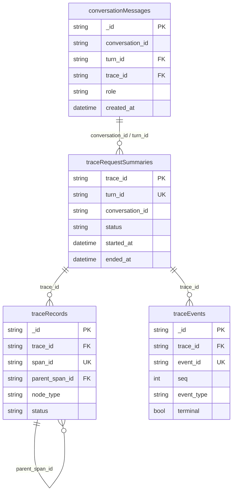

# v2 Agent MongoDB 集合与关联设计

本文是 [Trace、SSE 观测与链路召回设计](./2026-08-18-agent-trace-observability-and-recall-design.md) 的存储补充，专门规定对话历史和 Trace 在 MongoDB 中的集合边界、字段职责、关联方式、索引和保留策略。

## 1. 设计结论

v2 Agent 使用四个逻辑集合，按“产品事实”和“诊断事实”分离：

| 集合 | 一条文档代表 | 保存内容 | 默认是否保存大 payload |
|---|---|---|---|
| `conversationMessages` | 一条用户或 assistant 消息 | 对话历史全文、消息角色和消息与 Turn 的关联 | 只在这里保存聊天全文 |
| `traceRequestSummaries` | 一轮 Turn 的 Trace 汇总 | 状态、耗时、错误、业务提交结果、事件计数 | 否 |
| `traceRecords` | 一个内部执行节点 | LLM、Tool、审批、业务提交和 Turn 结果 | 仅摘要/脱敏 |
| `traceEvents` | 一个语义 SSE 事件 | 事件顺序、状态迁移、事件元数据和受控 payload | 默认否；增量聚合 |

不新增 `conversationTraces`、`traceDeliveries` 或 `conversationIndexes` 集合：

- 会话列表和历史以 `conversationMessages` 为事实源；Trace 通过 `conversation_id` 查询。
- SSE 连接和重连是传输事实，不是新的业务实体；连接请求使用 `transport_request_id` 关联到 `traceEvents`，重连次数汇总到 `traceRequestSummaries`。
- `traceRequestSummaries` 是可重建的查询加速层，不是唯一事实源；节点和事件仍分别以 `traceRecords`、`traceEvents` 为准。

## 2. 关联模型



关联规则：

1. `conversation_id` 是多轮会话的顶层边界；一个会话包含多个 `turn_id`。
2. 一个 `turn_id` 对应一个 `trace_id`；`traceRequestSummaries` 对 `(turn_id)` 建唯一约束，防止一个 Turn 出现多个根 Trace。
3. 一个 `trace_id` 对应多个 `traceRecords` 和 `traceEvents`；两个集合都必须同时保存 `turn_id`、`conversation_id`，用于缺少汇总时直接过滤和租户校验。
4. `conversationMessages` 只用 `trace_id` 和 `turn_id` 回链本轮消息，不嵌入完整节点或事件数组。
5. `traceRecords.span_id` 是节点身份，`parent_span_id` 只引用同一 `trace_id` 下的节点；`traceEvents.event_id` 是事件身份，`seq` 只在同一 `trace_id` 下单调递增。
6. Mongo 不建立跨集合数据库级外键。关联完整性由写入顺序、唯一索引、查询时的 `evidence_status` 和离线一致性检查保证。

回链主键顺序固定为：

```text
conversation_id -> turn_id -> trace_id -> event_id/seq -> span_id
```

`request_id` 仅作为迁移期查询别名；`client_request_id` 和 `transport_request_id` 不能替代 `trace_id`。

## 3. `conversationMessages`：对话历史事实

### 3.1 文档结构

```json
{
  "_id": "ObjectId",
  "schema_version": 2,
  "farmId": 1,
  "userId": "user_01J...",
  "conversationId": "conv_01J...",
  "sessionId": "conv_01J...",
  "turnId": "turn_01J...",
  "traceId": "trace_01J...",
  "role": "user",
  "messageKind": "prompt",
  "content": "用户可见的消息全文",
  "contentHash": "sha256:...",
  "meta": {
    "transport_request_id": "http_01J...",
    "source": "agent_chat",
    "reply_persisted": false
  },
  "createdAt": "2026-08-18T10:00:00Z"
}
```

保存边界：

- `role=user`：保存用户实际提交的完整文本，作为后续上下文召回的事实源。
- `role=assistant`：只保存最终面向用户的答复；`messageKind=final_answer`，并关联 `turnId`、`traceId`。
- `messageKind` 至少包括 `prompt`、`final_answer`、`error_answer`；`queued`、工具观察、思考过程和 SSE 增量不写入此集合。
- `contentHash` 用于去重和一致性核验；不能用哈希替代需要展示或作为 Agent 上下文的正文。
- `meta` 只放消息级关联和来源，不放 Trace 节点数组、完整 SSE payload 或凭证。

写入时序：先写用户消息并得到消息 ID，再创建 Turn；Turn 完成后最多写一条 assistant 最终消息。若 Trace 成功但 assistant 写入失败，`traceRequestSummaries.reply_persisted=false`，不能因为 Trace 有 `final_answer` 事件就假设消息已保存。

## 4. `traceRequestSummaries`：一轮查询索引

### 4.1 文档结构

```json
{
  "_id": "trace_01J...",
  "schema_version": 2,
  "trace_id": "trace_01J...",
  "user_id": "user_01J...",
  "farm_uid": "farm_01J...",
  "turn_id": "turn_01J...",
  "conversation_id": "conv_01J...",
  "user_id": "user_01J...",
  "farm_uid": "farm_01J...",
  "status": "completed",
  "stop_reason": "completed",
  "started_at": "2026-08-18T10:00:00Z",
  "ended_at": "2026-08-18T10:00:08Z",
  "duration_ms": 8000,
  "first_seq": 1,
  "last_seq": 18,
  "event_count": 18,
  "node_count": 4,
  "error_count": 0,
  "terminal_event_id": "evt_01J...",
  "business_committed": true,
  "reply_generated": true,
  "reply_persisted": true,
  "evidence_status": "complete",
  "metrics": {},
  "updated_at": "2026-08-18T10:00:08Z"
}
```

该集合只承担列表、筛选和快速概览。`metrics` 只能保存有界指标；完整节点、事件和消息分别从其他集合按需读取。汇总允许异步更新，但终态更新必须幂等，且 `terminal_event_id` 最多一个。

## 5. `traceRecords`：内部执行节点

一条文档代表一个 `span_id`，用于还原执行树，不用于记录每个 SSE 传输动作。

```json
{
  "_id": "ObjectId",
  "schema_version": 2,
  "trace_id": "trace_01J...",
  "turn_id": "turn_01J...",
  "conversation_id": "conv_01J...",
  "span_id": "span_01J...",
  "parent_span_id": "span_01J...",
  "step_index": 2,
  "node_type": "tool_call",
  "node_name": "create_crop_cycle",
  "phase": "tool_executing",
  "attempt": 1,
  "status": "succeeded",
  "start_time": "2026-08-18T10:00:02Z",
  "end_time": "2026-08-18T10:00:04Z",
  "duration_ms": 2000,
  "input_summary": {},
  "output_summary": {},
  "error": null,
  "resource": {"provider": "business_mcp", "request_id": "mcp_01J..."},
  "created_at": "2026-08-18T10:00:04Z"
}
```

`input_summary`、`output_summary` 必须是脱敏、有大小上限的摘要。原始异常堆栈留在应用日志，Trace 只保存 `code`、`message`、`phase`、`retryable` 和 `attempt`。

## 6. `traceEvents`：SSE 事件账本

一条文档代表一个语义事件，而不是一次网络发送。SSE 重连重放同一个事件时，不新增 Mongo 文档。

```json
{
  "_id": "evt_01J...",
  "schema_version": 2,
  "trace_id": "trace_01J...",
  "turn_id": "turn_01J...",
  "conversation_id": "conv_01J...",
  "transport_request_id": "http_01J...",
  "event_id": "evt_01J...",
  "seq": 12,
  "event_type": "tool_finished",
  "phase": "tool_executing",
  "step_index": 1,
  "attempt": 1,
  "status_before": "running",
  "status_after": "running",
  "terminal": false,
  "occurred_at": "2026-08-18T10:00:04Z",
  "data": {},
  "payload_meta": {"redacted": true, "bytes": 512},
  "created_at": "2026-08-18T10:00:04Z"
}
```

保存策略：

- 生命周期事件、工具、审批、提交、错误和唯一 `done` 事件完整保存 envelope；payload 仍需脱敏和大小限制。
- `assistant_delta`、`final_answer_delta` 聚合保存首末时间、数量、字符数和内容哈希，不逐 token 写入。
- `heartbeat` 聚合保存数量、首末时间和最后阶段。
- `thought` 不保存原始思维内容，只保存长度、哈希和受限预览（如产品确实需要）。
- `traceEvents` 写入失败不能阻断 SSE；必须在汇总或运行指标中记录丢失数量，并在召回中返回 `trace_events=error` 或 `not_available`。

## 7. 索引、唯一性与保留

推荐索引和约束：

| 集合 | 索引/约束 | 用途 |
|---|---|---|
| `conversationMessages` | `(farmId, conversationId, createdAt, _id)` | 会话历史分页和租户隔离 |
| `conversationMessages` | `(conversationId, turnId, createdAt)` | 按 Turn 回链消息 |
| `traceRequestSummaries` | unique `(trace_id)` | Trace 根身份 |
| `traceRequestSummaries` | unique `(turn_id)` | 一个 Turn 一个 Trace |
| `traceRequestSummaries` | `(conversation_id, ended_at)` | 整段会话召回 |
| `traceRequestSummaries` | `(user_id, farm_uid, started_at)` | 租户筛选 |
| `traceRecords` | unique `(trace_id, span_id)` | 节点身份和幂等写入 |
| `traceRecords` | `(trace_id, step_index, start_time)` | 执行树和时间线 |
| `traceEvents` | unique `(trace_id, event_id)` | 事件重放不重复 |
| `traceEvents` | unique `(trace_id, seq)` | 序号连续性核验 |
| `traceEvents` | `(turn_id, occurred_at)` | 单轮时间查询 |

保留顺序：Redis 短期事件 < `traceEvents` 诊断事件 < `traceRecords`/`traceRequestSummaries` 汇总 < `conversationMessages` 产品历史。具体天数由环境和合规策略配置，不在代码中写死。

## 8. 写入与一致性检查

一次 Turn 的推荐写入顺序：

```text
conversationMessages(user)
  -> traceRequestSummaries(started)
  -> traceRecords / traceEvents (append)
  -> traceRequestSummaries(terminal)
  -> conversationMessages(assistant final_answer)
```

检查脚本或后台任务应定期发现：

- 消息引用的 `trace_id` 不存在；
- Summary 没有对应 Turn 或存在多个 Summary；
- `traceEvents` 的 `(trace_id, seq)` 不连续或出现多个 `done`；
- `traceRecords.parent_span_id` 指向其他 Trace；
- `reply_persisted=true` 但不存在对应 assistant 消息。

这些是证据质量问题，不得通过补写自然语言答复来掩盖。查询接口必须返回集合级 `evidence_status`，区分 `missing`、`not_available` 和 `error`。

## 9. 当前实现状态与拆分任务

当前代码已经提供四个集合的显式配置、兼容入口、索引初始化和跨集合回链；统一 SSE envelope 已投影到 `traceEvents`，并按租户字段参与召回。后续维护任务为：

1. 持续校验四个集合的索引与保留策略；
2. 监控事件投影失败、消息缺失和 Mongo 不可用状态；
3. 对 `traceEvents` 的租户字段、幂等键和旧数据迁移做上线前检查；
4. 扩展真实环境验收场景，覆盖审批、失败、取消、超时和断线重连。

已完成验证：fake Mongo 投影契约测试通过；`v2/scripts/test_trace_sse_rounds.sh` 在本地真实 Agent、Redis、Mongo、Business MCP 上完成 3 轮 SSE、after_seq 重放、Trace 查询和消息回链验收。
